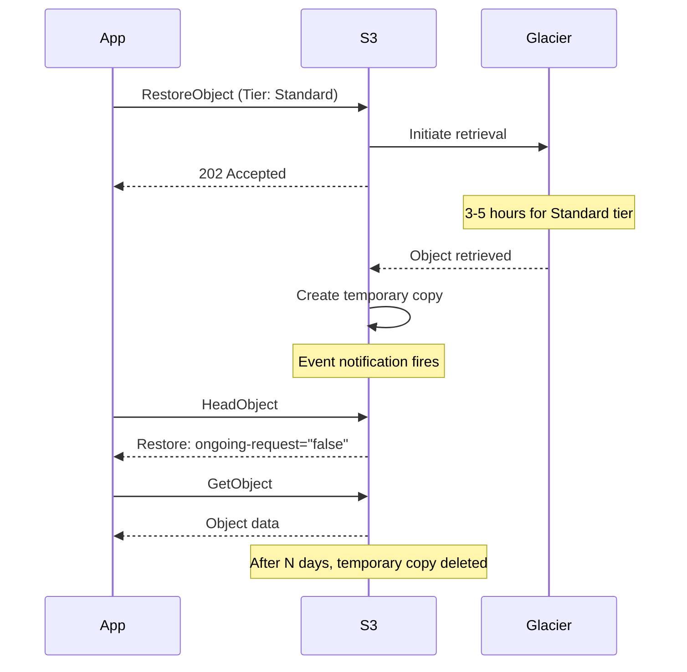

# How to Restore Objects from S3 Glacier and Glacier Deep Archive

Author: [nawazdhandala](https://github.com/nawazdhandala)

Tags: AWS, S3, Glacier, Data Recovery, Archival

Description: Learn how to restore objects from S3 Glacier and Glacier Deep Archive storage classes, including retrieval tiers, costs, and automation patterns.

---

You archived data to Glacier months ago, and now you need it back. Unlike standard S3 objects, Glacier and Deep Archive objects aren't immediately accessible - you have to initiate a restore request, wait for it to complete, and then download the temporary copy. The process is straightforward, but the retrieval options and their cost differences are important to understand.

## Retrieval Tiers

Each Glacier storage class offers different retrieval speeds at different prices.

### Glacier Flexible Retrieval

| Tier | Time | Cost per GB |
|------|------|------------|
| Expedited | 1-5 minutes | $0.03 |
| Standard | 3-5 hours | $0.01 |
| Bulk | 5-12 hours | $0.0025 |

### Glacier Deep Archive

| Tier | Time | Cost per GB |
|------|------|------------|
| Standard | 12 hours | $0.02 |
| Bulk | 48 hours | $0.0025 |

Expedited retrieval isn't available for Deep Archive. If you need frequent fast restores, you might want Glacier Instant Retrieval instead. See our guide on [S3 Glacier storage classes](https://oneuptime.com/blog/post/2026-02-12-s3-glacier-long-term-archival-storage/view).

## Step 1: Check Object Storage Class

Before restoring, verify the object is actually in a Glacier storage class.

```bash
# Check the storage class
aws s3api head-object \
  --bucket my-archive-bucket \
  --key backups/2024-q1/database-dump.tar.gz \
  --query '{StorageClass: StorageClass, Restore: Restore}'
```

If the storage class is `GLACIER` or `DEEP_ARCHIVE`, you need to restore it before downloading.

## Step 2: Initiate a Restore

Use the restore-object API to start the restore process. You specify how many days you want the temporary copy to be available.

Standard retrieval from Glacier (3-5 hours):

```bash
# Restore with standard retrieval, available for 7 days
aws s3api restore-object \
  --bucket my-archive-bucket \
  --key backups/2024-q1/database-dump.tar.gz \
  --restore-request '{
    "Days": 7,
    "GlacierJobParameters": {
      "Tier": "Standard"
    }
  }'
```

Expedited retrieval (1-5 minutes, Glacier only):

```bash
# Expedited restore for urgent access
aws s3api restore-object \
  --bucket my-archive-bucket \
  --key backups/2024-q1/database-dump.tar.gz \
  --restore-request '{
    "Days": 3,
    "GlacierJobParameters": {
      "Tier": "Expedited"
    }
  }'
```

Bulk retrieval from Deep Archive (48 hours, cheapest):

```bash
# Bulk restore from Deep Archive
aws s3api restore-object \
  --bucket my-archive-bucket \
  --key compliance/2020/financial-records.zip \
  --restore-request '{
    "Days": 14,
    "GlacierJobParameters": {
      "Tier": "Bulk"
    }
  }'
```

## Step 3: Monitor Restore Progress

After initiating a restore, you can check its status.

```bash
# Check restore status
aws s3api head-object \
  --bucket my-archive-bucket \
  --key backups/2024-q1/database-dump.tar.gz \
  --query 'Restore'
```

The `Restore` header tells you the status:

- `ongoing-request="true"` - Restore is in progress
- `ongoing-request="false", expiry-date="..."` - Restore is complete, shows when the temporary copy expires

## Step 4: Download the Restored Object

Once the restore is complete, download the object normally.

```bash
# Download after restore is complete
aws s3 cp \
  s3://my-archive-bucket/backups/2024-q1/database-dump.tar.gz \
  ./database-dump.tar.gz
```

## Restoring Multiple Objects with Python

When you need to restore a batch of objects, scripting is the way to go.

```python
import boto3
import time
from datetime import datetime

s3 = boto3.client('s3')

BUCKET = 'my-archive-bucket'
PREFIX = 'backups/2024/'
RESTORE_DAYS = 7
RETRIEVAL_TIER = 'Standard'

def restore_objects(bucket, prefix, days, tier):
    """Initiate restore for all Glacier objects under a prefix."""
    paginator = s3.get_paginator('list_objects_v2')
    pages = paginator.paginate(Bucket=bucket, Prefix=prefix)

    restore_count = 0
    already_restored = 0
    skipped = 0

    for page in pages:
        for obj in page.get('Contents', []):
            key = obj['Key']

            # Check storage class
            head = s3.head_object(Bucket=bucket, Key=key)
            storage_class = head.get('StorageClass', 'STANDARD')

            if storage_class not in ('GLACIER', 'DEEP_ARCHIVE'):
                skipped += 1
                continue

            # Check if already being restored
            restore_status = head.get('Restore', '')
            if 'ongoing-request="false"' in restore_status:
                already_restored += 1
                print(f"Already restored: {key}")
                continue

            if 'ongoing-request="true"' in restore_status:
                print(f"Restore in progress: {key}")
                continue

            # Initiate restore
            try:
                s3.restore_object(
                    Bucket=bucket,
                    Key=key,
                    RestoreRequest={
                        'Days': days,
                        'GlacierJobParameters': {'Tier': tier}
                    }
                )
                restore_count += 1
                print(f"Restore initiated: {key}")
            except s3.exceptions.ClientError as e:
                if 'RestoreAlreadyInProgress' in str(e):
                    print(f"Restore already in progress: {key}")
                else:
                    print(f"Error restoring {key}: {e}")

    print(f"\nSummary:")
    print(f"  Restores initiated: {restore_count}")
    print(f"  Already restored: {already_restored}")
    print(f"  Skipped (not Glacier): {skipped}")

restore_objects(BUCKET, PREFIX, RESTORE_DAYS, RETRIEVAL_TIER)
```

## Monitoring Restores with Polling

Here's a script that polls for restore completion and downloads objects once they're ready.

```python
import boto3
import time
import os

s3 = boto3.client('s3')

def wait_and_download(bucket, key, download_dir='./restored'):
    """
    Wait for a Glacier restore to complete, then download the object.
    Polls every 5 minutes.
    """
    os.makedirs(download_dir, exist_ok=True)
    local_path = os.path.join(download_dir, os.path.basename(key))

    print(f"Waiting for restore of {key}...")

    while True:
        head = s3.head_object(Bucket=bucket, Key=key)
        restore = head.get('Restore', '')

        if 'ongoing-request="false"' in restore:
            print(f"Restore complete! Downloading...")
            s3.download_file(bucket, key, local_path)
            print(f"Downloaded to {local_path}")
            return local_path

        if 'ongoing-request="true"' in restore:
            print(f"  Still restoring... checking again in 5 minutes")
            time.sleep(300)
        else:
            print(f"  No restore in progress. Initiate a restore first.")
            return None

# Usage
wait_and_download(
    'my-archive-bucket',
    'backups/2024-q1/database-dump.tar.gz'
)
```

## Using S3 Event Notifications for Restore Completion

Instead of polling, you can use S3 event notifications to trigger a Lambda function when a restore completes.

```python
import boto3
import json

def lambda_handler(event, context):
    """
    Triggered by s3:ObjectRestore:Completed event.
    Downloads the restored object or notifies your team.
    """
    for record in event['Records']:
        bucket = record['s3']['bucket']['name']
        key = record['s3']['object']['key']

        print(f"Restore completed: s3://{bucket}/{key}")

        # Option 1: Send notification
        sns = boto3.client('sns')
        sns.publish(
            TopicArn='arn:aws:sns:us-east-1:123456789012:restore-notifications',
            Subject=f'Glacier Restore Complete',
            Message=f'Object restored: s3://{bucket}/{key}\n'
                    f'The temporary copy is now available for download.'
        )

        # Option 2: Copy to a standard bucket for easier access
        s3 = boto3.client('s3')
        s3.copy_object(
            Bucket='my-active-bucket',
            Key=f'restored/{key}',
            CopySource={'Bucket': bucket, 'Key': key},
            StorageClass='STANDARD'
        )
        print(f"Copied to s3://my-active-bucket/restored/{key}")
```

Set up the event notification on the bucket.

```bash
aws s3api put-bucket-notification-configuration \
  --bucket my-archive-bucket \
  --notification-configuration '{
    "LambdaFunctionConfigurations": [
      {
        "Id": "restore-complete-handler",
        "LambdaFunctionArn": "arn:aws:lambda:us-east-1:123456789012:function:handle-restore-complete",
        "Events": ["s3:ObjectRestore:Completed"]
      }
    ]
  }'
```

## Restore Flow



## Extending a Restore

If you need more time with a restored object, you can extend the restore period by submitting another restore request.

```bash
# Extend the restore for another 14 days
aws s3api restore-object \
  --bucket my-archive-bucket \
  --key backups/2024-q1/database-dump.tar.gz \
  --restore-request '{"Days": 14, "GlacierJobParameters": {"Tier": "Standard"}}'
```

## Cost Example

Let's say you need to restore 500GB from Glacier Deep Archive:

- **Bulk retrieval (48 hours)**: 500 GB x $0.0025 = $1.25
- **Standard retrieval (12 hours)**: 500 GB x $0.02 = $10.00
- **Temporary copy storage (7 days)**: 500 GB x $0.023/30 x 7 = $2.68

Total for bulk: about $3.93. Total for standard: about $12.68.

If you're restoring regularly, those costs add up. Choose the cheapest tier that meets your time requirements.

## Wrapping Up

Restoring from Glacier is a two-step process - initiate the restore, then download once it's ready. The retrieval tier you choose determines both the cost and the wait time. For urgent needs, use Expedited (Glacier only) or Standard. For planned restores where you can wait, Bulk saves significant money. Automate the process with S3 event notifications to avoid the polling loop, and always keep an eye on retrieval costs when working with large datasets.
