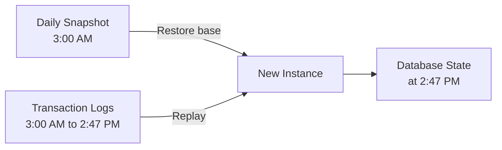

# How to Restore an RDS Instance to a Point in Time

Author: [nawazdhandala](https://github.com/nawazdhandala)

Tags: AWS, RDS, Backups, Disaster Recovery, Database

Description: Learn how to use RDS point-in-time recovery to restore your database to any specific second within your backup retention window.

---

Someone just ran a DELETE without a WHERE clause. Or a migration script went sideways and corrupted a table. Whatever happened, you need to get your data back to how it was at a specific moment in time. That's exactly what point-in-time recovery (PITR) does. It lets you restore your RDS database to any second within your backup retention window. Here's how it works and how to use it.

## How Point-in-Time Recovery Works

RDS continuously backs up your database in two ways:

1. **Daily automated snapshots**: Full backup taken during your backup window
2. **Transaction logs**: Uploaded to S3 every 5 minutes

When you perform a point-in-time restore, RDS does the following:

1. Finds the most recent automated snapshot before your target time
2. Restores that snapshot to a new instance
3. Replays the transaction logs from the snapshot time up to your specified point in time



This means you can recover to any second, not just to when snapshots were taken. If the bad event happened at 2:47:32 PM, you can restore to 2:47:31 PM.

## Prerequisites

Point-in-time recovery requires:

- **Automated backups enabled** (backup retention period > 0)
- The target time must be within your backup retention window (1-35 days)
- The latest restorable time is typically about 5 minutes ago (due to transaction log upload frequency)

## Finding the Restorable Window

Check what time range you can restore to.

This command shows the earliest and latest restorable times for your instance.

```bash
aws rds describe-db-instances \
  --db-instance-identifier my-production-db \
  --query 'DBInstances[0].{
    InstanceID: DBInstanceIdentifier,
    EarliestRestore: LatestRestorableTime,
    LatestRestore: LatestRestorableTime,
    BackupRetention: BackupRetentionPeriod,
    BackupWindow: PreferredBackupWindow
  }'
```

Wait - both earliest and latest point to the same field? Let me be more precise.

```bash
aws rds describe-db-instances \
  --db-instance-identifier my-production-db \
  --query 'DBInstances[0].{
    LatestRestorableTime: LatestRestorableTime
  }' \
  --output text
```

The `LatestRestorableTime` is typically 5 minutes before the current time. The earliest restorable time is determined by your backup retention period.

## Performing a Point-in-Time Restore

Like snapshot restores, PITR creates a new instance. It never overwrites the existing one.

### Basic Restore

This restores the database to a specific timestamp.

```bash
aws rds restore-db-instance-to-point-in-time \
  --source-db-instance-identifier my-production-db \
  --target-db-instance-identifier my-db-pitr-restored \
  --restore-time "2026-02-12T14:47:31Z"
```

The `--restore-time` uses ISO 8601 format in UTC. Make sure to convert from your local timezone.

### Restore to the Latest Restorable Time

If you want the most recent data possible, use `--use-latest-restorable-time`.

```bash
aws rds restore-db-instance-to-point-in-time \
  --source-db-instance-identifier my-production-db \
  --target-db-instance-identifier my-db-pitr-latest \
  --use-latest-restorable-time
```

### Full Production Restore

Specify all configuration options for a production-ready restored instance.

This restores with complete production configuration.

```bash
aws rds restore-db-instance-to-point-in-time \
  --source-db-instance-identifier my-production-db \
  --target-db-instance-identifier my-db-pitr-restored \
  --restore-time "2026-02-12T14:47:31Z" \
  --db-instance-class db.r6g.large \
  --db-subnet-group-name my-db-subnet-group \
  --vpc-security-group-ids sg-db-123 \
  --db-parameter-group-name my-postgres-params \
  --option-group-name my-option-group \
  --multi-az \
  --no-publicly-accessible \
  --storage-type gp3 \
  --iops 6000 \
  --storage-throughput 250 \
  --backup-retention-period 7 \
  --enable-cloudwatch-logs-exports '["postgresql"]' \
  --deletion-protection \
  --copy-tags-to-snapshot \
  --tags Key=Purpose,Value=pitr-restore Key=RestoreTime,Value=2026-02-12T14:47:31Z
```

## Determining the Right Restore Time

This is often the hardest part. You know something went wrong, but when exactly?

### Check CloudWatch Metrics

Look for anomalies in database metrics around the time of the incident.

```bash
# Check write IOPS for spikes that might indicate a bad batch operation
aws cloudwatch get-metric-statistics \
  --namespace AWS/RDS \
  --metric-name WriteIOPS \
  --dimensions Name=DBInstanceIdentifier,Value=my-production-db \
  --start-time "2026-02-12T14:00:00Z" \
  --end-time "2026-02-12T15:00:00Z" \
  --period 60 \
  --statistics Maximum
```

### Check Database Logs

Query the PostgreSQL log for the problematic statement.

```bash
# Search CloudWatch Logs for the problematic query
aws logs filter-log-events \
  --log-group-name /aws/rds/instance/my-production-db/postgresql \
  --start-time 1707746400000 \
  --end-time 1707750000000 \
  --filter-pattern "DELETE" \
  --query 'events[*].message'
```

### Check Application Logs

Your application logs might have timestamps for the operation that caused the problem. Use those to pinpoint when to restore to - just before the problematic operation started.

## Recovery Workflow

Here's a complete workflow for recovering from a data loss incident.

This Python script automates the PITR recovery workflow.

```python
import boto3
from datetime import datetime, timedelta, timezone

rds = boto3.client('rds')

def point_in_time_restore(source_id, target_id, restore_time, config):
    """
    Perform a point-in-time restore and wait for completion.

    Args:
        source_id: Source instance identifier
        target_id: Target instance identifier for the restored database
        restore_time: datetime object in UTC
        config: dict with instance configuration
    """
    # Verify the restore time is valid
    source = rds.describe_db_instances(
        DBInstanceIdentifier=source_id
    )['DBInstances'][0]

    latest_restorable = source['LatestRestorableTime']
    print(f"Latest restorable time: {latest_restorable}")
    print(f"Requested restore time: {restore_time.isoformat()}")

    if restore_time > latest_restorable.replace(tzinfo=None):
        # Use timezone-naive comparison
        print("Warning: Requested time might be after latest restorable time")
        print("Falling back to latest restorable time")
        use_latest = True
    else:
        use_latest = False

    # Build restore parameters
    params = {
        'SourceDBInstanceIdentifier': source_id,
        'TargetDBInstanceIdentifier': target_id,
        'DBInstanceClass': config.get('instance_class', source['DBInstanceClass']),
        'DBSubnetGroupName': config.get('subnet_group'),
        'VpcSecurityGroupIds': config.get('security_groups', []),
        'MultiAZ': config.get('multi_az', False),
        'PubliclyAccessible': False,
        'CopyTagsToSnapshot': True,
        'Tags': [
            {'Key': 'Purpose', 'Value': 'pitr-restore'},
            {'Key': 'RestoreTime', 'Value': restore_time.isoformat()},
            {'Key': 'SourceInstance', 'Value': source_id}
        ]
    }

    if use_latest:
        params['UseLatestRestorableTime'] = True
    else:
        params['RestoreTime'] = restore_time

    # Perform the restore
    print("Starting point-in-time restore...")
    rds.restore_db_instance_to_point_in_time(**params)

    # Wait for completion
    print("Waiting for instance to become available (this may take a while)...")
    waiter = rds.get_waiter('db_instance_available')
    waiter.wait(
        DBInstanceIdentifier=target_id,
        WaiterConfig={'Delay': 30, 'MaxAttempts': 120}
    )

    # Get the endpoint
    restored = rds.describe_db_instances(
        DBInstanceIdentifier=target_id
    )['DBInstances'][0]

    endpoint = restored['Endpoint']['Address']
    print(f"\nRestore complete!")
    print(f"Endpoint: {endpoint}")
    print(f"\nNext steps:")
    print(f"1. Connect to {endpoint} and verify the data")
    print(f"2. Compare with the original instance")
    print(f"3. Once verified, switch your application")
    return endpoint

# Example: Restore to 5 minutes before the incident
incident_time = datetime(2026, 2, 12, 14, 47, 31)
restore_to = incident_time - timedelta(minutes=5)

endpoint = point_in_time_restore(
    source_id='my-production-db',
    target_id='my-db-pitr-restored',
    restore_time=restore_to,
    config={
        'instance_class': 'db.r6g.large',
        'subnet_group': 'my-db-subnet-group',
        'security_groups': ['sg-db-123'],
        'multi_az': True
    }
)
```

## Selective Data Recovery

Sometimes you don't need to restore the entire database. Maybe just one table was affected. In that case, restore to a new instance, extract the specific data you need, and apply it to the original.

This approach copies specific data from the restored instance back to the original.

```sql
-- On the restored instance, export the affected table
-- Using pg_dump for a specific table
-- (run this from an EC2 instance that can reach both databases)
```

```bash
# Dump the specific table from the restored instance
pg_dump -h my-db-pitr-restored.abc123.rds.amazonaws.com \
  -U admin -d myappdb \
  -t orders \
  --data-only \
  -f /tmp/orders_backup.sql

# Review the data
head -50 /tmp/orders_backup.sql

# Restore to the original instance
# First, you might need to truncate or handle conflicts
psql -h my-production-db.abc123.rds.amazonaws.com \
  -U admin -d myappdb \
  -c "BEGIN; DELETE FROM orders WHERE id IN (SELECT id FROM orders WHERE created_at > '2026-02-12 14:47:00'); COMMIT;"

# Then import the recovered data
psql -h my-production-db.abc123.rds.amazonaws.com \
  -U admin -d myappdb \
  -f /tmp/orders_backup.sql
```

## PITR vs Snapshot Restore

When should you use each?

| Scenario | Use PITR | Use Snapshot |
|----------|----------|--------------|
| Recover from accidental deletion | Yes - restore to just before the delete | No - snapshot might be hours old |
| Create test environment | No - overkill | Yes - faster and simpler |
| Disaster recovery to latest | Yes - gets closest to current | No - could lose hours of data |
| Pre-migration checkpoint | No | Yes - explicit checkpoint |
| Recover from corruption | Yes - if you know when it started | Yes - if snapshot predates corruption |

## Restore Duration

PITR takes longer than snapshot restores because RDS needs to replay transaction logs after restoring the base snapshot. The more transaction logs to replay, the longer it takes.

Rough estimates:
- Small database (< 50 GB): 15-30 minutes
- Medium database (50-500 GB): 30-90 minutes
- Large database (500 GB+): 1-4 hours

The actual time depends on database size, transaction volume during the replay period, and the distance between the base snapshot and the restore time.

## Monitoring After Restore

After restoring, set up monitoring immediately. The restored instance doesn't inherit CloudWatch alarms from the source.

Use [OneUptime](https://oneuptime.com/blog/post/2026-02-13-aws-cloudwatch-infrastructure-monitoring/view) to quickly get visibility into the restored instance's health and performance while you verify the data and plan the cutover.

## Wrapping Up

Point-in-time recovery is one of the most powerful features of RDS. Being able to restore to any second within your backup window can save you from data disasters that would otherwise require hours or days of manual recovery. The key is having automated backups enabled with an appropriate retention period, knowing how to determine the right restore time, and practicing the restore process before you need it in an emergency. Treat PITR like a fire drill - do it regularly so you're ready when it counts.
