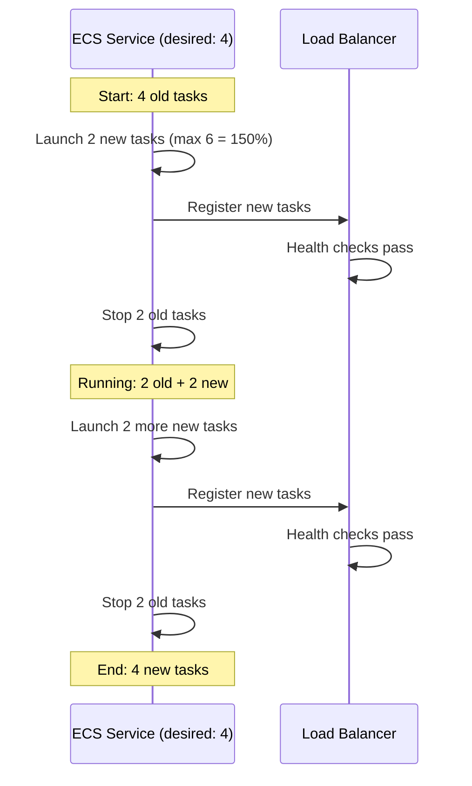

# How to Set Up Rolling Deployments in ECS

Author: [nawazdhandala](https://github.com/nawazdhandala)

Tags: AWS, ECS, Deployments, DevOps, Containers

Description: Learn how to configure rolling deployments in ECS to update your services with zero downtime using minimum healthy percent and maximum percent settings.

---

Rolling deployments are the default deployment strategy in ECS, and for good reason - they're simple, reliable, and handle most use cases without any extra infrastructure. Instead of replacing all tasks at once, ECS gradually replaces old tasks with new ones, keeping the service available throughout the process.

The beauty of rolling deployments is that you don't need CodeDeploy, extra target groups, or complex configurations. You just update the task definition and ECS does the rest. Let's look at how to configure this properly and tune it for your needs.

## How Rolling Deployments Work

When you update a service (typically by changing the task definition), ECS starts the rollout:

1. ECS launches new tasks running the updated definition
2. New tasks register with the load balancer and pass health checks
3. Old tasks are drained from the load balancer and stopped
4. This continues until all tasks are running the new version

The pace of this process is controlled by two settings: `minimumHealthyPercent` and `maximumPercent`.



## Understanding minimumHealthyPercent and maximumPercent

These two values control the deployment speed and safety:

- **minimumHealthyPercent** (default: 100) - The minimum number of tasks that must remain RUNNING during deployment, as a percentage of desired count. At 100%, ECS won't stop any old tasks until new tasks are healthy.

- **maximumPercent** (default: 200) - The maximum number of tasks allowed during deployment, as a percentage of desired count. At 200% with 4 desired tasks, ECS can run up to 8 tasks simultaneously during deployment.

Here are some common configurations.

```hcl
# Conservative - no downtime, slow rollout
resource "aws_ecs_service" "conservative" {
  name            = "api-service"
  cluster         = aws_ecs_cluster.main.id
  task_definition = aws_ecs_task_definition.api.arn
  desired_count   = 4

  deployment_minimum_healthy_percent = 100
  deployment_maximum_percent         = 125

  # With 4 tasks: max 5 total, min 4 healthy
  # Deploys 1 new task at a time
}

# Balanced - good speed, maintains availability
resource "aws_ecs_service" "balanced" {
  name            = "api-service"
  cluster         = aws_ecs_cluster.main.id
  task_definition = aws_ecs_task_definition.api.arn
  desired_count   = 4

  deployment_minimum_healthy_percent = 100
  deployment_maximum_percent         = 200

  # With 4 tasks: max 8 total, min 4 healthy
  # Can deploy all 4 new tasks at once, then drain old ones
}

# Aggressive - faster but brief capacity reduction
resource "aws_ecs_service" "aggressive" {
  name            = "api-service"
  cluster         = aws_ecs_cluster.main.id
  task_definition = aws_ecs_task_definition.api.arn
  desired_count   = 4

  deployment_minimum_healthy_percent = 50
  deployment_maximum_percent         = 200

  # With 4 tasks: max 8 total, min 2 healthy
  # Can stop old tasks before all new tasks are ready
}
```

## Choosing the Right Values

The right settings depend on your service's characteristics:

**For services behind a load balancer with plenty of capacity:**
- `minimumHealthyPercent = 100`, `maximumPercent = 200`
- This is the safest option. You always have full capacity.

**For services with resource constraints (not enough capacity for double tasks):**
- `minimumHealthyPercent = 50`, `maximumPercent = 100`
- You'll briefly have fewer tasks, but you never exceed current capacity.

**For single-task services (desired count = 1):**
- `minimumHealthyPercent = 0`, `maximumPercent = 200`
- There will be brief downtime as the old task stops and the new one starts.
- If you can't tolerate any downtime, increase desired count to at least 2.

```hcl
# Single task service - brief downtime during deploy
resource "aws_ecs_service" "singleton" {
  name            = "scheduler-service"
  desired_count   = 1

  deployment_minimum_healthy_percent = 0
  deployment_maximum_percent         = 100
  # Old task stops, then new task starts
}

# Single task with overlap allowed
resource "aws_ecs_service" "singleton_overlap" {
  name            = "scheduler-service"
  desired_count   = 1

  deployment_minimum_healthy_percent = 100
  deployment_maximum_percent         = 200
  # New task starts first, then old task stops
  # Warning: two instances run briefly - make sure your app handles this
}
```

## Triggering a Deployment

The most common way to trigger a rolling deployment is by registering a new task definition revision and updating the service.

```bash
# Register a new task definition revision (e.g., with a new image tag)
aws ecs register-task-definition \
  --cli-input-json file://task-definition.json

# Update the service to use the new revision
aws ecs update-service \
  --cluster my-cluster \
  --service my-service \
  --task-definition my-task:5

# Watch the deployment progress
aws ecs describe-services \
  --cluster my-cluster \
  --services my-service \
  --query 'services[0].deployments'
```

You can also force a redeployment with the same task definition (useful for pulling a new image with the `latest` tag).

```bash
# Force redeployment without changing the task definition
aws ecs update-service \
  --cluster my-cluster \
  --service my-service \
  --force-new-deployment
```

## Health Check Configuration

The load balancer health check determines when ECS considers a new task "healthy" enough to start draining old tasks. Get this wrong and you'll have long deployments or service disruptions.

```hcl
resource "aws_lb_target_group" "app" {
  name        = "app-tg"
  port        = 8080
  protocol    = "HTTP"
  vpc_id      = aws_vpc.main.id
  target_type = "ip"

  health_check {
    path                = "/health"
    protocol            = "HTTP"
    healthy_threshold   = 2      # 2 consecutive successes to be healthy
    unhealthy_threshold = 3      # 3 consecutive failures to be unhealthy
    interval            = 15     # Check every 15 seconds
    timeout             = 5      # Wait 5 seconds for response
    matcher             = "200"  # Only 200 is healthy
  }

  # How long to wait before starting health checks on new targets
  deregistration_delay = 30

  stickiness {
    enabled = false
    type    = "lb_cookie"
  }
}
```

**Tip**: A new task must pass `healthy_threshold` checks (2) at `interval` seconds each (15). So a task takes at minimum 30 seconds to become healthy. Factor this into your deployment time estimates.

## Container Health Checks

In addition to the load balancer health check, you can define a container-level health check in the task definition. ECS uses this to determine task health independently of the load balancer.

```json
{
  "containerDefinitions": [
    {
      "name": "app",
      "image": "my-app:latest",
      "healthCheck": {
        "command": ["CMD-SHELL", "curl -f http://localhost:8080/health || exit 1"],
        "interval": 15,
        "timeout": 5,
        "retries": 3,
        "startPeriod": 60
      }
    }
  ]
}
```

The `startPeriod` gives your application time to start up before health checks begin counting. This is especially important for applications with long startup times like Java services.

## Monitoring Deployment Progress

Keep tabs on your deployments with these commands and patterns.

```bash
# Watch deployment status
watch -n 5 'aws ecs describe-services \
  --cluster my-cluster \
  --services my-service \
  --query "services[0].{desired:desiredCount,running:runningCount,deployments:deployments[*].{status:status,desired:desiredCount,running:runningCount,pending:pendingCount,taskDef:taskDefinition}}" \
  --output table'
```

You can also set up CloudWatch events to notify you about deployment state changes.

```hcl
# EventBridge rule for deployment state changes
resource "aws_cloudwatch_event_rule" "deployment" {
  name        = "ecs-deployment-state-change"
  description = "Notify on ECS deployment state changes"

  event_pattern = jsonencode({
    source      = ["aws.ecs"]
    "detail-type" = ["ECS Deployment State Change"]
    detail = {
      eventName = ["SERVICE_DEPLOYMENT_COMPLETED", "SERVICE_DEPLOYMENT_FAILED"]
    }
  })
}

resource "aws_cloudwatch_event_target" "sns" {
  rule      = aws_cloudwatch_event_rule.deployment.name
  target_id = "send-to-sns"
  arn       = aws_sns_topic.deployments.arn
}
```

## Deployment Timeouts

ECS services have a deployment timeout. If a deployment can't reach a steady state within this window, it will either keep trying or trigger a rollback (if you have the circuit breaker enabled - see our post on [deployment circuit breakers](https://oneuptime.com/blog/post/2026-02-12-deployment-circuit-breaker-ecs/view)).

The default timeout is controlled by the health check grace period.

```hcl
resource "aws_ecs_service" "app" {
  # ...

  # How long to wait before checking load balancer health for new tasks
  health_check_grace_period_seconds = 120

  # The circuit breaker handles failed deployments
  deployment_circuit_breaker {
    enable   = true
    rollback = true
  }
}
```

## Best Practices

1. **Always use a load balancer** for multi-task services. Without it, there's no connection draining and clients may hit stopping tasks.

2. **Set appropriate deregistration delay.** The default is 300 seconds, which is usually too long. 30-60 seconds works for most HTTP services.

3. **Use container health checks** with a generous `startPeriod`. This prevents ECS from counting startup time as unhealthy.

4. **Monitor deployments actively.** Don't just fire and forget. Watch the deployment progress and have alerts for failures.

5. **Enable the circuit breaker.** It prevents stuck deployments from running indefinitely and automatically rolls back to the last working version.

Rolling deployments are the workhorse of ECS deployment strategies. They're reliable, straightforward, and don't require any extra AWS services. For most teams and most services, this is the right choice. Save blue/green deployments for your most critical services where you need the extra safety net of instant traffic switching.
