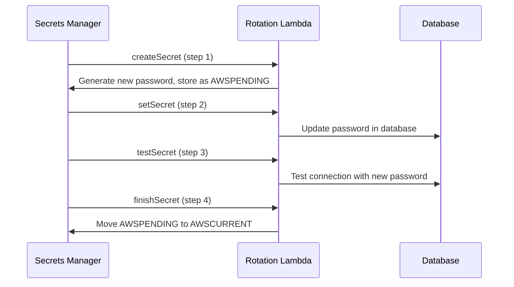

# How to Rotate Secrets Automatically with Secrets Manager

Author: [nawazdhandala](https://github.com/nawazdhandala)

Tags: AWS, Secrets Manager, Security, Lambda, Automation

Description: Learn how to set up automatic secret rotation with AWS Secrets Manager, including Lambda rotation functions for databases and custom applications.

---

Hard-coded credentials that never change are a ticking time bomb. AWS Secrets Manager solves this by automating secret rotation on a schedule - your database passwords, API keys, and tokens get updated automatically without any application downtime. The trick is getting the rotation Lambda function right and making sure your applications handle the transition smoothly.

This guide walks through setting up automatic rotation for RDS databases (the most common case) and building custom rotation functions for other types of secrets.

## How Rotation Works

Secrets Manager rotation follows a four-step process, implemented by a Lambda function:

1. **createSecret** - Creates a new version of the secret with fresh credentials
2. **setSecret** - Updates the target service (database, API, etc.) with the new credentials
3. **testSecret** - Verifies the new credentials work
4. **finishSecret** - Marks the new version as current

During rotation, Secrets Manager maintains two versions: `AWSCURRENT` (the active credentials) and `AWSPENDING` (the new credentials being validated). Applications using `AWSCURRENT` keep working throughout the rotation.



## Setting Up RDS Rotation

For RDS, Aurora, and Redshift, AWS provides pre-built rotation Lambda functions. This is the easiest path.

First, create the secret for your database.

```bash
# Create a secret for an RDS database
aws secretsmanager create-secret \
  --name "production/database/master" \
  --description "Production RDS master credentials" \
  --secret-string '{
    "username": "admin",
    "password": "initial-password-here",
    "engine": "postgres",
    "host": "production-db.cluster-abc123.us-east-1.rds.amazonaws.com",
    "port": 5432,
    "dbname": "myapp"
  }'
```

Now enable rotation. Secrets Manager can automatically create the rotation Lambda for supported database engines.

```bash
# Enable rotation with a 30-day schedule
aws secretsmanager rotate-secret \
  --secret-id "production/database/master" \
  --rotation-lambda-arn "arn:aws:lambda:us-east-1:123456789012:function:SecretsManagerRotation" \
  --rotation-rules '{
    "AutomaticallyAfterDays": 30
  }'
```

## Using the Serverless Application Repository

The easiest way to get the rotation Lambda is through the Serverless Application Repository. AWS publishes ready-made rotation functions for each database engine.

```bash
# Deploy the PostgreSQL rotation function from SAR
aws serverlessrepo create-cloud-formation-change-set \
  --application-id arn:aws:serverlessrepo:us-east-1:297356227824:applications/SecretsManagerRDSPostgreSQLRotationSingleUser \
  --stack-name secrets-rotation-postgres \
  --parameter-overrides '[
    {"Name": "endpoint", "Value": "https://secretsmanager.us-east-1.amazonaws.com"},
    {"Name": "functionName", "Value": "SecretsManagerPostgresRotation"}
  ]'
```

## Terraform Configuration

Terraform makes this much cleaner. Here's a complete setup for RDS secret rotation.

```hcl
# The secret
resource "aws_secretsmanager_secret" "db_master" {
  name        = "production/database/master"
  description = "Production RDS master credentials"

  tags = {
    Environment = "production"
    Service     = "database"
  }
}

# The secret value
resource "aws_secretsmanager_secret_version" "db_master" {
  secret_id = aws_secretsmanager_secret.db_master.id
  secret_string = jsonencode({
    username = "admin"
    password = var.initial_db_password
    engine   = "postgres"
    host     = aws_db_instance.production.endpoint
    port     = 5432
    dbname   = "myapp"
  })
}

# Rotation Lambda function
resource "aws_lambda_function" "rotation" {
  filename      = "rotation-lambda.zip"
  function_name = "secrets-rotation-postgres"
  role          = aws_iam_role.rotation_lambda.arn
  handler       = "lambda_function.lambda_handler"
  runtime       = "python3.11"
  timeout       = 30

  vpc_config {
    subnet_ids         = var.private_subnet_ids
    security_group_ids = [aws_security_group.rotation_lambda.id]
  }

  environment {
    variables = {
      SECRETS_MANAGER_ENDPOINT = "https://secretsmanager.${data.aws_region.current.name}.amazonaws.com"
    }
  }
}

# Permission for Secrets Manager to invoke the Lambda
resource "aws_lambda_permission" "secrets_manager" {
  statement_id  = "AllowSecretsManager"
  action        = "lambda:InvokeFunction"
  function_name = aws_lambda_function.rotation.function_name
  principal     = "secretsmanager.amazonaws.com"
}

# Enable rotation
resource "aws_secretsmanager_secret_rotation" "db_master" {
  secret_id           = aws_secretsmanager_secret.db_master.id
  rotation_lambda_arn = aws_lambda_function.rotation.arn

  rotation_rules {
    automatically_after_days = 30
  }
}
```

The Lambda needs to be in the same VPC as the database. Make sure the security group allows outbound connections to both the database and the Secrets Manager VPC endpoint.

## Single-User vs Multi-User Rotation

There are two rotation strategies:

**Single-user rotation** updates the password for a single database user. During the brief moment between updating the password and your app picking up the new value, there could be a connection failure. For most applications with connection pooling and retry logic, this isn't an issue.

**Multi-user rotation** uses two database users (e.g., `app_user` and `app_user_clone`). Secrets Manager alternates between them, so one is always valid. This provides zero-downtime rotation but requires managing two users.

For multi-user rotation, you need a separate "master" secret that has permissions to update the application user's password.

```bash
# Create the master secret (with admin privileges)
aws secretsmanager create-secret \
  --name "production/database/master" \
  --secret-string '{"username":"admin","password":"master-pass",...}'

# Create the application secret that references the master
aws secretsmanager create-secret \
  --name "production/database/app-user" \
  --secret-string '{"username":"app_user","password":"app-pass",...,"masterarn":"arn:aws:secretsmanager:us-east-1:123456789012:secret:production/database/master-abc123"}'
```

## Custom Rotation Functions

For non-database secrets (API keys, OAuth tokens, etc.), you need to write a custom rotation Lambda. Here's a template.

```python
import boto3
import json
import logging

logger = logging.getLogger()
logger.setLevel(logging.INFO)

sm_client = boto3.client('secretsmanager')


def lambda_handler(event, context):
    """Main handler - routes to the appropriate step."""
    secret_arn = event['SecretId']
    token = event['ClientRequestToken']
    step = event['Step']

    # Verify the secret version exists
    metadata = sm_client.describe_secret(SecretId=secret_arn)
    versions = metadata.get('VersionIdsToStages', {})

    if token not in versions:
        raise ValueError(f"Secret version {token} has no stage")

    if 'AWSCURRENT' in versions[token]:
        logger.info("Secret version already set as AWSCURRENT")
        return

    if 'AWSPENDING' not in versions[token]:
        raise ValueError(f"Secret version {token} not set as AWSPENDING")

    # Route to the correct step
    if step == "createSecret":
        create_secret(secret_arn, token)
    elif step == "setSecret":
        set_secret(secret_arn, token)
    elif step == "testSecret":
        test_secret(secret_arn, token)
    elif step == "finishSecret":
        finish_secret(secret_arn, token)
    else:
        raise ValueError(f"Invalid step: {step}")


def create_secret(secret_arn, token):
    """Generate new credentials and store as AWSPENDING."""
    # Get the current secret
    current = sm_client.get_secret_value(
        SecretId=secret_arn,
        VersionStage='AWSCURRENT'
    )
    current_secret = json.loads(current['SecretString'])

    # Generate new credentials (customize this for your use case)
    import secrets
    new_api_key = secrets.token_urlsafe(32)

    new_secret = current_secret.copy()
    new_secret['api_key'] = new_api_key

    # Store the new version as AWSPENDING
    sm_client.put_secret_value(
        SecretId=secret_arn,
        ClientRequestToken=token,
        SecretString=json.dumps(new_secret),
        VersionStages=['AWSPENDING']
    )
    logger.info("Created new secret version")


def set_secret(secret_arn, token):
    """Update the target service with new credentials."""
    pending = sm_client.get_secret_value(
        SecretId=secret_arn,
        VersionStage='AWSPENDING',
        VersionId=token
    )
    new_secret = json.loads(pending['SecretString'])

    # Update the external service with the new API key
    # This is where you'd call the third-party API to rotate the key
    # Example: requests.post('https://api.example.com/rotate-key', ...)

    logger.info("Updated target service with new credentials")


def test_secret(secret_arn, token):
    """Verify the new credentials work."""
    pending = sm_client.get_secret_value(
        SecretId=secret_arn,
        VersionStage='AWSPENDING',
        VersionId=token
    )
    new_secret = json.loads(pending['SecretString'])

    # Test the new credentials against the service
    # Example: make an authenticated API call
    # If it fails, raise an exception to abort rotation

    logger.info("New credentials validated successfully")


def finish_secret(secret_arn, token):
    """Promote AWSPENDING to AWSCURRENT."""
    metadata = sm_client.describe_secret(SecretId=secret_arn)
    versions = metadata.get('VersionIdsToStages', {})

    # Find the current version
    current_version = None
    for version_id, stages in versions.items():
        if 'AWSCURRENT' in stages:
            current_version = version_id
            break

    # Promote the pending version
    sm_client.update_secret_version_stage(
        SecretId=secret_arn,
        VersionStage='AWSCURRENT',
        MoveToVersionId=token,
        RemoveFromVersionId=current_version
    )
    logger.info(f"Promoted {token} to AWSCURRENT")
```

## Testing Rotation

Always test rotation before relying on it in production.

```bash
# Trigger an immediate rotation
aws secretsmanager rotate-secret \
  --secret-id "production/database/master"

# Check the rotation status
aws secretsmanager describe-secret \
  --secret-id "production/database/master" \
  --query '{LastRotated: LastRotatedDate, NextRotation: NextRotationDate, Versions: VersionIdsToStages}'
```

If rotation fails, check the Lambda's CloudWatch logs.

```bash
# Check rotation Lambda logs
aws logs filter-log-events \
  --log-group-name "/aws/lambda/secrets-rotation-postgres" \
  --start-time "$(date -d '1 hour ago' +%s)000" \
  --filter-pattern "ERROR"
```

## Application Best Practices

Your applications should handle secret rotation gracefully.

```python
import boto3
import json
from functools import lru_cache
import time

sm_client = boto3.client('secretsmanager')

# Cache the secret with a TTL
_secret_cache = {}
_cache_ttl = 300  # 5 minutes

def get_db_credentials(secret_name):
    """Retrieve database credentials with caching."""
    now = time.time()
    cached = _secret_cache.get(secret_name)

    if cached and (now - cached['timestamp']) < _cache_ttl:
        return cached['value']

    response = sm_client.get_secret_value(SecretId=secret_name)
    secret = json.loads(response['SecretString'])

    _secret_cache[secret_name] = {
        'value': secret,
        'timestamp': now
    }

    return secret
```

Don't cache secrets for too long. Five minutes is a reasonable default. After rotation, your app should pick up the new credentials within the cache TTL.

For more on managing secrets in different compute environments, check out our guides on [accessing secrets from Lambda](https://oneuptime.com/blog/post/access-secrets-manager-secrets-lambda-functions/view) and [accessing secrets from ECS](https://oneuptime.com/blog/post/access-secrets-manager-secrets-ecs-tasks/view).

## Wrapping Up

Automatic secret rotation eliminates one of the most common security gaps - stale credentials. For RDS databases, the pre-built Lambda functions make setup straightforward. For custom secrets, the four-step rotation pattern is well-documented and easy to implement. The key is to test rotation thoroughly in a non-production environment and make sure your applications cache credentials with a reasonable TTL.
