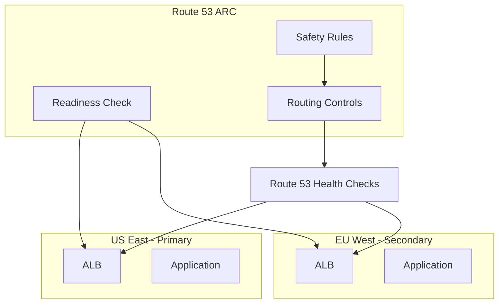

# How to Set Up Route 53 Application Recovery Controller

Author: [nawazdhandala](https://github.com/nawazdhandala)

Tags: AWS, Route 53, Disaster Recovery, High Availability

Description: Learn how to configure Route 53 Application Recovery Controller for readiness checks, routing controls, and automated failover across AWS regions.

---

Disaster recovery planning is one thing. Actually executing a failover when everything's on fire is something else entirely. Route 53 Application Recovery Controller (ARC) bridges that gap. It gives you the tools to verify your DR environment is ready before you need it, and a dead-simple mechanism to shift traffic when you do need to fail over.

No more hoping your secondary region works. No more manually updating DNS records at 3 AM during an outage. ARC lets you pre-validate readiness and flip traffic with a single API call.

## What ARC Provides

ARC has three main components:

1. **Readiness Check**: Continuously validates that your recovery environment can handle production traffic. Checks things like resource configuration, capacity, and scaling policies.

2. **Routing Control**: A highly available data plane for controlling traffic routing. Think of it as a set of switches that determine where traffic goes.

3. **Safety Rules**: Guards that prevent you from accidentally making things worse during a failover (like turning off all regions at once).



## Setting Up Readiness Checks

Readiness checks verify that your resources across regions are configured consistently. If your primary region has an auto-scaling group with a max capacity of 20, but your secondary only allows 5, ARC flags that as not ready.

Create a recovery group and readiness check:

```bash
# Create a recovery group - this represents your application
aws route53-recovery-readiness create-recovery-group \
  --recovery-group-name "order-app" \
  --tags Key=Application,Value=OrderService

# Create cells for each region (a cell is a regional deployment)
aws route53-recovery-readiness create-cell \
  --cell-name "order-app-us-east-1" \
  --tags Key=Region,Value=us-east-1

aws route53-recovery-readiness create-cell \
  --cell-name "order-app-eu-west-1" \
  --tags Key=Region,Value=eu-west-1

# Update the recovery group with the cells
aws route53-recovery-readiness update-recovery-group \
  --recovery-group-name "order-app" \
  --cells \
    arn:aws:route53-recovery-readiness::123456789012:cell/order-app-us-east-1 \
    arn:aws:route53-recovery-readiness::123456789012:cell/order-app-eu-west-1
```

Now create resource sets that define what resources to check in each cell.

Define the resource sets for readiness checking:

```bash
# Create a resource set for the auto-scaling groups
aws route53-recovery-readiness create-resource-set \
  --resource-set-name "order-app-asg" \
  --resource-set-type "AWS::AutoScaling::AutoScalingGroup" \
  --resources '[
    {
      "resourceArn": "arn:aws:autoscaling:us-east-1:123456789012:autoScalingGroup:guid:autoScalingGroupName/order-app-asg",
      "readinessScopes": ["arn:aws:route53-recovery-readiness::123456789012:cell/order-app-us-east-1"]
    },
    {
      "resourceArn": "arn:aws:autoscaling:eu-west-1:123456789012:autoScalingGroup:guid:autoScalingGroupName/order-app-asg",
      "readinessScopes": ["arn:aws:route53-recovery-readiness::123456789012:cell/order-app-eu-west-1"]
    }
  ]'

# Create a resource set for the ALBs
aws route53-recovery-readiness create-resource-set \
  --resource-set-name "order-app-alb" \
  --resource-set-type "AWS::ElasticLoadBalancingV2::LoadBalancer" \
  --resources '[
    {
      "resourceArn": "arn:aws:elasticloadbalancing:us-east-1:123456789012:loadbalancer/app/order-app/abc123",
      "readinessScopes": ["arn:aws:route53-recovery-readiness::123456789012:cell/order-app-us-east-1"]
    },
    {
      "resourceArn": "arn:aws:elasticloadbalancing:eu-west-1:123456789012:loadbalancer/app/order-app/def456",
      "readinessScopes": ["arn:aws:route53-recovery-readiness::123456789012:cell/order-app-eu-west-1"]
    }
  ]'

# Create readiness checks
aws route53-recovery-readiness create-readiness-check \
  --readiness-check-name "order-app-asg-check" \
  --resource-set-name "order-app-asg"

aws route53-recovery-readiness create-readiness-check \
  --readiness-check-name "order-app-alb-check" \
  --resource-set-name "order-app-alb"
```

ARC will now continuously evaluate whether the resources in both cells are equivalently configured and ready to handle traffic.

## Checking Readiness Status

Query readiness status to see if your DR environment is prepared:

```bash
# Check overall readiness of the recovery group
aws route53-recovery-readiness get-recovery-group-readiness-summary \
  --recovery-group-name "order-app"

# Check specific readiness check
aws route53-recovery-readiness get-readiness-check-status \
  --readiness-check-name "order-app-asg-check"

# Drill into resource-level readiness
aws route53-recovery-readiness get-readiness-check-resource-status \
  --readiness-check-name "order-app-asg-check" \
  --resource-identifier "arn:aws:autoscaling:eu-west-1:123456789012:autoScalingGroup:guid:autoScalingGroupName/order-app-asg"
```

The readiness status will be `READY`, `NOT_READY`, or `UNKNOWN`. If it's `NOT_READY`, ARC tells you exactly what's wrong - maybe the secondary ASG has a smaller max capacity, or a target group is missing health check configuration.

## Configuring Routing Controls

Routing controls are the mechanism for actually failing over. They work through a cluster of highly available endpoints.

Create a routing control cluster and controls:

```bash
# Create a cluster (5 regional endpoints for high availability)
aws route53-recovery-cluster create-cluster \
  --cluster-name "order-app-cluster"

# Create a control panel
aws route53-recovery-control-config create-control-panel \
  --cluster-arn arn:aws:route53-recovery-control::123456789012:cluster/abc-123 \
  --control-panel-name "order-app-panel"

# Create routing controls for each region
aws route53-recovery-control-config create-routing-control \
  --cluster-arn arn:aws:route53-recovery-control::123456789012:cluster/abc-123 \
  --control-panel-arn arn:aws:route53-recovery-control::123456789012:controlpanel/def-456 \
  --routing-control-name "order-app-us-east-1"

aws route53-recovery-control-config create-routing-control \
  --cluster-arn arn:aws:route53-recovery-control::123456789012:cluster/abc-123 \
  --control-panel-arn arn:aws:route53-recovery-control::123456789012:controlpanel/def-456 \
  --routing-control-name "order-app-eu-west-1"
```

## Connecting to Route 53 Health Checks

Link routing controls to Route 53 health checks, which in turn control your DNS routing policy.

Create health checks linked to routing controls:

```bash
# Create health checks that follow routing controls
aws route53 create-health-check \
  --caller-reference "order-us-east-$(date +%s)" \
  --health-check-config '{
    "Type": "RECOVERY_CONTROL",
    "RoutingControlArn": "arn:aws:route53-recovery-control::123456789012:controlpanel/def-456/routingcontrol/rc-useast1"
  }'

aws route53 create-health-check \
  --caller-reference "order-eu-west-$(date +%s)" \
  --health-check-config '{
    "Type": "RECOVERY_CONTROL",
    "RoutingControlArn": "arn:aws:route53-recovery-control::123456789012:controlpanel/def-456/routingcontrol/rc-euwest1"
  }'
```

Then use these health checks in your Route 53 failover routing policy. When a routing control is set to ON, the associated health check reports healthy. When it's OFF, the health check reports unhealthy, and Route 53 stops sending traffic to that region.

## Adding Safety Rules

Safety rules prevent accidental outages during failover operations.

Create safety rules:

```bash
# Assertion rule: at least one routing control must be ON at all times
aws route53-recovery-control-config create-safety-rule \
  --assertion-rule '{
    "Name": "AtLeastOneRegionActive",
    "ControlPanelArn": "arn:aws:route53-recovery-control::123456789012:controlpanel/def-456",
    "AssertedControls": [
      "arn:aws:route53-recovery-control::123456789012:controlpanel/def-456/routingcontrol/rc-useast1",
      "arn:aws:route53-recovery-control::123456789012:controlpanel/def-456/routingcontrol/rc-euwest1"
    ],
    "WaitPeriodMs": 5000,
    "RuleConfig": {
      "Type": "ATLEAST",
      "Threshold": 1,
      "Inverted": false
    }
  }'
```

This rule ensures you can't turn off both regions simultaneously. If someone tries to set both routing controls to OFF, the API rejects the request. This is a lifesaver during stressful incident situations where mistakes are most likely.

## Executing a Failover

When you need to fail over, it's a single API call. Use one of the five cluster endpoints for maximum reliability.

Fail over from us-east-1 to eu-west-1:

```bash
# Get the cluster endpoints
aws route53-recovery-control-config describe-cluster \
  --cluster-arn arn:aws:route53-recovery-control::123456789012:cluster/abc-123

# Update routing controls using a cluster endpoint
aws route53-recovery-cluster update-routing-control-states \
  --endpoint-url https://host-abc123.us-east-1.route53-recovery-cluster.amazonaws.com/v1 \
  --update-routing-control-state-entries '[
    {
      "RoutingControlArn": "arn:aws:route53-recovery-control::123456789012:controlpanel/def-456/routingcontrol/rc-useast1",
      "RoutingControlState": "Off"
    },
    {
      "RoutingControlArn": "arn:aws:route53-recovery-control::123456789012:controlpanel/def-456/routingcontrol/rc-euwest1",
      "RoutingControlState": "On"
    }
  ]'
```

That's it. Route 53 health checks detect the state change, and DNS starts routing all traffic to eu-west-1. The whole process takes seconds, not minutes.

## Regular DR Testing

ARC makes DR testing low-risk. You can:

1. Check readiness status to verify the secondary is prepared.
2. Fail over to the secondary during a maintenance window.
3. Verify the application works from the secondary region.
4. Fail back to the primary.

Build this into your operational calendar. Monthly DR drills with ARC take minutes instead of hours. For more on building resilient architectures, check out our guide on [Route 53 traffic flow](https://oneuptime.com/blog/post/route-53-traffic-flow-complex-routing/view).
