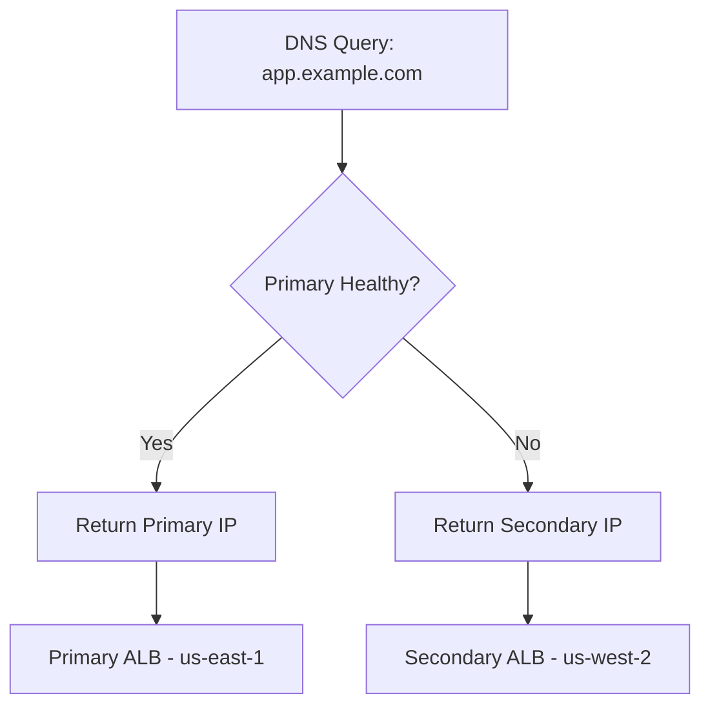

# How to Configure Route 53 Failover Routing Policy

Author: [nawazdhandala](https://github.com/nawazdhandala)

Tags: AWS, Route 53, DNS, High Availability

Description: A practical guide to configuring Route 53 failover routing for high availability, including active-passive setups, health check configuration, and multi-region disaster recovery patterns.

---

Failover routing in Route 53 gives you active-passive failover at the DNS level. You designate one endpoint as primary and another as secondary. Route 53 monitors the primary with a health check, and if it fails, DNS queries automatically get answered with the secondary endpoint. When the primary recovers, traffic shifts back.

It's one of the simplest ways to add high availability to your application without touching your application code. And for disaster recovery scenarios where you have a standby environment in another region, failover routing is the mechanism that makes the switch happen.

## How Failover Routing Works

You create two records: one with `Failover: PRIMARY` and one with `Failover: SECONDARY`. The primary record must have a health check. When the health check is healthy, Route 53 returns the primary record. When it's unhealthy, Route 53 returns the secondary.



## Setting Up Active-Passive Failover

First, create a health check for the primary endpoint.

```bash
# Create a health check for the primary endpoint
aws route53 create-health-check \
  --caller-reference "primary-health-$(date +%s)" \
  --health-check-config '{
    "Type": "HTTPS",
    "FullyQualifiedDomainName": "primary-alb.us-east-1.elb.amazonaws.com",
    "Port": 443,
    "ResourcePath": "/health",
    "RequestInterval": 10,
    "FailureThreshold": 3,
    "EnableSNI": true
  }'
```

With `RequestInterval` of 10 seconds and `FailureThreshold` of 3, Route 53 detects a failure within 30 seconds. The actual DNS failover happens almost immediately after the health check transitions to unhealthy.

Now create the failover records.

```bash
# Create the primary failover record
aws route53 change-resource-record-sets \
  --hosted-zone-id Z0123456789ABCDEFGHIJ \
  --change-batch '{
    "Changes": [{
      "Action": "CREATE",
      "ResourceRecordSet": {
        "Name": "app.example.com",
        "Type": "A",
        "SetIdentifier": "primary",
        "Failover": "PRIMARY",
        "HealthCheckId": "primary-health-check-id",
        "AliasTarget": {
          "HostedZoneId": "Z35SXDOTRQ7X7K",
          "DNSName": "primary-alb.us-east-1.elb.amazonaws.com",
          "EvaluateTargetHealth": true
        }
      }
    }]
  }'

# Create the secondary failover record
aws route53 change-resource-record-sets \
  --hosted-zone-id Z0123456789ABCDEFGHIJ \
  --change-batch '{
    "Changes": [{
      "Action": "CREATE",
      "ResourceRecordSet": {
        "Name": "app.example.com",
        "Type": "A",
        "SetIdentifier": "secondary",
        "Failover": "SECONDARY",
        "AliasTarget": {
          "HostedZoneId": "Z1H1FL5HABSF5",
          "DNSName": "secondary-alb.us-west-2.elb.amazonaws.com",
          "EvaluateTargetHealth": true
        }
      }
    }]
  }'
```

The secondary record doesn't need its own health check. When the primary is healthy, Route 53 returns the primary. When the primary is unhealthy, Route 53 returns the secondary (assuming it passes `EvaluateTargetHealth`).

## Adding a Health Check to the Secondary

For a more robust setup, add a health check to the secondary too. If both endpoints are unhealthy, Route 53 returns the primary record as a last resort (on the assumption that something is better than nothing).

```bash
# Create a health check for the secondary
aws route53 create-health-check \
  --caller-reference "secondary-health-$(date +%s)" \
  --health-check-config '{
    "Type": "HTTPS",
    "FullyQualifiedDomainName": "secondary-alb.us-west-2.elb.amazonaws.com",
    "Port": 443,
    "ResourcePath": "/health",
    "RequestInterval": 10,
    "FailureThreshold": 3
  }'

# Update the secondary record with the health check
aws route53 change-resource-record-sets \
  --hosted-zone-id Z0123456789ABCDEFGHIJ \
  --change-batch '{
    "Changes": [{
      "Action": "UPSERT",
      "ResourceRecordSet": {
        "Name": "app.example.com",
        "Type": "A",
        "SetIdentifier": "secondary",
        "Failover": "SECONDARY",
        "HealthCheckId": "secondary-health-check-id",
        "AliasTarget": {
          "HostedZoneId": "Z1H1FL5HABSF5",
          "DNSName": "secondary-alb.us-west-2.elb.amazonaws.com",
          "EvaluateTargetHealth": true
        }
      }
    }]
  }'
```

## Failover to a Static S3 Website

A common disaster recovery pattern is failing over to a static "sorry, we're down" page hosted on S3. This works even if your entire compute infrastructure is offline.

```bash
# Create an S3 bucket configured as a static website
aws s3 mb s3://app-failover-example-com

# Upload a maintenance page
aws s3 cp maintenance.html s3://app-failover-example-com/index.html \
  --content-type text/html

# Enable static website hosting
aws s3 website s3://app-failover-example-com \
  --index-document index.html

# Create the secondary failover record pointing to S3
aws route53 change-resource-record-sets \
  --hosted-zone-id Z0123456789ABCDEFGHIJ \
  --change-batch '{
    "Changes": [{
      "Action": "CREATE",
      "ResourceRecordSet": {
        "Name": "app.example.com",
        "Type": "A",
        "SetIdentifier": "secondary-s3",
        "Failover": "SECONDARY",
        "AliasTarget": {
          "HostedZoneId": "Z3AQBSTGFYJSTF",
          "DNSName": "s3-website-us-east-1.amazonaws.com",
          "EvaluateTargetHealth": false
        }
      }
    }]
  }'
```

## Terraform Configuration

```hcl
# Health check for primary
resource "aws_route53_health_check" "primary" {
  fqdn              = aws_lb.primary.dns_name
  port              = 443
  type              = "HTTPS"
  resource_path     = "/health"
  request_interval  = 10
  failure_threshold = 3

  tags = {
    Name = "primary-failover-health"
  }
}

# Primary failover record
resource "aws_route53_record" "primary" {
  zone_id        = aws_route53_zone.main.zone_id
  name           = "app.example.com"
  type           = "A"
  set_identifier = "primary"

  failover_routing_policy {
    type = "PRIMARY"
  }

  alias {
    name                   = aws_lb.primary.dns_name
    zone_id                = aws_lb.primary.zone_id
    evaluate_target_health = true
  }

  health_check_id = aws_route53_health_check.primary.id
}

# Secondary failover record
resource "aws_route53_record" "secondary" {
  zone_id        = aws_route53_zone.main.zone_id
  name           = "app.example.com"
  type           = "A"
  set_identifier = "secondary"

  failover_routing_policy {
    type = "SECONDARY"
  }

  alias {
    name                   = aws_lb.secondary.dns_name
    zone_id                = aws_lb.secondary.zone_id
    evaluate_target_health = true
  }
}
```

## Calculated Health Checks

For more sophisticated failover logic, use calculated health checks that combine multiple child health checks.

```bash
# Create a calculated health check that fails if 2 out of 3 children fail
aws route53 create-health-check \
  --caller-reference "calculated-$(date +%s)" \
  --health-check-config '{
    "Type": "CALCULATED",
    "HealthThreshold": 2,
    "ChildHealthChecks": [
      "child-health-check-1",
      "child-health-check-2",
      "child-health-check-3"
    ]
  }'
```

This is useful when your primary has multiple components (web server, API, database) and you only want to failover when multiple components are down, not just one.

## Testing Failover

You can manually force a failover by inverting the health check result.

```bash
# Invert the health check to simulate failure (for testing)
aws route53 update-health-check \
  --health-check-id primary-health-check-id \
  --inverted

# After testing, remove the inversion
aws route53 update-health-check \
  --health-check-id primary-health-check-id \
  --no-inverted
```

Always test your failover path before you need it. The worst time to discover your DR setup doesn't work is during an actual disaster.

## Failover Timing

The total failover time depends on several factors:
- Health check interval (10 or 30 seconds)
- Failure threshold (1-10 checks)
- DNS TTL on the record
- Client-side DNS caching

With a 10-second interval and threshold of 3, the health check declares failure in about 30 seconds. If your DNS TTL is 60 seconds, some clients may continue hitting the old endpoint for up to 90 seconds total. Keep TTLs low on failover records - 60 seconds is a good target.

For monitoring your failover health checks and getting alerted when failovers happen, consider setting up CloudWatch alarms or using a monitoring tool like OneUptime that can track both the health check status and the actual user experience during the transition.

Failover routing is the foundation of DNS-based disaster recovery. It's simple, reliable, and doesn't require any changes to your application. Combine it with health checks, keep your secondary environment warm, and test regularly.
