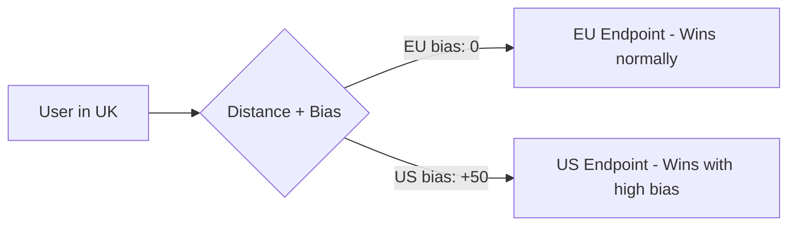

# How to Configure Route 53 Geoproximity Routing with Traffic Flow

Author: [nawazdhandala](https://github.com/nawazdhandala)

Tags: AWS, Route 53, DNS, Networking

Description: Learn how to use Route 53 geoproximity routing with Traffic Flow to route users based on geographic proximity with adjustable bias, enabling fine-grained control over traffic distribution across regions.

---

Geoproximity routing is the most flexible geographic routing option in Route 53. It routes traffic based on the physical distance between your users and your resources, but with a twist - you can add a bias to expand or shrink the geographic area that routes to each endpoint. This means you can shift traffic between regions without changing your infrastructure, just by adjusting a number.

Geoproximity routing requires Route 53 Traffic Flow, which is a visual policy editor for building complex routing configurations. You can't create geoproximity records with simple CLI commands the way you can with other routing policies.

## How Geoproximity Routing Works

Route 53 calculates the geographic distance between the DNS resolver (representing the user) and each of your endpoints. The closest endpoint wins. But here's where bias comes in: a positive bias expands the geographic area that routes to an endpoint, and a negative bias shrinks it.

Think of it like inflating or deflating a balloon around each endpoint. A bias of +50 on your US endpoint makes it "reach" further, pulling traffic that would normally go to your EU endpoint. A bias of -20 on your EU endpoint makes it "reach" less, pushing traffic to neighboring endpoints.



## Creating a Traffic Flow Policy

Since geoproximity routing requires Traffic Flow, you create a traffic policy that defines the routing logic, then create a policy record that applies it to your domain.

Here's a traffic policy that routes to three regions with bias adjustments.

```json
{
  "AWSPolicyFormatVersion": "2015-10-01",
  "RecordType": "A",
  "StartRule": "geoProximityRule",
  "Rules": {
    "geoProximityRule": {
      "RuleType": "geoproximity",
      "GeoproximityLocations": [
        {
          "EndpointReference": "usEast",
          "Region": "aws:route53:us-east-1",
          "Bias": 10
        },
        {
          "EndpointReference": "euWest",
          "Region": "aws:route53:eu-west-1",
          "Bias": 0
        },
        {
          "EndpointReference": "apSoutheast",
          "Region": "aws:route53:ap-southeast-1",
          "Bias": -10
        }
      ]
    }
  },
  "Endpoints": {
    "usEast": {
      "Type": "elastic-load-balancer",
      "Value": "us-east-alb-123.us-east-1.elb.amazonaws.com"
    },
    "euWest": {
      "Type": "elastic-load-balancer",
      "Value": "eu-west-alb-456.eu-west-1.elb.amazonaws.com"
    },
    "apSoutheast": {
      "Type": "elastic-load-balancer",
      "Value": "ap-se-alb-789.ap-southeast-1.elb.amazonaws.com"
    }
  }
}
```

Create and apply the policy.

```bash
# Create the traffic policy
aws route53 create-traffic-policy \
  --name "geoproximity-global" \
  --document file://traffic-policy.json \
  --comment "Global geoproximity routing with bias"

# Create a policy record that applies the policy to your domain
aws route53 create-traffic-policy-instance \
  --hosted-zone-id Z0123456789ABCDEFGHIJ \
  --name app.example.com \
  --traffic-policy-id policy-id \
  --traffic-policy-version 1 \
  --ttl 60
```

## Understanding Bias Values

Bias ranges from -99 to +99. Here's what different values mean in practice:

- **Bias 0** - Pure distance-based routing. Traffic goes to the geographically closest endpoint.
- **Bias +25 to +50** - Moderately expanded reach. Useful for absorbing traffic from a nearby endpoint that's under heavy load.
- **Bias +75 to +99** - Aggressively expanded reach. The endpoint pulls traffic from far away. Use this when you want one region to handle most traffic.
- **Bias -25 to -50** - Moderately reduced reach. The endpoint only handles traffic from very close users.
- **Bias -75 to -99** - Barely handles any traffic. Useful for draining a region before maintenance.

## Non-AWS Endpoints

Geoproximity routing also works with non-AWS endpoints. For resources not in AWS regions, you specify latitude and longitude coordinates.

```json
{
  "GeoproximityLocations": [
    {
      "EndpointReference": "onPremDC",
      "Latitude": "40.7128",
      "Longitude": "-74.0060",
      "Bias": 0
    },
    {
      "EndpointReference": "awsRegion",
      "Region": "aws:route53:us-east-1",
      "Bias": 0
    }
  ]
}
```

This is useful in hybrid deployments where you have on-premises data centers alongside AWS regions.

## Combining with Health Checks

Traffic Flow policies can include health checks. When an endpoint fails its health check, its geoproximity area collapses to zero and nearby endpoints absorb the traffic.

```json
{
  "Endpoints": {
    "usEast": {
      "Type": "elastic-load-balancer",
      "Value": "us-east-alb.us-east-1.elb.amazonaws.com",
      "HealthCheck": "health-check-id-us"
    },
    "euWest": {
      "Type": "elastic-load-balancer",
      "Value": "eu-west-alb.eu-west-1.elb.amazonaws.com",
      "HealthCheck": "health-check-id-eu"
    }
  }
}
```

## Complex Routing with Traffic Flow

The real power of Traffic Flow is combining multiple routing types. Here's a policy that uses geoproximity at the top level, then weighted routing within each region for canary deployments.

```json
{
  "AWSPolicyFormatVersion": "2015-10-01",
  "RecordType": "A",
  "StartRule": "geoProximityRule",
  "Rules": {
    "geoProximityRule": {
      "RuleType": "geoproximity",
      "GeoproximityLocations": [
        {
          "EndpointReference": null,
          "RuleReference": "usWeightedRule",
          "Region": "aws:route53:us-east-1",
          "Bias": 0
        },
        {
          "EndpointReference": null,
          "RuleReference": "euWeightedRule",
          "Region": "aws:route53:eu-west-1",
          "Bias": 0
        }
      ]
    },
    "usWeightedRule": {
      "RuleType": "weighted",
      "Items": [
        {
          "EndpointReference": "usProd",
          "Weight": 90
        },
        {
          "EndpointReference": "usCanary",
          "Weight": 10
        }
      ]
    },
    "euWeightedRule": {
      "RuleType": "weighted",
      "Items": [
        {
          "EndpointReference": "euProd",
          "Weight": 95
        },
        {
          "EndpointReference": "euCanary",
          "Weight": 5
        }
      ]
    }
  },
  "Endpoints": {
    "usProd": {
      "Type": "elastic-load-balancer",
      "Value": "us-prod-alb.us-east-1.elb.amazonaws.com"
    },
    "usCanary": {
      "Type": "elastic-load-balancer",
      "Value": "us-canary-alb.us-east-1.elb.amazonaws.com"
    },
    "euProd": {
      "Type": "elastic-load-balancer",
      "Value": "eu-prod-alb.eu-west-1.elb.amazonaws.com"
    },
    "euCanary": {
      "Type": "elastic-load-balancer",
      "Value": "eu-canary-alb.eu-west-1.elb.amazonaws.com"
    }
  }
}
```

## Terraform Configuration

```hcl
resource "aws_route53_traffic_policy" "geoproximity" {
  name     = "geoproximity-global"
  comment  = "Geoproximity routing with bias"
  document = jsonencode({
    AWSPolicyFormatVersion = "2015-10-01"
    RecordType            = "A"
    StartRule             = "geoProximityRule"
    Rules = {
      geoProximityRule = {
        RuleType = "geoproximity"
        GeoproximityLocations = [
          {
            EndpointReference = "usEast"
            Region           = "aws:route53:us-east-1"
            Bias             = 10
          },
          {
            EndpointReference = "euWest"
            Region           = "aws:route53:eu-west-1"
            Bias             = 0
          }
        ]
      }
    }
    Endpoints = {
      usEast = {
        Type  = "elastic-load-balancer"
        Value = aws_lb.us_east.dns_name
      }
      euWest = {
        Type  = "elastic-load-balancer"
        Value = aws_lb.eu_west.dns_name
      }
    }
  })
}

resource "aws_route53_traffic_policy_instance" "main" {
  name                   = "app.example.com"
  traffic_policy_id      = aws_route53_traffic_policy.geoproximity.id
  traffic_policy_version = aws_route53_traffic_policy.geoproximity.version
  hosted_zone_id         = aws_route53_zone.main.zone_id
  ttl                    = 60
}
```

## Traffic Flow Costs

Traffic Flow policies cost $50 per month per policy record. That's per domain name you apply the policy to, not per endpoint. If you use the same policy for `app.example.com` and `api.example.com`, that's $100/month.

This pricing makes Traffic Flow cost-effective for important domains but less practical for hundreds of records. For simpler geographic routing without bias control, regular geolocation routing (see https://oneuptime.com/blog/post/route-53-geolocation-routing-policy/view) is free beyond standard query charges.

## Versioning and Rollback

Traffic policies support versioning. Each change creates a new version, and you can quickly roll back to a previous version.

```bash
# Create a new version with adjusted bias
aws route53 create-traffic-policy-version \
  --id policy-id \
  --document file://updated-policy.json

# Update the instance to use the new version
aws route53 update-traffic-policy-instance \
  --id instance-id \
  --traffic-policy-id policy-id \
  --traffic-policy-version 2 \
  --ttl 60
```

Geoproximity routing with Traffic Flow gives you the most control over geographic traffic distribution in Route 53. The bias mechanism is uniquely powerful - it lets you shift traffic patterns in real-time without changing infrastructure, making it invaluable for capacity management and gradual migrations.
