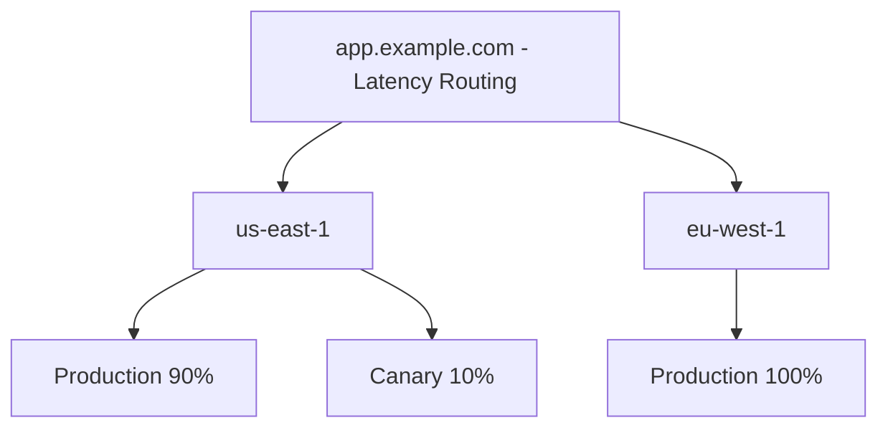

# How to Configure Route 53 Latency-Based Routing Policy

Author: [nawazdhandala](https://github.com/nawazdhandala)

Tags: AWS, Route 53, DNS, Networking

Description: Learn how to configure Route 53 latency-based routing to automatically direct users to the AWS region with the lowest network latency, improving application performance globally.

---

Latency-based routing in Route 53 automatically sends users to the AWS region that provides them the lowest latency. Instead of guessing which region is closest to a user based on their geography, Route 53 uses actual network latency measurements to make the routing decision. A user in Tokyo gets routed to ap-northeast-1, a user in London gets routed to eu-west-1, and a user in New York gets routed to us-east-1 - all automatically.

This is one of the most impactful things you can do for a globally distributed application. The difference between routing someone to a server 50ms away versus 200ms away is noticeable on every single page load.

## How Latency-Based Routing Works

Route 53 maintains a latency database that maps regions of the internet to AWS regions. When a DNS query arrives, Route 53 identifies the approximate network location of the resolver (not the end user directly, but close enough) and returns the record associated with the AWS region that has the lowest latency from that location.

You create multiple records with the same name, each associated with a different AWS region. Route 53 picks the best one for each query.

## Setting Up Latency-Based Routing

Let's say you have your application deployed in three regions: us-east-1, eu-west-1, and ap-southeast-1.

```bash
# US East endpoint
aws route53 change-resource-record-sets \
  --hosted-zone-id Z0123456789ABCDEFGHIJ \
  --change-batch '{
    "Changes": [{
      "Action": "CREATE",
      "ResourceRecordSet": {
        "Name": "app.example.com",
        "Type": "A",
        "SetIdentifier": "us-east-1",
        "Region": "us-east-1",
        "AliasTarget": {
          "HostedZoneId": "Z35SXDOTRQ7X7K",
          "DNSName": "app-us-east-alb.us-east-1.elb.amazonaws.com",
          "EvaluateTargetHealth": true
        }
      }
    }]
  }'

# EU West endpoint
aws route53 change-resource-record-sets \
  --hosted-zone-id Z0123456789ABCDEFGHIJ \
  --change-batch '{
    "Changes": [{
      "Action": "CREATE",
      "ResourceRecordSet": {
        "Name": "app.example.com",
        "Type": "A",
        "SetIdentifier": "eu-west-1",
        "Region": "eu-west-1",
        "AliasTarget": {
          "HostedZoneId": "Z32O12XQLNTSW2",
          "DNSName": "app-eu-west-alb.eu-west-1.elb.amazonaws.com",
          "EvaluateTargetHealth": true
        }
      }
    }]
  }'

# Asia Pacific endpoint
aws route53 change-resource-record-sets \
  --hosted-zone-id Z0123456789ABCDEFGHIJ \
  --change-batch '{
    "Changes": [{
      "Action": "CREATE",
      "ResourceRecordSet": {
        "Name": "app.example.com",
        "Type": "A",
        "SetIdentifier": "ap-southeast-1",
        "Region": "ap-southeast-1",
        "AliasTarget": {
          "HostedZoneId": "Z1LMS91P8CMLE5",
          "DNSName": "app-ap-se-alb.ap-southeast-1.elb.amazonaws.com",
          "EvaluateTargetHealth": true
        }
      }
    }]
  }'
```

The `Region` field is critical - it tells Route 53 which AWS region the endpoint is in. Route 53 uses this to look up latency data.

## Adding Health Checks

Without health checks, Route 53 will continue routing to a region even if the endpoint there is down. Always add health checks to latency-based records.

```bash
# Create health checks for each region
aws route53 create-health-check \
  --caller-reference "us-east-health-$(date +%s)" \
  --health-check-config '{
    "Type": "HTTPS",
    "FullyQualifiedDomainName": "app-us-east-alb.us-east-1.elb.amazonaws.com",
    "Port": 443,
    "ResourcePath": "/health",
    "RequestInterval": 10,
    "FailureThreshold": 3
  }'
```

When a health check fails, Route 53 removes that region from the latency calculations and routes users to the next-best region. This gives you automatic regional failover.

```bash
# Update the record to include the health check
aws route53 change-resource-record-sets \
  --hosted-zone-id Z0123456789ABCDEFGHIJ \
  --change-batch '{
    "Changes": [{
      "Action": "UPSERT",
      "ResourceRecordSet": {
        "Name": "app.example.com",
        "Type": "A",
        "SetIdentifier": "us-east-1",
        "Region": "us-east-1",
        "HealthCheckId": "us-east-health-check-id",
        "AliasTarget": {
          "HostedZoneId": "Z35SXDOTRQ7X7K",
          "DNSName": "app-us-east-alb.us-east-1.elb.amazonaws.com",
          "EvaluateTargetHealth": true
        }
      }
    }]
  }'
```

## Terraform Configuration

```hcl
# Latency-based routing records for each region
resource "aws_route53_record" "app_us" {
  zone_id        = aws_route53_zone.main.zone_id
  name           = "app.example.com"
  type           = "A"
  set_identifier = "us-east-1"

  latency_routing_policy {
    region = "us-east-1"
  }

  alias {
    name                   = aws_lb.us_east.dns_name
    zone_id                = aws_lb.us_east.zone_id
    evaluate_target_health = true
  }

  health_check_id = aws_route53_health_check.us_east.id
}

resource "aws_route53_record" "app_eu" {
  zone_id        = aws_route53_zone.main.zone_id
  name           = "app.example.com"
  type           = "A"
  set_identifier = "eu-west-1"

  latency_routing_policy {
    region = "eu-west-1"
  }

  alias {
    name                   = aws_lb.eu_west.dns_name
    zone_id                = aws_lb.eu_west.zone_id
    evaluate_target_health = true
  }

  health_check_id = aws_route53_health_check.eu_west.id
}

resource "aws_route53_record" "app_ap" {
  zone_id        = aws_route53_zone.main.zone_id
  name           = "app.example.com"
  type           = "A"
  set_identifier = "ap-southeast-1"

  latency_routing_policy {
    region = "ap-southeast-1"
  }

  alias {
    name                   = aws_lb.ap_southeast.dns_name
    zone_id                = aws_lb.ap_southeast.zone_id
    evaluate_target_health = true
  }

  health_check_id = aws_route53_health_check.ap_southeast.id
}

# Health checks
resource "aws_route53_health_check" "us_east" {
  fqdn              = aws_lb.us_east.dns_name
  port              = 443
  type              = "HTTPS"
  resource_path     = "/health"
  request_interval  = 10
  failure_threshold = 3

  tags = {
    Name = "us-east-1-health"
  }
}
```

## Combining with Other Routing Policies

You can nest latency-based routing with other policies using alias records. A common pattern is latency-based routing at the top level with weighted routing within each region for canary deployments.



You'd implement this with latency-based records pointing to intermediate record names, which themselves use weighted routing.

## Latency vs Geolocation Routing

People often ask which to use. Here's the difference:

- **Latency routing** picks the endpoint with the best network performance. It's based on actual latency data and can change over time as network conditions change.
- **Geolocation routing** picks the endpoint based on the user's geographic location. It's deterministic - a user in Germany always gets the Europe endpoint regardless of latency.

Use latency routing when performance is your priority. Use geolocation routing when you need to serve different content by region (regulatory requirements, localized content, data sovereignty).

For more on geolocation routing, see https://oneuptime.com/blog/post/route-53-geolocation-routing-policy/view.

## Testing Latency-Based Routing

You can test which endpoint Route 53 returns for different locations using the `test-dns-answer` API.

```bash
# Test which endpoint a resolver in Frankfurt would get
aws route53 test-dns-answer \
  --hosted-zone-id Z0123456789ABCDEFGHIJ \
  --record-name app.example.com \
  --record-type A \
  --resolver-ip 195.68.0.1
```

You can also use global testing services to verify routing from different locations around the world. Monitor the actual latency your users experience from each region using tools like OneUptime to ensure your routing is delivering the expected performance improvements.

## Limitations

- Route 53 routes based on the DNS resolver's location, not the end user's. If a user in Tokyo uses a DNS resolver in the US, they'll get the US endpoint. EDNS Client Subnet (ECS) support in Route 53 mitigates this for most major public resolvers.
- Latency data is based on AWS's measurements and may not perfectly reflect your users' actual experience.
- There's no way to set a bias or preference toward a specific region with latency routing. For that, use geoproximity routing with Traffic Flow. See https://oneuptime.com/blog/post/route-53-geoproximity-routing-traffic-flow/view.

Latency-based routing is one of the easiest wins for global applications. If your app runs in multiple AWS regions, set it up. The performance improvement for distant users is substantial, and the automatic failover with health checks gives you resilience for free.
