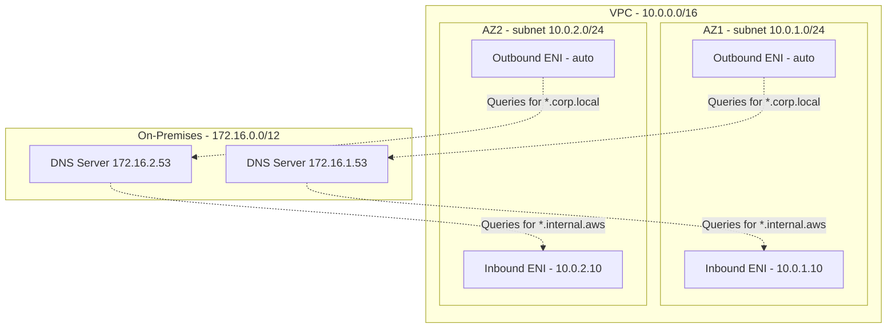

# How to Configure Route 53 Resolver Endpoints for On-Premises DNS

Author: [nawazdhandala](https://github.com/nawazdhandala)

Tags: AWS, Route 53, DNS, On-Premises, Hybrid Cloud

Description: Detailed walkthrough for setting up Route 53 Resolver inbound and outbound endpoints to integrate on-premises DNS with AWS private hosted zones.

---

If your organization runs a hybrid setup with workloads in AWS and on-premises data centers, one of the first things that breaks is DNS. Your on-premises Active Directory can't resolve EC2 instance names, and your AWS workloads can't find that legacy database server by hostname. Route 53 Resolver endpoints fix this by creating a DNS bridge between the two worlds.

## The DNS Problem in Hybrid Networks

When you connect your on-premises network to AWS via VPN or Direct Connect, you get network-level connectivity. Packets can flow between the two environments. But DNS is a different story.

Your VPC's built-in resolver (at the .2 address of your VPC CIDR) only handles queries for public domains and VPC-associated private hosted zones. It doesn't know about `dc01.corp.local`. And your on-premises DNS server running on Windows Server or BIND doesn't know about `myapp.internal.aws`.

Route 53 Resolver endpoints solve this with two components:

- **Inbound endpoints** receive DNS queries from on-premises and resolve them against Route 53 (including private hosted zones)
- **Outbound endpoints** forward DNS queries from AWS to your on-premises DNS servers based on configurable rules

## Planning Your Endpoint Deployment

Before creating anything, plan the following:

**IP Addressing**: Inbound endpoints need static IPs that your on-premises DNS servers will target. Pick IPs from your private subnets that won't conflict with anything.

**Subnet Selection**: Deploy endpoints in at least two AZs for high availability. Use private subnets that have connectivity to your on-premises network.

**Security Groups**: You'll need a security group allowing DNS traffic (TCP/UDP port 53) from both your VPC CIDR and on-premises CIDR ranges.

**Capacity**: Each endpoint IP address can handle about 10,000 queries per second. For most organizations, two IPs per endpoint is plenty.

Here's the network layout:



## Creating the Inbound Endpoint

Start with the security group:

```bash
# Create security group for resolver endpoints
aws ec2 create-security-group \
  --group-name resolver-endpoints-sg \
  --description "Allow DNS traffic for Route 53 Resolver" \
  --vpc-id vpc-0abc123def

# Allow DNS from on-premises network
aws ec2 authorize-security-group-ingress \
  --group-id sg-0abc123 \
  --ip-permissions \
    '[{"IpProtocol":"udp","FromPort":53,"ToPort":53,"IpRanges":[{"CidrIp":"172.16.0.0/12","Description":"On-prem DNS UDP"}]},
      {"IpProtocol":"tcp","FromPort":53,"ToPort":53,"IpRanges":[{"CidrIp":"172.16.0.0/12","Description":"On-prem DNS TCP"}]}]'

# Allow DNS from VPC
aws ec2 authorize-security-group-ingress \
  --group-id sg-0abc123 \
  --ip-permissions \
    '[{"IpProtocol":"udp","FromPort":53,"ToPort":53,"IpRanges":[{"CidrIp":"10.0.0.0/16","Description":"VPC DNS UDP"}]},
      {"IpProtocol":"tcp","FromPort":53,"ToPort":53,"IpRanges":[{"CidrIp":"10.0.0.0/16","Description":"VPC DNS TCP"}]}]'
```

Now create the inbound endpoint:

```bash
# Create inbound endpoint with static IPs in two AZs
aws route53resolver create-resolver-endpoint \
  --name "onprem-inbound" \
  --direction INBOUND \
  --security-group-ids sg-0abc123 \
  --ip-addresses \
    'SubnetId=subnet-az1,Ip=10.0.1.10' \
    'SubnetId=subnet-az2,Ip=10.0.2.10' \
  --creator-request-id "inbound-ep-$(date +%s)" \
  --tags 'Key=Environment,Value=Production'
```

Wait for it to become operational:

```bash
# Check endpoint status - should show OPERATIONAL
aws route53resolver get-resolver-endpoint \
  --resolver-endpoint-id rslvr-in-abc123 \
  --query 'ResolverEndpoint.Status'
```

## Creating the Outbound Endpoint

```bash
# Create outbound endpoint for forwarding to on-premises
aws route53resolver create-resolver-endpoint \
  --name "onprem-outbound" \
  --direction OUTBOUND \
  --security-group-ids sg-0abc123 \
  --ip-addresses \
    'SubnetId=subnet-az1' \
    'SubnetId=subnet-az2' \
  --creator-request-id "outbound-ep-$(date +%s)" \
  --tags 'Key=Environment,Value=Production'
```

Outbound endpoints don't need static IPs because nothing targets them directly - they initiate connections to your on-premises DNS servers.

## Configuring Forwarding Rules

Create rules that tell the outbound endpoint which domain queries to forward:

```bash
# Forward corp.local queries to on-premises DNS
aws route53resolver create-resolver-rule \
  --name "forward-corp-local" \
  --rule-type FORWARD \
  --domain-name "corp.local" \
  --resolver-endpoint-id rslvr-out-def456 \
  --target-ips \
    'Ip=172.16.1.53,Port=53' \
    'Ip=172.16.2.53,Port=53' \
  --creator-request-id "rule-corp-$(date +%s)"

# Forward Active Directory domain
aws route53resolver create-resolver-rule \
  --name "forward-ad-domain" \
  --rule-type FORWARD \
  --domain-name "ad.company.com" \
  --resolver-endpoint-id rslvr-out-def456 \
  --target-ips \
    'Ip=172.16.1.53,Port=53' \
    'Ip=172.16.2.53,Port=53' \
  --creator-request-id "rule-ad-$(date +%s)"

# Forward reverse DNS for on-premises IP ranges
aws route53resolver create-resolver-rule \
  --name "forward-reverse-onprem" \
  --rule-type FORWARD \
  --domain-name "16.172.in-addr.arpa" \
  --resolver-endpoint-id rslvr-out-def456 \
  --target-ips \
    'Ip=172.16.1.53,Port=53' \
    'Ip=172.16.2.53,Port=53' \
  --creator-request-id "rule-reverse-$(date +%s)"
```

Associate each rule with the VPCs that need it:

```bash
# Associate the corp.local rule with your main VPC
aws route53resolver associate-resolver-rule \
  --resolver-rule-id rslvr-rr-abc123 \
  --vpc-id vpc-0abc123def \
  --name "corp-local-main-vpc"

# Associate with additional VPCs if needed
aws route53resolver associate-resolver-rule \
  --resolver-rule-id rslvr-rr-abc123 \
  --vpc-id vpc-0xyz789 \
  --name "corp-local-dev-vpc"
```

## Configuring Your On-Premises DNS Servers

On your on-premises side, configure conditional forwarders to the inbound endpoint IPs.

For Windows DNS Server using PowerShell:

```powershell
# Add conditional forwarders for AWS private hosted zones
Add-DnsServerConditionalForwarderZone -Name "internal.aws" -MasterServers 10.0.1.10,10.0.2.10
Add-DnsServerConditionalForwarderZone -Name "us-east-1.compute.internal" -MasterServers 10.0.1.10,10.0.2.10
Add-DnsServerConditionalForwarderZone -Name "us-east-1.rds.amazonaws.com" -MasterServers 10.0.1.10,10.0.2.10
```

For BIND, add to `named.conf`:

```
zone "internal.aws" {
    type forward;
    forward only;
    forwarders { 10.0.1.10; 10.0.2.10; };
};

zone "us-east-1.compute.internal" {
    type forward;
    forward only;
    forwarders { 10.0.1.10; 10.0.2.10; };
};
```

Don't forget to forward the RDS and ElastiCache DNS zones if you're using those services - on-premises apps connecting to RDS through VPN need to resolve the RDS endpoint names.

## Testing and Validation

From an EC2 instance:

```bash
# Test resolving an on-premises hostname from AWS
nslookup dc01.corp.local
dig fileserver.corp.local A +short

# Verify the query goes through the outbound endpoint
dig +trace fileserver.corp.local
```

From an on-premises server:

```bash
# Test resolving AWS private hosted zone records
nslookup myapp.internal.aws
dig rds-instance.abcdef.us-east-1.rds.amazonaws.com +short
```

## Sharing Rules Across Accounts

If you're running a multi-account setup with AWS Organizations, you can share resolver rules via AWS RAM:

```bash
# Share a resolver rule with your AWS Organization
aws ram create-resource-share \
  --name "dns-resolver-rules" \
  --resource-arns "arn:aws:route53resolver:us-east-1:123456789:resolver-rule/rslvr-rr-abc123" \
  --principals "arn:aws:organizations::123456789:organization/o-abc123" \
  --permission-arns "arn:aws:ram::aws:permission/ARAMDefaultPermissionResolverRule"
```

This way, spoke accounts in your organization can associate the forwarding rules with their own VPCs without duplicating the outbound endpoint.

## Monitoring and Troubleshooting

Enable resolver query logging to diagnose issues:

```bash
# Create a log group for resolver queries
aws logs create-log-group \
  --log-group-name /aws/route53resolver/hybrid-dns

# Create resolver query log configuration
aws route53resolver create-resolver-query-log-config \
  --name "hybrid-dns-logs" \
  --destination-arn "arn:aws:logs:us-east-1:123456789:log-group:/aws/route53resolver/hybrid-dns" \
  --creator-request-id "qlog-$(date +%s)"
```

Common issues to watch for:

- **Timeouts**: Check that security groups allow both TCP and UDP port 53. DNS uses UDP normally but falls back to TCP for large responses.
- **SERVFAIL responses**: Usually means the target DNS server is unreachable. Verify network connectivity over VPN/Direct Connect.
- **Stale records**: On-premises DNS might cache aggressively. Check TTL values on your Route 53 records.

## Summary

Route 53 Resolver endpoints are the standard way to handle DNS in hybrid environments. Deploy inbound endpoints with static IPs for on-premises to AWS resolution, outbound endpoints with forwarding rules for AWS to on-premises resolution, and share rules across accounts with RAM. Plan for high availability by using at least two AZs, and enable query logging from day one to make troubleshooting easier down the road.
