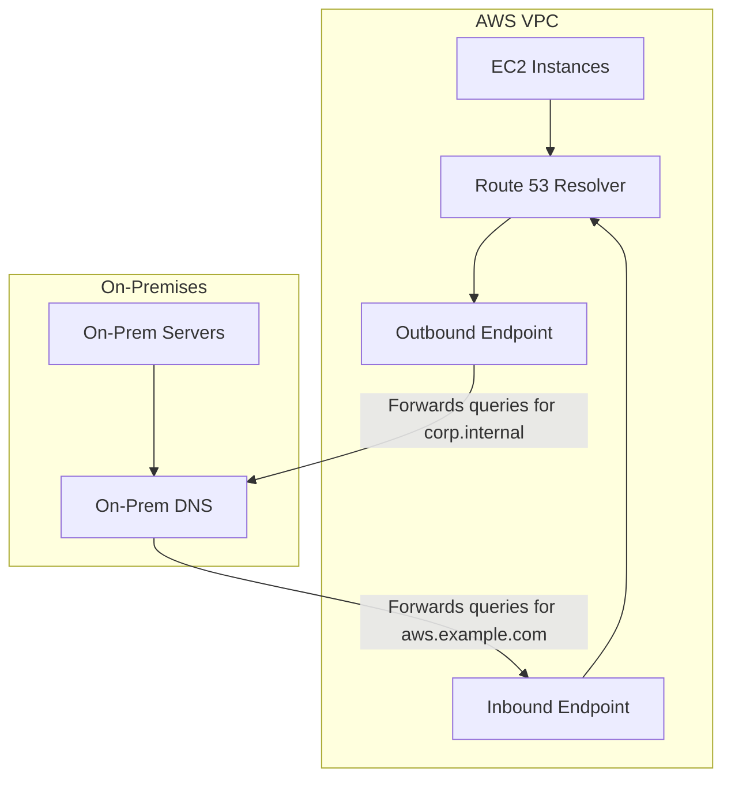

# How to Set Up Route 53 Resolver for Hybrid DNS

Author: [nawazdhandala](https://github.com/nawazdhandala)

Tags: AWS, Route 53, DNS, Hybrid Cloud, VPC

Description: Guide to configuring Route 53 Resolver for hybrid DNS resolution between AWS VPCs and on-premises networks using inbound and outbound endpoints.

---

When you're running a hybrid environment with workloads split between AWS and on-premises data centers, DNS becomes a surprisingly tricky problem. Your on-premises servers need to resolve AWS-hosted private domain names, and your AWS resources need to resolve on-premises domain names. Route 53 Resolver bridges this gap.

## Understanding the Problem

By default, every VPC gets a built-in DNS resolver at the VPC CIDR base plus two (for example, `10.0.0.2` for a `10.0.0.0/16` VPC). This resolver handles queries for:

- Public domain names (via recursive resolution)
- Private hosted zones associated with the VPC
- VPC-internal names (like EC2 private DNS names)

But here's the catch. Your on-premises DNS server can't reach `10.0.0.2` - it's inside the VPC. And the VPC resolver doesn't know about your on-premises `corp.internal` zone. You need Route 53 Resolver endpoints to make this work.



## Inbound vs Outbound Endpoints

There are two types of resolver endpoints, and the naming is based on the direction of DNS queries relative to your VPC:

- **Inbound Endpoint**: Receives DNS queries from outside the VPC (on-premises to AWS). Creates ENIs with IP addresses that your on-premises DNS servers can forward to.
- **Outbound Endpoint**: Sends DNS queries from the VPC to external DNS servers (AWS to on-premises). Works with resolver rules that define which domains get forwarded where.

Most hybrid setups need both.

## Step 1: Create a Security Group

Both endpoint types need a security group that allows DNS traffic:

```bash
# Create a security group for Route 53 Resolver endpoints
aws ec2 create-security-group \
  --group-name route53-resolver-sg \
  --description "Security group for Route 53 Resolver endpoints" \
  --vpc-id vpc-abc123

# Allow inbound DNS over TCP and UDP from on-premises CIDR
aws ec2 authorize-security-group-ingress \
  --group-id sg-resolver123 \
  --ip-permissions \
    '[{"IpProtocol":"tcp","FromPort":53,"ToPort":53,"IpRanges":[{"CidrIp":"172.16.0.0/12"}]},
      {"IpProtocol":"udp","FromPort":53,"ToPort":53,"IpRanges":[{"CidrIp":"172.16.0.0/12"}]}]'

# Allow inbound DNS from VPC CIDR as well
aws ec2 authorize-security-group-ingress \
  --group-id sg-resolver123 \
  --ip-permissions \
    '[{"IpProtocol":"tcp","FromPort":53,"ToPort":53,"IpRanges":[{"CidrIp":"10.0.0.0/16"}]},
      {"IpProtocol":"udp","FromPort":53,"ToPort":53,"IpRanges":[{"CidrIp":"10.0.0.0/16"}]}]'
```

## Step 2: Create the Inbound Endpoint

The inbound endpoint creates ENIs in your VPC subnets. Your on-premises DNS servers will forward queries to these IP addresses.

```bash
# Create the inbound resolver endpoint across two AZs for redundancy
aws route53resolver create-resolver-endpoint \
  --name "hybrid-inbound" \
  --direction INBOUND \
  --security-group-ids sg-resolver123 \
  --ip-addresses \
    'SubnetId=subnet-az1-private,Ip=10.0.1.10' \
    'SubnetId=subnet-az2-private,Ip=10.0.2.10' \
  --creator-request-id "inbound-$(date +%s)"
```

You're specifying static IPs here (`10.0.1.10` and `10.0.2.10`) so they're predictable for your on-premises DNS configuration. Place these in private subnets that are reachable from on-premises via your VPN or Direct Connect.

Verify the endpoint was created:

```bash
# Check inbound endpoint status
aws route53resolver get-resolver-endpoint \
  --resolver-endpoint-id rslvr-in-abc123 \
  --query 'ResolverEndpoint.{Status:Status,IpAddressCount:IpAddressCount}'
```

## Step 3: Create the Outbound Endpoint

The outbound endpoint handles queries going from AWS to on-premises:

```bash
# Create the outbound resolver endpoint
aws route53resolver create-resolver-endpoint \
  --name "hybrid-outbound" \
  --direction OUTBOUND \
  --security-group-ids sg-resolver123 \
  --ip-addresses \
    'SubnetId=subnet-az1-private' \
    'SubnetId=subnet-az2-private' \
  --creator-request-id "outbound-$(date +%s)"
```

For outbound endpoints, you don't need static IPs since nothing needs to target them directly. AWS assigns IPs from the subnet automatically.

## Step 4: Create Resolver Rules

Resolver rules tell the outbound endpoint which domain queries to forward and where to send them:

```bash
# Create a forwarding rule for your on-premises domain
aws route53resolver create-resolver-rule \
  --name "forward-corp-internal" \
  --rule-type FORWARD \
  --domain-name "corp.internal" \
  --resolver-endpoint-id rslvr-out-def456 \
  --target-ips \
    'Ip=172.16.1.10,Port=53' \
    'Ip=172.16.1.11,Port=53' \
  --creator-request-id "rule-corp-$(date +%s)"
```

You can create multiple rules for different domains:

```bash
# Forward queries for another on-premises zone
aws route53resolver create-resolver-rule \
  --name "forward-legacy-apps" \
  --rule-type FORWARD \
  --domain-name "legacy.company.com" \
  --resolver-endpoint-id rslvr-out-def456 \
  --target-ips \
    'Ip=172.16.1.10,Port=53' \
    'Ip=172.16.1.11,Port=53' \
  --creator-request-id "rule-legacy-$(date +%s)"
```

## Step 5: Associate Rules with VPCs

Rules don't take effect until you associate them with VPCs:

```bash
# Associate the forwarding rule with your VPC
aws route53resolver associate-resolver-rule \
  --resolver-rule-id rslvr-rr-abc123 \
  --vpc-id vpc-abc123 \
  --name "corp-internal-vpc-main"
```

If you have multiple VPCs, associate the rule with each one that needs to resolve on-premises names.

## Step 6: Configure On-Premises DNS

On your on-premises DNS servers, add conditional forwarders pointing to the inbound endpoint IPs. For BIND:

```
# Add to named.conf on your on-premises BIND server
zone "aws.example.com" {
    type forward;
    forward only;
    forwarders { 10.0.1.10; 10.0.2.10; };
};

zone "us-east-1.compute.internal" {
    type forward;
    forward only;
    forwarders { 10.0.1.10; 10.0.2.10; };
};
```

For Windows DNS Server, you'd add conditional forwarders through the DNS Manager console or PowerShell:

```powershell
# Add conditional forwarder on Windows DNS Server
Add-DnsServerConditionalForwarderZone `
  -Name "aws.example.com" `
  -MasterServers 10.0.1.10, 10.0.2.10
```

## Step 7: Test the Setup

From an EC2 instance, test resolving an on-premises name:

```bash
# Test forward resolution of on-premises domain from EC2
dig corp.internal A +short
# Should return the on-premises IP

# Test reverse resolution if configured
dig -x 172.16.5.20 +short
```

From an on-premises server, test resolving an AWS name:

```bash
# Test resolving an AWS private hosted zone name from on-premises
dig webserver.aws.example.com A +short
# Should return the private IP in the VPC
```

## Monitoring and Logging

Enable query logging to troubleshoot resolution issues:

```bash
# Create a query log config for the resolver
aws route53resolver create-resolver-query-log-config \
  --name "hybrid-dns-logging" \
  --destination-arn "arn:aws:logs:us-east-1:123456789:log-group:/aws/route53resolver" \
  --creator-request-id "logging-$(date +%s)"
```

For more on DNS logging, see our guide on [Route 53 query logging for DNS diagnostics](https://oneuptime.com/blog/post/route-53-query-logging-dns-diagnostics/view).

## Cost Considerations

Resolver endpoints charge per ENI per hour (about $0.125/hour each). With two ENIs per endpoint and two endpoints, that's roughly $365/month. Factor this into your budget. Query processing charges are $0.40 per million queries for the first billion.

## Summary

Route 53 Resolver endpoints bridge the DNS gap in hybrid environments. Inbound endpoints let on-premises servers resolve AWS private DNS names. Outbound endpoints with forwarding rules let AWS resources resolve on-premises DNS names. Deploy both in multiple AZs for redundancy, and make sure your security groups allow DNS traffic on both TCP and UDP port 53. The setup is straightforward once you understand which direction the queries flow.
