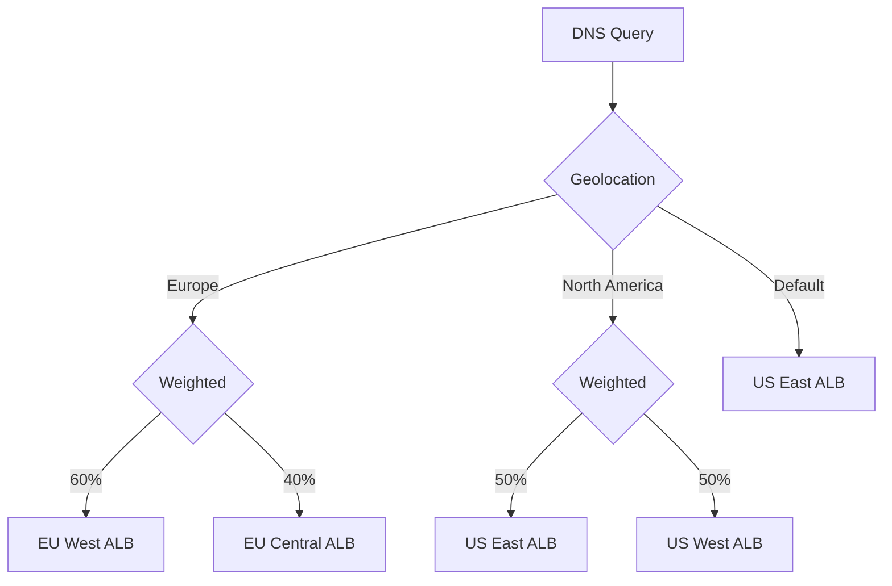

# How to Use Route 53 Traffic Flow for Complex Routing

Author: [nawazdhandala](https://github.com/nawazdhandala)

Tags: AWS, Route 53, DNS, Traffic Management

Description: A practical guide to using Route 53 Traffic Flow for building complex DNS routing policies with visual editor, versioning, and geographic traffic management.

---

Simple DNS routing is easy. Point a domain at an IP address and you're done. But real-world applications need more nuance. You want to route users to the closest region for low latency, fail over to a backup if the primary goes down, split traffic for canary testing, and maybe weight traffic differently across endpoints based on capacity. Doing all of this with plain Route 53 record sets becomes a nightmare of nested alias records and health checks.

Route 53 Traffic Flow gives you a visual policy editor and a versioned policy system for building complex routing trees. You define your routing logic once as a policy, then apply it to any number of domains with a single click. Let's build some real routing policies.

## How Traffic Flow Works

Traffic Flow uses three concepts:

- **Traffic Policy**: A versioned routing configuration that defines how DNS queries are resolved. Created visually or via JSON.
- **Policy Record**: Applies a traffic policy to a specific hosted zone and domain name.
- **Policy Version**: Each change creates a new version. You can switch between versions instantly.

The policies support all Route 53 routing types: simple, weighted, latency-based, geolocation, geoproximity, failover, and multivalue answer. The power comes from combining these into routing trees.

## Creating a Basic Weighted + Failover Policy

Let's start with a common pattern: weighted routing between two regions, with failover to a third region if both go down.

Traffic policy JSON for weighted routing with failover:

```json
{
  "AWSPolicyFormatVersion": "2015-10-01",
  "RecordType": "A",
  "Endpoints": {
    "us-east-endpoint": {
      "Type": "elastic-load-balancer",
      "Value": "dualstack.order-app-use1-1234567890.us-east-1.elb.amazonaws.com"
    },
    "eu-west-endpoint": {
      "Type": "elastic-load-balancer",
      "Value": "dualstack.order-app-euw1-0987654321.eu-west-1.elb.amazonaws.com"
    },
    "ap-southeast-endpoint": {
      "Type": "elastic-load-balancer",
      "Value": "dualstack.order-app-apse1-1122334455.ap-southeast-1.elb.amazonaws.com"
    }
  },
  "StartRule": "weighted-primary",
  "Rules": {
    "weighted-primary": {
      "RuleType": "weighted",
      "Items": [
        {
          "Weight": 70,
          "EndpointReference": "us-east-endpoint",
          "HealthCheck": "hc-us-east-1"
        },
        {
          "Weight": 30,
          "EndpointReference": "eu-west-endpoint",
          "HealthCheck": "hc-eu-west-1"
        }
      ],
      "Secondary": {
        "EndpointReference": "ap-southeast-endpoint",
        "HealthCheck": "hc-ap-southeast-1"
      }
    }
  }
}
```

Create and apply this policy:

```bash
# Create the traffic policy
aws route53 create-traffic-policy \
  --name "order-app-routing" \
  --document file://traffic-policy.json \
  --comment "Weighted routing with DR failover"

# Apply the policy to your domain
aws route53 create-traffic-policy-instance \
  --hosted-zone-id Z0123456789ABCDEF \
  --name "orders.example.com" \
  --ttl 60 \
  --traffic-policy-id policy-abc123 \
  --traffic-policy-version 1
```

## Latency-Based Routing

For global applications, latency-based routing sends users to the region that provides the lowest latency.

Traffic policy for latency-based routing:

```json
{
  "AWSPolicyFormatVersion": "2015-10-01",
  "RecordType": "A",
  "Endpoints": {
    "us-east-alb": {
      "Type": "elastic-load-balancer",
      "Value": "dualstack.app-use1-1234567890.us-east-1.elb.amazonaws.com"
    },
    "eu-west-alb": {
      "Type": "elastic-load-balancer",
      "Value": "dualstack.app-euw1-0987654321.eu-west-1.elb.amazonaws.com"
    },
    "ap-northeast-alb": {
      "Type": "elastic-load-balancer",
      "Value": "dualstack.app-apne1-5566778899.ap-northeast-1.elb.amazonaws.com"
    }
  },
  "StartRule": "latency-rule",
  "Rules": {
    "latency-rule": {
      "RuleType": "latency",
      "Items": [
        {
          "Region": "us-east-1",
          "EndpointReference": "us-east-alb",
          "HealthCheck": "hc-use1"
        },
        {
          "Region": "eu-west-1",
          "EndpointReference": "eu-west-alb",
          "HealthCheck": "hc-euw1"
        },
        {
          "Region": "ap-northeast-1",
          "EndpointReference": "ap-northeast-alb",
          "HealthCheck": "hc-apne1"
        }
      ]
    }
  }
}
```

When a DNS query comes in, Route 53 checks the latency tables to determine which region is closest to the resolver, then returns the corresponding endpoint. If an endpoint is unhealthy, it falls back to the next-closest region.

## Geolocation + Weighted Combo

Here's a more complex scenario: route European users to EU regions with weighted distribution, North American users to US regions, and everyone else to a default.

```json
{
  "AWSPolicyFormatVersion": "2015-10-01",
  "RecordType": "A",
  "Endpoints": {
    "eu-west-alb": {
      "Type": "elastic-load-balancer",
      "Value": "dualstack.app-euw1.eu-west-1.elb.amazonaws.com"
    },
    "eu-central-alb": {
      "Type": "elastic-load-balancer",
      "Value": "dualstack.app-euc1.eu-central-1.elb.amazonaws.com"
    },
    "us-east-alb": {
      "Type": "elastic-load-balancer",
      "Value": "dualstack.app-use1.us-east-1.elb.amazonaws.com"
    },
    "us-west-alb": {
      "Type": "elastic-load-balancer",
      "Value": "dualstack.app-usw2.us-west-2.elb.amazonaws.com"
    }
  },
  "StartRule": "geo-rule",
  "Rules": {
    "geo-rule": {
      "RuleType": "geo",
      "Items": [
        {
          "ContinentCode": "EU",
          "RuleReference": "eu-weighted"
        },
        {
          "ContinentCode": "NA",
          "RuleReference": "us-weighted"
        }
      ],
      "GeoDefault": {
        "EndpointReference": "us-east-alb"
      }
    },
    "eu-weighted": {
      "RuleType": "weighted",
      "Items": [
        {
          "Weight": 60,
          "EndpointReference": "eu-west-alb",
          "HealthCheck": "hc-euw1"
        },
        {
          "Weight": 40,
          "EndpointReference": "eu-central-alb",
          "HealthCheck": "hc-euc1"
        }
      ]
    },
    "us-weighted": {
      "RuleType": "weighted",
      "Items": [
        {
          "Weight": 50,
          "EndpointReference": "us-east-alb",
          "HealthCheck": "hc-use1"
        },
        {
          "Weight": 50,
          "EndpointReference": "us-west-alb",
          "HealthCheck": "hc-usw2"
        }
      ]
    }
  }
}
```

The routing tree looks like this:



## Versioning and Rollback

Every change to a traffic policy creates a new version. This is incredibly useful for rollbacks.

Manage policy versions:

```bash
# Create a new version with updated weights
aws route53 create-traffic-policy-version \
  --id policy-abc123 \
  --document file://traffic-policy-v2.json \
  --comment "Shifted more traffic to EU for EU launch"

# Update the policy instance to use the new version
aws route53 update-traffic-policy-instance \
  --id instance-xyz789 \
  --traffic-policy-id policy-abc123 \
  --traffic-policy-version 2 \
  --ttl 60

# Need to roll back? Just point back to version 1
aws route53 update-traffic-policy-instance \
  --id instance-xyz789 \
  --traffic-policy-id policy-abc123 \
  --traffic-policy-version 1 \
  --ttl 60
```

Version switching is instant. The only delay is DNS TTL propagation, which is why you'll want to keep your TTL low (60 seconds) during active changes.

## Health Check Integration

Health checks are what make traffic policies reliable. Without them, Route 53 keeps sending traffic to dead endpoints.

Create comprehensive health checks:

```bash
# HTTP health check for an ALB
aws route53 create-health-check \
  --caller-reference "hc-use1-$(date +%s)" \
  --health-check-config '{
    "Type": "HTTPS",
    "FullyQualifiedDomainName": "orders-use1.example.com",
    "Port": 443,
    "ResourcePath": "/health",
    "RequestInterval": 10,
    "FailureThreshold": 2,
    "EnableSNI": true,
    "Regions": ["us-east-1", "eu-west-1", "ap-southeast-1"]
  }'

# Calculated health check (combines multiple checks)
aws route53 create-health-check \
  --caller-reference "hc-calculated-$(date +%s)" \
  --health-check-config '{
    "Type": "CALCULATED",
    "ChildHealthChecks": [
      "hc-id-alb",
      "hc-id-database",
      "hc-id-cache"
    ],
    "HealthThreshold": 2
  }'
```

Calculated health checks are powerful for services with multiple dependencies. The example above requires at least 2 of 3 components (ALB, database, cache) to be healthy before the endpoint is considered healthy.

## Monitoring Traffic Policy Changes

Track changes to traffic policies with CloudTrail.

```bash
# Search CloudTrail for traffic policy changes
aws cloudtrail lookup-events \
  --lookup-attributes AttributeKey=EventName,AttributeValue=CreateTrafficPolicyVersion \
  --start-time "2026-02-01T00:00:00Z" \
  --end-time "2026-02-12T23:59:59Z"
```

## Cost Considerations

Traffic Flow policies cost $50 per policy record per month. That's per domain name, not per policy. So if you apply the same policy to `api.example.com` and `www.example.com`, that's $100/month. For most production deployments, this is a trivial cost compared to the complexity it removes.

Health checks are billed separately at $0.50-$2.00 per health check per month depending on the type and options.

## Tips for Production Use

**Keep TTLs low during changes.** 60 seconds is a good default. You can raise it for stable policies, but during active rollouts or migrations, low TTL means faster propagation.

**Test with dig.** Before going live, use `dig` to verify your policy resolves correctly from different locations.

**Use calculated health checks.** Don't rely on a single health check per endpoint. Combine ALB, database, and application health checks into a calculated check for accurate availability signals.

**Version control your policy JSON.** Store traffic policy documents in Git alongside your infrastructure code. They're just JSON files - treat them like any other configuration.

For DR-specific routing, check out our guide on [Route 53 Application Recovery Controller](https://oneuptime.com/blog/post/route-53-application-recovery-controller/view) which integrates well with Traffic Flow policies.
