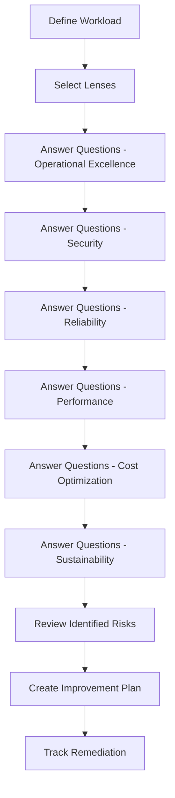

# How to Run a Well-Architected Review for Your AWS Workload

Author: [nawazdhandala](https://github.com/nawazdhandala)

Tags: AWS, Well-Architected, Architecture Review, Cloud Strategy

Description: A step-by-step guide to conducting an AWS Well-Architected Review for your workloads, from preparation and question walkthroughs to remediation and follow-up.

---

A Well-Architected Review is a structured conversation about your workload's architecture. It's not an audit or a compliance exercise - it's a way to identify risks and improvement opportunities by evaluating your design against AWS's proven best practices. The output is a list of high-risk issues with clear remediation paths.

Many teams skip these reviews because they seem time-consuming or bureaucratic. In reality, a focused review takes about 2-3 hours and almost always uncovers issues that would have caused problems down the road. Let's walk through exactly how to run one.

## Before the Review

### Define the Workload

A "workload" is the collection of resources and code that together deliver business value. It could be:

- A customer-facing web application
- A data processing pipeline
- An internal tool
- A microservice and its dependencies

Be specific. "Our entire AWS infrastructure" isn't a workload. "The e-commerce checkout system" is.

### Assemble the Right People

You need people who understand both the business context and the technical implementation. Typically:

- **Architecture lead** - knows the overall design and why decisions were made
- **Operations engineer** - knows how the system is monitored, deployed, and maintained
- **Security engineer** - understands the security controls in place
- **Product owner** - can speak to business requirements and priorities
- **Development lead** - knows the application code and data flows

Don't have 15 people in the room. 4-6 is the sweet spot.

### Gather Information

Before the review session, collect:

- Architecture diagrams (even rough ones)
- List of AWS services used
- Deployment process documentation
- Monitoring and alerting setup
- Recent incident reports
- Current cost breakdown

## Running the Review

### Use the AWS Well-Architected Tool

The Well-Architected Tool (available free in the AWS console) provides a structured questionnaire for each pillar. It's the easiest way to run a review:

```
AWS Console -> Well-Architected Tool -> Define workload -> Answer questions
```

Here's what the process looks like:



### Walking Through the Pillars

For each pillar, the tool asks a series of questions. Each question has multiple best practices, and you select which ones you've implemented.

**Example: Operational Excellence Question**

"How do you design your workload so that you can understand its state?"

Best practices to consider:
- Implement application telemetry
- Implement and configure workload telemetry
- Implement user activity telemetry
- Implement dependency telemetry
- Implement transaction traceability

If you've implemented comprehensive monitoring with CloudWatch, X-Ray traces, and structured logging, you'd check those boxes. If you're flying blind with no monitoring, that's a high-risk issue.

**Example: Security Question**

"How do you manage identities for people and machines?"

Best practices:
- Use strong sign-in mechanisms
- Use temporary credentials
- Store and use secrets securely
- Rely on a centralized identity provider
- Audit and rotate credentials periodically

If your developers have long-lived IAM access keys instead of SSO with temporary credentials, that's a risk worth flagging.

**Example: Reliability Question**

"How do you design your workload service architecture?"

Best practices:
- Choose how to segment your workload
- Build services focused on specific business domains
- Provide service contracts per API
- Rely on service-oriented architectures

### Documenting Answers

For each question, note:

1. **What you've implemented** - be honest, not aspirational
2. **What you haven't** - this becomes your improvement backlog
3. **Context** - why certain decisions were made (sometimes not following a best practice is the right tradeoff)
4. **Severity** - is this a high-risk gap or a minor optimization?

## After the Review

### Prioritize Findings

The review will generate a list of issues. Not all are equally important. Prioritize by:

1. **High-risk items in Security and Reliability** - these can cause incidents and breaches
2. **Medium-risk items that are easy to fix** - quick wins build momentum
3. **Lower-risk optimizations** - performance and cost improvements

### Create an Improvement Plan

For each high-risk issue, define:

- **What needs to change** - specific action items
- **Who owns it** - assign to a team or individual
- **Timeline** - when it should be done
- **Success criteria** - how you'll know it's fixed

Here's an example improvement plan format:

```
Issue: No automated backup testing
Pillar: Reliability
Risk: High
Action: Set up monthly restore tests using AWS Backup restore testing
Owner: Platform team
Timeline: 2 weeks
Success: Monthly automated restore tests passing, results reviewed
```

### Track Progress

Use the Well-Architected Tool's milestone feature to save the state of each review. This lets you compare progress over time.

Run reviews quarterly for your most critical workloads, or whenever there's a significant architectural change.

## Common High-Risk Findings

After running dozens of these reviews, certain issues come up again and again:

**Security:**
- IAM users with long-lived access keys instead of SSO
- No encryption at rest for databases or storage
- Overly permissive security groups
- No centralized logging (CloudTrail, VPC Flow Logs)

**Reliability:**
- Single-AZ deployments with no failover
- No automated backup testing (backups exist but have never been restored)
- No auto-scaling - manually sized instances
- No circuit breakers or timeout configurations

**Operational Excellence:**
- Manual deployments (SSH and deploy scripts)
- No runbooks for common operational tasks
- Alerting that pages on every warning instead of actionable thresholds
- No postmortem process for incidents

**Performance:**
- No caching layer
- Oversized instances running at low utilization
- Database queries without indexes
- No CDN for static content

**Cost:**
- Development environments running 24/7
- No savings plans or reserved instances for steady-state workloads
- Unused EBS volumes and elastic IPs
- No cost allocation tags

## Tips for Effective Reviews

1. **Be honest.** The review is only useful if you're truthful about your current state. Nobody's going to grade you.

2. **Focus on one workload at a time.** Trying to review everything at once leads to vague answers and generic recommendations.

3. **Document the "why" behind decisions.** Sometimes you intentionally skip a best practice. That's fine - document the tradeoff so future reviewers understand the context.

4. **Make it a regular practice.** A single review is helpful. Quarterly reviews are transformative. They create a continuous improvement cycle.

5. **Don't try to fix everything at once.** Pick the top 3-5 high-risk items and fix those first. Then review again.

6. **Use it as a learning tool.** The questions themselves teach your team about AWS best practices, even before you fix anything.

## Automating Parts of the Review

You can use AWS Config to automatically assess some aspects:

```hcl
# Conformance pack that checks Well-Architected best practices
resource "aws_config_conformance_pack" "well_architected" {
  name = "well-architected-checks"

  template_body = <<-EOT
    Resources:
      EncryptedVolumes:
        Type: AWS::Config::ConfigRule
        Properties:
          ConfigRuleName: encrypted-volumes
          Source:
            Owner: AWS
            SourceIdentifier: ENCRYPTED_VOLUMES
      MultiAzRds:
        Type: AWS::Config::ConfigRule
        Properties:
          ConfigRuleName: rds-multi-az-support
          Source:
            Owner: AWS
            SourceIdentifier: RDS_MULTI_AZ_SUPPORT
      S3BucketEncryption:
        Type: AWS::Config::ConfigRule
        Properties:
          ConfigRuleName: s3-default-encryption-kms
          Source:
            Owner: AWS
            SourceIdentifier: S3_DEFAULT_ENCRYPTION_KMS
  EOT
}
```

This doesn't replace the review but provides continuous monitoring of specific best practices.

## Summary

A Well-Architected Review is one of the highest-ROI activities you can do for your AWS workloads. In a few hours, you identify risks that could take days or weeks to discover through incidents. Use the AWS Well-Architected Tool to structure the review, be honest about your current state, prioritize the findings, and track improvements over time. Make it a regular practice, and your architecture will continuously improve.

For monitoring the improvements you make, see our guide on [AWS infrastructure monitoring](https://oneuptime.com/blog/post/2026-02-02-pulumi-aws-infrastructure/view).
