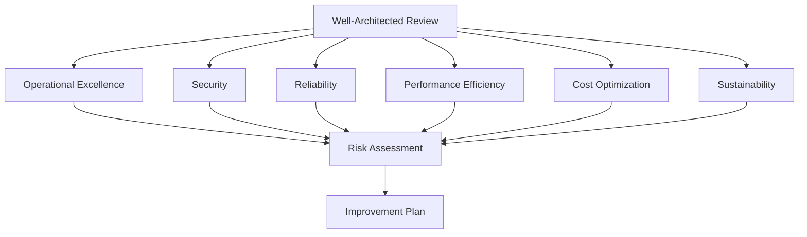

# How to Run a Well-Architected Review with AWS

Author: [nawazdhandala](https://github.com/nawazdhandala)

Tags: AWS, Well-Architected, Architecture Review, Best Practices

Description: Step-by-step guide to running an AWS Well-Architected Review using the Well-Architected Tool, covering all six pillars, risk identification, and improvement planning.

---

Every architecture accumulates technical debt. Features get rushed, quick fixes become permanent, and one day you realize your "temporary" workaround has been running in production for two years. The AWS Well-Architected Framework gives you a structured way to evaluate your architecture against proven best practices, identify risks, and create an improvement plan.

The Well-Architected Tool (available in the AWS Console) walks you through the evaluation process. This guide covers how to run the review effectively, what to look for in each pillar, and how to prioritize the findings.

## The Six Pillars

The Well-Architected Framework evaluates your architecture across six pillars:

1. **Operational Excellence** - Running and monitoring systems effectively
2. **Security** - Protecting data, systems, and assets
3. **Reliability** - Recovering from failures and meeting demand
4. **Performance Efficiency** - Using resources efficiently
5. **Cost Optimization** - Avoiding unnecessary costs
6. **Sustainability** - Minimizing environmental impact



## Setting Up the Well-Architected Tool

Create a workload in the Well-Architected Tool to begin your review.

```bash
# Create a workload for review
aws wellarchitected create-workload \
    --workload-name "Payment Service" \
    --description "Payment processing application including web tier, API, and database" \
    --environment "PRODUCTION" \
    --aws-regions '["us-east-1", "us-west-2"]' \
    --review-owner "platform-team@example.com" \
    --lenses '["wellarchitected"]' \
    --pillar-priorities '["reliability", "security", "operationalExcellence", "performanceEfficiency", "costOptimization", "sustainability"]'
```

The pillar priorities help focus the review. For a payment service, reliability and security come first. For a batch processing system, cost optimization might be the priority.

## Running the Review

The review consists of answering questions for each pillar. For each question, you select which best practices you've implemented.

```bash
# List the questions for a specific pillar
aws wellarchitected list-answers \
    --workload-id abc123 \
    --lens-alias "wellarchitected" \
    --pillar-id "reliability"
```

### Operational Excellence Questions

Key questions in this pillar focus on how you design, run, and improve your workloads.

**Do you use infrastructure as code?**

```bash
# Answer a question with selected choices
aws wellarchitected update-answer \
    --workload-id abc123 \
    --lens-alias "wellarchitected" \
    --question-id "ops-how-do-you-design-your-workload-to-understand-its-state" \
    --selected-choices '["ops_ops-how-do-you-design_implement_app_telemetry"]' \
    --notes "We use CloudWatch for metrics, X-Ray for tracing, and Datadog for aggregation"
```

Key things to assess:

- Are you using CloudFormation, CDK, or Terraform for all infrastructure?
- Do you have runbooks for common operational procedures?
- Are deployments automated with CI/CD pipelines?
- Do you have observability - metrics, logs, and traces?
- Do you run game days or chaos engineering experiments?

### Security Questions

Security questions cover identity management, detection, infrastructure protection, data protection, and incident response.

Key things to assess:

- Is MFA enabled for all human users?
- Are you using IAM roles (not long-lived credentials) for service-to-service communication?
- Is data encrypted at rest and in transit?
- Do you have automated security scanning in your pipeline?
- Do you have an incident response plan, and has it been tested?

### Reliability Questions

Reliability focuses on recovery planning, change management, and failure handling.

Key things to assess:

- Can the application survive an AZ failure?
- Are backups tested regularly (not just configured)?
- Do you have health checks and automatic recovery?
- Are your dependencies loosely coupled?
- Do you test failover procedures?

### Performance Efficiency Questions

This pillar covers compute, storage, database, and networking resource selection.

Key things to assess:

- Are you using the right instance types for your workload?
- Do you have caching where appropriate?
- Is the database type appropriate (relational vs. NoSQL)?
- Do you monitor performance and act on findings?
- Are you using current-generation resources?

### Cost Optimization Questions

Cost questions focus on governance, expenditure awareness, and resource optimization.

Key things to assess:

- Do you know what each service costs and who owns it?
- Are you using Savings Plans or Reserved Instances for steady-state workloads?
- Do development environments shut down outside business hours?
- Are you right-sizing resources based on actual utilization?
- Is there a process for reviewing and acting on cost reports?

### Sustainability Questions

The newest pillar focuses on reducing your environmental footprint.

Key things to assess:

- Are you using managed services (which have higher utilization) where possible?
- Do you right-size resources to minimize waste?
- Are you using Graviton instances (more energy efficient)?
- Do you minimize data transfer and storage of unneeded data?

## Viewing Results

After answering all questions, review the findings.

```bash
# Get the overall workload risk summary
aws wellarchitected get-workload \
    --workload-id abc123

# List high-risk items
aws wellarchitected list-answers \
    --workload-id abc123 \
    --lens-alias "wellarchitected" \
    --pillar-id "reliability" \
    --query "AnswerSummaries[?Risk=='HIGH']"
```

Risks are categorized as:

- **High Risk**: Significant issues that should be addressed soon
- **Medium Risk**: Issues that should be addressed but aren't urgent
- **No Risk**: Best practices are being followed
- **Not Applicable**: The question doesn't apply to this workload

## Creating an Improvement Plan

The real value of the review is the improvement plan. Prioritize high-risk items first.

```python
# improvement_plan.py - Generate a prioritized improvement plan
import boto3

wa = boto3.client('wellarchitected', region_name='us-east-1')

def generate_improvement_plan(workload_id):
    """Generate a prioritized improvement plan from the review."""
    high_risks = []
    medium_risks = []

    for pillar in ['operationalExcellence', 'security', 'reliability',
                   'performanceEfficiency', 'costOptimization', 'sustainability']:

        answers = wa.list_answers(
            WorkloadId=workload_id,
            LensAlias='wellarchitected',
            PillarId=pillar
        )

        for answer in answers['AnswerSummaries']:
            if answer['Risk'] == 'HIGH':
                high_risks.append({
                    'pillar': pillar,
                    'question': answer['QuestionTitle'],
                    'risk': 'HIGH'
                })
            elif answer['Risk'] == 'MEDIUM':
                medium_risks.append({
                    'pillar': pillar,
                    'question': answer['QuestionTitle'],
                    'risk': 'MEDIUM'
                })

    print(f"=== Improvement Plan ===")
    print(f"\nHigh Risk Items ({len(high_risks)}):")
    for i, item in enumerate(high_risks, 1):
        print(f"  {i}. [{item['pillar']}] {item['question']}")

    print(f"\nMedium Risk Items ({len(medium_risks)}):")
    for i, item in enumerate(medium_risks, 1):
        print(f"  {i}. [{item['pillar']}] {item['question']}")

generate_improvement_plan("abc123")
```

## Using Custom Lenses

Besides the standard Well-Architected lens, you can use specialized lenses for specific workload types.

```bash
# List available lenses
aws wellarchitected list-lenses

# Common lenses:
# - wellarchitected (default)
# - serverless
# - saas
# - foundationaltechnicalreview
# - iot
```

You can also create custom lenses for your organization's specific standards.

```bash
# Import a custom lens
aws wellarchitected import-lens \
    --json-string file://custom-lens.json
```

## Milestone Tracking

Create milestones to track your progress over time.

```bash
# Record a milestone after initial review
aws wellarchitected create-milestone \
    --workload-id abc123 \
    --milestone-name "Initial Review - Feb 2026"

# After implementing improvements, create another milestone
aws wellarchitected create-milestone \
    --workload-id abc123 \
    --milestone-name "Post-Improvement - Mar 2026"
```

Compare milestones to see improvement.

```bash
# List milestones
aws wellarchitected list-milestones \
    --workload-id abc123
```

## Review Cadence

A one-time review is better than no review, but the real benefit comes from regular reviews.

**Quarterly reviews** work well for most teams. Enough time to implement improvements between reviews, frequent enough to catch new issues.

**After major changes**: Run a focused review after significant architectural changes like adding a new region, migrating databases, or adopting a new service.

**Annual comprehensive review**: Once a year, do a thorough review of all pillars with the full team.

## Common Findings and Quick Wins

Based on hundreds of reviews, these are the most common high-risk findings and their fixes.

**No multi-AZ for databases**: Enable Multi-AZ. It's one CLI command and eliminates a major single point of failure.

**No backup testing**: Schedule monthly backup restore tests. Backups you've never restored are backups you can't trust.

**Over-provisioned instances**: Right-size based on CloudWatch utilization data. Most organizations are 40-60% over-provisioned.

**No encryption at rest**: Enable default encryption on S3 buckets, EBS volumes, and RDS instances.

**No centralized logging**: Set up CloudWatch Logs with log groups for every service. You can't troubleshoot what you can't see.

## Wrapping Up

The Well-Architected Review isn't about achieving a perfect score - it's about understanding your risks and making intentional decisions about which ones to accept and which to fix. Some findings are quick wins you can address in a day. Others are multi-quarter projects that need planning and investment.

Start with your most critical workload, run the review, and create an improvement plan. Track progress with milestones, and make the review a regular part of your engineering cadence. For more focused resilience assessment, check out our guide on [AWS Resilience Hub](https://oneuptime.com/blog/post/set-up-aws-resilience-hub-for-application-resilience/view).
