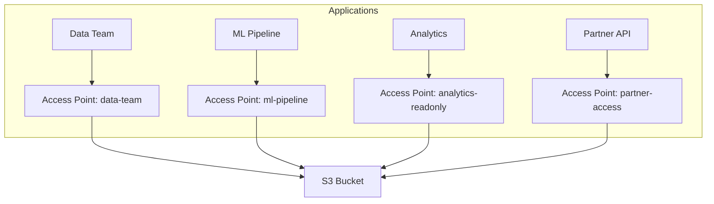

# How to Use S3 Access Points for Shared Data Access

Author: [nawazdhandala](https://github.com/nawazdhandala)

Tags: AWS, S3, Security, Networking

Description: Simplify shared data access on S3 using Access Points to create dedicated endpoints with unique permissions for different teams and applications.

---

As your S3 bucket grows and more teams need access, bucket policies get complicated fast. A single bucket policy might need to handle permissions for your data team, your ML pipeline, your analytics platform, a partner account, and a public-facing API - all with different access levels for different prefixes. The result is a sprawling, fragile JSON document that nobody wants to touch.

S3 Access Points solve this by giving you named network endpoints, each with its own access policy. Instead of one giant bucket policy, you create dedicated access points for each use case, each with simple, focused permissions. Let's set them up.

## What Are S3 Access Points?

An access point is a named endpoint attached to a bucket. Each access point has:
- A unique DNS name (e.g., `my-ap-123456789012.s3-accesspoint.us-east-1.amazonaws.com`)
- Its own access policy (like a mini bucket policy)
- Optional VPC restrictions (limit access to specific VPCs)
- Its own ARN (for use in IAM policies)

You can create up to 10,000 access points per account per region.



## Creating an Access Point

Create an access point for a specific use case.

Create an S3 access point:

```bash
# Create an access point for the data team
aws s3control create-access-point \
    --account-id 123456789012 \
    --name data-team-ap \
    --bucket my-data-bucket

# Create an access point restricted to a VPC
aws s3control create-access-point \
    --account-id 123456789012 \
    --name internal-ap \
    --bucket my-data-bucket \
    --vpc-configuration VpcId=vpc-0abc123def

# List all access points for a bucket
aws s3control list-access-points \
    --account-id 123456789012 \
    --bucket my-data-bucket
```

When you restrict an access point to a VPC, it can only be accessed from within that VPC. Requests from the internet or other VPCs are denied. This is a powerful security control for internal-only data.

## Setting Access Point Policies

Each access point gets its own policy. These policies follow the same syntax as bucket policies but are scoped to the access point.

Create a read-only access point for analytics:

```bash
# Create the access point
aws s3control create-access-point \
    --account-id 123456789012 \
    --name analytics-readonly \
    --bucket my-data-bucket

# Set the access point policy
aws s3control put-access-point-policy \
    --account-id 123456789012 \
    --name analytics-readonly \
    --policy '{
        "Version": "2012-10-17",
        "Statement": [
            {
                "Sid": "AnalyticsReadOnly",
                "Effect": "Allow",
                "Principal": {
                    "AWS": "arn:aws:iam::123456789012:role/AnalyticsTeamRole"
                },
                "Action": [
                    "s3:GetObject",
                    "s3:ListBucket"
                ],
                "Resource": [
                    "arn:aws:s3:us-east-1:123456789012:accesspoint/analytics-readonly",
                    "arn:aws:s3:us-east-1:123456789012:accesspoint/analytics-readonly/object/*"
                ]
            }
        ]
    }'
```

Create a read-write access point for the data team, limited to a specific prefix:

```bash
aws s3control create-access-point \
    --account-id 123456789012 \
    --name data-team-rw \
    --bucket my-data-bucket

aws s3control put-access-point-policy \
    --account-id 123456789012 \
    --name data-team-rw \
    --policy '{
        "Version": "2012-10-17",
        "Statement": [
            {
                "Sid": "DataTeamReadWrite",
                "Effect": "Allow",
                "Principal": {
                    "AWS": "arn:aws:iam::123456789012:role/DataTeamRole"
                },
                "Action": [
                    "s3:GetObject",
                    "s3:PutObject",
                    "s3:DeleteObject",
                    "s3:ListBucket"
                ],
                "Resource": [
                    "arn:aws:s3:us-east-1:123456789012:accesspoint/data-team-rw",
                    "arn:aws:s3:us-east-1:123456789012:accesspoint/data-team-rw/object/data-team/*"
                ]
            }
        ]
    }'
```

## Using Access Points

Once created, you use access points instead of bucket names in your S3 operations.

Use access points with the AWS CLI:

```bash
# Using the access point ARN
aws s3 cp myfile.csv \
    s3://arn:aws:s3:us-east-1:123456789012:accesspoint/data-team-rw/data-team/myfile.csv

# Using the access point alias (shorter form)
# AWS generates an alias like: data-team-rw-abc123-s3alias
aws s3 ls s3://data-team-rw-abc123-s3alias/

# Upload through an access point
aws s3 cp report.pdf \
    s3://arn:aws:s3:us-east-1:123456789012:accesspoint/data-team-rw/data-team/reports/report.pdf

# Sync through an access point
aws s3 sync ./local-data/ \
    s3://arn:aws:s3:us-east-1:123456789012:accesspoint/data-team-rw/data-team/
```

Using access points in Python:

```python
import boto3

s3 = boto3.client('s3')

# Use the access point ARN as the "bucket" parameter
ap_arn = 'arn:aws:s3:us-east-1:123456789012:accesspoint/analytics-readonly'

# List objects through the access point
response = s3.list_objects_v2(Bucket=ap_arn, Prefix='reports/')
for obj in response.get('Contents', []):
    print(f"{obj['Key']} - {obj['Size']} bytes")

# Get an object through the access point
response = s3.get_object(Bucket=ap_arn, Key='reports/quarterly.csv')
data = response['Body'].read()
print(f"Downloaded {len(data)} bytes")
```

## Cross-Account Access Points

Access points work great for cross-account data sharing. Instead of managing complex bucket policies, create an access point for each partner account.

Create a cross-account access point:

```bash
# Create an access point for a partner account
aws s3control create-access-point \
    --account-id 123456789012 \
    --name partner-access \
    --bucket my-shared-bucket

# Set the policy to allow the partner account
aws s3control put-access-point-policy \
    --account-id 123456789012 \
    --name partner-access \
    --policy '{
        "Version": "2012-10-17",
        "Statement": [
            {
                "Sid": "PartnerRead",
                "Effect": "Allow",
                "Principal": {
                    "AWS": "arn:aws:iam::999888777666:root"
                },
                "Action": [
                    "s3:GetObject",
                    "s3:ListBucket"
                ],
                "Resource": [
                    "arn:aws:s3:us-east-1:123456789012:accesspoint/partner-access",
                    "arn:aws:s3:us-east-1:123456789012:accesspoint/partner-access/object/shared-data/*"
                ]
            }
        ]
    }'
```

The partner account also needs to update their IAM policies to allow access through the access point:

```json
{
    "Version": "2012-10-17",
    "Statement": [
        {
            "Effect": "Allow",
            "Action": ["s3:GetObject", "s3:ListBucket"],
            "Resource": [
                "arn:aws:s3:us-east-1:123456789012:accesspoint/partner-access",
                "arn:aws:s3:us-east-1:123456789012:accesspoint/partner-access/object/*"
            ]
        }
    ]
}
```

## Delegating Access Control with Bucket Policy

For access points to work, the bucket policy must delegate access control to the access points. This is done with a simple bucket policy.

Delegate bucket access control to access points:

```bash
aws s3api put-bucket-policy \
    --bucket my-data-bucket \
    --policy '{
        "Version": "2012-10-17",
        "Statement": [
            {
                "Sid": "DelegateToAccessPoints",
                "Effect": "Allow",
                "Principal": "*",
                "Action": "s3:*",
                "Resource": [
                    "arn:aws:s3:::my-data-bucket",
                    "arn:aws:s3:::my-data-bucket/*"
                ],
                "Condition": {
                    "StringEquals": {
                        "s3:DataAccessPointAccount": "123456789012"
                    }
                }
            }
        ]
    }'
```

This bucket policy says "allow any action, as long as it comes through an access point owned by this account." The actual fine-grained permissions are defined in each access point's policy.

## VPC-Restricted Access Points

For sensitive data, restrict access points to specific VPCs.

Create a VPC-only access point:

```bash
# Create access point restricted to a VPC
aws s3control create-access-point \
    --account-id 123456789012 \
    --name internal-only \
    --bucket my-sensitive-bucket \
    --vpc-configuration VpcId=vpc-0abc123def

# You also need a VPC endpoint for S3
aws ec2 create-vpc-endpoint \
    --vpc-id vpc-0abc123def \
    --service-name com.amazonaws.us-east-1.s3 \
    --route-table-ids rtb-0abc123
```

With a VPC-restricted access point, even if someone has valid credentials and the correct access point policy allows them, they can only access data from within the specified VPC. Requests from outside the VPC are rejected.

## Managing Access Points

Monitor and manage your access points:

```bash
# List all access points
aws s3control list-access-points \
    --account-id 123456789012

# Get access point details
aws s3control get-access-point \
    --account-id 123456789012 \
    --name data-team-rw

# View access point policy
aws s3control get-access-point-policy \
    --account-id 123456789012 \
    --name data-team-rw

# Delete an access point (doesn't affect the bucket or its data)
aws s3control delete-access-point \
    --account-id 123456789012 \
    --name old-access-point
```

## Access Points vs. Bucket Policies

When should you use access points instead of bucket policies?

**Use access points when:**
- Multiple teams or applications access the same bucket
- You need per-application access control
- Cross-account sharing is involved
- You want VPC-restricted access to specific data paths
- Your bucket policy is getting unwieldy

**Stick with bucket policies when:**
- You have a single application accessing the bucket
- Access patterns are simple
- You don't need VPC restrictions

Access points don't replace bucket policies entirely - they complement them. The bucket policy delegates to access points, and each access point has focused, manageable permissions. It's a cleaner architecture that scales as your data sharing needs grow.

For related S3 security topics, check our guides on [bucket policies](https://oneuptime.com/blog/post/2026-02-12-set-up-s3-bucket-policies-access-control/view) and [blocking public access](https://oneuptime.com/blog/post/2026-02-12-block-public-access-on-s3-buckets/view).
