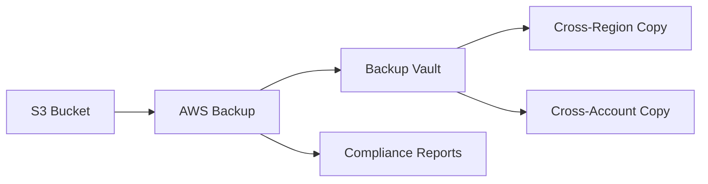

# How to Use S3 with AWS Backup for Centralized Backup Management

Author: [nawazdhandala](https://github.com/nawazdhandala)

Tags: AWS, S3, Backup, Disaster Recovery

Description: Learn how to integrate Amazon S3 with AWS Backup for centralized backup management, including backup plans, vault configuration, cross-region copies, and compliance reporting.

---

Managing backups across dozens of S3 buckets gets messy fast. AWS Backup brings all your backup operations under one roof, giving you centralized policies, scheduling, retention management, and compliance reporting for S3 alongside your other AWS resources like EBS, RDS, and DynamoDB.

Before AWS Backup added S3 support, you had to rely on S3 versioning and lifecycle rules for "backups." That works for some cases, but it doesn't give you point-in-time recovery, cross-account copies, or unified reporting. AWS Backup fills those gaps.

## How AWS Backup Works with S3

AWS Backup creates continuous backups of your S3 data. It supports both continuous backup (point-in-time recovery within the last 35 days) and periodic snapshots (for longer retention).

Here's the flow.



## Prerequisites

Before setting up AWS Backup for S3, your bucket needs versioning enabled.

```bash
# Enable versioning on the bucket - required for AWS Backup
aws s3api put-bucket-versioning \
  --bucket my-important-data \
  --versioning-configuration Status=Enabled
```

You also need to opt in to S3 backup support in your account (it's not enabled by default).

```bash
# Enable S3 backup support
aws backup update-region-settings \
  --resource-type-opt-in-preference '{
    "S3": true
  }'
```

## Create a Backup Vault

A backup vault is where your recovery points (backups) are stored. Think of it as a container for backups with its own encryption and access policies.

```bash
# Create a backup vault with KMS encryption
aws backup create-backup-vault \
  --backup-vault-name s3-backup-vault \
  --encryption-key-arn arn:aws:kms:us-east-1:123456789012:key/abc123-456-789 \
  --backup-vault-tags Environment=Production
```

Lock the vault to prevent deletion - this is critical for compliance.

```bash
# Lock the vault with a minimum retention of 30 days
aws backup put-backup-vault-lock-configuration \
  --backup-vault-name s3-backup-vault \
  --min-retention-days 30 \
  --max-retention-days 365 \
  --changeable-for-days 3
```

Once the `changeable-for-days` period expires, the lock becomes immutable. Nobody - not even root - can delete backups before the retention period ends.

## Create a Backup Plan

A backup plan defines when backups run, how long they're retained, and where they're stored.

```bash
# Create a comprehensive backup plan
aws backup create-backup-plan \
  --backup-plan '{
    "BackupPlanName": "s3-daily-backup",
    "Rules": [
      {
        "RuleName": "DailyBackup",
        "TargetBackupVaultName": "s3-backup-vault",
        "ScheduleExpression": "cron(0 3 * * ? *)",
        "StartWindowMinutes": 60,
        "CompletionWindowMinutes": 480,
        "Lifecycle": {
          "MoveToColdStorageAfterDays": 30,
          "DeleteAfterDays": 365
        },
        "CopyActions": [
          {
            "DestinationBackupVaultArn": "arn:aws:backup:us-west-2:123456789012:backup-vault:dr-vault",
            "Lifecycle": {
              "DeleteAfterDays": 365
            }
          }
        ]
      },
      {
        "RuleName": "ContinuousBackup",
        "TargetBackupVaultName": "s3-backup-vault",
        "ScheduleExpression": "cron(0 * * * ? *)",
        "EnableContinuousBackup": true,
        "Lifecycle": {
          "DeleteAfterDays": 35
        }
      }
    ]
  }'
```

This plan does two things:

1. **Daily snapshots** at 3 AM UTC, kept for 365 days (moved to cold storage after 30), with cross-region copies to us-west-2
2. **Continuous backup** for point-in-time recovery within the last 35 days

## Assign Resources to the Plan

Now tell the backup plan which S3 buckets to protect.

```bash
# Assign specific buckets to the backup plan
aws backup create-backup-selection \
  --backup-plan-id PLAN_ID_HERE \
  --backup-selection '{
    "SelectionName": "production-s3-buckets",
    "IamRoleArn": "arn:aws:iam::123456789012:role/AWSBackupDefaultServiceRole",
    "Resources": [
      "arn:aws:s3:::my-important-data",
      "arn:aws:s3:::customer-uploads",
      "arn:aws:s3:::financial-reports"
    ]
  }'
```

For a more dynamic approach, use tags. This automatically includes any bucket with the `backup=enabled` tag.

```bash
# Use tag-based selection
aws backup create-backup-selection \
  --backup-plan-id PLAN_ID_HERE \
  --backup-selection '{
    "SelectionName": "tagged-s3-buckets",
    "IamRoleArn": "arn:aws:iam::123456789012:role/AWSBackupDefaultServiceRole",
    "ListOfTags": [
      {
        "ConditionType": "STRINGEQUALS",
        "ConditionKey": "backup",
        "ConditionValue": "enabled"
      }
    ]
  }'
```

Then just tag your buckets.

```bash
# Tag a bucket to include it in backups
aws s3api put-bucket-tagging \
  --bucket my-important-data \
  --tagging 'TagSet=[{Key=backup,Value=enabled}]'
```

## IAM Role for AWS Backup

The backup service role needs permissions to read S3 and write to the vault.

```json
{
  "Version": "2012-10-17",
  "Statement": [
    {
      "Effect": "Allow",
      "Action": [
        "s3:GetInventoryConfiguration",
        "s3:PutInventoryConfiguration",
        "s3:ListBucketVersions",
        "s3:ListBucket",
        "s3:GetBucketVersioning",
        "s3:GetBucketNotification",
        "s3:PutBucketNotification",
        "s3:GetBucketLocation",
        "s3:GetBucketTagging",
        "s3:GetObject",
        "s3:GetObjectVersion",
        "s3:GetObjectVersionTagging",
        "s3:GetObjectTagging"
      ],
      "Resource": [
        "arn:aws:s3:::*"
      ]
    },
    {
      "Effect": "Allow",
      "Action": [
        "s3:ListAllMyBuckets"
      ],
      "Resource": "*"
    }
  ]
}
```

## Restoring from Backup

When you need to restore, you can recover to the same bucket, a different bucket, or even a different account.

Restore an entire bucket to a new location.

```bash
# Start a restore job
aws backup start-restore-job \
  --recovery-point-arn arn:aws:backup:us-east-1:123456789012:recovery-point:abc123-456 \
  --iam-role-arn arn:aws:iam::123456789012:role/AWSBackupDefaultServiceRole \
  --metadata '{
    "DestinationBucketName": "my-restored-data",
    "NewBucket": "true",
    "Encrypted": "true",
    "EncryptionType": "SSE-S3"
  }'
```

For point-in-time recovery (from continuous backup), specify the exact timestamp.

```bash
# Restore to a specific point in time
aws backup start-restore-job \
  --recovery-point-arn arn:aws:backup:us-east-1:123456789012:recovery-point:continuous:my-important-data \
  --iam-role-arn arn:aws:iam::123456789012:role/AWSBackupDefaultServiceRole \
  --metadata '{
    "DestinationBucketName": "my-restored-data",
    "NewBucket": "true",
    "RestoreTime": "2026-02-10T14:30:00Z"
  }'
```

## Monitoring Backup Jobs

Check the status of backup and restore jobs.

```bash
# List recent backup jobs
aws backup list-backup-jobs \
  --by-resource-type S3 \
  --by-state COMPLETED \
  --max-results 10

# Get details of a specific backup job
aws backup describe-backup-job \
  --backup-job-id JOB_ID_HERE
```

Set up SNS notifications for backup events.

```bash
# Configure backup vault notifications
aws backup put-backup-vault-notifications \
  --backup-vault-name s3-backup-vault \
  --sns-topic-arn arn:aws:sns:us-east-1:123456789012:backup-notifications \
  --backup-vault-events BACKUP_JOB_COMPLETED BACKUP_JOB_FAILED RESTORE_JOB_COMPLETED RESTORE_JOB_FAILED
```

For comprehensive monitoring across all your backup jobs, integrate with [OneUptime](https://oneuptime.com) to track backup success rates, alert on failures, and maintain compliance dashboards.

## Compliance Reporting

AWS Backup provides built-in compliance reporting through Backup Audit Manager.

```bash
# Create a backup audit framework
aws backup create-framework \
  --framework-name s3-backup-compliance \
  --framework-controls '[
    {
      "ControlName": "BACKUP_RESOURCES_PROTECTED_BY_BACKUP_PLAN",
      "ControlInputParameters": [
        {
          "ParameterName": "resourceType",
          "ParameterValue": "S3"
        }
      ]
    },
    {
      "ControlName": "BACKUP_RECOVERY_POINT_MINIMUM_RETENTION_CHECK",
      "ControlInputParameters": [
        {
          "ParameterName": "requiredRetentionDays",
          "ParameterValue": "30"
        }
      ]
    },
    {
      "ControlName": "BACKUP_RECOVERY_POINT_ENCRYPTED"
    }
  ]'
```

This checks that all S3 resources have backup plans, meet minimum retention requirements, and recovery points are encrypted.

## Cost Considerations

AWS Backup for S3 charges based on:

- **Warm storage**: Per GB of backup data stored
- **Cold storage**: Cheaper per GB, but minimum 90-day retention
- **Restore**: Per GB restored
- **Cross-region copies**: Data transfer charges

Continuous backup costs more than periodic snapshots because it maintains a complete change log. Use periodic backups for data that doesn't change frequently and continuous backup for critical data where you need point-in-time recovery.

For optimizing your S3 storage costs overall, take a look at our guide on [S3 storage class analysis](https://oneuptime.com/blog/post/s3-storage-class-analysis-optimize-costs/view).
