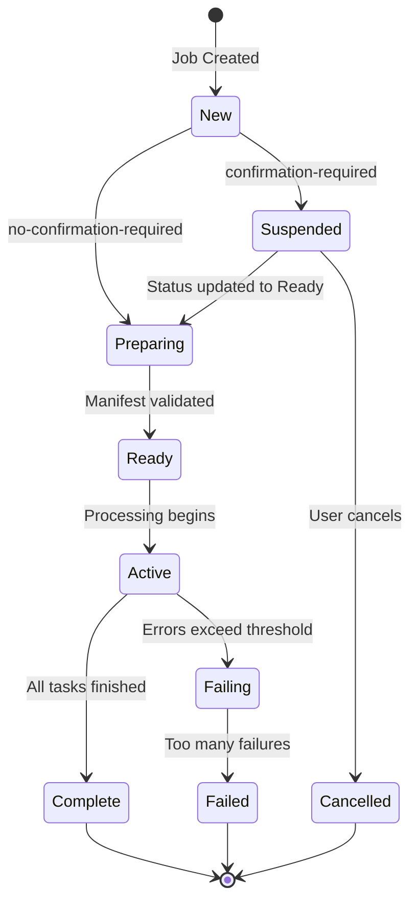

# How to Use S3 Batch Operations to Process Millions of Objects

Author: [nawazdhandala](https://github.com/nawazdhandala)

Tags: AWS, S3, Batch Operations, Automation, Data Management

Description: A practical guide to using S3 Batch Operations for processing millions of objects at scale, including tagging, copying, restoring, and invoking Lambda functions.

---

When you need to change tags on 50 million objects, copy a billion files to another bucket, or restore thousands of archived objects from Glacier, doing it one API call at a time isn't feasible. S3 Batch Operations lets you queue up these kinds of jobs and let AWS handle the execution at massive scale - we're talking billions of objects per job.

## What S3 Batch Operations Can Do

S3 Batch Operations supports several built-in operations:

- **Copy objects** between buckets (including cross-account and cross-region)
- **Replace tags** or delete all tags
- **Replace ACLs**
- **Restore from Glacier** or Glacier Deep Archive
- **Invoke a Lambda function** for each object (the Swiss army knife option)
- **Apply legal holds** or set retention periods
- **Replicate existing objects** (for buckets with replication configured)

Each job processes a manifest - a list of objects to operate on. The manifest can come from an S3 Inventory report or a CSV file you create yourself.

## Step 1: Create Your Manifest

You've got two options for manifests.

**Option A: Use an S3 Inventory report** (best for large-scale operations). If you already have S3 Inventory configured, you can point your batch job directly at the inventory manifest. See our post on [using S3 Inventory to audit objects at scale](https://oneuptime.com/blog/post/s3-inventory-audit-objects-at-scale/view) for setup instructions.

**Option B: Create a CSV manifest** (best for targeted operations). The CSV format is simple - just bucket name and object key per line.

```csv
my-source-bucket,logs/2025/01/access.log
my-source-bucket,logs/2025/02/access.log
my-source-bucket,logs/2025/03/access.log
my-source-bucket,data/archive/old-records.tar.gz
```

Upload the manifest to S3.

```bash
# Upload your manifest file
aws s3 cp manifest.csv s3://my-batch-manifests/manifests/tag-update-manifest.csv
```

## Step 2: Create the IAM Role

S3 Batch Operations needs an IAM role with permissions to read the manifest and perform the operation on the target objects.

Here's a trust policy that allows the S3 batch service to assume the role.

```json
{
  "Version": "2012-10-17",
  "Statement": [
    {
      "Effect": "Allow",
      "Principal": {
        "Service": "batchoperations.s3.amazonaws.com"
      },
      "Action": "sts:AssumeRole"
    }
  ]
}
```

And the permissions policy - adjust based on your specific operation.

```json
{
  "Version": "2012-10-17",
  "Statement": [
    {
      "Sid": "ReadManifest",
      "Effect": "Allow",
      "Action": [
        "s3:GetObject",
        "s3:GetObjectVersion"
      ],
      "Resource": "arn:aws:s3:::my-batch-manifests/*"
    },
    {
      "Sid": "PerformBatchOperations",
      "Effect": "Allow",
      "Action": [
        "s3:PutObjectTagging",
        "s3:GetObject",
        "s3:PutObject",
        "s3:RestoreObject"
      ],
      "Resource": "arn:aws:s3:::my-source-bucket/*"
    },
    {
      "Sid": "WriteReport",
      "Effect": "Allow",
      "Action": "s3:PutObject",
      "Resource": "arn:aws:s3:::my-batch-reports/*"
    }
  ]
}
```

Create the role.

```bash
# Create the IAM role
aws iam create-role \
  --role-name S3BatchOperationsRole \
  --assume-role-policy-document file://trust-policy.json

# Attach the permissions policy
aws iam put-role-policy \
  --role-name S3BatchOperationsRole \
  --policy-name S3BatchPermissions \
  --policy-document file://batch-permissions.json
```

## Step 3: Create a Batch Job - Tagging Example

Let's start with a common use case - adding tags to objects. This creates a job that tags every object in the manifest.

```bash
aws s3control create-job \
  --account-id 123456789012 \
  --operation '{
    "S3PutObjectTagging": {
      "TagSet": [
        {"Key": "Department", "Value": "Engineering"},
        {"Key": "RetentionPolicy", "Value": "7-years"},
        {"Key": "Classification", "Value": "Internal"}
      ]
    }
  }' \
  --manifest '{
    "Spec": {
      "Format": "S3BatchOperations_CSV_20180820",
      "Fields": ["Bucket", "Key"]
    },
    "Location": {
      "ObjectArn": "arn:aws:s3:::my-batch-manifests/manifests/tag-update-manifest.csv",
      "ETag": "abc123def456"
    }
  }' \
  --report '{
    "Bucket": "arn:aws:s3:::my-batch-reports",
    "Prefix": "tagging-job",
    "Format": "Report_CSV_20180820",
    "Enabled": true,
    "ReportScope": "AllTasks"
  }' \
  --priority 10 \
  --role-arn "arn:aws:iam::123456789012:role/S3BatchOperationsRole" \
  --confirmation-required
```

Note the `--confirmation-required` flag. The job will be created in a "suspended" state, giving you a chance to review before it runs.

## Step 4: Review and Run the Job

Check the job details before confirming.

```bash
# Describe the job
aws s3control describe-job \
  --account-id 123456789012 \
  --job-id <job-id-from-create>
```

Once you're satisfied, update the job status to run it.

```bash
# Confirm and run the job
aws s3control update-job-status \
  --account-id 123456789012 \
  --job-id <job-id> \
  --requested-job-status Ready
```

## Example: Copy Objects Cross-Region

Here's how to create a batch job that copies objects to another region.

```bash
aws s3control create-job \
  --account-id 123456789012 \
  --operation '{
    "S3PutObjectCopy": {
      "TargetResource": "arn:aws:s3:::my-backup-bucket-eu-west-1",
      "StorageClass": "STANDARD_IA",
      "MetadataDirective": "COPY"
    }
  }' \
  --manifest '{
    "Spec": {
      "Format": "S3BatchOperations_CSV_20180820",
      "Fields": ["Bucket", "Key"]
    },
    "Location": {
      "ObjectArn": "arn:aws:s3:::my-batch-manifests/manifests/copy-manifest.csv",
      "ETag": "xyz789"
    }
  }' \
  --report '{
    "Bucket": "arn:aws:s3:::my-batch-reports",
    "Prefix": "copy-job",
    "Format": "Report_CSV_20180820",
    "Enabled": true,
    "ReportScope": "FailedTasksOnly"
  }' \
  --priority 5 \
  --role-arn "arn:aws:iam::123456789012:role/S3BatchOperationsRole" \
  --no-confirmation-required
```

## Example: Invoke Lambda for Custom Processing

The Lambda invocation operation is the most flexible. You can run any custom logic against each object.

Here's a Lambda function that generates thumbnails for images.

```python
import boto3
import json
from PIL import Image
import io

s3 = boto3.client('s3')

def lambda_handler(event, context):
    """
    Called by S3 Batch Operations for each object.
    Generates a thumbnail and saves it to a thumbnails prefix.
    """
    # Parse the S3 Batch Operations invocation
    invocation_id = event['invocationId']
    invocation_schema_version = event['invocationSchemaVersion']

    results = []

    for task in event['tasks']:
        task_id = task['taskId']
        bucket = task['s3BucketArn'].split(':::')[1]
        key = task['s3Key']

        try:
            # Download the original image
            response = s3.get_object(Bucket=bucket, Key=key)
            image_data = response['Body'].read()

            # Create thumbnail
            img = Image.open(io.BytesIO(image_data))
            img.thumbnail((200, 200))

            # Save thumbnail
            buffer = io.BytesIO()
            img.save(buffer, format='JPEG', quality=85)
            buffer.seek(0)

            thumbnail_key = f"thumbnails/{key}"
            s3.put_object(
                Bucket=bucket,
                Key=thumbnail_key,
                Body=buffer,
                ContentType='image/jpeg'
            )

            results.append({
                'taskId': task_id,
                'resultCode': 'Succeeded',
                'resultString': f'Thumbnail created: {thumbnail_key}'
            })

        except Exception as e:
            results.append({
                'taskId': task_id,
                'resultCode': 'PermanentFailure',
                'resultString': str(e)
            })

    return {
        'invocationSchemaVersion': invocation_schema_version,
        'treatMissingKeysAs': 'PermanentFailure',
        'invocationId': invocation_id,
        'results': results
    }
```

Create the batch job to invoke this Lambda.

```bash
aws s3control create-job \
  --account-id 123456789012 \
  --operation '{
    "LambdaInvoke": {
      "FunctionArn": "arn:aws:lambda:us-east-1:123456789012:function:generate-thumbnails"
    }
  }' \
  --manifest '{
    "Spec": {
      "Format": "S3BatchOperations_CSV_20180820",
      "Fields": ["Bucket", "Key"]
    },
    "Location": {
      "ObjectArn": "arn:aws:s3:::my-batch-manifests/manifests/images-manifest.csv",
      "ETag": "manifest-etag"
    }
  }' \
  --report '{
    "Bucket": "arn:aws:s3:::my-batch-reports",
    "Prefix": "thumbnail-job",
    "Format": "Report_CSV_20180820",
    "Enabled": true,
    "ReportScope": "AllTasks"
  }' \
  --priority 1 \
  --role-arn "arn:aws:iam::123456789012:role/S3BatchOperationsRole" \
  --confirmation-required
```

## Job Lifecycle

Here's how a batch job progresses through its stages.



## Monitoring Batch Jobs

Track your jobs with the list and describe commands.

```bash
# List all batch jobs
aws s3control list-jobs \
  --account-id 123456789012 \
  --job-statuses Active Complete Failed

# Get detailed job progress
aws s3control describe-job \
  --account-id 123456789012 \
  --job-id <job-id>
```

The describe output includes progress counters showing how many tasks succeeded, failed, or are still pending.

## Wrapping Up

S3 Batch Operations is the right tool whenever you're doing anything to more than a few thousand objects. The managed execution means you don't need to worry about rate limiting, retries, or tracking progress yourself. You create a manifest, define the operation, and let AWS handle the rest. The completion reports tell you exactly what happened to every object, making it easy to audit and retry any failures.
