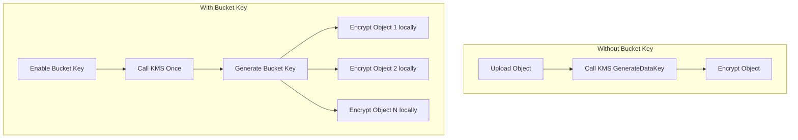

# How to Configure S3 Bucket Key to Reduce KMS Costs

Author: [nawazdhandala](https://github.com/nawazdhandala)

Tags: AWS, S3, KMS, Cost Optimization

Description: Learn how S3 Bucket Keys work to reduce AWS KMS request costs by up to 99 percent, with step-by-step configuration for new and existing buckets.

---

If you're using SSE-KMS encryption on your S3 buckets, you're paying for every KMS API call. Every upload, download, and copy operation triggers a call to KMS to encrypt or decrypt the data key. At high volumes, those KMS costs add up fast - sometimes exceeding the S3 storage cost itself.

S3 Bucket Keys fix this by creating a bucket-level key that reduces KMS calls by up to 99%. Let's see how it works and how to enable it.

## The Problem: KMS Request Costs

Without Bucket Keys, here's what happens for every S3 object operation:

1. You upload an object to S3
2. S3 calls KMS `GenerateDataKey` to get a unique data encryption key
3. S3 encrypts the object with that key
4. On download, S3 calls KMS `Decrypt` to decrypt the data key

Every single object gets its own KMS call. If you're uploading a million objects per day, that's a million KMS calls just for uploads. At $0.03 per 10,000 requests, that's $3 per day for uploads alone - $90 per month. And downloads double it.

For high-throughput workloads processing billions of objects, KMS costs can reach thousands of dollars per month.

## How Bucket Keys Work

With Bucket Keys enabled, S3 generates a time-limited bucket-level key from KMS. This bucket key then generates data keys for individual objects locally, without calling KMS for each one.



The bucket key is refreshed periodically, so KMS is still called - just far less frequently. For most workloads, this reduces KMS requests by 90-99%.

## Enabling Bucket Keys on a New Bucket

Set the default encryption with Bucket Key enabled when creating a new bucket.

```bash
# Create bucket with KMS encryption and Bucket Key
aws s3api create-bucket \
  --bucket my-encrypted-bucket \
  --region us-east-1

# Enable default KMS encryption with Bucket Key
aws s3api put-bucket-encryption \
  --bucket my-encrypted-bucket \
  --server-side-encryption-configuration '{
    "Rules": [
      {
        "ApplyServerSideEncryptionByDefault": {
          "SSEAlgorithm": "aws:kms",
          "KMSMasterKeyID": "arn:aws:kms:us-east-1:123456789012:key/abc123-456-789"
        },
        "BucketKeyEnabled": true
      }
    ]
  }'
```

That's it. The `BucketKeyEnabled: true` flag does all the magic.

## Enabling Bucket Keys on an Existing Bucket

You can enable Bucket Keys on existing buckets at any time. It only affects new objects - existing objects keep their current encryption.

```bash
# Enable Bucket Key on an existing bucket
aws s3api put-bucket-encryption \
  --bucket my-existing-bucket \
  --server-side-encryption-configuration '{
    "Rules": [
      {
        "ApplyServerSideEncryptionByDefault": {
          "SSEAlgorithm": "aws:kms",
          "KMSMasterKeyID": "arn:aws:kms:us-east-1:123456789012:key/abc123-456-789"
        },
        "BucketKeyEnabled": true
      }
    ]
  }'
```

Verify it's enabled.

```bash
# Check the current encryption configuration
aws s3api get-bucket-encryption --bucket my-existing-bucket
```

## Enabling Per-Object During Upload

Even without bucket-level configuration, you can enable Bucket Key for individual uploads.

```bash
# Upload with Bucket Key enabled for this specific object
aws s3api put-object \
  --bucket my-bucket \
  --key data/report.csv \
  --body report.csv \
  --server-side-encryption aws:kms \
  --ssekms-key-id arn:aws:kms:us-east-1:123456789012:key/abc123-456-789 \
  --bucket-key-enabled
```

## Using Terraform

Configure Bucket Keys in your Terraform infrastructure.

```hcl
resource "aws_s3_bucket" "encrypted" {
  bucket = "my-encrypted-bucket"
}

resource "aws_s3_bucket_server_side_encryption_configuration" "encrypted" {
  bucket = aws_s3_bucket.encrypted.id

  rule {
    apply_server_side_encryption_by_default {
      sse_algorithm     = "aws:kms"
      kms_master_key_id = aws_kms_key.s3_key.arn
    }
    bucket_key_enabled = true
  }
}

resource "aws_kms_key" "s3_key" {
  description             = "KMS key for S3 encryption"
  deletion_window_in_days = 7
  enable_key_rotation     = true
}
```

## Using CloudFormation

Here's the equivalent CloudFormation configuration.

```yaml
Resources:
  EncryptedBucket:
    Type: AWS::S3::Bucket
    Properties:
      BucketName: my-encrypted-bucket
      BucketEncryption:
        ServerSideEncryptionConfiguration:
          - ServerSideEncryptionByDefault:
              SSEAlgorithm: aws:kms
              KMSMasterKeyID: !Ref S3KMSKey
            BucketKeyEnabled: true

  S3KMSKey:
    Type: AWS::KMS::Key
    Properties:
      Description: KMS key for S3 encryption
      EnableKeyRotation: true
      KeyPolicy:
        Version: '2012-10-17'
        Statement:
          - Sid: Enable Root Account
            Effect: Allow
            Principal:
              AWS: !Sub 'arn:aws:iam::${AWS::AccountId}:root'
            Action: 'kms:*'
            Resource: '*'
```

## Applying Bucket Key to Existing Objects

Existing objects in the bucket don't automatically get the Bucket Key optimization. To apply it, you need to re-encrypt them using S3 Batch Operations or a copy operation.

Copy an object to itself with Bucket Key enabled.

```bash
# Re-encrypt an existing object with Bucket Key
aws s3api copy-object \
  --bucket my-bucket \
  --key data/old-file.csv \
  --copy-source my-bucket/data/old-file.csv \
  --server-side-encryption aws:kms \
  --ssekms-key-id arn:aws:kms:us-east-1:123456789012:key/abc123-456-789 \
  --bucket-key-enabled \
  --metadata-directive COPY
```

For millions of objects, use S3 Batch Operations to do this at scale.

## Checking if an Object Uses Bucket Key

Verify whether a specific object was encrypted with a Bucket Key.

```bash
# Check object metadata for Bucket Key usage
aws s3api head-object \
  --bucket my-bucket \
  --key data/report.csv

# Look for BucketKeyEnabled: true in the output
```

## Cost Impact Analysis

Let's calculate the savings for a typical workload.

Scenario: 10 million uploads and 10 million downloads per month.

**Without Bucket Key:**
- Uploads: 10M KMS GenerateDataKey calls = $30
- Downloads: 10M KMS Decrypt calls = $30
- Total KMS cost: $60/month

**With Bucket Key (99% reduction):**
- Uploads: ~100K KMS calls = $0.30
- Downloads: ~100K KMS calls = $0.30
- Total KMS cost: $0.60/month

That's a savings of $59.40 per month on KMS alone. For larger workloads with billions of operations, the savings run into thousands.

You can track your actual KMS costs before and after enabling Bucket Keys using AWS Cost Explorer. Filter by service "Key Management Service" and compare month over month.

## Things to Know

1. **No impact on encryption strength** - Bucket Keys don't weaken encryption. Each object still gets its own unique data key. The bucket key just generates those data keys locally instead of calling KMS.

2. **CloudTrail logging changes** - With Bucket Keys, CloudTrail KMS events show the bucket ARN as the resource instead of the object ARN. This changes how you audit KMS usage.

3. **Cross-account considerations** - Bucket Keys work fine with cross-account access, but the KMS key policy must allow the bucket's account. For more on cross-account setups, see our guide on [cross-account S3 bucket access](https://oneuptime.com/blog/post/2026-02-12-cross-account-s3-bucket-access/view).

4. **Replication** - Bucket Key settings are not replicated. You need to configure Bucket Keys separately on both source and destination buckets.

5. **SSE-S3 doesn't need this** - Bucket Keys only matter for SSE-KMS. If you use SSE-S3 (AES-256), there are no KMS calls to reduce.

## Monitoring KMS Costs

After enabling Bucket Keys, monitor your KMS request metrics to verify the cost reduction.

```bash
# Check KMS API call volume in CloudWatch
aws cloudwatch get-metric-statistics \
  --namespace AWS/KMS \
  --metric-name RequestCount \
  --dimensions Name=KeyId,Value=abc123-456-789 \
  --start-time 2026-02-01T00:00:00Z \
  --end-time 2026-02-12T00:00:00Z \
  --period 86400 \
  --statistics Sum
```

For comprehensive cost monitoring across all your AWS services including KMS, use [OneUptime](https://oneuptime.com) to track spending trends and alert on unexpected cost spikes.
