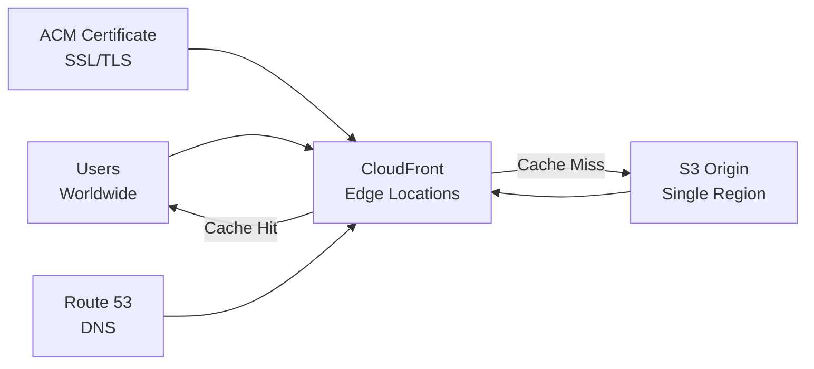

# How to Set Up S3 with CloudFront for a CDN-Backed Static Site

Author: [nawazdhandala](https://github.com/nawazdhandala)

Tags: AWS, S3, CloudFront, CDN, Static Website

Description: Learn how to put CloudFront in front of S3 for HTTPS, global CDN distribution, caching, and improved performance for your static website.

---

S3 static website hosting works great for simple setups, but it has real limitations. No HTTPS support. No custom headers. No compression. All traffic served from a single region. CloudFront solves every one of these problems by sitting in front of S3 as a global CDN with edge locations worldwide. Your users get fast page loads from the nearest edge, and you get HTTPS for free with AWS Certificate Manager.

## Architecture Overview



## Step 1: Create and Configure the S3 Bucket

For a CloudFront setup, you don't need S3 static website hosting enabled. CloudFront can use the S3 REST API endpoint directly, which is actually better because it supports OAC (Origin Access Control) - keeping the bucket private while CloudFront serves the content.

```bash
# Create the bucket (no need for website hosting)
aws s3api create-bucket \
  --bucket my-cdn-site \
  --region us-east-1

# Upload your website files
aws s3 sync ./build/ s3://my-cdn-site/
```

Keep the bucket private - don't add a public access policy. CloudFront will be the only way to access the content.

## Step 2: Request an SSL Certificate

Use AWS Certificate Manager to get a free certificate. Important: the certificate must be in us-east-1 for CloudFront, regardless of where your bucket is.

```bash
# Request a certificate (must be in us-east-1 for CloudFront)
aws acm request-certificate \
  --region us-east-1 \
  --domain-name example.com \
  --subject-alternative-names "*.example.com" \
  --validation-method DNS
```

Note the CertificateArn from the output. You'll need to validate the certificate by adding the DNS records ACM provides.

```bash
# List pending certificates to get validation records
aws acm describe-certificate \
  --region us-east-1 \
  --certificate-arn arn:aws:acm:us-east-1:123456789012:certificate/abc-123 \
  --query 'Certificate.DomainValidationOptions'
```

Add the CNAME validation records to your DNS, then wait for validation (usually 5-30 minutes).

## Step 3: Create a CloudFront Distribution

Create the distribution with OAC to keep the S3 bucket private.

First, create an Origin Access Control.

```bash
# Create Origin Access Control
aws cloudfront create-origin-access-control \
  --origin-access-control-config '{
    "Name": "my-cdn-site-oac",
    "Description": "OAC for my-cdn-site",
    "SigningProtocol": "sigv4",
    "SigningBehavior": "always",
    "OriginAccessControlOriginType": "s3"
  }'
```

Note the OAC ID from the output, then create the distribution.

```bash
# Create CloudFront distribution
aws cloudfront create-distribution \
  --distribution-config '{
    "CallerReference": "my-cdn-site-2026",
    "Aliases": {
      "Quantity": 2,
      "Items": ["example.com", "www.example.com"]
    },
    "DefaultRootObject": "index.html",
    "Origins": {
      "Quantity": 1,
      "Items": [
        {
          "Id": "s3-my-cdn-site",
          "DomainName": "my-cdn-site.s3.us-east-1.amazonaws.com",
          "S3OriginConfig": {
            "OriginAccessIdentity": ""
          },
          "OriginAccessControlId": "OAC_ID_HERE"
        }
      ]
    },
    "DefaultCacheBehavior": {
      "TargetOriginId": "s3-my-cdn-site",
      "ViewerProtocolPolicy": "redirect-to-https",
      "AllowedMethods": {
        "Quantity": 2,
        "Items": ["GET", "HEAD"]
      },
      "CachePolicyId": "658327ea-f89d-4fab-a63d-7e88639e58f6",
      "Compress": true
    },
    "CustomErrorResponses": {
      "Quantity": 1,
      "Items": [
        {
          "ErrorCode": 403,
          "ResponsePagePath": "/error.html",
          "ResponseCode": "404",
          "ErrorCachingMinTTL": 300
        }
      ]
    },
    "ViewerCertificate": {
      "ACMCertificateArn": "arn:aws:acm:us-east-1:123456789012:certificate/abc-123",
      "SSLSupportMethod": "sni-only",
      "MinimumProtocolVersion": "TLSv1.2_2021"
    },
    "Enabled": true,
    "Comment": "CDN for my static site",
    "PriceClass": "PriceClass_100",
    "HttpVersion": "http2and3"
  }'
```

Some notes on the configuration:

- **ViewerProtocolPolicy: redirect-to-https** - Forces HTTPS for all visitors
- **Compress: true** - Enables automatic gzip/brotli compression
- **PriceClass_100** - Uses only North American and European edge locations (cheapest). Use PriceClass_All for global.
- **HttpVersion: http2and3** - Enables HTTP/2 and HTTP/3 for best performance
- The **CachePolicyId** `658327ea-f89d-4fab-a63d-7e88639e58f6` is the AWS Managed-CachingOptimized policy

## Step 4: Update the S3 Bucket Policy

Allow CloudFront to access the bucket through OAC.

```json
{
  "Version": "2012-10-17",
  "Statement": [
    {
      "Sid": "AllowCloudFrontServicePrincipal",
      "Effect": "Allow",
      "Principal": {
        "Service": "cloudfront.amazonaws.com"
      },
      "Action": "s3:GetObject",
      "Resource": "arn:aws:s3:::my-cdn-site/*",
      "Condition": {
        "StringEquals": {
          "AWS:SourceArn": "arn:aws:cloudfront::123456789012:distribution/E1234567890ABC"
        }
      }
    }
  ]
}
```

```bash
aws s3api put-bucket-policy \
  --bucket my-cdn-site \
  --policy file://cloudfront-bucket-policy.json
```

## Step 5: Configure DNS

Point your domain to the CloudFront distribution.

```bash
# Get the CloudFront domain name
aws cloudfront list-distributions \
  --query "DistributionList.Items[?Comment=='CDN for my static site'].{Id:Id,Domain:DomainName}"

# Create Route 53 alias records
aws route53 change-resource-record-sets \
  --hosted-zone-id Z1234567890ABC \
  --change-batch '{
    "Changes": [
      {
        "Action": "UPSERT",
        "ResourceRecordSet": {
          "Name": "example.com",
          "Type": "A",
          "AliasTarget": {
            "HostedZoneId": "Z2FDTNDATAQYW2",
            "DNSName": "d1234567890abc.cloudfront.net",
            "EvaluateTargetHealth": false
          }
        }
      },
      {
        "Action": "UPSERT",
        "ResourceRecordSet": {
          "Name": "www.example.com",
          "Type": "A",
          "AliasTarget": {
            "HostedZoneId": "Z2FDTNDATAQYW2",
            "DNSName": "d1234567890abc.cloudfront.net",
            "EvaluateTargetHealth": false
          }
        }
      }
    ]
  }'
```

The `Z2FDTNDATAQYW2` is always the hosted zone ID for CloudFront distributions.

## Step 6: Handle SPA Routing

If you're deploying a single-page application (React, Vue, Angular), you need CloudFront to serve index.html for all routes.

Configure custom error responses to handle 404s by returning index.html.

```bash
# Update distribution with SPA-friendly error handling
# This makes CloudFront return index.html for any 403 or 404 from S3
aws cloudfront update-distribution \
  --id E1234567890ABC \
  --if-match ETAG_VALUE \
  --distribution-config '...'
```

The custom error responses should include:

```json
{
  "CustomErrorResponses": {
    "Quantity": 2,
    "Items": [
      {
        "ErrorCode": 403,
        "ResponsePagePath": "/index.html",
        "ResponseCode": "200",
        "ErrorCachingMinTTL": 0
      },
      {
        "ErrorCode": 404,
        "ResponsePagePath": "/index.html",
        "ResponseCode": "200",
        "ErrorCachingMinTTL": 0
      }
    ]
  }
}
```

## Step 7: Invalidate the Cache After Deployments

When you update your site, CloudFront still serves cached versions. Invalidate the cache to push updates.

```bash
# Invalidate all files
aws cloudfront create-invalidation \
  --distribution-id E1234567890ABC \
  --paths "/*"

# Or invalidate specific paths
aws cloudfront create-invalidation \
  --distribution-id E1234567890ABC \
  --paths "/index.html" "/styles.css" "/app.js"
```

Note: The first 1,000 invalidation paths per month are free. After that, it's $0.005 per path. Using `/*` counts as one path.

## Deployment Script

Here's a complete deployment script that syncs files and invalidates the cache.

```bash
#!/bin/bash
# deploy.sh - Deploy and invalidate

BUCKET="my-cdn-site"
DISTRIBUTION_ID="E1234567890ABC"
BUILD_DIR="./build"

echo "Syncing files to S3..."
aws s3 sync "$BUILD_DIR" "s3://$BUCKET" \
  --delete \
  --cache-control "max-age=31536000,public" \
  --exclude "*.html"

# HTML files get shorter cache since they change more often
aws s3 sync "$BUILD_DIR" "s3://$BUCKET" \
  --exclude "*" --include "*.html" \
  --cache-control "max-age=0,no-cache,no-store,must-revalidate" \
  --content-type "text/html"

echo "Invalidating CloudFront cache..."
INVALIDATION_ID=$(aws cloudfront create-invalidation \
  --distribution-id "$DISTRIBUTION_ID" \
  --paths "/*" \
  --query 'Invalidation.Id' \
  --output text)

echo "Invalidation ID: $INVALIDATION_ID"
echo "Waiting for invalidation to complete..."
aws cloudfront wait invalidation-completed \
  --distribution-id "$DISTRIBUTION_ID" \
  --id "$INVALIDATION_ID"

echo "Deployment complete!"
```

## Performance Tips

1. **Use long cache TTLs for static assets** and bust the cache with hashed filenames (e.g., `app.a1b2c3.js`)
2. **Enable Brotli compression** - CloudFront compresses automatically when `Compress: true`
3. **Use HTTP/3** for faster connections on modern browsers
4. **Set appropriate Price Class** - PriceClass_All for global audience, PriceClass_100 for US/EU only

## Wrapping Up

CloudFront plus S3 is the gold standard for static site hosting on AWS. You get HTTPS, global CDN distribution, automatic compression, and HTTP/2+3 support - all while keeping your S3 bucket completely private. The initial setup takes some work, but once it's running, the only thing you'll do regularly is deploy new content and invalidate the cache. For monitoring your CDN performance and uptime, check out [OneUptime's monitoring capabilities](https://oneuptime.com/blog/post/2026-02-13-aws-cloudwatch-infrastructure-monitoring/view).
