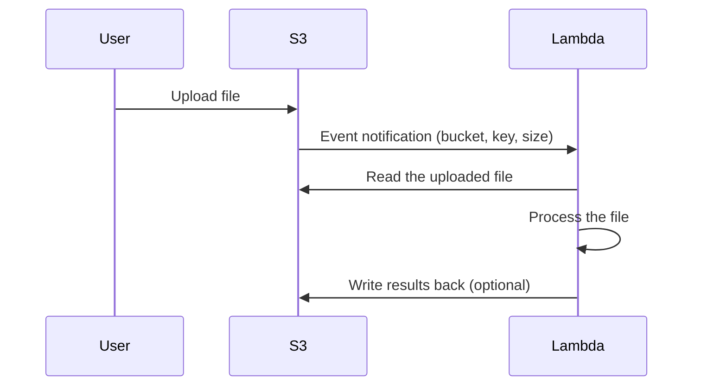

# How to Set Up S3 Event Notifications to Trigger Lambda Functions

Author: [nawazdhandala](https://github.com/nawazdhandala)

Tags: AWS, S3, Lambda, Serverless

Description: Configure S3 event notifications to automatically trigger Lambda functions when objects are created, deleted, or modified in your S3 buckets.

---

One of the most powerful patterns in AWS is triggering a Lambda function whenever something happens in an S3 bucket. Image uploaded? Automatically resize it. CSV landed? Process it into a database. Log file created? Parse it and send alerts. S3 event notifications combined with Lambda give you a reactive, serverless architecture that scales automatically.

Let's set this up from scratch, covering the Lambda function, permissions, and notification configuration.

## How It Works

When an event occurs in S3 (object created, deleted, etc.), S3 sends a notification containing the event details (bucket name, object key, size, etc.) to the configured target. Lambda receives this event, runs your code, and processes the object.



## Step 1: Create the Lambda Function

First, create the Lambda function that will process S3 events.

Create a Lambda function for processing S3 events:

```python
# lambda_function.py - Process S3 event notifications

import json
import boto3
import urllib.parse

s3 = boto3.client('s3')

def lambda_handler(event, context):
    # S3 can batch multiple records in a single invocation
    for record in event['Records']:
        # Extract event details
        bucket = record['s3']['bucket']['name']
        key = urllib.parse.unquote_plus(record['s3']['object']['key'])
        size = record['s3']['object'].get('size', 0)
        event_name = record['eventName']

        print(f"Event: {event_name}")
        print(f"Bucket: {bucket}")
        print(f"Key: {key}")
        print(f"Size: {size} bytes")

        # Download and process the object
        response = s3.get_object(Bucket=bucket, Key=key)
        content = response['Body'].read()

        # Your processing logic here
        process_file(bucket, key, content)

    return {
        'statusCode': 200,
        'body': json.dumps('Processing complete')
    }

def process_file(bucket, key, content):
    """Process the uploaded file."""
    if key.endswith('.csv'):
        # Process CSV files
        lines = content.decode('utf-8').split('\n')
        print(f"CSV file with {len(lines)} lines")

    elif key.endswith('.json'):
        # Process JSON files
        data = json.loads(content)
        print(f"JSON file with {len(data)} records")

    elif key.endswith(('.jpg', '.png', '.gif')):
        # Process images
        print(f"Image file: {len(content)} bytes")

    else:
        print(f"Unknown file type: {key}")
```

Package and deploy the Lambda function:

```bash
# Create the deployment package
zip function.zip lambda_function.py

# Create the Lambda function
aws lambda create-function \
    --function-name s3-event-processor \
    --runtime python3.12 \
    --handler lambda_function.lambda_handler \
    --role arn:aws:iam::123456789012:role/lambda-s3-role \
    --zip-file fileb://function.zip \
    --timeout 60 \
    --memory-size 256
```

## Step 2: Create the IAM Role

The Lambda function needs permission to read from S3 and write logs.

Create an IAM role for the Lambda function:

```bash
# Create the trust policy
cat > lambda-trust.json << 'EOF'
{
    "Version": "2012-10-17",
    "Statement": [
        {
            "Effect": "Allow",
            "Principal": {"Service": "lambda.amazonaws.com"},
            "Action": "sts:AssumeRole"
        }
    ]
}
EOF

# Create the role
aws iam create-role \
    --role-name lambda-s3-role \
    --assume-role-policy-document file://lambda-trust.json

# Attach the basic execution policy (CloudWatch logs)
aws iam attach-role-policy \
    --role-name lambda-s3-role \
    --policy-arn arn:aws:iam::aws:policy/service-role/AWSLambdaBasicExecutionRole

# Create and attach S3 read policy
cat > s3-read-policy.json << 'EOF'
{
    "Version": "2012-10-17",
    "Statement": [
        {
            "Effect": "Allow",
            "Action": [
                "s3:GetObject",
                "s3:ListBucket"
            ],
            "Resource": [
                "arn:aws:s3:::my-bucket",
                "arn:aws:s3:::my-bucket/*"
            ]
        }
    ]
}
EOF

aws iam put-role-policy \
    --role-name lambda-s3-role \
    --policy-name s3-read-access \
    --policy-document file://s3-read-policy.json
```

## Step 3: Grant S3 Permission to Invoke Lambda

S3 needs explicit permission to invoke your Lambda function.

Add a resource-based policy to the Lambda function:

```bash
# Allow S3 to invoke the Lambda function
aws lambda add-permission \
    --function-name s3-event-processor \
    --statement-id s3-invoke-permission \
    --action lambda:InvokeFunction \
    --principal s3.amazonaws.com \
    --source-arn arn:aws:s3:::my-bucket \
    --source-account 123456789012
```

## Step 4: Configure S3 Event Notifications

Now connect S3 to Lambda by creating the notification configuration.

Set up S3 event notifications to trigger Lambda:

```bash
# Configure notification for all object creation events
aws s3api put-bucket-notification-configuration \
    --bucket my-bucket \
    --notification-configuration '{
        "LambdaFunctionConfigurations": [
            {
                "Id": "process-new-uploads",
                "LambdaFunctionArn": "arn:aws:lambda:us-east-1:123456789012:function:s3-event-processor",
                "Events": [
                    "s3:ObjectCreated:*"
                ]
            }
        ]
    }'
```

## Filtering Events by Prefix and Suffix

You don't have to trigger on every object. Use filters to target specific files.

Configure notifications with prefix and suffix filters:

```bash
aws s3api put-bucket-notification-configuration \
    --bucket my-bucket \
    --notification-configuration '{
        "LambdaFunctionConfigurations": [
            {
                "Id": "process-csv-uploads",
                "LambdaFunctionArn": "arn:aws:lambda:us-east-1:123456789012:function:csv-processor",
                "Events": ["s3:ObjectCreated:*"],
                "Filter": {
                    "Key": {
                        "FilterRules": [
                            {"Name": "prefix", "Value": "uploads/"},
                            {"Name": "suffix", "Value": ".csv"}
                        ]
                    }
                }
            },
            {
                "Id": "process-image-uploads",
                "LambdaFunctionArn": "arn:aws:lambda:us-east-1:123456789012:function:image-processor",
                "Events": ["s3:ObjectCreated:*"],
                "Filter": {
                    "Key": {
                        "FilterRules": [
                            {"Name": "prefix", "Value": "images/"},
                            {"Name": "suffix", "Value": ".jpg"}
                        ]
                    }
                }
            },
            {
                "Id": "notify-on-delete",
                "LambdaFunctionArn": "arn:aws:lambda:us-east-1:123456789012:function:deletion-handler",
                "Events": ["s3:ObjectRemoved:*"]
            }
        ]
    }'
```

## Available Event Types

S3 supports a variety of event types:

```
s3:ObjectCreated:*              - Any object creation
s3:ObjectCreated:Put            - PUT (single upload)
s3:ObjectCreated:Post           - POST
s3:ObjectCreated:Copy           - Copy operation
s3:ObjectCreated:CompleteMultipartUpload - Multipart upload completed

s3:ObjectRemoved:*              - Any deletion
s3:ObjectRemoved:Delete         - Permanent delete
s3:ObjectRemoved:DeleteMarkerCreated - Delete marker (versioned)

s3:ObjectRestore:*              - Glacier restore events
s3:ObjectRestore:Post           - Restore initiated
s3:ObjectRestore:Completed      - Restore completed

s3:ObjectTagging:*              - Tag changes
s3:ObjectTagging:Put            - Tags added/modified
s3:ObjectTagging:Delete         - Tags removed

s3:ReducedRedundancyLostObject  - Object in RRS lost
```

## Real-World Example: Image Thumbnail Generator

Here's a practical Lambda function that generates thumbnails when images are uploaded.

Create an image thumbnail generator:

```python
# thumbnail_generator.py
import boto3
import json
import urllib.parse
from io import BytesIO
from PIL import Image

s3 = boto3.client('s3')
THUMBNAIL_SIZE = (200, 200)
THUMBNAIL_PREFIX = 'thumbnails/'

def lambda_handler(event, context):
    for record in event['Records']:
        bucket = record['s3']['bucket']['name']
        key = urllib.parse.unquote_plus(record['s3']['object']['key'])

        # Skip if this is already a thumbnail (prevent infinite loop!)
        if key.startswith(THUMBNAIL_PREFIX):
            print(f"Skipping thumbnail: {key}")
            continue

        print(f"Generating thumbnail for: {key}")

        # Download the image
        response = s3.get_object(Bucket=bucket, Key=key)
        image_data = response['Body'].read()

        # Create thumbnail
        image = Image.open(BytesIO(image_data))
        image.thumbnail(THUMBNAIL_SIZE)

        # Save thumbnail to buffer
        buffer = BytesIO()
        image.save(buffer, 'JPEG', quality=85)
        buffer.seek(0)

        # Upload thumbnail
        thumb_key = f"{THUMBNAIL_PREFIX}{key}"
        s3.put_object(
            Bucket=bucket,
            Key=thumb_key,
            Body=buffer,
            ContentType='image/jpeg'
        )

        print(f"Thumbnail created: {thumb_key}")

    return {'statusCode': 200}
```

Note the infinite loop prevention - the function checks if the key starts with the thumbnail prefix. Without this check, uploading a thumbnail would trigger the function again, creating another thumbnail, and so on forever.

## Testing the Notification

Verify your setup works end to end:

```bash
# Upload a test file
echo "test,data,here" > /tmp/test.csv
aws s3 cp /tmp/test.csv s3://my-bucket/uploads/test.csv

# Check Lambda logs (wait a few seconds)
aws logs tail /aws/lambda/s3-event-processor --since 5m

# Check if the Lambda was invoked
aws lambda get-function \
    --function-name s3-event-processor \
    --query "Configuration.LastModified"
```

## Error Handling and Retries

S3 will retry failed Lambda invocations. If your function throws an error, S3 retries up to 2 more times. If all retries fail, the event is dropped (unless you configure a dead-letter queue).

Configure error handling:

```bash
# Add a dead-letter queue for failed invocations
aws lambda update-function-configuration \
    --function-name s3-event-processor \
    --dead-letter-config TargetArn=arn:aws:sqs:us-east-1:123456789012:s3-events-dlq
```

For alternative notification targets like SQS and SNS, see our guide on [S3 event notifications to SQS and SNS](https://oneuptime.com/blog/post/s3-event-notifications-sqs-sns/view).

## Common Pitfalls

1. **Infinite loops**: If your Lambda writes to the same bucket that triggers it, use prefix filters to prevent loops.
2. **Permission errors**: The most common setup failure. Double-check the Lambda resource policy and IAM role.
3. **Event duplication**: S3 notifications are at-least-once delivery. Your function should be idempotent.
4. **Large files**: Lambda has a 15-minute timeout. For very large files, use Step Functions or process asynchronously.
5. **Notification overlap**: Two notification configurations can't have overlapping prefix/suffix filters for the same event type.

S3 event notifications to Lambda are one of the foundational serverless patterns on AWS. Once you've built one, you'll start seeing opportunities to use it everywhere.
