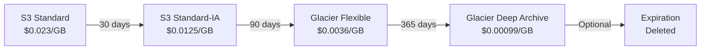

# How to Use S3 Glacier for Long-Term Archival Storage

Author: [nawazdhandala](https://github.com/nawazdhandala)

Tags: AWS, S3, Glacier, Archival, Cost Optimization

Description: A practical guide to using S3 Glacier and Glacier Deep Archive for long-term archival storage, including lifecycle policies, direct uploads, and cost comparisons.

---

Not all data needs instant access. Log archives from three years ago, compliance records you're legally required to keep for seven years, old backups you hope you'll never need - all of this can live in S3 Glacier at a fraction of the cost of standard storage. Glacier storage classes trade retrieval speed for dramatically lower storage prices, and for archival data, that's a trade worth making.

## S3 Glacier Storage Classes

AWS offers three Glacier-related storage classes:

| Storage Class | Storage Cost (per GB/month) | Min Storage Duration | Retrieval Time | Use Case |
|---|---|---|---|---|
| Glacier Instant Retrieval | ~$0.004 | 90 days | Milliseconds | Quarterly/yearly accessed archives |
| Glacier Flexible Retrieval | ~$0.0036 | 90 days | 1-5 min to 12 hours | Backup archives, compliance data |
| Glacier Deep Archive | ~$0.00099 | 180 days | 12-48 hours | Long-term compliance, cold backups |

Compare that to S3 Standard at ~$0.023 per GB/month. Deep Archive is roughly 23x cheaper.

## Method 1: Direct Upload to Glacier

You can upload objects directly to Glacier storage classes without putting them in Standard first.

```bash
# Upload directly to Glacier Flexible Retrieval
aws s3 cp backup-2025-q4.tar.gz \
  s3://my-archive-bucket/backups/2025-q4/backup.tar.gz \
  --storage-class GLACIER

# Upload to Glacier Deep Archive
aws s3 cp compliance-records-2020.zip \
  s3://my-archive-bucket/compliance/2020/records.zip \
  --storage-class DEEP_ARCHIVE

# Upload to Glacier Instant Retrieval
aws s3 cp quarterly-report-2025.pdf \
  s3://my-archive-bucket/reports/2025-q4.pdf \
  --storage-class GLACIER_IR
```

Using Python:

```python
import boto3

s3 = boto3.client('s3')

# Upload directly to Glacier Deep Archive
with open('old-database-dump.sql.gz', 'rb') as f:
    s3.put_object(
        Bucket='my-archive-bucket',
        Key='db-archives/2023/full-dump.sql.gz',
        Body=f,
        StorageClass='DEEP_ARCHIVE'
    )

print("Archived to Glacier Deep Archive")
```

## Method 2: Lifecycle Policies (Recommended)

The more common approach is to upload data to Standard storage and let lifecycle policies transition it to Glacier automatically. This is cleaner because:

- Data is immediately accessible after upload
- You can set up a "cooling" period before archiving
- Different prefixes can have different policies

Here's a lifecycle configuration that transitions data progressively through cheaper storage tiers.

```json
{
  "Rules": [
    {
      "ID": "archive-old-logs",
      "Status": "Enabled",
      "Filter": {
        "Prefix": "logs/"
      },
      "Transitions": [
        {
          "Days": 30,
          "StorageClass": "STANDARD_IA"
        },
        {
          "Days": 90,
          "StorageClass": "GLACIER"
        },
        {
          "Days": 365,
          "StorageClass": "DEEP_ARCHIVE"
        }
      ]
    },
    {
      "ID": "archive-backups",
      "Status": "Enabled",
      "Filter": {
        "Prefix": "backups/"
      },
      "Transitions": [
        {
          "Days": 7,
          "StorageClass": "GLACIER"
        }
      ],
      "Expiration": {
        "Days": 2555
      }
    },
    {
      "ID": "cleanup-temp",
      "Status": "Enabled",
      "Filter": {
        "Prefix": "temp/"
      },
      "Expiration": {
        "Days": 7
      }
    }
  ]
}
```

Apply the lifecycle configuration.

```bash
aws s3api put-bucket-lifecycle-configuration \
  --bucket my-archive-bucket \
  --lifecycle-configuration file://lifecycle.json
```

## Lifecycle Flow



## Understanding Minimum Storage Duration

Glacier storage classes have minimum storage duration charges. If you delete or transition an object before the minimum duration, you're still charged for the full period.

- **Glacier Instant Retrieval**: 90 days minimum
- **Glacier Flexible Retrieval**: 90 days minimum
- **Glacier Deep Archive**: 180 days minimum

For example, if you store an object in Deep Archive and delete it after 30 days, you're still billed for 180 days of storage.

## Monitoring Glacier Storage

Check how much data you have in each storage class.

```python
import boto3

s3 = boto3.client('s3')
cloudwatch = boto3.client('cloudwatch')
from datetime import datetime, timedelta

# Get storage metrics from CloudWatch
metrics = cloudwatch.get_metric_statistics(
    Namespace='AWS/S3',
    MetricName='BucketSizeBytes',
    Dimensions=[
        {'Name': 'BucketName', 'Value': 'my-archive-bucket'},
        {'Name': 'StorageType', 'Value': 'GlacierStorage'}
    ],
    StartTime=datetime.utcnow() - timedelta(days=2),
    EndTime=datetime.utcnow(),
    Period=86400,
    Statistics=['Average']
)

for point in metrics['Datapoints']:
    size_gb = point['Average'] / (1024 ** 3)
    print(f"Glacier storage: {size_gb:.2f} GB")
```

## Cost Optimization Tips

1. **Use lifecycle policies instead of direct uploads** when possible. This gives you a window of immediate access.

2. **Set appropriate expiration rules.** Don't archive forever if you don't need to. Even at Glacier pricing, terabytes add up over years.

3. **Batch small objects before archiving.** Glacier charges a minimum of 40KB per object (8KB for metadata + 32KB minimum). Thousands of small files are expensive. Tar them up first.

```bash
# Bad: archiving thousands of small files individually
# Each small file incurs 40KB minimum charge

# Good: combine them first
tar czf logs-2025-01.tar.gz logs/2025/01/
aws s3 cp logs-2025-01.tar.gz \
  s3://my-archive-bucket/archives/logs-2025-01.tar.gz \
  --storage-class DEEP_ARCHIVE
```

4. **Use Glacier Instant Retrieval for data accessed roughly once per quarter.** It's cheaper than Standard-IA and gives millisecond access.

5. **Consider S3 Intelligent-Tiering** if your access patterns are unpredictable. It automatically moves data between tiers. See our guide on [S3 Intelligent-Tiering](https://oneuptime.com/blog/post/2026-02-12-s3-intelligent-tiering-optimize-storage-costs/view).

## Verifying Object Storage Class

Check what storage class your objects are in.

```bash
# Check storage class of a specific object
aws s3api head-object \
  --bucket my-archive-bucket \
  --key backups/2025-q4/backup.tar.gz \
  --query 'StorageClass'

# List objects with their storage classes
aws s3api list-objects-v2 \
  --bucket my-archive-bucket \
  --prefix backups/ \
  --query 'Contents[].{Key: Key, Size: Size, StorageClass: StorageClass}'
```

## Retrieving Glacier Data

Objects in Glacier Flexible Retrieval and Deep Archive can't be accessed directly - you need to initiate a restore first. The object stays in Glacier but a temporary copy is made available in Standard storage.

For a complete guide on restoring objects, see our post on [restoring objects from S3 Glacier and Glacier Deep Archive](https://oneuptime.com/blog/post/2026-02-12-restore-objects-s3-glacier-deep-archive/view).

Quick restore example:

```bash
# Initiate a restore with standard retrieval (3-5 hours)
aws s3api restore-object \
  --bucket my-archive-bucket \
  --key backups/2025-q4/backup.tar.gz \
  --restore-request '{"Days": 7, "GlacierJobParameters": {"Tier": "Standard"}}'
```

## Compliance Considerations

If you're using Glacier for regulatory compliance, combine it with:

- **S3 Object Lock** in compliance mode to prevent deletion during the retention period
- **S3 Versioning** to maintain a complete history of changes
- **S3 Access Logging** to create an audit trail

For details on Object Lock, see our guide on [configuring S3 Object Lock for WORM compliance](https://oneuptime.com/blog/post/2026-02-12-configure-s3-object-lock-worm-compliance/view).

## Wrapping Up

S3 Glacier storage classes are the most cost-effective way to store data you rarely need. The key decisions are which tier to use (based on how quickly you might need the data back) and whether to upload directly or use lifecycle policies. For most use cases, lifecycle policies are cleaner - they let your application work with Standard storage while automatically handling the transition to cheaper tiers over time. Just remember the minimum storage durations and per-object overhead when planning your archival strategy.
