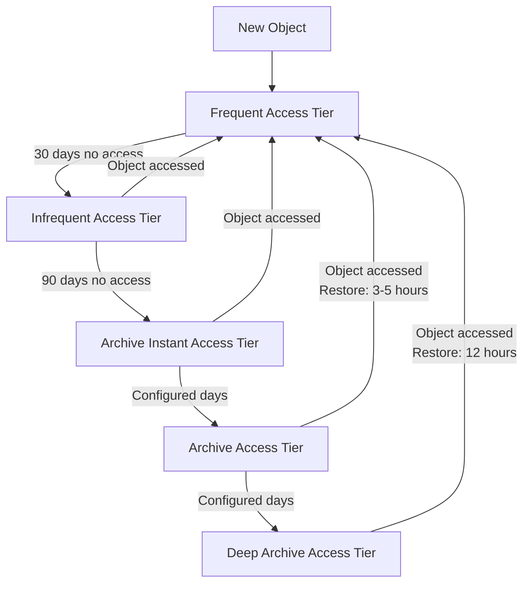

# How to Use S3 Intelligent-Tiering to Automatically Optimize Storage Costs

Author: [nawazdhandala](https://github.com/nawazdhandala)

Tags: AWS, S3, Intelligent-Tiering, Cost Optimization, Storage

Description: Learn how S3 Intelligent-Tiering automatically moves your data between access tiers based on usage patterns to reduce storage costs without performance impact.

---

Most S3 cost optimization advice boils down to "move cold data to cheaper storage." But figuring out which data is cold is harder than it sounds. Access patterns change. That dataset nobody touched for six months suddenly becomes critical for a quarterly report. S3 Intelligent-Tiering handles this automatically - it monitors access patterns per object and moves data between tiers based on actual usage. No performance penalty, no retrieval fees, no guesswork.

## How Intelligent-Tiering Works

S3 Intelligent-Tiering has five access tiers:

1. **Frequent Access** (same price as S3 Standard)
2. **Infrequent Access** (same price as S3 Standard-IA) - after 30 consecutive days without access
3. **Archive Instant Access** (same price as Glacier Instant Retrieval) - after 90 consecutive days
4. **Archive Access** (same price as Glacier Flexible Retrieval) - after 90-730 days (opt-in)
5. **Deep Archive Access** (same price as Glacier Deep Archive) - after 180-730 days (opt-in)

The first three tiers are automatic. The archive tiers are opt-in and configurable.

When an object is accessed, it automatically moves back to Frequent Access. There are no retrieval fees for any tier - that's the big advantage over manually using Glacier.

## The Cost of Intelligent-Tiering

There's a monitoring fee of $0.0025 per 1,000 objects per month. For objects smaller than 128KB, there's no monitoring fee and they're always stored in the Frequent Access tier.

Let's do the math. If you have 10 million objects and 50% of them are cold:

- **Monitoring cost**: 10M / 1000 x $0.0025 = $25/month
- **Savings on cold data**: If 5M objects average 1MB each, that's 5TB moved from Standard ($0.023) to Infrequent ($0.0125) = $43.75/month saved

Net savings: $18.75/month. And that's just with the Infrequent tier. With Archive tiers enabled, the savings multiply.

## Step 1: Upload Objects to Intelligent-Tiering

You can upload directly to the Intelligent-Tiering storage class.

```bash
# Upload a file to Intelligent-Tiering
aws s3 cp large-dataset.parquet \
  s3://my-data-bucket/datasets/large-dataset.parquet \
  --storage-class INTELLIGENT_TIERING
```

Or set it as the default for all uploads using a lifecycle rule.

## Step 2: Set Up a Lifecycle Policy for Automatic Transition

The best approach is a lifecycle policy that moves existing objects to Intelligent-Tiering.

```json
{
  "Rules": [
    {
      "ID": "move-to-intelligent-tiering",
      "Status": "Enabled",
      "Filter": {
        "Prefix": ""
      },
      "Transitions": [
        {
          "Days": 0,
          "StorageClass": "INTELLIGENT_TIERING"
        }
      ]
    }
  ]
}
```

Apply it.

```bash
aws s3api put-bucket-lifecycle-configuration \
  --bucket my-data-bucket \
  --lifecycle-configuration file://intelligent-tiering-lifecycle.json
```

Wait - `Days: 0` means objects transition immediately after creation? Not exactly. It means objects become eligible for transition at midnight UTC after creation. In practice, there's a roughly 24-48 hour delay.

## Step 3: Enable Archive Access Tiers

The archive tiers aren't enabled by default. You need to configure them with an Intelligent-Tiering configuration.

```bash
# Enable Archive Access tier after 90 days, Deep Archive after 180 days
aws s3api put-bucket-intelligent-tiering-configuration \
  --bucket my-data-bucket \
  --id archive-config \
  --intelligent-tiering-configuration '{
    "Id": "archive-config",
    "Status": "Enabled",
    "Filter": {
      "Prefix": "data/"
    },
    "Tierings": [
      {
        "AccessTier": "ARCHIVE_ACCESS",
        "Days": 90
      },
      {
        "AccessTier": "DEEP_ARCHIVE_ACCESS",
        "Days": 180
      }
    ]
  }'
```

You can create different configurations for different prefixes.

```bash
# Archive logs more aggressively
aws s3api put-bucket-intelligent-tiering-configuration \
  --bucket my-data-bucket \
  --id logs-archive-config \
  --intelligent-tiering-configuration '{
    "Id": "logs-archive-config",
    "Status": "Enabled",
    "Filter": {
      "Prefix": "logs/"
    },
    "Tierings": [
      {
        "AccessTier": "ARCHIVE_ACCESS",
        "Days": 90
      },
      {
        "AccessTier": "DEEP_ARCHIVE_ACCESS",
        "Days": 180
      }
    ]
  }'

# Keep datasets accessible longer
aws s3api put-bucket-intelligent-tiering-configuration \
  --bucket my-data-bucket \
  --id datasets-config \
  --intelligent-tiering-configuration '{
    "Id": "datasets-config",
    "Status": "Enabled",
    "Filter": {
      "Prefix": "datasets/"
    },
    "Tierings": [
      {
        "AccessTier": "ARCHIVE_ACCESS",
        "Days": 365
      }
    ]
  }'
```

## How Objects Move Between Tiers



Note: Objects in Archive and Deep Archive tiers need to be restored before access (like Glacier), but there are no retrieval fees. The access automatically triggers the restore and moves the object back to Frequent Access.

## Step 4: Monitor Tier Distribution

Use S3 Storage Lens or CloudWatch to see how your objects are distributed across tiers.

```python
import boto3
from datetime import datetime, timedelta

cloudwatch = boto3.client('cloudwatch')

# Get metrics for each tier
tiers = {
    'IntelligentTieringFAStorage': 'Frequent Access',
    'IntelligentTieringIAStorage': 'Infrequent Access',
    'IntelligentTieringAAStorage': 'Archive Access',
    'IntelligentTieringDAAStorage': 'Deep Archive Access',
    'IntelligentTieringAIAStorage': 'Archive Instant Access',
}

for storage_type, tier_name in tiers.items():
    response = cloudwatch.get_metric_statistics(
        Namespace='AWS/S3',
        MetricName='BucketSizeBytes',
        Dimensions=[
            {'Name': 'BucketName', 'Value': 'my-data-bucket'},
            {'Name': 'StorageType', 'Value': storage_type}
        ],
        StartTime=datetime.utcnow() - timedelta(days=2),
        EndTime=datetime.utcnow(),
        Period=86400,
        Statistics=['Average']
    )

    for point in response['Datapoints']:
        size_gb = point['Average'] / (1024 ** 3)
        print(f"{tier_name}: {size_gb:.2f} GB")
```

For a broader view across all your buckets, see our guide on [S3 Storage Lens](https://oneuptime.com/blog/post/s3-storage-lens-visibility-storage-usage/view).

## When to Use Intelligent-Tiering vs. Manual Lifecycle Policies

**Use Intelligent-Tiering when:**
- Access patterns are unpredictable
- Data that's been cold might become hot again
- You don't want to pay retrieval fees (important for analytics workloads)
- You'd rather pay $0.0025/1000 objects than spend time analyzing access patterns

**Use manual lifecycle policies when:**
- Access patterns are very predictable (e.g., logs that are never accessed after 30 days)
- You have many small objects under 128KB
- You want to save the monitoring fee
- You want to delete objects after a certain period (Intelligent-Tiering doesn't handle expiration)

You can combine both approaches. Use lifecycle policies for known patterns (like expiring temp files) and Intelligent-Tiering for everything else.

## Step 5: Intelligent-Tiering with Existing Buckets

Migrating an existing bucket to Intelligent-Tiering involves changing the storage class of existing objects.

Using S3 Batch Operations for large-scale migration:

```python
import boto3

s3 = boto3.client('s3')

# For smaller buckets, copy in place
paginator = s3.get_paginator('list_objects_v2')
pages = paginator.paginate(Bucket='my-data-bucket', Prefix='data/')

migrated = 0
for page in pages:
    for obj in page.get('Contents', []):
        key = obj['Key']
        # Skip if already Intelligent-Tiering
        head = s3.head_object(Bucket='my-data-bucket', Key=key)
        if head.get('StorageClass') == 'INTELLIGENT_TIERING':
            continue

        # Copy in place with new storage class
        s3.copy_object(
            Bucket='my-data-bucket',
            Key=key,
            CopySource={'Bucket': 'my-data-bucket', 'Key': key},
            StorageClass='INTELLIGENT_TIERING',
            MetadataDirective='COPY'
        )
        migrated += 1

print(f"Migrated {migrated} objects to Intelligent-Tiering")
```

For millions of objects, use [S3 Batch Operations](https://oneuptime.com/blog/post/s3-batch-operations-process-millions-objects/view) instead.

## Wrapping Up

S3 Intelligent-Tiering is the "set it and forget it" approach to storage cost optimization. You pay a small monitoring fee per object, and AWS automatically moves your data to the cheapest tier based on actual access patterns. No retrieval fees when data moves back to Frequent Access means you never pay a penalty for incorrect tiering decisions. For most workloads with unpredictable access patterns, it's the best default choice.
