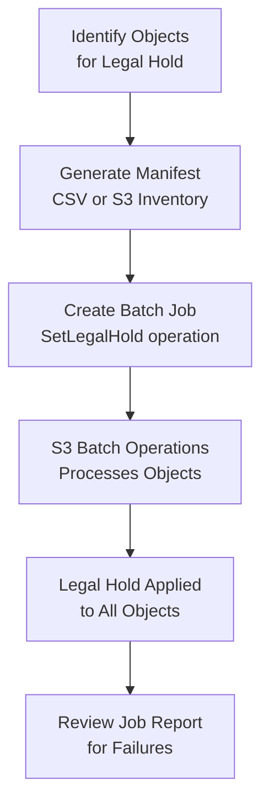

# How to Use S3 Legal Hold for Compliance

Author: [nawazdhandala](https://github.com/nawazdhandala)

Tags: AWS, S3, Compliance, Legal Hold, Data Protection

Description: Learn how to use S3 Legal Hold to prevent object deletion indefinitely for litigation, regulatory audits, and compliance requirements.

---

When your legal team says "don't delete anything related to Project X," you need a mechanism that's bulletproof. Not a Slack message asking people to be careful. Not a bucket policy that someone might accidentally change. You need S3 Legal Hold - a simple on/off flag that prevents any object version from being deleted, with no expiration date and no way to bypass it without explicitly removing the hold.

## Legal Hold vs. Retention Periods

Before diving in, let's clear up the difference between legal holds and retention periods, because they're often confused.

**Retention periods** have a fixed end date. Once the date passes, the object can be deleted normally. You set them when you upload the object or through a bucket default.

**Legal holds** have no expiration. They stay in effect until someone with the right IAM permissions explicitly removes them. This makes them perfect for litigation holds where you don't know how long you'll need to preserve the data.

You can use both simultaneously on the same object. An object with a retention period AND a legal hold can only be deleted when both the retention period has expired AND the legal hold has been removed.

## Prerequisites

Legal Hold requires an S3 bucket with Object Lock enabled. If you haven't set that up yet, check out our guide on [configuring S3 Object Lock for WORM compliance](https://oneuptime.com/blog/post/2026-02-12-configure-s3-object-lock-worm-compliance/view).

Quick reminder - Object Lock must be enabled at bucket creation time.

```bash
# Create a bucket with Object Lock enabled
aws s3api create-bucket \
  --bucket my-legal-hold-bucket \
  --region us-east-1 \
  --object-lock-enabled-for-object-configuration '{"ObjectLockEnabled": "Enabled"}'
```

## Placing a Legal Hold on an Object

The API call is straightforward. You specify the bucket, key, and set the legal hold status to ON.

```bash
# Place a legal hold on a specific object
aws s3api put-object-legal-hold \
  --bucket my-legal-hold-bucket \
  --key contracts/vendor-agreement-2025.pdf \
  --legal-hold '{"Status": "ON"}'
```

You can also set it during upload.

```bash
# Upload an object with legal hold already applied
aws s3api put-object \
  --bucket my-legal-hold-bucket \
  --key litigation/case-12345/evidence-001.pdf \
  --body ./evidence-001.pdf \
  --object-lock-legal-hold-status ON
```

## Placing Legal Holds with Python

Here's how to do it programmatically, which you'll need for bulk operations.

```python
import boto3

s3 = boto3.client('s3')

# Place legal hold on a single object
s3.put_object_legal_hold(
    Bucket='my-legal-hold-bucket',
    Key='contracts/vendor-agreement-2025.pdf',
    LegalHold={'Status': 'ON'}
)

print("Legal hold applied successfully")
```

For placing holds on many objects at once (like all files in a specific prefix), you can iterate through the objects.

```python
import boto3

s3 = boto3.client('s3')
bucket = 'my-legal-hold-bucket'
prefix = 'litigation/case-12345/'

# List all objects under the litigation case prefix
paginator = s3.get_paginator('list_objects_v2')
pages = paginator.paginate(Bucket=bucket, Prefix=prefix)

held_count = 0
for page in pages:
    for obj in page.get('Contents', []):
        s3.put_object_legal_hold(
            Bucket=bucket,
            Key=obj['Key'],
            LegalHold={'Status': 'ON'}
        )
        held_count += 1
        print(f"Legal hold applied to: {obj['Key']}")

print(f"\nTotal objects held: {held_count}")
```

## Checking Legal Hold Status

You can query the legal hold status of any object.

```bash
# Check legal hold status
aws s3api get-object-legal-hold \
  --bucket my-legal-hold-bucket \
  --key contracts/vendor-agreement-2025.pdf
```

The response tells you whether the hold is ON or OFF.

```json
{
    "LegalHold": {
        "Status": "ON"
    }
}
```

You can also check via the head-object command.

```bash
# Head object also shows legal hold status
aws s3api head-object \
  --bucket my-legal-hold-bucket \
  --key contracts/vendor-agreement-2025.pdf
```

## Removing a Legal Hold

When the legal matter is resolved, you can remove the hold.

```bash
# Remove legal hold
aws s3api put-object-legal-hold \
  --bucket my-legal-hold-bucket \
  --key contracts/vendor-agreement-2025.pdf \
  --legal-hold '{"Status": "OFF"}'
```

## IAM Permissions for Legal Hold

You need specific permissions to manage legal holds. Here's a policy that separates who can apply holds from who can remove them - useful for separation of duties.

This policy allows applying but not removing legal holds.

```json
{
  "Version": "2012-10-17",
  "Statement": [
    {
      "Sid": "AllowApplyLegalHold",
      "Effect": "Allow",
      "Action": [
        "s3:PutObjectLegalHold"
      ],
      "Resource": "arn:aws:s3:::my-legal-hold-bucket/*",
      "Condition": {
        "StringEquals": {
          "s3:object-lock-legal-hold": "ON"
        }
      }
    },
    {
      "Sid": "AllowCheckLegalHold",
      "Effect": "Allow",
      "Action": [
        "s3:GetObjectLegalHold"
      ],
      "Resource": "arn:aws:s3:::my-legal-hold-bucket/*"
    }
  ]
}
```

And this policy for legal team managers who can also remove holds.

```json
{
  "Version": "2012-10-17",
  "Statement": [
    {
      "Sid": "FullLegalHoldManagement",
      "Effect": "Allow",
      "Action": [
        "s3:PutObjectLegalHold",
        "s3:GetObjectLegalHold"
      ],
      "Resource": "arn:aws:s3:::my-legal-hold-bucket/*"
    }
  ]
}
```

## Using S3 Batch Operations for Large-Scale Legal Holds

When you need to place legal holds on thousands or millions of objects, individual API calls aren't practical. S3 Batch Operations can apply legal holds at scale. For a deep dive into batch operations, see our post on [using S3 Batch Operations to process millions of objects](https://oneuptime.com/blog/post/2026-02-12-s3-batch-operations-process-millions-objects/view).

Here's the general flow:



## Building a Legal Hold Audit System

For compliance, you'll want to track every legal hold change. Here's a pattern using CloudTrail and a Lambda function.

```python
import json
import boto3
from datetime import datetime

dynamodb = boto3.resource('dynamodb')
table = dynamodb.Table('legal-hold-audit-log')

def lambda_handler(event, context):
    """
    Triggered by CloudTrail events for PutObjectLegalHold.
    Records every legal hold change in DynamoDB for audit purposes.
    """
    for record in event['Records']:
        body = json.loads(record['body'])
        detail = body.get('detail', {})

        # Extract relevant information
        bucket = detail.get('requestParameters', {}).get('bucketName', '')
        key = detail.get('requestParameters', {}).get('key', '')
        user = detail.get('userIdentity', {}).get('arn', 'unknown')
        status = detail.get('requestParameters', {}).get('legalHold', {}).get('Status', '')

        # Log to DynamoDB
        table.put_item(
            Item={
                'object_path': f"s3://{bucket}/{key}",
                'timestamp': datetime.utcnow().isoformat(),
                'action': f"LegalHold_{status}",
                'performed_by': user,
                'bucket': bucket,
                'key': key
            }
        )

        print(f"Audit log: {user} set legal hold {status} on s3://{bucket}/{key}")

    return {'statusCode': 200}
```

## Best Practices

1. **Use separate IAM roles for applying vs removing holds.** The person who places a hold shouldn't always be the same person who removes it. This gives you proper separation of duties.

2. **Document your hold procedures.** Have a written process for when legal holds should be applied, who authorizes it, and the review process for removing them.

3. **Combine with retention periods.** Legal holds protect against deletion, but retention periods give you a minimum guaranteed preservation time. Using both together is the safest approach.

4. **Monitor hold activities.** Set up CloudTrail logging and alerts for any legal hold changes. You should know immediately if someone removes a hold.

5. **Use prefixes to organize held data.** Group related objects under a common prefix (like `litigation/case-number/`) so you can easily apply and track holds for specific matters.

## What Happens When You Try to Delete a Held Object?

Attempting to delete an object with an active legal hold returns an `AccessDenied` error. This applies to all users, regardless of their IAM permissions. The only way to delete the object is to first remove the legal hold, and only users with the `s3:PutObjectLegalHold` permission can do that.

```bash
# This will fail with AccessDenied if legal hold is ON
aws s3api delete-object \
  --bucket my-legal-hold-bucket \
  --key contracts/vendor-agreement-2025.pdf \
  --version-id "xyz789"
```

## Wrapping Up

S3 Legal Hold is deceptively simple - it's just an ON/OFF switch. But that simplicity is its strength. There's no complicated policy language to get wrong, no dates to calculate. When your legal department says "preserve everything," you flip the switch. When the matter is resolved, you flip it back.

The important things to get right are the IAM policies (who can apply and who can remove holds), the audit trail (CloudTrail logging every change), and the operational procedures around when and how holds are managed. Get those pieces in place, and you've got a solid compliance posture that any auditor would approve of.
