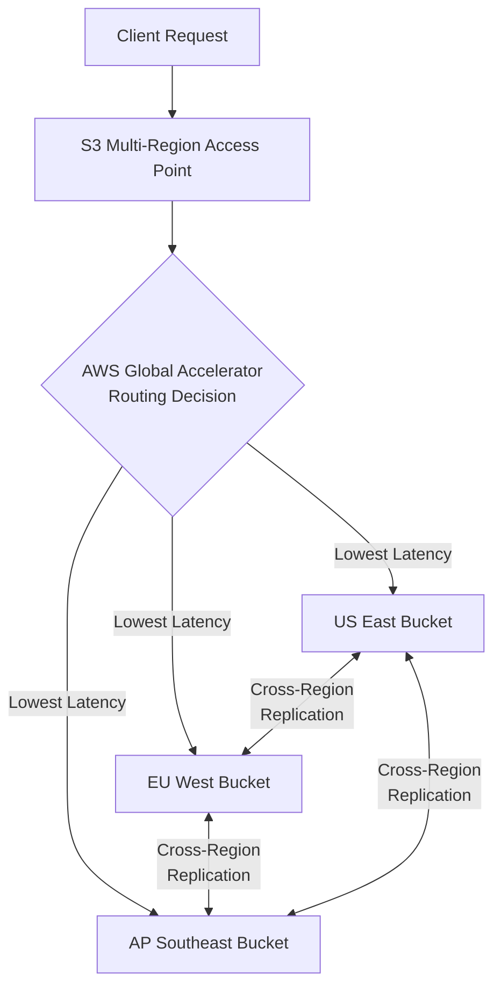

# How to Use S3 Multi-Region Access Points for Global Applications

Author: [nawazdhandala](https://github.com/nawazdhandala)

Tags: AWS, S3, Multi-Region, Global Infrastructure, Cloud Storage

Description: Learn how to configure and use S3 Multi-Region Access Points to route traffic to the closest S3 bucket for low-latency global applications.

---

If you're running a global application, you've probably noticed that serving objects from a single S3 bucket doesn't cut it when users are scattered across continents. Latency spikes, slow downloads, and inconsistent performance are the norm. That's where S3 Multi-Region Access Points come in - they let you create a single global endpoint that automatically routes requests to the nearest bucket replica.

## What Are S3 Multi-Region Access Points?

S3 Multi-Region Access Points (MRAPs) provide a unified global endpoint that spans multiple S3 buckets across different AWS regions. When a client makes a request, AWS's global networking infrastructure routes that request to the bucket with the lowest latency. Behind the scenes, S3 Cross-Region Replication keeps the data synchronized across all participating buckets.

Think of it like a DNS-based load balancer, but purpose-built for S3. You don't need to write any routing logic yourself. AWS handles all the intelligent routing automatically.

## Why You'd Want This

There are a few scenarios where MRAPs really shine:

- **Global media delivery**: Serving images, videos, or documents to users worldwide
- **Multi-region active-active architectures**: Applications deployed across multiple regions that need fast local access to the same data
- **Disaster recovery**: If one region goes down, traffic automatically routes to the next closest region
- **Compliance with data locality**: You can keep copies of data in specific regions while still having a global access layer

## Prerequisites

Before you start, make sure you have:

1. AWS CLI v2 installed and configured
2. S3 buckets in at least two regions
3. Appropriate IAM permissions for S3 and S3 Control operations

## Step 1: Create Buckets in Multiple Regions

First, create S3 buckets in the regions where your users are concentrated.

This creates two buckets - one in US East and one in EU West.

```bash
# Create a bucket in US East (N. Virginia)
aws s3api create-bucket \
  --bucket my-app-data-us-east-1 \
  --region us-east-1

# Create a bucket in EU West (Ireland)
aws s3api create-bucket \
  --bucket my-app-data-eu-west-1 \
  --region eu-west-1 \
  --create-bucket-configuration LocationConstraint=eu-west-1

# Create a bucket in AP Southeast (Singapore)
aws s3api create-bucket \
  --bucket my-app-data-ap-southeast-1 \
  --region ap-southeast-1 \
  --create-bucket-configuration LocationConstraint=ap-southeast-1
```

## Step 2: Enable Versioning on All Buckets

Cross-Region Replication requires versioning, so enable it on every bucket that will participate.

```bash
# Enable versioning on all three buckets
for BUCKET in my-app-data-us-east-1 my-app-data-eu-west-1 my-app-data-ap-southeast-1; do
  aws s3api put-bucket-versioning \
    --bucket $BUCKET \
    --versioning-configuration Status=Enabled
done
```

## Step 3: Create the Multi-Region Access Point

Now create the MRAP itself. You'll need your AWS account ID.

```bash
# Create the Multi-Region Access Point
aws s3control create-multi-region-access-point \
  --account-id 123456789012 \
  --details '{
    "Name": "my-global-access-point",
    "Regions": [
      {"Bucket": "my-app-data-us-east-1"},
      {"Bucket": "my-app-data-eu-west-1"},
      {"Bucket": "my-app-data-ap-southeast-1"}
    ]
  }'
```

This is an asynchronous operation. You can check the status with the describe command.

```bash
# Check the status of the MRAP creation
aws s3control describe-multi-region-access-point \
  --account-id 123456789012 \
  --name my-global-access-point
```

## Step 4: Set Up Cross-Region Replication

For the MRAP to work properly, data needs to be replicated across all regions. Create a replication configuration.

This IAM role allows S3 to replicate objects between your buckets.

```json
{
  "Role": "arn:aws:iam::123456789012:role/s3-replication-role",
  "Rules": [
    {
      "ID": "replicate-to-all-regions",
      "Status": "Enabled",
      "Filter": {
        "Prefix": ""
      },
      "Destination": {
        "Bucket": "arn:aws:s3:::my-app-data-eu-west-1",
        "StorageClass": "STANDARD"
      },
      "DeleteMarkerReplication": {
        "Status": "Enabled"
      }
    }
  ]
}
```

Apply the replication configuration.

```bash
# Apply replication from US East to EU West
aws s3api put-bucket-replication \
  --bucket my-app-data-us-east-1 \
  --replication-configuration file://replication-config.json
```

You'll want to set up bidirectional replication between all bucket pairs for a fully active-active setup.

## Step 5: Use the MRAP Endpoint

Once the MRAP is active, you get an endpoint that looks like this:

```
arn:aws:s3::123456789012:accesspoint/my-global-access-point.mrap
```

You can use this ARN directly in the AWS SDK. Here's a Python example that uploads and downloads through the MRAP.

```python
import boto3

s3_client = boto3.client('s3')

# The MRAP alias - found in the console or describe output
mrap_arn = "arn:aws:s3::123456789012:accesspoint/my-global-access-point.mrap"

# Upload an object through the MRAP
# AWS routes this to the closest bucket automatically
s3_client.put_object(
    Bucket=mrap_arn,
    Key="assets/logo.png",
    Body=open("logo.png", "rb")
)

# Download through the MRAP
# Again, routed to the nearest bucket
response = s3_client.get_object(
    Bucket=mrap_arn,
    Key="assets/logo.png"
)

data = response['Body'].read()
print(f"Downloaded {len(data)} bytes from nearest region")
```

## Step 6: Configure the Routing Policy

By default, MRAPs route to the lowest-latency bucket. But you can customize this behavior.

```bash
# Update routing to send 70% to US East, 30% to EU West
aws s3control submit-multi-region-access-point-routes \
  --account-id 123456789012 \
  --mrap "arn:aws:s3::123456789012:accesspoint/my-global-access-point.mrap" \
  --route-updates '[
    {
      "Bucket": "my-app-data-us-east-1",
      "Region": "us-east-1",
      "TrafficDialPercentage": 70
    },
    {
      "Bucket": "my-app-data-eu-west-1",
      "Region": "eu-west-1",
      "TrafficDialPercentage": 30
    }
  ]'
```

This is useful during migrations or when you need to gradually shift traffic.

## How the Routing Works

Here's a visual overview of how requests flow through a Multi-Region Access Point.



## Cost Considerations

MRAPs aren't free - here's what to expect:

- **Data routing costs**: There's a per-GB charge for data routed through the MRAP
- **Cross-Region Replication**: Standard replication costs apply (per-GB transferred + request charges)
- **Storage**: You're paying for storage in every region where data is replicated
- **Request pricing**: Standard S3 request pricing applies per region

For a production workload, make sure you model these costs. The latency improvement is significant, but so is the bill if you're replicating terabytes across five regions.

## Monitoring Your MRAP

Keep an eye on your MRAP's performance using CloudWatch. You can track metrics like request counts per region, latency distribution, and replication lag. If you're looking for a comprehensive monitoring solution that covers your entire AWS infrastructure, check out how [OneUptime can help with AWS monitoring](https://oneuptime.com/blog/post/aws-cloudwatch-monitoring/view).

## Common Pitfalls

1. **Forgetting versioning**: Cross-Region Replication won't work without it. Enable it before creating the MRAP.
2. **Eventual consistency**: Replication isn't instant. There's typically a few seconds of lag, sometimes more for large objects.
3. **Permission mismatches**: The replication role needs permission to read from source and write to destination buckets.
4. **Region availability**: Not all regions support MRAPs. Check the AWS documentation for current region availability.

## Wrapping Up

S3 Multi-Region Access Points are one of the cleanest solutions AWS offers for global data access. Instead of building complex routing logic in your application, you get a single endpoint that handles everything. Combined with Cross-Region Replication, your data stays synchronized, and your users get fast access no matter where they are.

The setup does take a bit of work upfront - creating buckets, configuring replication, setting up IAM roles - but once it's running, the operational overhead is minimal. Just keep an eye on your replication metrics and costs, and you'll have a solid global storage layer for your application.
