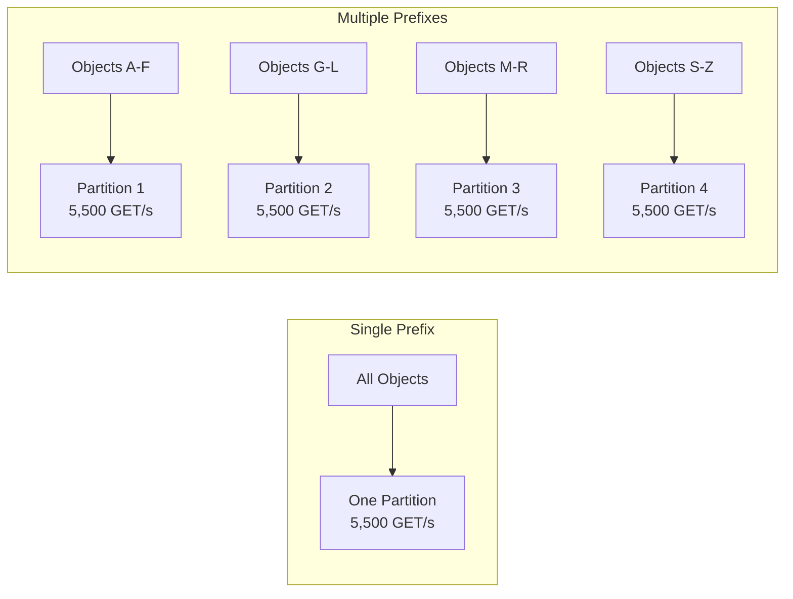

# How to Use S3 Prefixes and Partitioning for Better Performance

Author: [nawazdhandala](https://github.com/nawazdhandala)

Tags: AWS, S3, Performance, Partitioning, Data Architecture

Description: Learn how S3 prefixes affect performance and how to design your key naming strategy for maximum throughput and efficient data organization.

---

S3 doesn't have directories. It has keys. And the way you structure those keys directly impacts performance, cost, and how easy your data is to work with. Understanding prefixes and how S3 partitions data internally is critical for anyone building high-throughput applications or managing large datasets on S3.

## What's a Prefix?

In S3, a prefix is everything in the object key before the final object name. For the key `data/2026/02/12/sensor-readings.json`, the prefix is `data/2026/02/12/`. The forward slashes are just characters in the key - S3 doesn't have a real folder hierarchy. But the console shows them as folders, and more importantly, S3 uses prefixes for internal partitioning.

## How S3 Partitions Data

S3 automatically partitions your bucket based on key prefixes to spread load across multiple servers. Each partition can handle:

- **3,500 PUT/COPY/POST/DELETE requests per second**
- **5,500 GET/HEAD requests per second**

If all your objects share the same prefix, they're likely on the same partition, limiting you to those per-partition rates. Distribute across multiple prefixes, and you multiply those limits.

For example, with 10 distinct prefixes, you could theoretically handle 55,000 GET requests per second.

## Prefix Design Patterns

### Pattern 1: Date-Based Partitioning

The most common pattern. Great for time-series data, logs, and events.

```
logs/2026/02/12/00/access-001.log
logs/2026/02/12/00/access-002.log
logs/2026/02/12/01/access-001.log
...
```

This naturally spreads data across prefixes over time. Querying recent data is efficient because you can target specific date prefixes.

```python
import boto3
from datetime import datetime

s3 = boto3.client('s3')

def store_log_entry(bucket, log_data):
    """Store a log entry using date-based partitioning."""
    now = datetime.utcnow()
    key = f"logs/{now.strftime('%Y/%m/%d/%H')}/entry-{now.strftime('%M%S%f')}.json"

    s3.put_object(
        Bucket=bucket,
        Key=key,
        Body=log_data
    )
    return key

# Each hour gets its own prefix, spreading the load
key = store_log_entry('my-log-bucket', '{"level": "info", "message": "test"}')
print(f"Stored at: {key}")
```

### Pattern 2: Hash-Based Partitioning

When you need maximum throughput and don't care about browsing objects by name. Add a hash prefix to distribute objects evenly.

```python
import hashlib
import boto3

s3 = boto3.client('s3')

def store_with_hash_prefix(bucket, logical_key, data):
    """
    Add a hash prefix to distribute objects across S3 partitions.
    The hash ensures even distribution regardless of the logical key pattern.
    """
    # Create a short hash from the logical key
    hash_hex = hashlib.md5(logical_key.encode()).hexdigest()[:4]

    # Prepend the hash to the key
    physical_key = f"{hash_hex}/{logical_key}"

    s3.put_object(Bucket=bucket, Key=physical_key, Body=data)
    return physical_key

# These objects distribute across 65,536 possible prefix partitions
store_with_hash_prefix('my-bucket', 'users/12345/profile.json', b'...')
# Stored as: a1b2/users/12345/profile.json

store_with_hash_prefix('my-bucket', 'users/12346/profile.json', b'...')
# Stored as: c3d4/users/12346/profile.json
```

### Pattern 3: Category-Based Partitioning

Organize by data type or category. Good for applications with distinct data types that have different access patterns.

```
raw-data/sensor-a/2026-02-12/readings.parquet
raw-data/sensor-b/2026-02-12/readings.parquet
processed/sensor-a/2026-02-12/aggregated.parquet
processed/sensor-b/2026-02-12/aggregated.parquet
exports/daily/2026-02-12/full-export.csv
```

### Pattern 4: Hive-Style Partitioning for Analytics

If you're using Athena, Spark, or any Hive-compatible tool, this partitioning style is the standard. The tools automatically detect partition columns from the path.

```
events/year=2026/month=02/day=12/hour=14/data.parquet
events/year=2026/month=02/day=12/hour=15/data.parquet
events/year=2026/month=02/day=13/hour=00/data.parquet
```

This lets Athena prune partitions efficiently.

```sql
-- Athena only scans the relevant partition
SELECT * FROM events
WHERE year = '2026' AND month = '02' AND day = '12';
```

Setup the Athena table with partition projection for automatic partition discovery.

```sql
CREATE EXTERNAL TABLE events (
  event_id string,
  event_type string,
  user_id string,
  payload string
)
PARTITIONED BY (year string, month string, day string, hour string)
ROW FORMAT SERDE 'org.apache.hadoop.hive.ql.io.parquet.serde.ParquetHiveSerDe'
STORED AS PARQUET
LOCATION 's3://my-analytics-bucket/events/'
TBLPROPERTIES (
  'projection.enabled' = 'true',
  'projection.year.type' = 'integer',
  'projection.year.range' = '2024,2030',
  'projection.month.type' = 'integer',
  'projection.month.range' = '1,12',
  'projection.month.digits' = '2',
  'projection.day.type' = 'integer',
  'projection.day.range' = '1,31',
  'projection.day.digits' = '2',
  'projection.hour.type' = 'integer',
  'projection.hour.range' = '0,23',
  'projection.hour.digits' = '2',
  'storage.location.template' = 's3://my-analytics-bucket/events/year=${year}/month=${month}/day=${day}/hour=${hour}'
);
```

## Anti-Patterns to Avoid

### Sequential Numeric Prefixes

```
# BAD: All objects land on the same partition initially
data/0000001.json
data/0000002.json
data/0000003.json

# GOOD: Add randomness or use dates
data/a1b2/0000001.json
data/c3d4/0000002.json
```

### Single Flat Prefix

```
# BAD: Everything in one prefix
files/upload1.jpg
files/upload2.jpg
files/upload3.jpg
... millions more

# GOOD: Distribute with sub-prefixes
files/images/2026/02/upload1.jpg
files/documents/2026/02/doc1.pdf
```

### Timestamp-First Keys

```
# PROBLEMATIC: All recent writes hit the same prefix
2026-02-12T14:30:00-data.json
2026-02-12T14:30:01-data.json
2026-02-12T14:30:02-data.json

# BETTER: Reverse or hash the timestamp
data/21-20-41-21-20-6202.json  # reversed
# OR
data/a1b2/2026-02-12T14:30:00.json  # hash prefix
```

## Performance Comparison



With 4 well-distributed prefixes, you get 4x the throughput: 22,000 GET/s instead of 5,500.

## Choosing the Right Strategy

Here's a decision framework.

```python
"""
Prefix strategy decision guide:

1. Time-series data (logs, events, metrics)?
   -> Date-based: data/YYYY/MM/DD/HH/

2. High write throughput (>3500 writes/sec)?
   -> Hash prefix: XXXX/original-key

3. Analytics workload (Athena, Spark)?
   -> Hive-style: data/year=YYYY/month=MM/day=DD/

4. Mixed access patterns?
   -> Category + date: category/YYYY/MM/DD/

5. Need both high throughput AND browsability?
   -> Category + hash: category/XXXX/filename
"""
```

For high-throughput optimization techniques beyond prefix design, see our guide on [optimizing S3 performance for high-throughput workloads](https://oneuptime.com/blog/post/2026-02-12-optimize-s3-performance-high-throughput-workloads/view).

## Listing Objects by Prefix Efficiently

When you need to list objects under a specific prefix, S3's ListObjectsV2 is already optimized for prefix-based listing.

```python
import boto3

s3 = boto3.client('s3')

def list_by_prefix(bucket, prefix, max_keys=1000):
    """Efficiently list objects under a specific prefix."""
    paginator = s3.get_paginator('list_objects_v2')
    total_objects = 0
    total_size = 0

    for page in paginator.paginate(Bucket=bucket, Prefix=prefix):
        for obj in page.get('Contents', []):
            total_objects += 1
            total_size += obj['Size']

    print(f"Prefix: {prefix}")
    print(f"Objects: {total_objects}")
    print(f"Total size: {total_size / 1024 / 1024:.2f} MB")

# List objects for a specific date
list_by_prefix('my-log-bucket', 'logs/2026/02/12/')

# List objects for a specific hour
list_by_prefix('my-log-bucket', 'logs/2026/02/12/14/')
```

## Migrating to a Better Prefix Structure

If you need to reorganize existing objects, use S3 Batch Operations or a migration script.

```python
import boto3
import hashlib
from concurrent.futures import ThreadPoolExecutor

s3 = boto3.client('s3')
BUCKET = 'my-bucket'

def migrate_object(old_key):
    """Copy an object to a new key with hash prefix."""
    hash_prefix = hashlib.md5(old_key.encode()).hexdigest()[:4]
    new_key = f"{hash_prefix}/{old_key}"

    s3.copy_object(
        Bucket=BUCKET,
        Key=new_key,
        CopySource={'Bucket': BUCKET, 'Key': old_key}
    )

    # Optionally delete the old key after confirming copy
    s3.delete_object(Bucket=BUCKET, Key=old_key)
    return old_key, new_key

# Migrate objects in parallel
paginator = s3.get_paginator('list_objects_v2')
keys = []
for page in paginator.paginate(Bucket=BUCKET, Prefix='data/'):
    keys.extend([obj['Key'] for obj in page.get('Contents', [])])

with ThreadPoolExecutor(max_workers=20) as executor:
    results = list(executor.map(migrate_object, keys))

print(f"Migrated {len(results)} objects")
```

For millions of objects, use [S3 Batch Operations](https://oneuptime.com/blog/post/2026-02-12-s3-batch-operations-process-millions-objects/view) instead.

## Wrapping Up

Your S3 prefix structure determines both performance and usability. For most applications, date-based partitioning provides a good balance of throughput distribution and logical organization. If you need maximum throughput, add hash prefixes. If you're building an analytics platform, use Hive-style partitioning. The key takeaway is to think about your access patterns before you start writing data - changing the key structure after the fact requires migrating every object.
