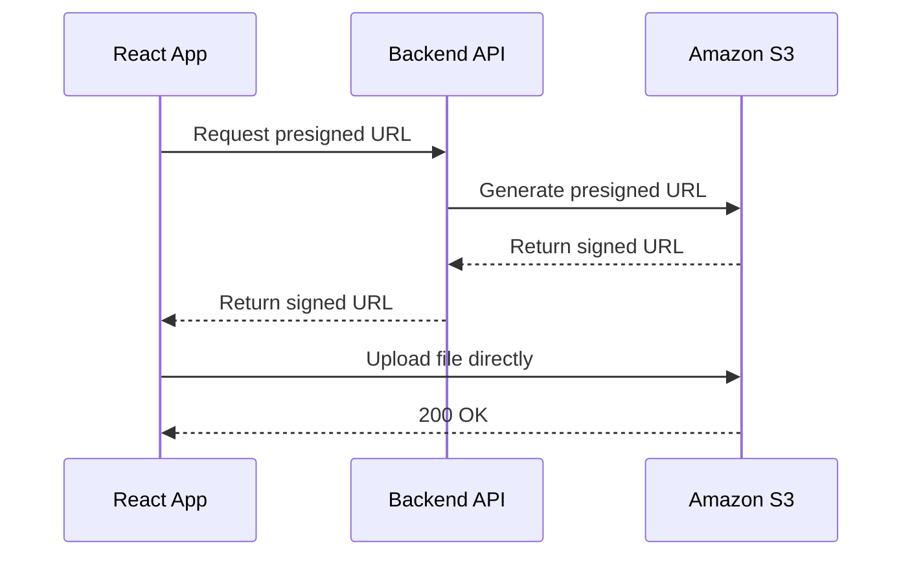

# How to Use S3 with Presigned URLs in a React Application

Author: [nawazdhandala](https://github.com/nawazdhandala)

Tags: AWS, S3, React, JavaScript

Description: Build a secure file upload and download system in React using S3 presigned URLs, with a backend API for URL generation and a frontend with drag-and-drop support.

---

Presigned URLs are the right way to handle file uploads in web applications. Instead of routing files through your server (which wastes bandwidth and memory), your React app gets a presigned URL from your backend and uploads directly to S3. Your server never touches the file bytes.

Here's the flow.



Let's build this end to end.

## Backend: Generating Presigned URLs

Your backend generates presigned URLs. This keeps your AWS credentials secure - they never go to the browser.

Here's an Express.js API endpoint that generates both upload and download URLs.

```javascript
// server.js - Express backend for presigned URL generation
import express from 'express';
import { S3Client, PutObjectCommand, GetObjectCommand } from '@aws-sdk/client-s3';
import { getSignedUrl } from '@aws-sdk/s3-request-presigner';
import { randomUUID } from 'crypto';
import cors from 'cors';

const app = express();
app.use(cors());
app.use(express.json());

const s3 = new S3Client({ region: 'us-east-1' });
const BUCKET = 'user-uploads-bucket';

// Generate a presigned upload URL
app.post('/api/upload-url', async (req, res) => {
  try {
    const { filename, contentType } = req.body;

    // Validate content type
    const allowedTypes = ['image/jpeg', 'image/png', 'image/webp', 'application/pdf'];
    if (!allowedTypes.includes(contentType)) {
      return res.status(400).json({ error: 'File type not allowed' });
    }

    // Generate a unique key to avoid overwrites
    const fileExtension = filename.split('.').pop();
    const key = `uploads/${randomUUID()}.${fileExtension}`;

    const command = new PutObjectCommand({
      Bucket: BUCKET,
      Key: key,
      ContentType: contentType,
    });

    // URL expires in 15 minutes
    const url = await getSignedUrl(s3, command, { expiresIn: 900 });

    res.json({ url, key });
  } catch (error) {
    console.error('Error generating upload URL:', error);
    res.status(500).json({ error: 'Failed to generate upload URL' });
  }
});

// Generate a presigned download URL
app.get('/api/download-url/:key', async (req, res) => {
  try {
    const key = decodeURIComponent(req.params.key);

    const command = new GetObjectCommand({
      Bucket: BUCKET,
      Key: key,
    });

    // URL expires in 1 hour
    const url = await getSignedUrl(s3, command, { expiresIn: 3600 });

    res.json({ url });
  } catch (error) {
    console.error('Error generating download URL:', error);
    res.status(500).json({ error: 'Failed to generate download URL' });
  }
});

app.listen(3001, () => console.log('Server running on port 3001'));
```

## S3 Bucket CORS Configuration

Your S3 bucket needs CORS configured to accept uploads from your React app's domain.

```bash
# Set CORS configuration on the bucket
aws s3api put-bucket-cors \
  --bucket user-uploads-bucket \
  --cors-configuration '{
    "CORSRules": [
      {
        "AllowedHeaders": ["*"],
        "AllowedMethods": ["PUT", "GET"],
        "AllowedOrigins": ["http://localhost:3000", "https://yourapp.com"],
        "ExposeHeaders": ["ETag"],
        "MaxAgeSeconds": 3600
      }
    ]
  }'
```

Without this, the browser will block the upload with a CORS error.

## React: File Upload Component

Now the React side. Here's a complete upload component with progress tracking.

```jsx
// FileUpload.jsx - Upload component with progress tracking
import { useState, useCallback } from 'react';

const API_BASE = 'http://localhost:3001/api';

function FileUpload({ onUploadComplete }) {
  const [uploading, setUploading] = useState(false);
  const [progress, setProgress] = useState(0);
  const [error, setError] = useState(null);

  const uploadFile = useCallback(async (file) => {
    setUploading(true);
    setProgress(0);
    setError(null);

    try {
      // Step 1: Get presigned URL from backend
      const response = await fetch(`${API_BASE}/upload-url`, {
        method: 'POST',
        headers: { 'Content-Type': 'application/json' },
        body: JSON.stringify({
          filename: file.name,
          contentType: file.type,
        }),
      });

      if (!response.ok) {
        const data = await response.json();
        throw new Error(data.error || 'Failed to get upload URL');
      }

      const { url, key } = await response.json();

      // Step 2: Upload directly to S3 using XMLHttpRequest for progress
      await new Promise((resolve, reject) => {
        const xhr = new XMLHttpRequest();

        xhr.upload.addEventListener('progress', (event) => {
          if (event.lengthComputable) {
            const pct = Math.round((event.loaded / event.total) * 100);
            setProgress(pct);
          }
        });

        xhr.addEventListener('load', () => {
          if (xhr.status === 200) {
            resolve();
          } else {
            reject(new Error(`Upload failed with status ${xhr.status}`));
          }
        });

        xhr.addEventListener('error', () => reject(new Error('Upload failed')));

        xhr.open('PUT', url);
        xhr.setRequestHeader('Content-Type', file.type);
        xhr.send(file);
      });

      // Step 3: Notify parent component
      onUploadComplete?.({ key, filename: file.name, size: file.size });
    } catch (err) {
      setError(err.message);
    } finally {
      setUploading(false);
    }
  }, [onUploadComplete]);

  const handleFileSelect = (event) => {
    const file = event.target.files[0];
    if (file) uploadFile(file);
  };

  return (
    <div className="file-upload">
      <input
        type="file"
        onChange={handleFileSelect}
        disabled={uploading}
        accept="image/*,.pdf"
      />

      {uploading && (
        <div className="progress-bar">
          <div
            className="progress-fill"
            style={{ width: `${progress}%` }}
          />
          <span>{progress}%</span>
        </div>
      )}

      {error && <p className="error">{error}</p>}
    </div>
  );
}

export default FileUpload;
```

## React: Drag and Drop Upload

A nicer experience with drag-and-drop support.

```jsx
// DragDropUpload.jsx - Drag and drop file upload
import { useState, useCallback } from 'react';

function DragDropUpload({ onUploadComplete }) {
  const [isDragging, setIsDragging] = useState(false);
  const [files, setFiles] = useState([]);

  const handleDragOver = useCallback((e) => {
    e.preventDefault();
    setIsDragging(true);
  }, []);

  const handleDragLeave = useCallback((e) => {
    e.preventDefault();
    setIsDragging(false);
  }, []);

  const uploadSingleFile = async (file) => {
    // Get presigned URL
    const res = await fetch('http://localhost:3001/api/upload-url', {
      method: 'POST',
      headers: { 'Content-Type': 'application/json' },
      body: JSON.stringify({
        filename: file.name,
        contentType: file.type,
      }),
    });

    const { url, key } = await res.json();

    // Upload to S3
    await fetch(url, {
      method: 'PUT',
      headers: { 'Content-Type': file.type },
      body: file,
    });

    return { key, filename: file.name, size: file.size };
  };

  const handleDrop = useCallback(async (e) => {
    e.preventDefault();
    setIsDragging(false);

    const droppedFiles = Array.from(e.dataTransfer.files);

    // Upload all files in parallel
    const uploadPromises = droppedFiles.map(async (file) => {
      try {
        const result = await uploadSingleFile(file);
        return { ...result, status: 'success' };
      } catch (err) {
        return { filename: file.name, status: 'error', error: err.message };
      }
    });

    const results = await Promise.all(uploadPromises);
    setFiles(results);
    onUploadComplete?.(results.filter((r) => r.status === 'success'));
  }, [onUploadComplete]);

  return (
    <div
      className={`drop-zone ${isDragging ? 'dragging' : ''}`}
      onDragOver={handleDragOver}
      onDragLeave={handleDragLeave}
      onDrop={handleDrop}
    >
      <p>Drop files here to upload</p>

      {files.length > 0 && (
        <ul>
          {files.map((file, i) => (
            <li key={i}>
              {file.filename} - {file.status}
            </li>
          ))}
        </ul>
      )}
    </div>
  );
}

export default DragDropUpload;
```

## Download Component

A component that fetches a presigned download URL and triggers a download.

```jsx
// FileDownload.jsx - Download files using presigned URLs
function FileDownload({ fileKey, filename }) {
  const [downloading, setDownloading] = useState(false);

  const handleDownload = async () => {
    setDownloading(true);

    try {
      // Get presigned download URL from backend
      const res = await fetch(
        `http://localhost:3001/api/download-url/${encodeURIComponent(fileKey)}`
      );
      const { url } = await res.json();

      // Trigger browser download
      const link = document.createElement('a');
      link.href = url;
      link.download = filename;
      document.body.appendChild(link);
      link.click();
      document.body.removeChild(link);
    } catch (err) {
      console.error('Download failed:', err);
    } finally {
      setDownloading(false);
    }
  };

  return (
    <button onClick={handleDownload} disabled={downloading}>
      {downloading ? 'Downloading...' : `Download ${filename}`}
    </button>
  );
}
```

## Security Considerations

A few things to keep in mind.

**Validate file types on the backend.** Don't trust the content type from the client. Validate it before generating the presigned URL.

**Set upload size limits.** Use S3 conditions in the presigned URL to enforce maximum file size.

```javascript
// Add content length condition to presigned URL
const command = new PutObjectCommand({
  Bucket: BUCKET,
  Key: key,
  ContentType: contentType,
  // This header restricts the maximum upload size
  ContentLength: maxSize,
});
```

**Use short expiration times.** Upload URLs should expire in 5-15 minutes. Download URLs can be longer, but keep them under an hour for sensitive content.

**Scan uploaded files.** Consider running a virus scan on uploaded files using a Lambda function triggered by S3 events.

For monitoring your upload pipeline - tracking success rates, upload latency, and error rates - integrate with [OneUptime](https://oneuptime.com) to get visibility into the end-to-end flow.

For the backend streaming patterns that complement this frontend approach, see our guide on [streaming large files from S3 in Node.js](https://oneuptime.com/blog/post/stream-large-files-s3-nodejs/view).
