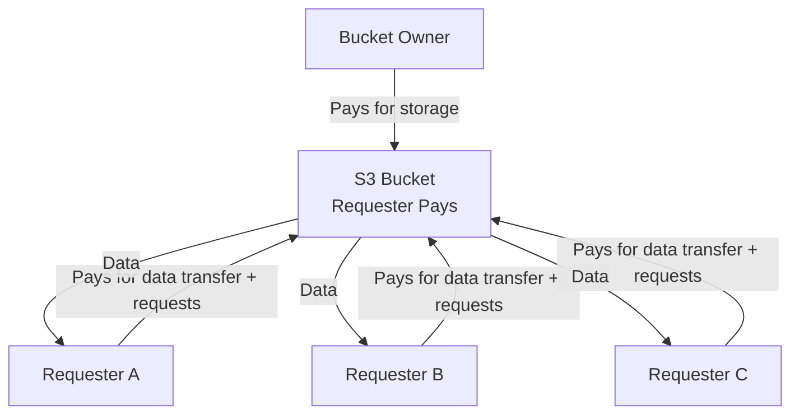

# How to Set Up S3 Requester Pays Buckets

Author: [nawazdhandala](https://github.com/nawazdhandala)

Tags: AWS, S3, Requester Pays, Cost Management, Data Sharing

Description: Learn how to configure S3 Requester Pays buckets to share data without bearing the data transfer costs, including setup, access patterns, and billing considerations.

---

When you share large datasets on S3, the data transfer costs can get expensive fast. If you host a public dataset that gets 10TB of downloads per month, you're looking at roughly $900 in transfer charges. S3 Requester Pays flips this - the person downloading the data pays for the transfer and request costs instead of the bucket owner. You still pay for storage, but everyone who accesses the data pays their own way.

## How Requester Pays Works

With Requester Pays enabled:

- **Bucket owner pays**: Storage costs only
- **Requester pays**: Data transfer out, request costs (GET, PUT, LIST, etc.)
- **Anonymous access**: Disabled entirely. Every request must be authenticated.
- **Requester identification**: Each request must include the `x-amz-request-payer` header

This is commonly used for:
- Scientific datasets (genomics, climate data, satellite imagery)
- Public data repositories
- Cross-account data sharing within an organization
- SaaS platforms where customers access their own data

## Step 1: Enable Requester Pays

Enabling Requester Pays on a bucket is a single API call.

```bash
# Enable Requester Pays
aws s3api put-bucket-request-payment \
  --bucket my-shared-dataset \
  --request-payment-configuration '{"Payer": "Requester"}'
```

Verify the configuration.

```bash
# Check current payment configuration
aws s3api get-bucket-request-payment \
  --bucket my-shared-dataset
```

## Step 2: Accessing Requester Pays Buckets

When a requester accesses a Requester Pays bucket, they must include the `--request-payer requester` flag.

Using the CLI:

```bash
# Download from a Requester Pays bucket
aws s3 cp s3://my-shared-dataset/data/sample.parquet ./sample.parquet \
  --request-payer requester

# List objects in a Requester Pays bucket
aws s3 ls s3://my-shared-dataset/data/ --request-payer requester

# Sync a directory from a Requester Pays bucket
aws s3 sync s3://my-shared-dataset/data/ ./local-data/ \
  --request-payer requester
```

Using Python:

```python
import boto3

s3 = boto3.client('s3')

# Download from a Requester Pays bucket
response = s3.get_object(
    Bucket='my-shared-dataset',
    Key='data/sample.parquet',
    RequestPayer='requester'
)

data = response['Body'].read()
print(f"Downloaded {len(data)} bytes")

# List objects with Requester Pays
response = s3.list_objects_v2(
    Bucket='my-shared-dataset',
    Prefix='data/',
    RequestPayer='requester'
)

for obj in response.get('Contents', []):
    print(f"{obj['Key']}: {obj['Size']} bytes")
```

Using JavaScript:

```javascript
const { S3Client, GetObjectCommand } = require('@aws-sdk/client-s3');

const s3 = new S3Client({ region: 'us-east-1' });

async function downloadFromRequesterPays(bucket, key) {
    const command = new GetObjectCommand({
        Bucket: bucket,
        Key: key,
        RequestPayer: 'requester',
    });

    const response = await s3.send(command);
    const data = await response.Body.transformToByteArray();
    console.log(`Downloaded ${data.length} bytes`);
    return data;
}

downloadFromRequesterPays('my-shared-dataset', 'data/sample.parquet');
```

## Step 3: Set Up Access Policies

Even with Requester Pays, you need a bucket policy to control who can access the data. Here's a policy that allows any authenticated AWS user to read data.

```json
{
  "Version": "2012-10-17",
  "Statement": [
    {
      "Sid": "AllowAuthenticatedRead",
      "Effect": "Allow",
      "Principal": {
        "AWS": "*"
      },
      "Action": [
        "s3:GetObject",
        "s3:ListBucket"
      ],
      "Resource": [
        "arn:aws:s3:::my-shared-dataset",
        "arn:aws:s3:::my-shared-dataset/*"
      ],
      "Condition": {
        "StringEquals": {
          "s3:authType": "REST-HEADER"
        }
      }
    }
  ]
}
```

For more restrictive access (specific accounts only):

```json
{
  "Version": "2012-10-17",
  "Statement": [
    {
      "Sid": "AllowSpecificAccountsRead",
      "Effect": "Allow",
      "Principal": {
        "AWS": [
          "arn:aws:iam::111111111111:root",
          "arn:aws:iam::222222222222:root",
          "arn:aws:iam::333333333333:root"
        ]
      },
      "Action": [
        "s3:GetObject",
        "s3:ListBucket"
      ],
      "Resource": [
        "arn:aws:s3:::my-shared-dataset",
        "arn:aws:s3:::my-shared-dataset/*"
      ]
    }
  ]
}
```

## Billing Flow



## Cross-Account Requester Pays Access

When accessing from a different AWS account, the requester's account is billed. Make sure the requester's IAM policy allows S3 access.

IAM policy for the requester's role:

```json
{
  "Version": "2012-10-17",
  "Statement": [
    {
      "Sid": "AllowRequesterPaysAccess",
      "Effect": "Allow",
      "Action": [
        "s3:GetObject",
        "s3:ListBucket"
      ],
      "Resource": [
        "arn:aws:s3:::my-shared-dataset",
        "arn:aws:s3:::my-shared-dataset/*"
      ]
    }
  ]
}
```

## Monitoring Requester Pays Usage

Track who's accessing your data and how much they're downloading using S3 access logs.

```bash
# Enable access logging to track requester activity
aws s3api put-bucket-logging \
  --bucket my-shared-dataset \
  --bucket-logging-status '{
    "LoggingEnabled": {
      "TargetBucket": "my-access-logs",
      "TargetPrefix": "requester-pays-logs/"
    }
  }'
```

Then analyze the logs to see which accounts are accessing your data. See our guide on [analyzing S3 access logs with Athena](https://oneuptime.com/blog/post/analyze-s3-access-logs-athena/view) for setting up log analysis.

## Practical Example: Sharing a Machine Learning Dataset

Here's a complete setup for sharing a large ML dataset using Requester Pays.

```python
import boto3
import json

def setup_shared_dataset(bucket_name, region='us-east-1'):
    """
    Set up an S3 bucket for sharing large datasets
    with Requester Pays billing.
    """
    s3 = boto3.client('s3', region_name=region)

    # Create the bucket
    if region == 'us-east-1':
        s3.create_bucket(Bucket=bucket_name)
    else:
        s3.create_bucket(
            Bucket=bucket_name,
            CreateBucketConfiguration={'LocationConstraint': region}
        )

    # Enable Requester Pays
    s3.put_bucket_request_payment(
        Bucket=bucket_name,
        RequestPaymentConfiguration={'Payer': 'Requester'}
    )

    # Set bucket policy for authenticated read access
    policy = {
        'Version': '2012-10-17',
        'Statement': [{
            'Sid': 'RequesterPaysRead',
            'Effect': 'Allow',
            'Principal': {'AWS': '*'},
            'Action': ['s3:GetObject', 's3:ListBucket'],
            'Resource': [
                f'arn:aws:s3:::{bucket_name}',
                f'arn:aws:s3:::{bucket_name}/*'
            ]
        }]
    }
    s3.put_bucket_policy(
        Bucket=bucket_name,
        Policy=json.dumps(policy)
    )

    # Enable access logging
    s3.put_bucket_logging(
        Bucket=bucket_name,
        BucketLoggingStatus={
            'LoggingEnabled': {
                'TargetBucket': 'my-access-logs',
                'TargetPrefix': f'requester-pays/{bucket_name}/'
            }
        }
    )

    # Upload a README describing the dataset
    readme = """
    Dataset: ImageNet-Lite Sample
    Format: Parquet files, partitioned by category
    Total Size: ~500GB
    Access: Requester Pays (you pay for downloads)

    Usage:
      aws s3 cp s3://BUCKET/data/ ./data/ --recursive --request-payer requester
    """

    s3.put_object(
        Bucket=bucket_name,
        Key='README.txt',
        Body=readme.replace('BUCKET', bucket_name).encode()
    )

    print(f"Requester Pays bucket ready: {bucket_name}")
    print(f"Share this URL: s3://{bucket_name}/")

setup_shared_dataset('my-ml-dataset')
```

## Limitations and Gotchas

1. **No anonymous access**: Every request must be authenticated. You can't use Requester Pays for truly public, no-account-needed access.

2. **Pre-signed URLs**: When using presigned URLs with Requester Pays buckets, the person who generated the URL is billed, not the person using the URL. This can lead to unexpected charges.

3. **S3 website hosting**: Doesn't work with Requester Pays. Website endpoint requests don't include the request-payer header.

4. **CORS requests from browsers**: The browser needs to include the `x-amz-request-payer` header, which requires CORS to be configured properly.

5. **BitTorrent**: Not supported with Requester Pays.

## Cost Savings Example

Hosting a 1TB public dataset with 50TB of monthly downloads:

**Without Requester Pays:**
- Storage: 1TB x $0.023 = $23/month
- Transfer: 50TB x $0.09 = $4,500/month
- Total: $4,523/month

**With Requester Pays:**
- Storage: 1TB x $0.023 = $23/month
- Transfer: $0 (requesters pay)
- Total: $23/month

That's a 99.5% cost reduction. For organizations sharing large datasets, Requester Pays can be the difference between making data available and not being able to afford it.

## Wrapping Up

Requester Pays is a simple but powerful feature for data sharing. It removes the financial barrier to hosting large datasets by shifting transfer costs to the consumers. The setup is straightforward - enable it on the bucket, set up appropriate access policies, and make sure requesters include the right header. The main limitation is that anonymous access is not supported, so every consumer needs an AWS account. For scientific data, inter-company data sharing, or any scenario where you want to share large datasets without subsidizing everyone's downloads, it's the right tool.
