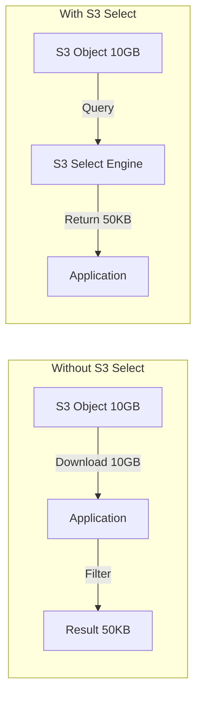

# How to Use S3 Select with CSV and JSON Data

Author: [nawazdhandala](https://github.com/nawazdhandala)

Tags: AWS, S3, SQL, Data Processing

Description: Guide to using S3 Select to query CSV, JSON, and Parquet data directly in S3 using SQL expressions, reducing data transfer and processing time significantly.

---

S3 Select lets you run SQL queries directly against objects stored in S3. Instead of downloading a 10 GB CSV file to find 50 rows, S3 Select reads the file server-side and returns only the matching data. This can reduce data transfer by up to 400x and speed up queries dramatically.

It's not a replacement for Athena or Redshift - those are for complex analytics. S3 Select is for simple, fast filtering on individual objects.

## How It Works

Without S3 Select, your application downloads the entire object, then filters it locally. With S3 Select, S3 does the filtering and only sends the matching rows.



## Querying CSV Files

Let's start with a CSV file stored in S3. Assume we have a file `sales/2025-data.csv` with millions of rows.

```csv
date,region,product,quantity,revenue
2025-01-15,us-east,widget-a,150,4500.00
2025-01-15,eu-west,widget-b,230,6900.00
2025-01-16,us-east,widget-a,175,5250.00
...
```

Query it with the AWS CLI.

```bash
# Query CSV data - find all sales in us-east with revenue over 5000
aws s3api select-object-content \
  --bucket analytics-bucket \
  --key sales/2025-data.csv \
  --expression "SELECT * FROM s3object s WHERE s.region = 'us-east' AND CAST(s.revenue AS FLOAT) > 5000" \
  --expression-type SQL \
  --input-serialization '{"CSV": {"FileHeaderInfo": "USE", "Comments": "#", "QuoteEscapeCharacter": "\\"}, "CompressionType": "NONE"}' \
  --output-serialization '{"CSV": {}}' \
  output.csv
```

The `FileHeaderInfo` option tells S3 how to handle the first row:
- `USE` - First row is headers, use them as column names
- `IGNORE` - First row is headers but don't use them (refer to columns as _1, _2, etc.)
- `NONE` - No header row

## Querying JSON Files

S3 Select also works with JSON. It supports both JSON documents and JSON lines (one JSON object per line).

For a JSON file like this.

```json
{
  "events": [
    {"timestamp": "2025-01-15T10:30:00Z", "type": "login", "user": "alice", "success": true},
    {"timestamp": "2025-01-15T10:31:00Z", "type": "login", "user": "bob", "success": false},
    {"timestamp": "2025-01-15T10:32:00Z", "type": "purchase", "user": "alice", "amount": 49.99}
  ]
}
```

Query it.

```bash
# Query JSON data - find failed login events
aws s3api select-object-content \
  --bucket analytics-bucket \
  --key events/2025-01-15.json \
  --expression "SELECT s.timestamp, s.user FROM s3object[*].events[*] s WHERE s.type = 'login' AND s.success = false" \
  --expression-type SQL \
  --input-serialization '{"JSON": {"Type": "DOCUMENT"}}' \
  --output-serialization '{"JSON": {}}' \
  output.json
```

For JSON Lines format (one JSON object per line), use `"Type": "LINES"`.

```bash
# Query JSON Lines data
aws s3api select-object-content \
  --bucket analytics-bucket \
  --key logs/2025-01-15.jsonl \
  --expression "SELECT s.level, s.message FROM s3object s WHERE s.level = 'ERROR'" \
  --expression-type SQL \
  --input-serialization '{"JSON": {"Type": "LINES"}}' \
  --output-serialization '{"JSON": {}}' \
  errors.json
```

## Using S3 Select with Python (Boto3)

The programmatic interface gives you more control and lets you process results as streams.

```python
import boto3
import json

s3 = boto3.client('s3')


def query_csv(bucket, key, sql_expression):
    """
    Run an S3 Select query against a CSV file
    and return the results as a list of strings.
    """
    response = s3.select_object_content(
        Bucket=bucket,
        Key=key,
        ExpressionType='SQL',
        Expression=sql_expression,
        InputSerialization={
            'CSV': {
                'FileHeaderInfo': 'USE',
                'RecordDelimiter': '\n',
                'FieldDelimiter': ','
            },
            'CompressionType': 'NONE'
        },
        OutputSerialization={
            'CSV': {}
        }
    )

    # Process the streaming response
    results = []
    for event in response['Payload']:
        if 'Records' in event:
            results.append(event['Records']['Payload'].decode('utf-8'))
        elif 'Stats' in event:
            stats = event['Stats']['Details']
            print(f"Scanned: {stats['BytesScanned']} bytes")
            print(f"Processed: {stats['BytesProcessed']} bytes")
            print(f"Returned: {stats['BytesReturned']} bytes")

    return ''.join(results)


# Find high-revenue sales in the US
result = query_csv(
    'analytics-bucket',
    'sales/2025-data.csv',
    "SELECT date, product, revenue FROM s3object s WHERE s.region = 'us-east' AND CAST(s.revenue AS FLOAT) > 10000 ORDER BY s.revenue DESC"
)

print(result)
```

Query JSON files with Boto3.

```python
def query_json(bucket, key, sql_expression, json_type='DOCUMENT'):
    """
    Run an S3 Select query against a JSON file.
    json_type: 'DOCUMENT' for a single JSON doc, 'LINES' for JSON Lines.
    """
    response = s3.select_object_content(
        Bucket=bucket,
        Key=key,
        ExpressionType='SQL',
        Expression=sql_expression,
        InputSerialization={
            'JSON': {'Type': json_type},
            'CompressionType': 'NONE'
        },
        OutputSerialization={
            'JSON': {'RecordDelimiter': '\n'}
        }
    )

    results = []
    for event in response['Payload']:
        if 'Records' in event:
            payload = event['Records']['Payload'].decode('utf-8')
            for line in payload.strip().split('\n'):
                if line:
                    results.append(json.loads(line))

    return results


# Query failed events from JSON Lines log file
errors = query_json(
    'analytics-bucket',
    'logs/app.jsonl',
    "SELECT s.timestamp, s.message FROM s3object s WHERE s.level = 'ERROR'",
    json_type='LINES'
)

for error in errors:
    print(f"[{error['timestamp']}] {error['message']}")
```

## Querying Compressed Files

S3 Select can query gzipped and bzip2 compressed files directly. You don't need to decompress first.

```python
# Query a gzipped CSV
result = s3.select_object_content(
    Bucket='analytics-bucket',
    Key='sales/2025-data.csv.gz',
    ExpressionType='SQL',
    Expression="SELECT * FROM s3object s WHERE s.region = 'us-east'",
    InputSerialization={
        'CSV': {'FileHeaderInfo': 'USE'},
        'CompressionType': 'GZIP'  # or 'BZIP2'
    },
    OutputSerialization={
        'CSV': {}
    }
)
```

## SQL Syntax Reference

S3 Select supports a subset of SQL. Here are the most useful expressions.

Aggregation functions.

```sql
-- Count, sum, average
SELECT COUNT(*) as total, SUM(CAST(s.revenue AS FLOAT)) as total_revenue
FROM s3object s
WHERE s.region = 'us-east'
```

String functions.

```sql
-- String matching
SELECT * FROM s3object s
WHERE s.product LIKE 'widget%'
AND LOWER(s.region) = 'us-east'
AND CHAR_LENGTH(s.product) > 5
```

Date functions (limited).

```sql
-- Extract date parts
SELECT s.timestamp, s.event_type
FROM s3object s
WHERE EXTRACT(YEAR FROM CAST(s.timestamp AS TIMESTAMP)) = 2025
```

CAST operations.

```sql
-- Type casting
SELECT s.product, CAST(s.quantity AS INT) * CAST(s.price AS FLOAT) as total
FROM s3object s
WHERE CAST(s.quantity AS INT) > 100
```

## Limitations

S3 Select has some important constraints.

- **Single object queries only** - You can't join or query across multiple objects. Use Athena for that.
- **No UPDATE or DELETE** - It's read-only.
- **Limited SQL** - No JOINs, subqueries, GROUP BY, or window functions.
- **Max result size** - Results are limited based on your S3 Select output.
- **Supported formats** - CSV, JSON, and Parquet only.
- **Max object size** - Works best with objects under a few GB.

## When to Use S3 Select vs Alternatives

| Use Case | Best Tool |
|---|---|
| Simple filter on one file | S3 Select |
| Query across many files | Athena |
| Complex analytics | Redshift/Athena |
| Real-time aggregation | Kinesis + Lambda |
| ETL pipeline | AWS Glue |

For ETL pipelines that process S3 data at scale, check out our guide on [integrating S3 with AWS Glue](https://oneuptime.com/blog/post/integrate-s3-aws-glue-etl/view).

## Cost Savings

S3 Select charges based on data scanned and data returned. Since you're scanning the same amount of data regardless, the real savings come from:

1. **Reduced data transfer** - Pay for less egress
2. **Reduced compute** - Your application processes less data
3. **Reduced latency** - Results arrive faster

For a 10 GB CSV where you need 1% of the rows, you'd transfer ~100 MB instead of 10 GB. That's a significant reduction in both time and cost.

Monitor your S3 Select usage and costs with [OneUptime](https://oneuptime.com) to ensure you're getting the expected savings from your queries.
