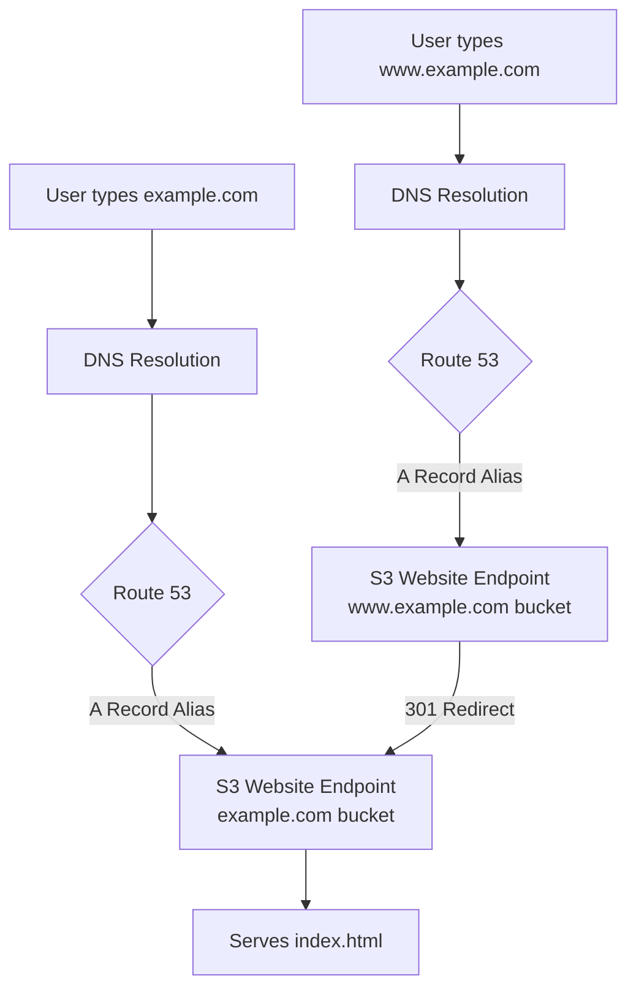

# How to Set Up S3 Static Website Hosting with a Custom Domain

Author: [nawazdhandala](https://github.com/nawazdhandala)

Tags: AWS, S3, Route 53, Static Website, DNS

Description: Learn how to connect a custom domain to your S3-hosted static website using Route 53 or any DNS provider, including www redirects.

---

Having your static site on `my-bucket.s3-website-us-east-1.amazonaws.com` works for testing, but you obviously want `yourcompany.com` for production. Setting this up with S3 requires a specific naming convention for your bucket and the right DNS configuration. Let's walk through the entire process.

## Prerequisites

Before you start, you'll need:

1. A registered domain name
2. Access to your DNS provider (Route 53 or external)
3. An S3 bucket configured for static website hosting (see our guide on [hosting a static website on S3](https://oneuptime.com/blog/post/host-static-website-s3/view))

## The Bucket Naming Rule

Here's the critical requirement: **your bucket name must exactly match your domain name**. If your domain is `example.com`, the bucket must be named `example.com`. For `www.example.com`, the bucket must be `www.example.com`.

Most setups need two buckets:
- `example.com` - the main site
- `www.example.com` - redirects to the main site (or vice versa)

## Step 1: Create the Main Bucket

Create a bucket that matches your domain name and configure it for website hosting.

```bash
# Create the main site bucket
aws s3api create-bucket \
  --bucket example.com \
  --region us-east-1

# Enable static website hosting
aws s3api put-bucket-website \
  --bucket example.com \
  --website-configuration '{
    "IndexDocument": {"Suffix": "index.html"},
    "ErrorDocument": {"Key": "error.html"}
  }'

# Remove public access block
aws s3api put-public-access-block \
  --bucket example.com \
  --public-access-block-configuration '{
    "BlockPublicAcls": false,
    "IgnorePublicAcls": false,
    "BlockPublicPolicy": false,
    "RestrictPublicBuckets": false
  }'
```

Add the public read policy.

```bash
# Allow public read access
aws s3api put-bucket-policy \
  --bucket example.com \
  --policy '{
    "Version": "2012-10-17",
    "Statement": [{
      "Sid": "PublicRead",
      "Effect": "Allow",
      "Principal": "*",
      "Action": "s3:GetObject",
      "Resource": "arn:aws:s3:::example.com/*"
    }]
  }'
```

## Step 2: Create the Redirect Bucket

Create a second bucket for the www subdomain that redirects all traffic to the main domain.

```bash
# Create the redirect bucket
aws s3api create-bucket \
  --bucket www.example.com \
  --region us-east-1

# Configure it to redirect all requests
aws s3api put-bucket-website \
  --bucket www.example.com \
  --website-configuration '{
    "RedirectAllRequestsTo": {
      "HostName": "example.com",
      "Protocol": "http"
    }
  }'
```

No public access policy is needed on the redirect bucket - it just sends redirects.

## Step 3: Upload Your Website

Upload your site content to the main bucket.

```bash
# Upload website files
aws s3 sync ./website/ s3://example.com/ --delete

# Verify
aws s3 ls s3://example.com/
```

## Step 4: Configure DNS with Route 53

If you're using Route 53, you can create alias records that point directly to S3 website endpoints. Alias records are free (no DNS query charges) and support zone apex (naked domain) records.

```bash
# Get your hosted zone ID
aws route53 list-hosted-zones-by-name --dns-name example.com

# Create an alias record for the main domain
aws route53 change-resource-record-sets \
  --hosted-zone-id Z1234567890ABC \
  --change-batch '{
    "Changes": [
      {
        "Action": "UPSERT",
        "ResourceRecordSet": {
          "Name": "example.com",
          "Type": "A",
          "AliasTarget": {
            "HostedZoneId": "Z3AQBSTGFYJSTF",
            "DNSName": "s3-website-us-east-1.amazonaws.com",
            "EvaluateTargetHealth": false
          }
        }
      }
    ]
  }'
```

The `HostedZoneId` for the S3 website endpoint is region-specific. Here are the common ones:

| Region | S3 Website Endpoint Hosted Zone ID |
|--------|-------------------------------------|
| us-east-1 | Z3AQBSTGFYJSTF |
| us-west-2 | Z3BJ6K6RIION7M |
| eu-west-1 | Z1BKCTXD74EZPE |
| ap-southeast-1 | Z3O0J2DXBE1FTB |

Now add the www record.

```bash
# Create alias record for www subdomain
aws route53 change-resource-record-sets \
  --hosted-zone-id Z1234567890ABC \
  --change-batch '{
    "Changes": [
      {
        "Action": "UPSERT",
        "ResourceRecordSet": {
          "Name": "www.example.com",
          "Type": "A",
          "AliasTarget": {
            "HostedZoneId": "Z3AQBSTGFYJSTF",
            "DNSName": "s3-website-us-east-1.amazonaws.com",
            "EvaluateTargetHealth": false
          }
        }
      }
    ]
  }'
```

## Step 4b: Configure DNS with an External Provider

If you're not using Route 53, you'll need CNAME records. Note that CNAMEs can't be used for the zone apex (naked domain) - that's a DNS limitation, not an AWS one. Some providers offer ALIAS or ANAME records that work around this.

For most external DNS providers, add these records:

```
www.example.com    CNAME    www.example.com.s3-website-us-east-1.amazonaws.com
```

For the naked domain, you either need:
- A DNS provider that supports ALIAS/ANAME records
- A redirect service that forwards `example.com` to `www.example.com`
- Or migrate your DNS to Route 53

## DNS Flow



## Step 5: Test Everything

After DNS propagation (can take up to 48 hours, usually much faster), test your setup.

```bash
# Test the main domain
curl -I http://example.com

# Test the www redirect
curl -I http://www.example.com
# Should show a 301 redirect to http://example.com

# Test a specific page
curl -I http://example.com/about.html

# Test the 404 page
curl -I http://example.com/nonexistent-page
```

## Automation Script

Here's a Python script that sets up the complete custom domain configuration.

```python
import boto3
import json
import time

def setup_custom_domain(domain, region='us-east-1'):
    """
    Set up S3 static website hosting with a custom domain.
    Creates both the main and www redirect buckets.
    """
    s3 = boto3.client('s3', region_name=region)
    www_domain = f'www.{domain}'

    print(f"Setting up {domain} and {www_domain}...")

    # Create main bucket
    if region == 'us-east-1':
        s3.create_bucket(Bucket=domain)
    else:
        s3.create_bucket(
            Bucket=domain,
            CreateBucketConfiguration={'LocationConstraint': region}
        )

    # Configure website hosting on main bucket
    s3.put_bucket_website(
        Bucket=domain,
        WebsiteConfiguration={
            'IndexDocument': {'Suffix': 'index.html'},
            'ErrorDocument': {'Key': 'error.html'}
        }
    )

    # Disable public access block
    s3.put_public_access_block(
        Bucket=domain,
        PublicAccessBlockConfiguration={
            'BlockPublicAcls': False,
            'IgnorePublicAcls': False,
            'BlockPublicPolicy': False,
            'RestrictPublicBuckets': False
        }
    )

    # Wait a moment for the block to propagate
    time.sleep(2)

    # Add public read policy
    policy = {
        'Version': '2012-10-17',
        'Statement': [{
            'Sid': 'PublicRead',
            'Effect': 'Allow',
            'Principal': '*',
            'Action': 's3:GetObject',
            'Resource': f'arn:aws:s3:::{domain}/*'
        }]
    }
    s3.put_bucket_policy(Bucket=domain, Policy=json.dumps(policy))

    # Create www redirect bucket
    if region == 'us-east-1':
        s3.create_bucket(Bucket=www_domain)
    else:
        s3.create_bucket(
            Bucket=www_domain,
            CreateBucketConfiguration={'LocationConstraint': region}
        )

    # Configure www bucket to redirect to main domain
    s3.put_bucket_website(
        Bucket=www_domain,
        WebsiteConfiguration={
            'RedirectAllRequestsTo': {
                'HostName': domain,
                'Protocol': 'http'
            }
        }
    )

    endpoint = f'http://{domain}.s3-website-{region}.amazonaws.com'
    print(f"\nSetup complete!")
    print(f"S3 endpoint: {endpoint}")
    print(f"\nNext steps:")
    print(f"1. Upload your site: aws s3 sync ./site/ s3://{domain}/")
    print(f"2. Configure DNS to point {domain} to S3")
    print(f"3. Configure DNS to point {www_domain} to S3")

    return endpoint


# Run it
setup_custom_domain('example.com')
```

## Adding HTTPS

S3 website endpoints only support HTTP. For HTTPS (which you absolutely should have), you need CloudFront in front of S3. CloudFront can also provide:

- SSL/TLS with a free certificate from ACM
- Global CDN distribution
- Custom headers
- Gzip/Brotli compression
- Cache invalidation

For the complete HTTPS setup, see our guide on [setting up S3 with CloudFront for a CDN-backed static site](https://oneuptime.com/blog/post/s3-cloudfront-cdn-backed-static-site/view).

## Troubleshooting

**"NoSuchBucket" error**: Make sure the bucket name exactly matches the domain name, including any subdomains.

**DNS not resolving**: Check that DNS has propagated. Use `dig example.com` or `nslookup example.com` to verify.

**403 Forbidden**: The bucket policy isn't allowing public reads. Double-check that the public access block is disabled and the policy is correct.

**"The specified bucket does not have a website configuration"**: Run the put-bucket-website command again. Sometimes it doesn't take effect immediately.

## Wrapping Up

Custom domain setup for S3 static sites requires matching your bucket name to your domain, configuring DNS records, and setting up a redirect bucket for the www variant. The process is straightforward but has a few gotchas - particularly the bucket naming requirement and the limitations of CNAME records for naked domains. Once it's configured, you've got a production-ready static hosting setup that costs almost nothing to run.
