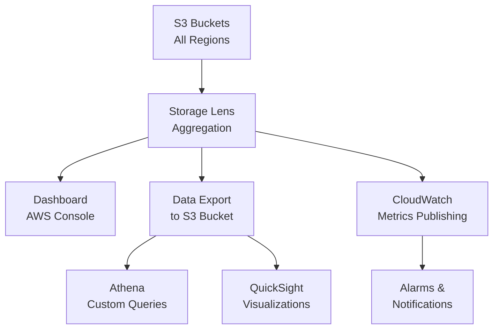

# How to Use S3 Storage Lens for Visibility Into Storage Usage

Author: [nawazdhandala](https://github.com/nawazdhandala)

Tags: AWS, S3, Storage Lens, Cost Optimization, Monitoring

Description: Learn how to set up and use S3 Storage Lens to get organization-wide visibility into storage usage, activity metrics, and cost optimization recommendations.

---

If you've got dozens of AWS accounts and hundreds of S3 buckets, figuring out where your storage costs are going is harder than it should be. S3 Storage Lens gives you a single dashboard that aggregates storage metrics across all your accounts, regions, and buckets. It shows you not just how much storage you're using, but how effectively you're using it - with actionable recommendations for reducing costs.

## What S3 Storage Lens Provides

Storage Lens comes in two tiers:

**Free metrics** (default): 28+ usage metrics updated daily with 14 days of history. Covers object counts, storage bytes, request counts by type, and byte downloads/uploads.

**Advanced metrics** (paid): 35+ additional metrics with 15 months of history. Adds activity metrics, detailed status codes, data protection metrics, and the ability to export to S3 for custom analysis. You also get contextual recommendations.

The data is aggregated at multiple levels: organization, account, region, bucket, and even prefix level.

## Step 1: Create a Storage Lens Dashboard

Every AWS account gets a default dashboard, but creating custom ones lets you focus on what matters.

```bash
# Create a Storage Lens dashboard with free metrics
aws s3control put-storage-lens-configuration \
  --account-id 123456789012 \
  --config-id my-storage-dashboard \
  --storage-lens-configuration '{
    "Id": "my-storage-dashboard",
    "AccountLevel": {
      "BucketLevel": {
        "ActivityMetrics": {
          "IsEnabled": false
        }
      }
    },
    "Include": {
      "Regions": ["us-east-1", "us-west-2", "eu-west-1"],
      "Buckets": []
    },
    "IsEnabled": true,
    "DataExport": {
      "S3BucketDestination": {
        "Format": "CSV",
        "OutputSchemaVersion": "V_1",
        "AccountId": "123456789012",
        "Arn": "arn:aws:s3:::my-storage-lens-exports",
        "Prefix": "storage-lens-data",
        "Encryption": {
          "SSES3": {}
        }
      }
    }
  }'
```

## Step 2: Enable Advanced Metrics

If you need deeper insights, enable advanced metrics. This costs extra but gives you much more data.

```bash
# Create a dashboard with advanced metrics enabled
aws s3control put-storage-lens-configuration \
  --account-id 123456789012 \
  --config-id advanced-storage-dashboard \
  --storage-lens-configuration '{
    "Id": "advanced-storage-dashboard",
    "AccountLevel": {
      "BucketLevel": {
        "ActivityMetrics": {
          "IsEnabled": true
        },
        "DetailedStatusCodesMetrics": {
          "IsEnabled": true
        },
        "AdvancedCostOptimizationMetrics": {
          "IsEnabled": true
        },
        "AdvancedDataProtectionMetrics": {
          "IsEnabled": true
        },
        "PrefixLevel": {
          "StorageMetrics": {
            "IsEnabled": true,
            "SelectionCriteria": {
              "MaxDepth": 3,
              "MinStorageBytesPercentage": 1.0,
              "Delimiter": "/"
            }
          }
        }
      },
      "ActivityMetrics": {
        "IsEnabled": true
      },
      "DetailedStatusCodesMetrics": {
        "IsEnabled": true
      },
      "AdvancedCostOptimizationMetrics": {
        "IsEnabled": true
      },
      "AdvancedDataProtectionMetrics": {
        "IsEnabled": true
      }
    },
    "IsEnabled": true
  }'
```

## Step 3: Set Up Organization-Level Visibility

If you're using AWS Organizations, you can create a dashboard that spans all accounts. This needs to be set up from the management account or a delegated administrator.

```bash
# Enable Storage Lens for the organization
aws s3control put-storage-lens-configuration \
  --account-id 111111111111 \
  --config-id org-wide-dashboard \
  --storage-lens-configuration '{
    "Id": "org-wide-dashboard",
    "AccountLevel": {
      "BucketLevel": {
        "ActivityMetrics": {
          "IsEnabled": true
        }
      }
    },
    "AwsOrg": {
      "Arn": "arn:aws:organizations::111111111111:organization/o-abc123"
    },
    "IsEnabled": true
  }'
```

## Understanding the Key Metrics

Here's what the most useful metrics tell you and what to do about them.

### Storage Metrics

| Metric | What It Tells You | Action |
|--------|-------------------|--------|
| Total storage bytes | How much you're storing | Set lifecycle policies to reduce |
| Object count | Total number of objects | Look for small objects that could be combined |
| Average object size | Size distribution | Objects under 128KB don't benefit from multipart |
| Current version bytes | Storage for latest versions | Compare with total to see version overhead |
| Noncurrent version bytes | Old version storage | Set noncurrent version expiration |

### Activity Metrics

| Metric | What It Tells You | Action |
|--------|-------------------|--------|
| GET request count | How often objects are read | High reads on Standard = good, low reads = consider IA |
| PUT request count | How often objects are written | Unusual spikes may indicate issues |
| Bytes downloaded | Data transfer out | Optimize with CloudFront for repeated downloads |
| 4xx error count | Client errors | Fix permissions or application bugs |
| 5xx error count | Server errors | Investigate and add retries |

## Step 4: Export and Analyze with Athena

When you configure data export, Storage Lens writes daily metrics to your S3 bucket. You can query these with Athena.

Create an Athena table for the exported data.

```sql
CREATE EXTERNAL TABLE storage_lens_data (
  report_date string,
  account_id string,
  region string,
  bucket_name string,
  metric_name string,
  metric_value double
)
ROW FORMAT SERDE 'org.apache.hadoop.hive.serde2.OpenCSVSerde'
STORED AS TEXTFILE
LOCATION 's3://my-storage-lens-exports/storage-lens-data/'
TBLPROPERTIES ('skip.header.line.count'='1');
```

Now run queries to find optimization opportunities.

Find buckets with the highest storage costs.

```sql
SELECT
  bucket_name,
  metric_value / 1024 / 1024 / 1024 as storage_gb,
  report_date
FROM storage_lens_data
WHERE metric_name = 'StorageBytes'
  AND report_date = '2026-02-11'
ORDER BY metric_value DESC
LIMIT 20;
```

Find buckets where noncurrent versions are consuming significant storage.

```sql
SELECT
  a.bucket_name,
  a.metric_value / 1024 / 1024 / 1024 as current_gb,
  b.metric_value / 1024 / 1024 / 1024 as noncurrent_gb,
  (b.metric_value / (a.metric_value + b.metric_value)) * 100 as noncurrent_pct
FROM storage_lens_data a
JOIN storage_lens_data b
  ON a.bucket_name = b.bucket_name
  AND a.report_date = b.report_date
WHERE a.metric_name = 'CurrentVersionStorageBytes'
  AND b.metric_name = 'NonCurrentVersionStorageBytes'
  AND a.report_date = '2026-02-11'
  AND b.metric_value > 0
ORDER BY noncurrent_pct DESC
LIMIT 20;
```

## Step 5: Act on Recommendations

Storage Lens provides contextual recommendations when advanced metrics are enabled. Here are the most common ones and what to do.

**"Enable lifecycle policies"**: You've got buckets without any lifecycle rules. Set up transitions to Intelligent-Tiering or Glacier for cold data. See our guide on [S3 Intelligent-Tiering](https://oneuptime.com/blog/post/s3-intelligent-tiering-optimize-storage-costs/view).

**"Clean up incomplete multipart uploads"**: Abandoned multipart uploads sit around consuming storage. Add a lifecycle rule to abort them.

```json
{
  "Rules": [
    {
      "ID": "abort-incomplete-multipart",
      "Status": "Enabled",
      "Filter": {"Prefix": ""},
      "AbortIncompleteMultipartUpload": {
        "DaysAfterInitiation": 7
      }
    }
  ]
}
```

**"Delete expired noncurrent versions"**: Old object versions are piling up. Add an expiration rule.

**"Enable server-side encryption"**: Some buckets don't have default encryption. Fix that immediately - check our guide on [SSE-S3 encryption](https://oneuptime.com/blog/post/server-side-encryption-s3-managed-keys-sse-s3/view).

## Monitoring Storage Lens Metrics

Here's how the data flows through Storage Lens.



## Cost of Storage Lens

The free tier covers most basic needs. Advanced metrics cost about $0.20 per million objects per month. For an organization with 1 billion objects, that's $200/month - often worth it if it helps you find even small optimization opportunities.

The data export storage costs are minimal - typically a few MBs per day.

## Wrapping Up

S3 Storage Lens takes the guesswork out of understanding your S3 usage. Instead of writing scripts to iterate through buckets and aggregate metrics, you get a managed service that does it automatically across your entire organization. The recommendations alone can pay for the advanced tier many times over by identifying storage that can be moved to cheaper tiers or cleaned up entirely.

Start with the free metrics to get baseline visibility, then enable advanced metrics on your most expensive accounts to find optimization opportunities.
