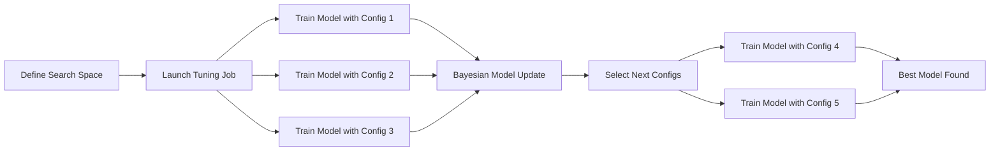

# How to Use SageMaker Automatic Model Tuning (Hyperparameter Optimization)

Author: [nawazdhandala](https://github.com/nawazdhandala)

Tags: AWS, SageMaker, Machine Learning, Hyperparameter Tuning, Optimization

Description: Automate hyperparameter optimization with Amazon SageMaker Automatic Model Tuning to find the best model configuration without manual experimentation.

---

Choosing the right hyperparameters can make or break a model. The difference between a learning rate of 0.01 and 0.001 might be the difference between 85% accuracy and 93% accuracy. But manually trying different combinations is tedious and doesn't scale. SageMaker Automatic Model Tuning (AMT) does the search for you, intelligently exploring the hyperparameter space to find the best configuration.

This guide shows you how to set up and run hyperparameter optimization jobs on SageMaker.

## How Automatic Model Tuning Works

AMT uses Bayesian optimization by default. Instead of randomly trying hyperparameter combinations (though it supports that too), it builds a probabilistic model of how hyperparameters affect the objective metric. Each training job informs the next one, so the search gets smarter over time.



## Setting Up a Tuning Job

Let's tune an XGBoost model. We'll define the hyperparameter search ranges, the objective metric, and the resource limits.

```python
import sagemaker
from sagemaker import image_uris
from sagemaker.tuner import (
    HyperparameterTuner,
    IntegerParameter,
    ContinuousParameter,
    CategoricalParameter
)
from sagemaker.inputs import TrainingInput

session = sagemaker.Session()
role = sagemaker.get_execution_role()
bucket = session.default_bucket()
region = session.boto_region_name

# Get the XGBoost container
xgb_image = image_uris.retrieve('xgboost', region, '1.7-1')

# Create the base estimator
xgb_estimator = sagemaker.estimator.Estimator(
    image_uri=xgb_image,
    role=role,
    instance_count=1,
    instance_type='ml.m5.xlarge',
    output_path=f's3://{bucket}/tuning-output',
    sagemaker_session=session,
    max_run=3600
)

# Set the fixed hyperparameters (ones we're NOT tuning)
xgb_estimator.set_hyperparameters(
    objective='binary:logistic',
    eval_metric='auc',
    num_round=300
)
```

Now define the hyperparameter ranges to search.

```python
# Define the hyperparameter search space
hyperparameter_ranges = {
    # Continuous parameters - any value in the range
    'eta': ContinuousParameter(0.01, 0.3, scaling_type='Logarithmic'),
    'subsample': ContinuousParameter(0.5, 1.0),
    'colsample_bytree': ContinuousParameter(0.5, 1.0),
    'gamma': ContinuousParameter(0, 5),
    'min_child_weight': ContinuousParameter(1, 10),
    'alpha': ContinuousParameter(0, 2),

    # Integer parameters - whole numbers only
    'max_depth': IntegerParameter(3, 12),
}

# Create the tuner
tuner = HyperparameterTuner(
    estimator=xgb_estimator,
    objective_metric_name='validation:auc',
    objective_type='Maximize',                  # We want to maximize AUC
    hyperparameter_ranges=hyperparameter_ranges,
    max_jobs=50,                                 # Total training jobs to run
    max_parallel_jobs=5,                         # Run 5 at a time
    strategy='Bayesian',                         # Bayesian optimization
    early_stopping_type='Auto'                   # Auto-stop unpromising trials
)
```

## Launching the Tuning Job

Start the tuning job with your training data.

```python
# Define input data channels
train_input = TrainingInput(
    s3_data=f's3://{bucket}/data/train',
    content_type='text/csv'
)

val_input = TrainingInput(
    s3_data=f's3://{bucket}/data/validation',
    content_type='text/csv'
)

# Launch the tuning job
tuner.fit(
    inputs={
        'train': train_input,
        'validation': val_input
    },
    job_name='xgb-hpo-search',
    wait=False  # Don't block - tuning can take a while
)

print(f"Tuning job started: {tuner.latest_tuning_job.name}")
```

## Monitoring the Tuning Job

While the tuner runs, you can check progress.

```python
import boto3

client = boto3.client('sagemaker')

# Get tuning job details
tuning_job_name = tuner.latest_tuning_job.name

response = client.describe_hyper_parameter_tuning_job(
    HyperParameterTuningJobName=tuning_job_name
)

# Overall status
print(f"Status: {response['HyperParameterTuningJobStatus']}")
print(f"Strategy: {response['HyperParameterTuningJobConfig']['Strategy']}")

# Training job counts
counts = response['TrainingJobStatusCounters']
print(f"\nTraining Jobs:")
print(f"  Completed: {counts['Completed']}")
print(f"  In Progress: {counts['InProgress']}")
print(f"  Stopped: {counts.get('Stopped', 0)}")
print(f"  Failed: {counts.get('NonRetryableError', 0)}")

# Best result so far
if 'BestTrainingJob' in response:
    best = response['BestTrainingJob']
    print(f"\nBest Training Job: {best['TrainingJobName']}")
    print(f"  Objective Value: {best['FinalHyperParameterTuningJobObjectiveMetric']['Value']:.4f}")
    print(f"  Hyperparameters:")
    for key, value in best['TunedHyperParameters'].items():
        print(f"    {key}: {value}")
```

## Analyzing Results

After the tuning job completes, analyze all the trials.

```python
from sagemaker.analytics import HyperparameterTuningJobAnalytics

# Create an analytics object for the tuning job
tuner_analytics = HyperparameterTuningJobAnalytics(
    hyperparameter_tuning_job_name=tuning_job_name,
    sagemaker_session=session
)

# Get results as a DataFrame
results_df = tuner_analytics.dataframe()

# Sort by objective metric
results_df = results_df.sort_values(
    'FinalObjectiveValue',
    ascending=False
)

# Show top 10 results
print("Top 10 configurations:")
print(results_df[['TrainingJobName', 'FinalObjectiveValue',
                   'eta', 'max_depth', 'subsample']].head(10).to_string())
```

## Warm Starting a Tuning Job

If you've already run a tuning job and want to refine the search, use warm start. This tells the new tuning job to learn from previous results.

```python
from sagemaker.tuner import WarmStartConfig, WarmStartTypes

# Warm start from a previous tuning job
warm_start_config = WarmStartConfig(
    warm_start_type=WarmStartTypes.TRANSFER_LEARNING,
    parents=[
        {'HyperParameterTuningJobName': 'xgb-hpo-search'}  # Previous job
    ]
)

# Create a new tuner with warm start
refined_tuner = HyperparameterTuner(
    estimator=xgb_estimator,
    objective_metric_name='validation:auc',
    objective_type='Maximize',
    hyperparameter_ranges={
        # Narrow the ranges based on previous results
        'eta': ContinuousParameter(0.03, 0.12, scaling_type='Logarithmic'),
        'max_depth': IntegerParameter(5, 9),
        'subsample': ContinuousParameter(0.7, 0.95),
        'colsample_bytree': ContinuousParameter(0.6, 0.9),
        'gamma': ContinuousParameter(0, 2),
        'min_child_weight': ContinuousParameter(2, 7),
    },
    max_jobs=25,
    max_parallel_jobs=5,
    strategy='Bayesian',
    warm_start_config=warm_start_config
)

refined_tuner.fit(
    inputs={'train': train_input, 'validation': val_input},
    job_name='xgb-hpo-refined'
)
```

## Tuning with Custom Algorithms

AMT works with any SageMaker training job, including your own custom containers. You just need to define the objective metric regex so SageMaker can parse it from the training logs.

```python
from sagemaker.pytorch import PyTorch

# Custom PyTorch estimator
pytorch_estimator = PyTorch(
    entry_point='train.py',
    source_dir='./scripts',
    role=role,
    instance_count=1,
    instance_type='ml.p3.2xlarge',
    framework_version='2.0',
    py_version='py310'
)

# Define the metric - SageMaker parses this from stdout
metric_definitions = [
    {
        'Name': 'validation:f1',
        'Regex': 'val_f1: ([0-9\\.]+)'  # Matches "val_f1: 0.8723" in logs
    },
    {
        'Name': 'validation:accuracy',
        'Regex': 'val_accuracy: ([0-9\\.]+)'
    }
]

# Create the tuner for a custom model
custom_tuner = HyperparameterTuner(
    estimator=pytorch_estimator,
    objective_metric_name='validation:f1',
    objective_type='Maximize',
    metric_definitions=metric_definitions,
    hyperparameter_ranges={
        'learning-rate': ContinuousParameter(0.0001, 0.01, scaling_type='Logarithmic'),
        'batch-size': CategoricalParameter([16, 32, 64, 128]),
        'hidden-dim': CategoricalParameter([64, 128, 256, 512]),
        'dropout': ContinuousParameter(0.1, 0.5),
        'num-layers': IntegerParameter(1, 4)
    },
    max_jobs=30,
    max_parallel_jobs=3
)
```

Your training script just needs to print the metric in the expected format.

```python
# In your training script, print metrics that match the regex
print(f"val_f1: {f1_score:.4f}")
print(f"val_accuracy: {accuracy:.4f}")
```

## Multi-Objective Tuning

Sometimes you care about more than one metric. For example, you might want to maximize accuracy while minimizing latency.

```python
# Multi-objective tuning
multi_tuner = HyperparameterTuner(
    estimator=xgb_estimator,
    objective_metric_name='validation:auc',
    objective_type='Maximize',
    hyperparameter_ranges=hyperparameter_ranges,
    max_jobs=50,
    max_parallel_jobs=5,
    strategy='Bayesian',
    # Define additional objectives
    completion_criteria_config={
        'BestObjectiveNotImproving': {
            'MaxNumberOfTrainingJobsNotImproving': 10
        }
    }
)
```

## Cost Optimization

Tuning jobs can get expensive since they launch many training jobs. Here are some ways to manage costs:

- **Use spot instances** for training jobs within the tuning job
- **Set `max_jobs` conservatively** - start with 20-30 jobs and see if that's enough
- **Enable early stopping** - kills unpromising trials before they finish
- **Use warm start** instead of running from scratch every time

```python
# Use spot instances for cost savings
xgb_estimator_spot = sagemaker.estimator.Estimator(
    image_uri=xgb_image,
    role=role,
    instance_count=1,
    instance_type='ml.m5.xlarge',
    output_path=f's3://{bucket}/tuning-output',
    use_spot_instances=True,        # Use spot instances
    max_wait=7200,                  # Max wait time including spot delays
    max_run=3600,                   # Max training time
    sagemaker_session=session
)
```

For more on reducing training costs, see our guide on [using spot instances with SageMaker](https://oneuptime.com/blog/post/2026-02-12-reduce-sagemaker-training-costs-spot-instances/view).

## Deploying the Best Model

Once tuning is complete, deploy the best model directly.

```python
# Deploy the best model from the tuning job
predictor = tuner.deploy(
    initial_instance_count=1,
    instance_type='ml.m5.large',
    endpoint_name='best-tuned-model',
    serializer=sagemaker.serializers.CSVSerializer(),
    deserializer=sagemaker.deserializers.JSONDeserializer()
)

print(f"Deployed best model to: {predictor.endpoint_name}")
```

## Wrapping Up

Automatic Model Tuning takes the guesswork out of hyperparameter selection. Instead of manually trying combinations or running expensive grid searches, Bayesian optimization finds good configurations with fewer training jobs. Combined with [SageMaker Experiments](https://oneuptime.com/blog/post/2026-02-12-sagemaker-experiments-tracking/view) for tracking what you've tried and [Debugger](https://oneuptime.com/blog/post/2026-02-12-sagemaker-debugger-training-insights/view) for understanding why certain configurations work better, you've got a systematic approach to model optimization.
