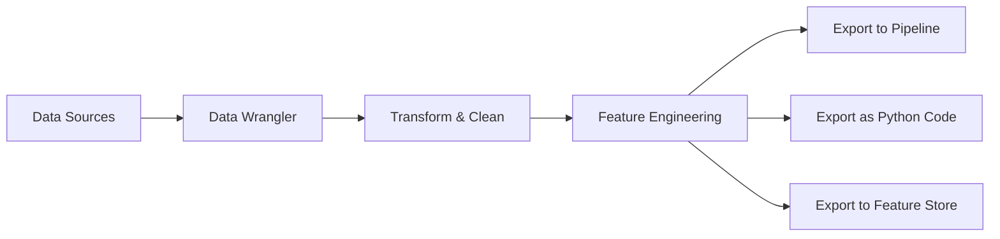

# How to Use SageMaker Data Wrangler for Feature Engineering

Author: [nawazdhandala](https://github.com/nawazdhandala)

Tags: AWS, SageMaker, Feature Engineering, Data Preparation, Machine Learning

Description: Use Amazon SageMaker Data Wrangler's visual interface to transform, clean, and engineer features for machine learning without writing complex code.

---

Feature engineering is where data becomes useful for machine learning. Raw data rarely works well as-is - you need to clean it, transform it, combine columns, handle missing values, and create new features that capture meaningful patterns. SageMaker Data Wrangler gives you a visual interface to do all of this, with the ability to export your transformations as code when you're ready to productionize.

This guide covers how to use Data Wrangler for common feature engineering tasks.

## What is Data Wrangler?

Data Wrangler is a visual data preparation tool inside SageMaker Studio. It connects to your data sources, lets you explore and transform data through a drag-and-drop interface, and generates the code (Python, PySpark, or SQL) needed to reproduce your transformations in a production pipeline.



The visual approach is great for exploration and iteration. Once you've nailed down your transformations, you export them as code and integrate them into your training pipeline.

## Connecting to Data Sources

Data Wrangler can pull data from several sources:

- Amazon S3 (CSV, Parquet, JSON)
- Amazon Athena
- Amazon Redshift
- Snowflake
- Databricks

Let's prepare some data and make it available for Data Wrangler.

```python
import pandas as pd
import numpy as np
import boto3

# Create a realistic e-commerce dataset
np.random.seed(42)
n_records = 10000

data = pd.DataFrame({
    'order_id': range(1, n_records + 1),
    'customer_id': np.random.randint(1, 2000, n_records),
    'order_date': pd.date_range('2025-01-01', periods=n_records, freq='15min'),
    'product_category': np.random.choice(
        ['Electronics', 'Clothing', 'Home', 'Books', 'Food'],
        n_records
    ),
    'quantity': np.random.randint(1, 10, n_records),
    'unit_price': np.random.uniform(5, 500, n_records).round(2),
    'discount_pct': np.random.choice([0, 5, 10, 15, 20, 25], n_records),
    'shipping_method': np.random.choice(
        ['Standard', 'Express', 'Same Day', None],
        n_records,
        p=[0.5, 0.3, 0.15, 0.05]
    ),
    'customer_age': np.random.randint(18, 75, n_records),
    'customer_state': np.random.choice(
        ['CA', 'NY', 'TX', 'FL', 'IL', 'WA', 'PA', None],
        n_records,
        p=[0.2, 0.15, 0.15, 0.1, 0.1, 0.1, 0.1, 0.1]
    ),
    'is_returned': np.random.choice([0, 1], n_records, p=[0.85, 0.15])
})

# Add some realistic messiness
data.loc[np.random.choice(n_records, 200), 'unit_price'] = np.nan
data.loc[np.random.choice(n_records, 150), 'customer_age'] = -1  # Invalid ages

# Upload to S3
data.to_csv('ecommerce_data.csv', index=False)

s3 = boto3.client('s3')
bucket = 'my-data-wrangler-bucket'
s3.upload_file('ecommerce_data.csv', bucket, 'raw-data/ecommerce_data.csv')

print(f"Uploaded {len(data)} records to S3")
```

In the Data Wrangler UI, you'd create a new flow file (.flow), click "Import", select S3, and navigate to your file.

## Common Transformations

Data Wrangler offers over 300 built-in transformations. Here are the ones you'll use most often.

### Handling Missing Values

Data Wrangler provides several strategies for missing data.

```python
# What Data Wrangler generates under the hood
# when you select "Fill missing" -> "Fill with median" for unit_price

import pandas as pd

def fill_missing_with_median(df):
    """Fill missing values in unit_price with the column median."""
    median_value = df['unit_price'].median()
    df['unit_price'] = df['unit_price'].fillna(median_value)
    return df

# For categorical columns, fill with mode
def fill_missing_with_mode(df):
    """Fill missing shipping_method with the most frequent value."""
    mode_value = df['shipping_method'].mode()[0]
    df['shipping_method'] = df['shipping_method'].fillna(mode_value)
    return df
```

### Creating Calculated Columns

Some of the most useful features come from combining existing columns.

```python
# Total order value
def add_order_value(df):
    """Calculate the total order value after discount."""
    df['subtotal'] = df['quantity'] * df['unit_price']
    df['discount_amount'] = df['subtotal'] * (df['discount_pct'] / 100)
    df['total_value'] = df['subtotal'] - df['discount_amount']
    return df

# Is high-value order (useful as a feature)
def add_high_value_flag(df):
    """Flag orders above $200 as high-value."""
    df['is_high_value'] = (df['total_value'] > 200).astype(int)
    return df
```

### Datetime Feature Extraction

Time-based features are often incredibly predictive. Data Wrangler can extract components from datetime columns.

```python
# Extract temporal features from order_date
def extract_datetime_features(df):
    """Extract useful time-based features from order_date."""
    df['order_date'] = pd.to_datetime(df['order_date'])

    df['order_hour'] = df['order_date'].dt.hour
    df['order_day_of_week'] = df['order_date'].dt.dayofweek
    df['order_month'] = df['order_date'].dt.month
    df['is_weekend'] = (df['order_day_of_week'] >= 5).astype(int)

    # Business hours flag
    df['is_business_hours'] = (
        (df['order_hour'] >= 9) & (df['order_hour'] <= 17)
    ).astype(int)

    return df
```

### Encoding Categorical Variables

ML models need numeric inputs. Data Wrangler offers several encoding options.

```python
# One-hot encoding (what Data Wrangler generates)
def one_hot_encode(df, column='product_category'):
    """One-hot encode a categorical column."""
    dummies = pd.get_dummies(df[column], prefix=column)
    df = pd.concat([df, dummies], axis=1)
    df = df.drop(columns=[column])
    return df

# Ordinal encoding for ordered categories
def ordinal_encode_shipping(df):
    """Ordinal encode shipping method by speed."""
    shipping_order = {
        'Standard': 0,
        'Express': 1,
        'Same Day': 2
    }
    df['shipping_encoded'] = df['shipping_method'].map(shipping_order)
    return df

# Target encoding (powerful but needs care to avoid leakage)
def target_encode(df, column='customer_state', target='is_returned'):
    """Encode a categorical column based on the target mean."""
    means = df.groupby(column)[target].mean()
    df[f'{column}_target_encoded'] = df[column].map(means)
    return df
```

### Aggregation Features

Customer-level aggregations are incredibly useful for many ML problems.

```python
# Create customer-level aggregate features
def add_customer_aggregates(df):
    """Calculate per-customer statistics."""
    customer_stats = df.groupby('customer_id').agg(
        customer_total_orders=('order_id', 'count'),
        customer_avg_order_value=('total_value', 'mean'),
        customer_total_spend=('total_value', 'sum'),
        customer_avg_quantity=('quantity', 'mean'),
        customer_return_rate=('is_returned', 'mean'),
        customer_unique_categories=('product_category', 'nunique')
    ).reset_index()

    df = df.merge(customer_stats, on='customer_id', how='left')
    return df
```

### Outlier Handling

Data Wrangler can detect and handle outliers using several methods.

```python
# Remove outliers using IQR method
def handle_outliers_iqr(df, column='unit_price'):
    """Cap outliers at IQR boundaries."""
    Q1 = df[column].quantile(0.25)
    Q3 = df[column].quantile(0.75)
    IQR = Q3 - Q1
    lower = Q1 - 1.5 * IQR
    upper = Q3 + 1.5 * IQR

    df[column] = df[column].clip(lower=lower, upper=upper)
    return df

# Fix invalid values
def fix_invalid_ages(df):
    """Replace invalid ages with the median."""
    median_age = df.loc[df['customer_age'] > 0, 'customer_age'].median()
    df.loc[df['customer_age'] <= 0, 'customer_age'] = median_age
    return df
```

## Data Quality Report

Data Wrangler generates a data quality report that shows:

- Column types and distributions
- Missing value counts
- Outlier detection
- Duplicate rows
- Target leakage warnings

This is incredibly useful for understanding your data before you start engineering features.

## Exporting Your Transformations

Once you're happy with your transformations, Data Wrangler can export them in several formats.

### Export as a Processing Job

```python
# Data Wrangler generates a processing job that applies all your transformations
from sagemaker.processing import ProcessingInput, ProcessingOutput
from sagemaker.processing import Processor

# The flow file contains all your transformation logic
flow_uri = f's3://{bucket}/data-wrangler/my-flow.flow'

# Run the transformations at scale
processor = Processor(
    role=role,
    image_uri='174368400705.dkr.ecr.us-east-1.amazonaws.com/sagemaker-data-wrangler-container:1.x',
    instance_count=1,
    instance_type='ml.m5.4xlarge',
    sagemaker_session=session
)

processor.run(
    inputs=[
        ProcessingInput(
            source=flow_uri,
            destination='/opt/ml/processing/flow',
            input_name='flow'
        )
    ],
    outputs=[
        ProcessingOutput(
            source='/opt/ml/processing/output',
            destination=f's3://{bucket}/processed-data/',
            output_name='output'
        )
    ]
)
```

### Export to SageMaker Feature Store

You can push your engineered features directly to [SageMaker Feature Store](https://oneuptime.com/blog/post/2026-02-12-sagemaker-feature-store/view) for centralized management and serving.

### Export as a Pipeline Step

Integrate your Data Wrangler transformations into a [SageMaker Pipeline](https://oneuptime.com/blog/post/2026-02-12-sagemaker-pipelines-mlops/view) for automated reprocessing.

## Custom Transformations

When the built-in transforms aren't enough, write custom Python or PySpark code.

```python
# Custom transformation in Data Wrangler
# This gets embedded in your flow file

import pandas as pd
import numpy as np

def custom_transform(df):
    """Create an RFM (Recency, Frequency, Monetary) score for each customer."""

    now = df['order_date'].max()

    rfm = df.groupby('customer_id').agg(
        recency=('order_date', lambda x: (now - x.max()).days),
        frequency=('order_id', 'count'),
        monetary=('total_value', 'sum')
    ).reset_index()

    # Normalize each component to 0-1
    for col in ['recency', 'frequency', 'monetary']:
        min_val = rfm[col].min()
        max_val = rfm[col].max()
        if max_val > min_val:
            rfm[f'{col}_score'] = (rfm[col] - min_val) / (max_val - min_val)
        else:
            rfm[f'{col}_score'] = 0.5

    # Invert recency (lower is better)
    rfm['recency_score'] = 1 - rfm['recency_score']

    # Combined RFM score
    rfm['rfm_score'] = (
        rfm['recency_score'] * 0.3 +
        rfm['frequency_score'] * 0.3 +
        rfm['monetary_score'] * 0.4
    )

    df = df.merge(
        rfm[['customer_id', 'rfm_score', 'recency_score',
             'frequency_score', 'monetary_score']],
        on='customer_id',
        how='left'
    )

    return df
```

## Wrapping Up

Data Wrangler makes feature engineering accessible and visual while still producing production-ready code. The visual interface is perfect for exploration - you can quickly try different transformations and see the results. When you're ready to productionize, export your transformations as code and integrate them into your [SageMaker Pipeline](https://oneuptime.com/blog/post/2026-02-12-sagemaker-pipelines-mlops/view). For features that need to be shared across projects, push them to [SageMaker Feature Store](https://oneuptime.com/blog/post/2026-02-12-sagemaker-feature-store/view). The combination of visual exploration and code export gives you the best of both worlds.
