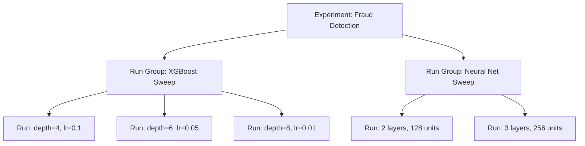

# How to Use SageMaker Experiments for Tracking

Author: [nawazdhandala](https://github.com/nawazdhandala)

Tags: AWS, SageMaker, Machine Learning, Experiment Tracking, MLOps

Description: Track, compare, and organize machine learning experiments using Amazon SageMaker Experiments to improve your model development workflow.

---

Every ML project involves running lots of experiments. Different hyperparameters, different feature sets, different algorithms - you try a bunch of things and see what works. The problem is keeping track of it all. Was it run 47 or run 52 that had the best AUC? What learning rate did you use in that one good run from last Tuesday?

SageMaker Experiments solves this by automatically logging everything about your training runs. You can compare metrics across runs, track which parameters produced the best results, and share findings with your team.

## How Experiments Are Organized

SageMaker Experiments uses a three-level hierarchy:

- **Experiment** - The top-level container for a project or research question (e.g., "fraud detection model improvements")
- **Run** - A single training attempt within an experiment (e.g., "XGBoost with depth=8 and lr=0.05")
- **Run Group** - An optional grouping layer to organize related runs (e.g., "hyperparameter sweep Q1")



## Creating an Experiment

Let's set up an experiment and start tracking runs.

```python
from sagemaker.experiments.run import Run
import sagemaker
import time

session = sagemaker.Session()
role = sagemaker.get_execution_role()

# Define experiment name
experiment_name = 'fraud-detection-experiments'
```

## Tracking a Training Run

The simplest way to track an experiment is with the `Run` context manager. Everything you log inside the `with` block gets associated with that run.

```python
from sagemaker.experiments.run import Run
import numpy as np

# Create a run within the experiment
with Run(
    experiment_name=experiment_name,
    run_name=f'xgboost-run-{int(time.time())}',
    sagemaker_session=session
) as run:

    # Log hyperparameters
    run.log_parameter('algorithm', 'xgboost')
    run.log_parameter('max_depth', 6)
    run.log_parameter('learning_rate', 0.1)
    run.log_parameter('num_round', 200)
    run.log_parameter('subsample', 0.8)
    run.log_parameter('colsample_bytree', 0.8)

    # Log dataset information
    run.log_parameter('training_samples', 50000)
    run.log_parameter('validation_samples', 10000)
    run.log_parameter('feature_count', 45)

    # Simulate training and log metrics at each epoch
    for epoch in range(1, 51):
        # In a real scenario, these would come from your training loop
        train_loss = 0.5 * np.exp(-0.03 * epoch) + np.random.normal(0, 0.01)
        val_loss = 0.55 * np.exp(-0.025 * epoch) + np.random.normal(0, 0.015)
        train_auc = 1 - 0.3 * np.exp(-0.04 * epoch) + np.random.normal(0, 0.005)
        val_auc = 1 - 0.35 * np.exp(-0.035 * epoch) + np.random.normal(0, 0.008)

        # Log metrics with step numbers for time-series plotting
        run.log_metric('train:loss', train_loss, step=epoch)
        run.log_metric('validation:loss', val_loss, step=epoch)
        run.log_metric('train:auc', train_auc, step=epoch)
        run.log_metric('validation:auc', val_auc, step=epoch)

    # Log final metrics
    run.log_metric('final:validation_auc', float(val_auc))
    run.log_metric('final:validation_loss', float(val_loss))

    # Log artifacts (like confusion matrix plots, feature importance, etc.)
    run.log_file('confusion_matrix.png', name='confusion-matrix', is_output=True)

    print(f"Run logged with final AUC: {val_auc:.4f}")
```

## Tracking SageMaker Training Jobs

When you use SageMaker's Estimator for training, you can automatically associate the training job with an experiment run.

```python
from sagemaker import image_uris
from sagemaker.inputs import TrainingInput
from sagemaker.experiments.run import Run

bucket = session.default_bucket()
region = session.boto_region_name

xgb_image = image_uris.retrieve('xgboost', region, '1.7-1')

# Run parameters for this experiment
max_depth = 8
learning_rate = 0.05

with Run(
    experiment_name=experiment_name,
    run_name=f'xgb-depth{max_depth}-lr{learning_rate}',
    sagemaker_session=session
) as run:

    # Log the parameters we're testing
    run.log_parameter('max_depth', max_depth)
    run.log_parameter('learning_rate', learning_rate)

    # Create and configure the estimator
    xgb_estimator = sagemaker.estimator.Estimator(
        image_uri=xgb_image,
        role=role,
        instance_count=1,
        instance_type='ml.m5.xlarge',
        output_path=f's3://{bucket}/experiments/output',
        sagemaker_session=session
    )

    xgb_estimator.set_hyperparameters(
        objective='binary:logistic',
        num_round=200,
        max_depth=max_depth,
        eta=learning_rate,
        subsample=0.8,
        eval_metric='auc'
    )

    # The training job is automatically linked to this run
    xgb_estimator.fit(
        inputs={
            'train': TrainingInput(f's3://{bucket}/data/train', content_type='text/csv'),
            'validation': TrainingInput(f's3://{bucket}/data/validation', content_type='text/csv')
        },
        wait=True
    )

    # Log the model artifact location
    run.log_parameter('model_data', xgb_estimator.model_data)
```

## Running a Hyperparameter Sweep

Experiments really shine when you're running lots of variations. Here's how to sweep across hyperparameters and track each run.

```python
import itertools

# Define the parameter grid
param_grid = {
    'max_depth': [4, 6, 8],
    'learning_rate': [0.01, 0.05, 0.1],
    'subsample': [0.7, 0.9]
}

# Generate all combinations
keys = param_grid.keys()
combinations = list(itertools.product(*param_grid.values()))

print(f"Running {len(combinations)} experiments")

for combo in combinations:
    params = dict(zip(keys, combo))
    run_name = f"xgb-d{params['max_depth']}-lr{params['learning_rate']}-ss{params['subsample']}"

    with Run(
        experiment_name=experiment_name,
        run_name=run_name,
        sagemaker_session=session
    ) as run:

        # Log all parameters
        for key, value in params.items():
            run.log_parameter(key, value)

        # Configure and launch training
        xgb_estimator = sagemaker.estimator.Estimator(
            image_uri=xgb_image,
            role=role,
            instance_count=1,
            instance_type='ml.m5.xlarge',
            output_path=f's3://{bucket}/experiments/output',
            sagemaker_session=session
        )

        xgb_estimator.set_hyperparameters(
            objective='binary:logistic',
            num_round=200,
            max_depth=params['max_depth'],
            eta=params['learning_rate'],
            subsample=params['subsample'],
            eval_metric='auc'
        )

        xgb_estimator.fit(
            inputs={
                'train': TrainingInput(f's3://{bucket}/data/train', content_type='text/csv'),
                'validation': TrainingInput(f's3://{bucket}/data/validation', content_type='text/csv')
            },
            wait=True
        )

        # Log the final metrics
        run.log_parameter('model_data', xgb_estimator.model_data)

    print(f"Completed: {run_name}")
```

## Comparing Experiments

Once you've run multiple experiments, query and compare them.

```python
import boto3
import pandas as pd

client = boto3.client('sagemaker')

# List all runs in the experiment
from sagemaker.analytics import ExperimentAnalytics

experiment_analytics = ExperimentAnalytics(
    experiment_name=experiment_name,
    sagemaker_session=session
)

# Load into a DataFrame for easy comparison
df = experiment_analytics.dataframe()

# Show the most relevant columns
if not df.empty:
    display_cols = [col for col in df.columns if 'max_depth' in col
                    or 'learning_rate' in col or 'auc' in col.lower()
                    or 'loss' in col.lower()]
    display_cols = ['TrialComponentName'] + display_cols

    available = [c for c in display_cols if c in df.columns]
    print(df[available].to_string())
```

## Finding the Best Run

Quickly identify which parameters produced the best results.

```python
# Sort by validation AUC to find the best run
auc_col = [col for col in df.columns if 'validation_auc' in col.lower() or 'final:validation_auc' in col.lower()]

if auc_col:
    best_run = df.sort_values(auc_col[0], ascending=False).iloc[0]
    print(f"Best run: {best_run['TrialComponentName']}")
    print(f"  AUC: {best_run[auc_col[0]]:.4f}")

    # Print the parameters used
    param_cols = [col for col in df.columns if col.endswith(' - Value')]
    for col in param_cols:
        if pd.notna(best_run[col]):
            print(f"  {col}: {best_run[col]}")
```

## Cleaning Up Experiments

Remove experiments and runs you no longer need.

```python
# Delete specific runs
from sagemaker.experiments.run import Run

# List and delete runs
experiment_runs = client.list_trial_components(
    ExperimentName=experiment_name
)

for tc in experiment_runs.get('TrialComponentSummaries', []):
    client.delete_trial_component(TrialComponentName=tc['TrialComponentName'])
    print(f"Deleted run: {tc['TrialComponentName']}")

# Delete the experiment itself
client.delete_experiment(ExperimentName=experiment_name)
print(f"Deleted experiment: {experiment_name}")
```

## Integrating with Model Registry

Once you find the best experiment run, promote it to the [Model Registry](https://oneuptime.com/blog/post/sagemaker-model-registry/view) for production tracking.

```python
# After identifying the best run, register the model
best_model_data = best_run.get('model_data - Value', '')

if best_model_data:
    from sagemaker.model import Model

    model = Model(
        image_uri=xgb_image,
        model_data=best_model_data,
        role=role,
        sagemaker_session=session
    )

    # Register in model registry
    model_package = model.register(
        model_package_group_name='fraud-detection-models',
        content_types=['text/csv'],
        response_types=['text/csv'],
        inference_instances=['ml.m5.large'],
        transform_instances=['ml.m5.xlarge'],
        approval_status='PendingManualApproval',
        description=f'Best model from experiment: {experiment_name}'
    )

    print(f"Model registered: {model_package.model_package_arn}")
```

## Wrapping Up

Experiment tracking might seem like overhead when you're just trying to get a model working, but it pays off enormously once you have more than a handful of runs to compare. SageMaker Experiments integrates directly into the training workflow, so there's minimal extra effort to log everything. Combined with [SageMaker Debugger](https://oneuptime.com/blog/post/sagemaker-debugger-training-insights/view) for deeper training insights and [automatic model tuning](https://oneuptime.com/blog/post/sagemaker-automatic-model-tuning-hyperparameter-optimization/view) for systematic hyperparameter search, you've got a solid experimentation platform.
