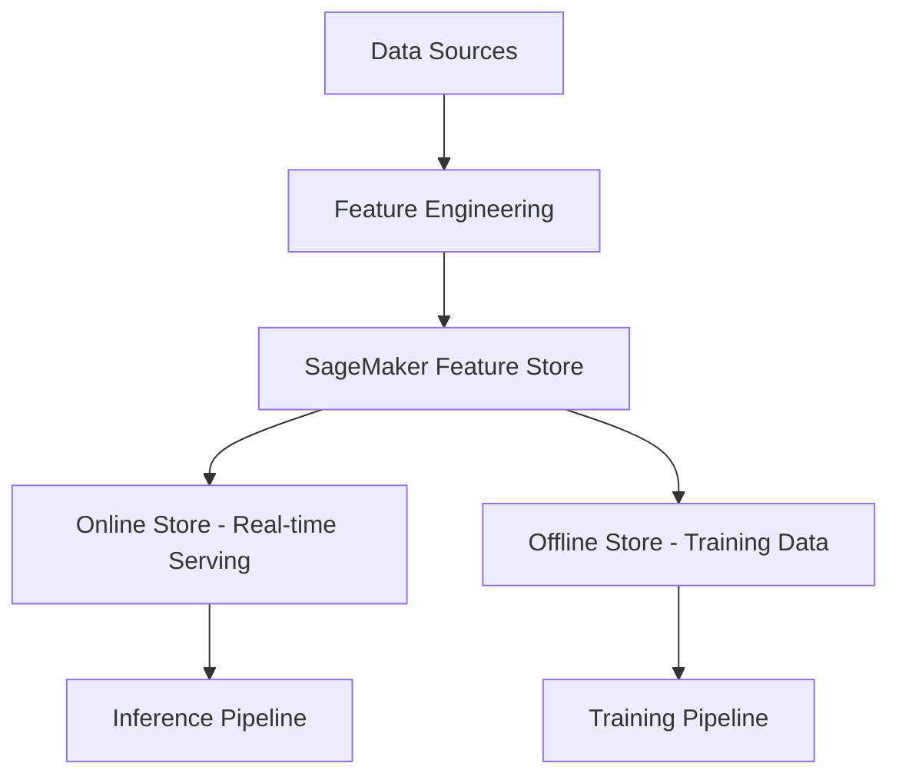

# How to Use SageMaker Feature Store

Author: [nawazdhandala](https://github.com/nawazdhandala)

Tags: AWS, SageMaker, Feature Store, Machine Learning, MLOps

Description: A practical guide to using Amazon SageMaker Feature Store for managing, storing, and serving machine learning features across teams and models.

---

Feature engineering is one of the most impactful parts of an ML project, but it's also one of the messiest. Teams end up with duplicate feature computation logic, training-serving skew, and no easy way to share features across projects. SageMaker Feature Store solves this by giving you a centralized repository for storing and serving ML features.

Let's walk through how to set it up, ingest features, and use them for both training and real-time inference.

## What Problem Does Feature Store Solve?

Without a feature store, here's what typically happens:

1. Data scientists compute features in notebooks for training
2. Engineers rewrite the same feature logic for the production serving pipeline
3. The two implementations drift apart over time
4. Nobody can find or reuse features from other projects
5. There's no audit trail for what features were used to train which model

Feature Store provides a single source of truth for features. You compute features once, store them, and use them everywhere.



## Core Concepts

Before diving into code, let's cover the key concepts:

- **Feature Group** - A logical grouping of features, like a table in a database. Each feature group has a schema, a record identifier, and an event time.
- **Online Store** - Low-latency storage for real-time feature serving. Think of it as a key-value store optimized for single-record lookups.
- **Offline Store** - Bulk storage in S3 (as Parquet files) for training dataset generation. Supports time-travel queries.
- **Record Identifier** - The primary key for looking up records (e.g., customer_id, product_id).
- **Event Time** - Timestamp for each record, enabling point-in-time lookups.

## Creating a Feature Group

Let's create a feature group for customer features.

```python
import sagemaker
from sagemaker.feature_store.feature_group import FeatureGroup
from sagemaker.session import Session
import pandas as pd
import time

session = Session()
role = sagemaker.get_execution_role()
bucket = session.default_bucket()
region = session.boto_region_name

# Define the feature group name
feature_group_name = 'customer-features'

# Create a sample DataFrame that defines the schema
# The DataFrame must include the record identifier and event time columns
sample_df = pd.DataFrame({
    'customer_id': ['C001'],
    'event_time': [str(int(time.time()))],  # Unix timestamp as string
    'total_purchases': [150.0],
    'avg_order_value': [45.50],
    'days_since_last_purchase': [7.0],
    'total_orders': [12.0],
    'return_rate': [0.05],
    'preferred_category': ['electronics'],
    'account_age_days': [365.0],
    'loyalty_score': [0.85]
})

# Create the Feature Group object
customer_feature_group = FeatureGroup(
    name=feature_group_name,
    sagemaker_session=session
)

# Load the schema from the DataFrame
customer_feature_group.load_feature_definitions(data_frame=sample_df)

# Create the feature group with both online and offline stores
customer_feature_group.create(
    s3_uri=f's3://{bucket}/feature-store/',
    record_identifier_name='customer_id',
    event_time_feature_name='event_time',
    role_arn=role,
    enable_online_store=True,   # Enable real-time serving
    description='Customer behavioral features for recommendation models'
)

# Wait for creation to complete
status = customer_feature_group.describe().get('FeatureGroupStatus')
while status == 'Creating':
    print(f"Status: {status}...")
    time.sleep(5)
    status = customer_feature_group.describe().get('FeatureGroupStatus')

print(f"Feature group status: {status}")
```

## Ingesting Features

Once the feature group exists, you can start putting features into it. There are two main approaches: single-record puts for real-time updates, and batch ingestion for loading historical data.

Here's how to do single-record ingestion.

```python
import time

# Ingest a single record
record = {
    'customer_id': 'C001',
    'event_time': str(int(time.time())),
    'total_purchases': 1250.75,
    'avg_order_value': 52.30,
    'days_since_last_purchase': 3.0,
    'total_orders': 24.0,
    'return_rate': 0.04,
    'preferred_category': 'electronics',
    'account_age_days': 730.0,
    'loyalty_score': 0.92
}

# Convert to the format Feature Store expects
customer_feature_group.put_record(
    Record=[
        {'FeatureName': k, 'ValueAsString': str(v)}
        for k, v in record.items()
    ]
)

print(f"Ingested record for customer {record['customer_id']}")
```

For batch ingestion, use a DataFrame.

```python
import pandas as pd
import numpy as np
import time

# Generate a batch of customer features
n_customers = 1000

batch_df = pd.DataFrame({
    'customer_id': [f'C{str(i).zfill(4)}' for i in range(1, n_customers + 1)],
    'event_time': [str(int(time.time()))] * n_customers,
    'total_purchases': np.random.uniform(10, 5000, n_customers).round(2),
    'avg_order_value': np.random.uniform(10, 200, n_customers).round(2),
    'days_since_last_purchase': np.random.randint(0, 365, n_customers).astype(float),
    'total_orders': np.random.randint(1, 100, n_customers).astype(float),
    'return_rate': np.random.uniform(0, 0.3, n_customers).round(3),
    'preferred_category': np.random.choice(
        ['electronics', 'clothing', 'books', 'home', 'sports'],
        n_customers
    ),
    'account_age_days': np.random.randint(30, 2000, n_customers).astype(float),
    'loyalty_score': np.random.uniform(0, 1, n_customers).round(3)
})

# Batch ingest using the built-in ingestion manager
ingestion_manager = customer_feature_group.ingest(
    data_frame=batch_df,
    max_workers=4,   # Parallel ingestion workers
    wait=True
)

print(f"Ingested {n_customers} customer records")
```

## Reading Features from the Online Store

The online store is designed for low-latency lookups during inference. You provide a record identifier and get back the latest feature values.

```python
import boto3

# Use the SageMaker Feature Store Runtime client
featurestore_runtime = boto3.client('sagemaker-featurestore-runtime')

# Get features for a specific customer
response = featurestore_runtime.get_record(
    FeatureGroupName='customer-features',
    RecordIdentifierValueAsString='C0042'
)

# Parse the response
features = {
    item['FeatureName']: item['ValueAsString']
    for item in response['Record']
}

print("Customer C0042 features:")
for name, value in features.items():
    print(f"  {name}: {value}")
```

You can also do batch lookups to get features for multiple records in one call.

```python
# Batch get records for multiple customers
response = featurestore_runtime.batch_get_record(
    Identifiers=[
        {
            'FeatureGroupName': 'customer-features',
            'RecordIdentifiersValueAsString': ['C0001', 'C0042', 'C0100']
        }
    ]
)

for record in response['Records']:
    features = {
        item['FeatureName']: item['ValueAsString']
        for item in record['Record']
    }
    print(f"Customer {features['customer_id']}: loyalty_score={features['loyalty_score']}")
```

## Querying the Offline Store for Training

The offline store is where Feature Store really shines for ML workflows. It stores all historical feature values in S3 as Parquet files, and you can query them using Athena.

```python
from sagemaker.feature_store.feature_group import FeatureGroup

# Build a training dataset using Athena queries
query = customer_feature_group.athena_query()

# The table name follows a convention
table_name = query.table_name
print(f"Athena table: {table_name}")

# Run a query to get training data
query_string = f"""
SELECT customer_id,
       total_purchases,
       avg_order_value,
       days_since_last_purchase,
       total_orders,
       return_rate,
       account_age_days,
       loyalty_score
FROM "{table_name}"
WHERE loyalty_score IS NOT NULL
"""

# Execute the query
query.run(
    query_string=query_string,
    output_location=f's3://{bucket}/query-results/'
)

# Wait for the query to complete
query.wait()

# Load results into a DataFrame
training_df = query.as_dataframe()
print(f"Training dataset: {len(training_df)} rows, {len(training_df.columns)} columns")
```

## Point-in-Time Queries

One of the most powerful features is point-in-time lookups. When training a model, you want the feature values as they were at the time an event happened, not the current values. This prevents data leakage.

```python
# Point-in-time join query
# Assuming you have a labels table with event timestamps
point_in_time_query = f"""
SELECT labels.customer_id,
       labels.purchased,
       labels.event_timestamp,
       features.total_purchases,
       features.avg_order_value,
       features.days_since_last_purchase,
       features.loyalty_score
FROM labels_table AS labels
LEFT JOIN "{table_name}" AS features
    ON labels.customer_id = features.customer_id
    AND features.event_time <= labels.event_timestamp
    AND features.event_time >= labels.event_timestamp - INTERVAL '24' HOUR
ORDER BY labels.event_timestamp DESC
"""
```

## Updating Feature Values

Features change over time. When you ingest a new record with the same record identifier but a newer event time, the online store updates to show the latest value, while the offline store keeps the historical record.

```python
import time

# Update features for an existing customer
updated_record = {
    'customer_id': 'C0042',
    'event_time': str(int(time.time())),  # New timestamp
    'total_purchases': 1500.00,           # Updated value
    'avg_order_value': 55.00,
    'days_since_last_purchase': 1.0,      # Just made a purchase
    'total_orders': 28.0,
    'return_rate': 0.035,
    'preferred_category': 'electronics',
    'account_age_days': 740.0,
    'loyalty_score': 0.95                 # Score improved
}

customer_feature_group.put_record(
    Record=[
        {'FeatureName': k, 'ValueAsString': str(v)}
        for k, v in updated_record.items()
    ]
)

# The online store now returns the updated values
# The offline store keeps both the old and new values
```

## Feature Group Discovery

When you have many feature groups, you need a way to find and understand them.

```python
import boto3

client = boto3.client('sagemaker')

# List all feature groups
response = client.list_feature_groups(
    SortBy='CreationTime',
    SortOrder='Descending'
)

for fg in response['FeatureGroupSummaries']:
    print(f"{fg['FeatureGroupName']}: {fg['FeatureGroupStatus']}")

# Describe a specific feature group to see its schema
details = client.describe_feature_group(
    FeatureGroupName='customer-features'
)

print(f"\nFeature definitions for {details['FeatureGroupName']}:")
for feature in details['FeatureDefinitions']:
    print(f"  {feature['FeatureName']}: {feature['FeatureType']}")
```

## Wrapping Up

SageMaker Feature Store bridges the gap between feature engineering and production serving. By centralizing features, you eliminate training-serving skew, make features discoverable and reusable, and get a full audit trail of feature values over time. Start by creating feature groups for your most commonly used features, then gradually migrate your existing feature pipelines to use the store. For the full picture of how Feature Store fits into an ML pipeline, check out [SageMaker Pipelines for MLOps](https://oneuptime.com/blog/post/sagemaker-pipelines-mlops/view).
