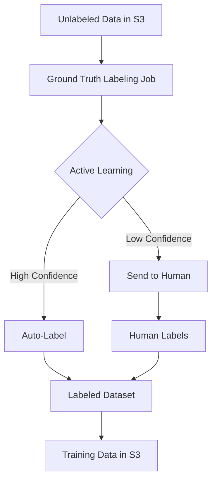

# How to Use SageMaker Ground Truth for Data Labeling

Author: [nawazdhandala](https://github.com/nawazdhandala)

Tags: AWS, SageMaker, Data Labeling, Machine Learning

Description: Set up Amazon SageMaker Ground Truth to create high-quality labeled datasets for machine learning using human annotators and automated labeling.

---

Every supervised ML model starts with labeled data, and getting that labeled data is often the hardest part of the whole project. Labeling thousands of images, text documents, or data points by hand is expensive and time-consuming. SageMaker Ground Truth makes this manageable by combining human labelers with active learning to reduce the amount of manual work needed.

This guide walks through setting up labeling jobs, managing your workforce, and using automated labeling to speed things up.

## How Ground Truth Works

Ground Truth orchestrates labeling jobs by distributing data to human annotators and collecting their labels. It supports several labeling strategies:

- **Amazon Mechanical Turk** - Crowdsourced labeling from the public workforce
- **Private workforce** - Your own team of annotators
- **Vendor workforce** - Professional labeling companies from the AWS Marketplace
- **Automated labeling** - Active learning that progressively labels data without human involvement



The active learning piece is the real game-changer. As human annotators label a subset of your data, Ground Truth trains a model to label the rest automatically. It only sends ambiguous cases to humans, which can reduce labeling costs by up to 70%.

## Setting Up an Image Classification Labeling Job

Let's set up a labeling job for classifying images. This is one of the most common use cases.

First, prepare your input data manifest file.

```python
import json
import boto3

s3 = boto3.client('s3')
bucket = 'my-labeling-bucket'

# Create an input manifest file
# Each line is a JSON object pointing to one data item
manifest_entries = []
for i in range(1, 101):  # 100 images to label
    entry = {
        'source-ref': f's3://{bucket}/images/image_{i:04d}.jpg'
    }
    manifest_entries.append(json.dumps(entry))

# Write the manifest to S3
manifest_body = '\n'.join(manifest_entries)
s3.put_object(
    Bucket=bucket,
    Key='manifests/input.manifest',
    Body=manifest_body
)

print(f"Created manifest with {len(manifest_entries)} items")
```

Now create the labeling job.

```python
import boto3

sagemaker_client = boto3.client('sagemaker')

# Create an image classification labeling job
sagemaker_client.create_labeling_job(
    LabelingJobName='product-image-classification',
    LabelAttributeName='product-category',
    InputConfig={
        'DataSource': {
            'S3DataSource': {
                'ManifestS3Uri': f's3://{bucket}/manifests/input.manifest'
            }
        }
    },
    OutputConfig={
        'S3OutputPath': f's3://{bucket}/labeling-output/'
    },
    RoleArn='arn:aws:iam::123456789012:role/SageMakerGroundTruthRole',
    LabelCategoryConfigS3Uri=f's3://{bucket}/configs/label-categories.json',
    HumanTaskConfig={
        'WorkteamArn': 'arn:aws:sagemaker:us-east-1:123456789012:workteam/private-crowd/my-team',
        'UiConfig': {
            'UiTemplateS3Uri': f's3://{bucket}/templates/image-classification.html'
        },
        'PreHumanTaskLambdaArn': 'arn:aws:lambda:us-east-1:123456789012:function:PRE-ImageMultiClass',
        'TaskTitle': 'Classify product images',
        'TaskDescription': 'Look at each image and select the correct product category',
        'NumberOfHumanWorkersPerDataObject': 3,  # 3 annotators per image
        'TaskTimeLimitInSeconds': 300,  # 5 minutes per task
        'AnnotationConsolidationConfig': {
            'AnnotationConsolidationLambdaArn':
                'arn:aws:lambda:us-east-1:123456789012:function:ACS-ImageMultiClass'
        }
    }
)

print("Labeling job created!")
```

The label categories configuration file defines the possible labels.

```json
{
    "document-version": "2018-11-28",
    "labels": [
        {"label": "Electronics"},
        {"label": "Clothing"},
        {"label": "Home & Garden"},
        {"label": "Books"},
        {"label": "Sports"},
        {"label": "Toys"},
        {"label": "Other"}
    ]
}
```

## Setting Up a Private Workforce

For sensitive data, you'll want to use your own team of annotators rather than a public workforce.

```python
# Create a private workforce using Cognito
sagemaker_client.create_workforce(
    WorkforceName='my-labeling-team',
    CognitoConfig={
        'UserPool': 'us-east-1_xxxxx',
        'ClientId': 'xxxxxxxxxxxxxxxx'
    }
)

# Create a work team within the workforce
sagemaker_client.create_workteam(
    WorkteamName='image-labelers',
    WorkforceName='my-labeling-team',
    MemberDefinitions=[
        {
            'CognitoMemberDefinition': {
                'UserPool': 'us-east-1_xxxxx',
                'UserGroup': 'labelers',
                'ClientId': 'xxxxxxxxxxxxxxxx'
            }
        }
    ],
    Description='Team for image classification tasks'
)

# Get the labeling portal URL
workforce = sagemaker_client.describe_workforce(WorkforceName='my-labeling-team')
print(f"Labeling portal: {workforce['Workforce']['SubDomain']}")
```

## Custom Labeling Templates

Ground Truth comes with built-in templates for common tasks, but you can create custom templates for specialized labeling workflows.

```html
<!-- custom-template.html -->
<script src="https://assets.crowd.aws/crowd-html-elements.js"></script>

<crowd-form>
    <crowd-image-classifier
        name="category"
        src="{{ task.input.source-ref | grant_read_access }}"
        header="What type of product is shown in this image?"
        categories="['Electronics', 'Clothing', 'Home', 'Books', 'Sports', 'Other']">

        <full-instructions header="Product Classification Instructions">
            <p>Look at the image carefully and select the category that best describes the product.</p>
            <p><strong>Electronics:</strong> Phones, computers, TVs, headphones, etc.</p>
            <p><strong>Clothing:</strong> Shirts, pants, shoes, accessories, etc.</p>
            <p><strong>Home:</strong> Furniture, kitchen items, decor, etc.</p>
            <p><strong>Books:</strong> Physical books, magazines, etc.</p>
            <p><strong>Sports:</strong> Exercise equipment, sports gear, etc.</p>
            <p><strong>Other:</strong> Anything that doesn't fit the above categories.</p>
        </full-instructions>

        <short-instructions>
            Select the product category for the shown image.
        </short-instructions>

    </crowd-image-classifier>
</crowd-form>
```

## Text Classification Labeling

Ground Truth isn't just for images. Here's how to set up a text classification job.

```python
# Create input manifest for text data
text_manifest = []
texts = [
    "The battery life on this phone is incredible",
    "Shipping was slow and the package arrived damaged",
    "Great value for the price, highly recommend",
    "The product stopped working after two weeks"
]

for i, text in enumerate(texts):
    entry = {
        'source': text,
        'id': f'text_{i}'
    }
    text_manifest.append(json.dumps(entry))

s3.put_object(
    Bucket=bucket,
    Key='manifests/text-input.manifest',
    Body='\n'.join(text_manifest)
)

# Text classification label categories
text_categories = {
    "document-version": "2018-11-28",
    "labels": [
        {"label": "Positive"},
        {"label": "Negative"},
        {"label": "Neutral"}
    ]
}

s3.put_object(
    Bucket=bucket,
    Key='configs/text-categories.json',
    Body=json.dumps(text_categories)
)
```

## Enabling Automated Labeling

Automated labeling uses active learning to reduce the number of items that need human annotation. Enable it by adding `LabelingJobAlgorithmsConfig` to your job.

```python
sagemaker_client.create_labeling_job(
    LabelingJobName='auto-label-images',
    LabelAttributeName='category',
    InputConfig={
        'DataSource': {
            'S3DataSource': {
                'ManifestS3Uri': f's3://{bucket}/manifests/input.manifest'
            }
        }
    },
    OutputConfig={
        'S3OutputPath': f's3://{bucket}/labeling-output/'
    },
    RoleArn='arn:aws:iam::123456789012:role/SageMakerGroundTruthRole',
    LabelCategoryConfigS3Uri=f's3://{bucket}/configs/label-categories.json',
    # Enable automated labeling
    LabelingJobAlgorithmsConfig={
        'LabelingJobAlgorithmSpecificationArn':
            'arn:aws:sagemaker:us-east-1:027400017018:labeling-job-algorithm-specification/image-classification'
    },
    HumanTaskConfig={
        'WorkteamArn': 'arn:aws:sagemaker:us-east-1:123456789012:workteam/private-crowd/my-team',
        'UiConfig': {
            'UiTemplateS3Uri': f's3://{bucket}/templates/image-classification.html'
        },
        'PreHumanTaskLambdaArn': 'arn:aws:lambda:us-east-1:123456789012:function:PRE-ImageMultiClass',
        'TaskTitle': 'Classify product images',
        'TaskDescription': 'Select the correct product category',
        'NumberOfHumanWorkersPerDataObject': 3,
        'TaskTimeLimitInSeconds': 300,
        'AnnotationConsolidationConfig': {
            'AnnotationConsolidationLambdaArn':
                'arn:aws:lambda:us-east-1:123456789012:function:ACS-ImageMultiClass'
        },
        'MaxConcurrentTaskCount': 100
    },
    StoppingConditions={
        'MaxHumanLabeledObjectCount': 500,       # Stop after labeling 500 items
        'MaxPercentageOfInputDatasetLabeled': 100 # Or when all items are labeled
    }
)
```

## Monitoring Labeling Jobs

Track the progress of your labeling jobs.

```python
# Check labeling job status
response = sagemaker_client.describe_labeling_job(
    LabelingJobName='product-image-classification'
)

print(f"Status: {response['LabelingJobStatus']}")
print(f"Total objects: {response['LabelCounters']['TotalLabeled'] + response['LabelCounters']['Unlabeled']}")
print(f"Labeled: {response['LabelCounters']['TotalLabeled']}")
print(f"Human labeled: {response['LabelCounters']['HumanLabeled']}")
print(f"Machine labeled: {response['LabelCounters']['MachineLabeled']}")
print(f"Failed: {response['LabelCounters']['FailedNonRetryableError']}")
```

## Using Labeled Data for Training

Once the labeling job completes, use the output manifest for model training.

```python
import json

# Read the output manifest
output_manifest_key = 'labeling-output/product-image-classification/manifests/output/output.manifest'
response = s3.get_object(Bucket=bucket, Key=output_manifest_key)
manifest_lines = response['Body'].read().decode().strip().split('\n')

# Parse labeled data
labeled_data = []
for line in manifest_lines:
    record = json.loads(line)
    source = record['source-ref']
    label = record['product-category']
    confidence = record.get('product-category-metadata', {}).get('confidence', 0)

    labeled_data.append({
        'source': source,
        'label': label,
        'confidence': confidence
    })

print(f"Got {len(labeled_data)} labeled items")

# Filter by confidence if desired
high_confidence = [d for d in labeled_data if d['confidence'] > 0.8]
print(f"High confidence labels: {len(high_confidence)}")
```

## Quality Control

Good labels mean good models. Here are some quality control strategies:

- **Multiple annotators** - Have 3-5 people label each item and use consensus
- **Gold standard items** - Include pre-labeled items to check annotator accuracy
- **Regular audits** - Periodically review a sample of completed labels
- **Clear instructions** - Ambiguous instructions lead to inconsistent labels

## Wrapping Up

SageMaker Ground Truth takes the operational burden out of data labeling while maintaining quality through multi-annotator consensus and automated labeling. The active learning component is particularly powerful - it can dramatically reduce the amount of human labeling needed, which saves both time and money. Once you have high-quality labels, feed them into your [SageMaker training pipeline](https://oneuptime.com/blog/post/2026-02-12-train-machine-learning-model-sagemaker/view) for model development.
