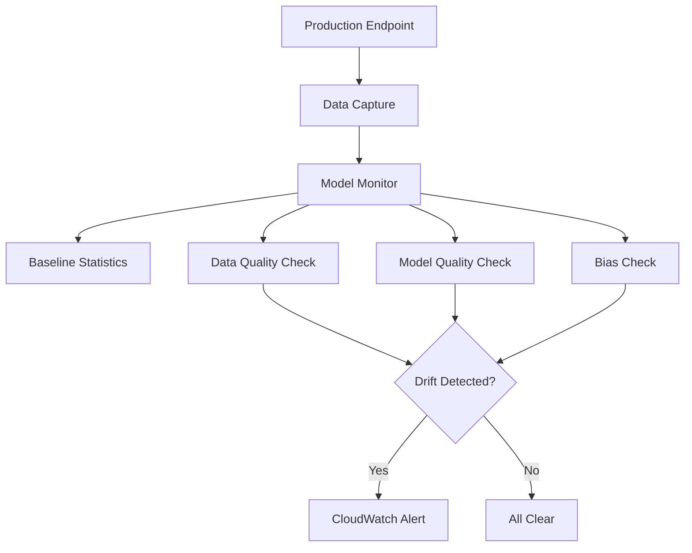

# How to Use SageMaker Model Monitor for Drift Detection

Author: [nawazdhandala](https://github.com/nawazdhandala)

Tags: AWS, SageMaker, MLOps, Model Monitoring, Drift Detection

Description: Set up Amazon SageMaker Model Monitor to detect data drift, model quality degradation, and bias drift in your deployed machine learning models.

---

Deploying a model isn't the finish line - it's the starting point of a whole new set of challenges. Models degrade over time as the data they see in production drifts away from what they were trained on. A fraud detection model trained on last year's data might miss new attack patterns. A recommendation engine might become stale as user preferences shift.

SageMaker Model Monitor continuously watches your deployed models for signs of trouble. It can detect data drift, model quality degradation, and even changes in bias metrics. Let's set it up.

## Why Models Degrade

There are several ways a deployed model can go sideways:

- **Data drift** - The statistical properties of input features change over time. Maybe a "typical" transaction amount has shifted upward.
- **Concept drift** - The relationship between features and the target changes. What used to predict fraud no longer does.
- **Model quality drift** - Prediction accuracy drops, even if the data looks similar.
- **Bias drift** - The model's fairness characteristics change over time.

Model Monitor helps you catch all of these before they impact your users.



## Step 1: Enable Data Capture

Before you can monitor anything, you need to capture the data flowing through your endpoint. Enable data capture when deploying your model.

```python
import sagemaker
from sagemaker.model_monitor import DataCaptureConfig

session = sagemaker.Session()
role = sagemaker.get_execution_role()
bucket = session.default_bucket()

# Configure data capture
data_capture_config = DataCaptureConfig(
    enable_capture=True,
    sampling_percentage=100,  # Capture all requests (reduce for high-traffic endpoints)
    destination_s3_uri=f's3://{bucket}/model-monitor/data-capture',
    capture_options=['Input', 'Output'],  # Capture both request and response
    csv_content_types=['text/csv'],
    json_content_types=['application/json']
)

# Deploy with data capture enabled
from sagemaker.model import Model
from sagemaker import image_uris

xgb_image = image_uris.retrieve('xgboost', session.boto_region_name, '1.7-1')

model = Model(
    image_uri=xgb_image,
    model_data='s3://my-bucket/models/fraud-model/model.tar.gz',
    role=role,
    sagemaker_session=session
)

predictor = model.deploy(
    initial_instance_count=1,
    instance_type='ml.m5.large',
    endpoint_name='fraud-detection-monitored',
    data_capture_config=data_capture_config
)
```

Data capture saves request/response pairs as JSON Lines files in S3. Each file contains the raw input, the model's output, and metadata like timestamps.

## Step 2: Create a Baseline

Model Monitor needs to know what "normal" looks like. You create a baseline from your training data - this captures the statistical properties (distributions, means, ranges) that the monitor uses for comparison.

```python
from sagemaker.model_monitor import DefaultModelMonitor
from sagemaker.model_monitor.dataset_format import DatasetFormat

# Create a Model Monitor instance
monitor = DefaultModelMonitor(
    role=role,
    instance_count=1,
    instance_type='ml.m5.xlarge',
    volume_size_in_gb=20,
    max_runtime_in_seconds=3600
)

# Generate baseline statistics and constraints from training data
monitor.suggest_baseline(
    baseline_dataset=f's3://{bucket}/training-data/train.csv',
    dataset_format=DatasetFormat.csv(header=True),
    output_s3_uri=f's3://{bucket}/model-monitor/baseline/',
    wait=True
)

print("Baseline generated!")
```

The baseline job produces two files:

- **statistics.json** - Descriptive statistics for each feature (mean, std, min, max, distribution)
- **constraints.json** - Rules for what's acceptable (e.g., no nulls in certain columns, values within expected ranges)

Let's inspect them.

```python
import json
import boto3

s3 = boto3.client('s3')

# Read the baseline statistics
stats_obj = s3.get_object(
    Bucket=bucket,
    Key='model-monitor/baseline/statistics.json'
)
stats = json.loads(stats_obj['Body'].read().decode())

# Show statistics for a few features
for feature in stats['features'][:3]:
    name = feature['name']
    numerical = feature.get('numerical_statistics', {})
    print(f"\nFeature: {name}")
    print(f"  Mean: {numerical.get('mean', 'N/A')}")
    print(f"  Std Dev: {numerical.get('std_dev', 'N/A')}")
    print(f"  Min: {numerical.get('min', 'N/A')}")
    print(f"  Max: {numerical.get('max', 'N/A')}")
```

## Step 3: Schedule Monitoring Jobs

Now set up recurring monitoring jobs that compare live data against the baseline.

```python
from sagemaker.model_monitor import CronExpressionGenerator

# Schedule monitoring to run every hour
monitor.create_monitoring_schedule(
    monitor_schedule_name='fraud-model-data-quality',
    endpoint_input='fraud-detection-monitored',
    output_s3_uri=f's3://{bucket}/model-monitor/reports/',
    statistics=monitor.baseline_statistics(),
    constraints=monitor.suggested_constraints(),
    schedule_cron_expression=CronExpressionGenerator.hourly(),
    enable_cloudwatch_metrics=True
)

print("Monitoring schedule created!")
```

## Step 4: Model Quality Monitoring

Data quality monitoring checks if the inputs look right. Model quality monitoring checks if the outputs are accurate. For this, you need ground truth labels.

```python
from sagemaker.model_monitor import ModelQualityMonitor

model_quality_monitor = ModelQualityMonitor(
    role=role,
    instance_count=1,
    instance_type='ml.m5.xlarge',
    volume_size_in_gb=20,
    max_runtime_in_seconds=3600,
    sagemaker_session=session
)

# Create a model quality baseline
model_quality_monitor.suggest_baseline(
    problem_type='BinaryClassification',
    baseline_dataset=f's3://{bucket}/baseline/predictions-with-labels.csv',
    dataset_format=DatasetFormat.csv(header=True),
    output_s3_uri=f's3://{bucket}/model-monitor/model-quality-baseline/',
    ground_truth_attribute='label',
    inference_attribute='prediction',
    probability_attribute='probability'
)
```

Set up the model quality schedule.

```python
from sagemaker.model_monitor import EndpointInput

model_quality_monitor.create_monitoring_schedule(
    monitor_schedule_name='fraud-model-quality',
    endpoint_input=EndpointInput(
        endpoint_name='fraud-detection-monitored',
        destination='/opt/ml/processing/input/endpoint'
    ),
    ground_truth_input=f's3://{bucket}/ground-truth/',
    output_s3_uri=f's3://{bucket}/model-monitor/quality-reports/',
    problem_type='BinaryClassification',
    schedule_cron_expression=CronExpressionGenerator.daily(),
    constraints=model_quality_monitor.suggested_constraints()
)
```

## Uploading Ground Truth Labels

For model quality monitoring to work, you need to provide ground truth labels. These typically arrive with a delay - for fraud detection, you might know the actual outcome days later.

```python
import json
import time

# Upload ground truth labels
# Each record matches a captured inference by its inference_id
ground_truth_records = [
    {
        'groundTruthData': {
            'data': '1',  # Actual label
            'encoding': 'CSV'
        },
        'eventMetadata': {
            'eventId': 'inference-id-001'  # Matches the captured inference
        },
        'eventVersion': '0'
    },
    {
        'groundTruthData': {
            'data': '0',
            'encoding': 'CSV'
        },
        'eventMetadata': {
            'eventId': 'inference-id-002'
        },
        'eventVersion': '0'
    }
]

# Write to S3 as JSON Lines
s3 = boto3.client('s3')
body = '\n'.join(json.dumps(record) for record in ground_truth_records)

s3.put_object(
    Bucket=bucket,
    Key=f'ground-truth/{time.strftime("%Y/%m/%d/%H")}/labels.jsonl',
    Body=body
)
```

## Checking Monitoring Results

After a monitoring job runs, check the results for any violations.

```python
# List monitoring executions
executions = monitor.list_executions()

for execution in executions[:5]:
    print(f"Execution: {execution.processing_job_name}")
    print(f"  Status: {execution.processing_job['ProcessingJobStatus']}")

    # Check for constraint violations
    violations = execution.constraint_violations()
    if violations:
        print(f"  Violations found: {len(violations.body_dict.get('violations', []))}")
        for v in violations.body_dict.get('violations', []):
            print(f"    - Feature: {v.get('feature_name')}")
            print(f"      Type: {v.get('constraint_check_type')}")
            print(f"      Description: {v.get('description')}")
    else:
        print("  No violations detected")
    print()
```

## Setting Up Alerts

When Model Monitor detects a violation, it publishes metrics to CloudWatch. Set up alerts to get notified.

```python
cloudwatch = boto3.client('cloudwatch')

# Create an alarm for data quality violations
cloudwatch.put_metric_alarm(
    AlarmName='fraud-model-data-drift-alarm',
    AlarmDescription='Alert when data drift is detected in the fraud model',
    MetricName='data_quality_constraint_violations',
    Namespace='aws/sagemaker/Endpoints/data-metrics',
    Dimensions=[
        {
            'Name': 'Endpoint',
            'Value': 'fraud-detection-monitored'
        },
        {
            'Name': 'MonitoringSchedule',
            'Value': 'fraud-model-data-quality'
        }
    ],
    Statistic='Sum',
    Period=3600,  # 1 hour
    EvaluationPeriods=1,
    Threshold=1.0,
    ComparisonOperator='GreaterThanOrEqualToThreshold',
    AlarmActions=[
        'arn:aws:sns:us-east-1:123456789012:ml-alerts'
    ]
)
```

For more comprehensive alerting that goes beyond CloudWatch, consider piping these alerts into [OneUptime](https://oneuptime.com/blog/post/aws-cloudwatch-alerting/view) for unified incident management.

## Handling Drift

When drift is detected, you have several options:

1. **Investigate** - Look at the monitoring reports to understand what changed
2. **Retrain** - If the drift is significant, retrain with recent data
3. **Update the baseline** - If the drift represents a legitimate shift, update the baseline
4. **Roll back** - If a recent model update caused quality issues, revert to the previous version

```python
# Update the baseline if drift is expected and acceptable
monitor.update_monitoring_schedule(
    schedule_name='fraud-model-data-quality',
    statistics=f's3://{bucket}/model-monitor/new-baseline/statistics.json',
    constraints=f's3://{bucket}/model-monitor/new-baseline/constraints.json'
)
```

## Wrapping Up

Model monitoring is the piece that makes ML deployments sustainable. Without it, you're betting that your model will perform the same in six months as it did on day one. That's a bad bet. SageMaker Model Monitor gives you continuous visibility into your model's behavior, catching issues before they impact your users. Set it up alongside your deployment and you'll sleep a lot better at night. For the full MLOps picture, combine monitoring with [SageMaker Pipelines](https://oneuptime.com/blog/post/2026-02-12-sagemaker-pipelines-mlops/view) for automated retraining when drift is detected.
