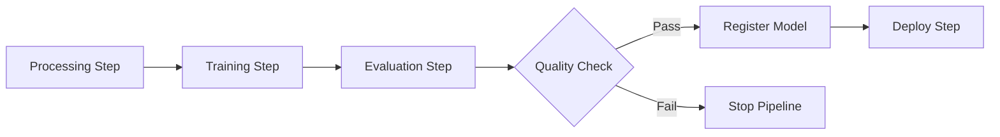

# How to Use SageMaker Pipelines for MLOps

Author: [nawazdhandala](https://github.com/nawazdhandala)

Tags: AWS, SageMaker, MLOps, Machine Learning, CI/CD

Description: Build end-to-end machine learning pipelines with Amazon SageMaker Pipelines for automated training, evaluation, and deployment workflows.

---

Moving from notebook experiments to production ML systems is where most teams stumble. You can't just retrain models by re-running cells in a notebook - you need automated, reproducible pipelines that handle data processing, training, evaluation, and deployment. SageMaker Pipelines is AWS's answer to this challenge. It lets you define ML workflows as code and run them automatically.

This guide walks through building a complete ML pipeline from scratch.

## What Are SageMaker Pipelines?

SageMaker Pipelines is a CI/CD service built specifically for machine learning. You define a directed acyclic graph (DAG) of steps - processing, training, evaluation, model registration, deployment - and SageMaker executes them in order, handling dependencies and data flow between steps.



Each step runs on its own managed infrastructure. If a step fails, the pipeline stops and you can see exactly where things went wrong.

## Setting Up Your First Pipeline

Let's build a pipeline that processes data, trains a model, evaluates it, and conditionally registers it based on performance.

Start by importing what you need and setting up parameters.

```python
import sagemaker
from sagemaker.workflow.pipeline import Pipeline
from sagemaker.workflow.parameters import ParameterString, ParameterFloat, ParameterInteger
from sagemaker.workflow.steps import ProcessingStep, TrainingStep
from sagemaker.workflow.step_collections import RegisterModel
from sagemaker.workflow.conditions import ConditionGreaterThanOrEqualTo
from sagemaker.workflow.condition_step import ConditionStep
from sagemaker.workflow.functions import JsonGet
from sagemaker.workflow.properties import PropertyFile

session = sagemaker.Session()
role = sagemaker.get_execution_role()
bucket = session.default_bucket()
region = session.boto_region_name

# Define pipeline parameters - these can be changed at execution time
input_data = ParameterString(
    name='InputDataUrl',
    default_value=f's3://{bucket}/raw-data/dataset.csv'
)

instance_type = ParameterString(
    name='TrainingInstanceType',
    default_value='ml.m5.xlarge'
)

model_approval_status = ParameterString(
    name='ModelApprovalStatus',
    default_value='PendingManualApproval'
)

min_auc_threshold = ParameterFloat(
    name='MinAucThreshold',
    default_value=0.75
)
```

## Step 1: Data Processing

Define the preprocessing step.

```python
from sagemaker.sklearn.processing import SKLearnProcessor
from sagemaker.processing import ProcessingInput, ProcessingOutput

sklearn_processor = SKLearnProcessor(
    framework_version='1.2-1',
    role=role,
    instance_type='ml.m5.xlarge',
    instance_count=1,
    sagemaker_session=session
)

processing_step = ProcessingStep(
    name='PreprocessData',
    processor=sklearn_processor,
    inputs=[
        ProcessingInput(
            source=input_data,  # Uses the pipeline parameter
            destination='/opt/ml/processing/input'
        )
    ],
    outputs=[
        ProcessingOutput(
            output_name='train',
            source='/opt/ml/processing/output/train',
            destination=f's3://{bucket}/pipeline/processed/train'
        ),
        ProcessingOutput(
            output_name='validation',
            source='/opt/ml/processing/output/validation',
            destination=f's3://{bucket}/pipeline/processed/validation'
        ),
        ProcessingOutput(
            output_name='test',
            source='/opt/ml/processing/output/test',
            destination=f's3://{bucket}/pipeline/processed/test'
        )
    ],
    code='scripts/preprocess.py'
)
```

## Step 2: Model Training

Set up the training step using the output from preprocessing.

```python
from sagemaker import image_uris
from sagemaker.inputs import TrainingInput
from sagemaker.estimator import Estimator

xgb_image = image_uris.retrieve(
    framework='xgboost',
    region=region,
    version='1.7-1'
)

xgb_estimator = Estimator(
    image_uri=xgb_image,
    role=role,
    instance_count=1,
    instance_type=instance_type,  # Pipeline parameter
    output_path=f's3://{bucket}/pipeline/model-output',
    sagemaker_session=session
)

xgb_estimator.set_hyperparameters(
    objective='binary:logistic',
    num_round=200,
    max_depth=6,
    eta=0.1,
    subsample=0.8,
    eval_metric='auc'
)

training_step = TrainingStep(
    name='TrainModel',
    estimator=xgb_estimator,
    inputs={
        'train': TrainingInput(
            s3_data=processing_step.properties.ProcessingOutputConfig.Outputs[
                'train'
            ].S3Output.S3Uri,
            content_type='text/csv'
        ),
        'validation': TrainingInput(
            s3_data=processing_step.properties.ProcessingOutputConfig.Outputs[
                'validation'
            ].S3Output.S3Uri,
            content_type='text/csv'
        )
    }
)
```

## Step 3: Model Evaluation

Evaluate the trained model and generate a metrics report.

```python
# Define a property file to capture evaluation metrics
evaluation_report = PropertyFile(
    name='EvaluationReport',
    output_name='evaluation',
    path='evaluation.json'
)

evaluation_processor = SKLearnProcessor(
    framework_version='1.2-1',
    role=role,
    instance_type='ml.m5.large',
    instance_count=1,
    sagemaker_session=session
)

evaluation_step = ProcessingStep(
    name='EvaluateModel',
    processor=evaluation_processor,
    inputs=[
        ProcessingInput(
            source=training_step.properties.ModelArtifacts.S3ModelArtifacts,
            destination='/opt/ml/processing/model'
        ),
        ProcessingInput(
            source=processing_step.properties.ProcessingOutputConfig.Outputs[
                'test'
            ].S3Output.S3Uri,
            destination='/opt/ml/processing/test'
        )
    ],
    outputs=[
        ProcessingOutput(
            output_name='evaluation',
            source='/opt/ml/processing/evaluation',
            destination=f's3://{bucket}/pipeline/evaluation'
        )
    ],
    code='scripts/evaluate.py',
    property_files=[evaluation_report]
)
```

## Step 4: Conditional Model Registration

Only register the model if it meets our quality threshold.

```python
from sagemaker.model_metrics import MetricsSource, ModelMetrics

# Define model metrics for the registry
model_metrics = ModelMetrics(
    model_statistics=MetricsSource(
        s3_uri=f's3://{bucket}/pipeline/evaluation/evaluation.json',
        content_type='application/json'
    )
)

# Register the model in SageMaker Model Registry
register_step = RegisterModel(
    name='RegisterModel',
    estimator=xgb_estimator,
    model_data=training_step.properties.ModelArtifacts.S3ModelArtifacts,
    content_types=['text/csv'],
    response_types=['text/csv'],
    inference_instances=['ml.m5.large', 'ml.m5.xlarge'],
    transform_instances=['ml.m5.xlarge'],
    model_package_group_name='classification-models',
    approval_status=model_approval_status,
    model_metrics=model_metrics
)

# Create a condition: only register if AUC >= threshold
auc_condition = ConditionGreaterThanOrEqualTo(
    left=JsonGet(
        step_name=evaluation_step.name,
        property_file=evaluation_report,
        json_path='classification_metrics.auc_roc.value'
    ),
    right=min_auc_threshold
)

# Conditional step - register model only if condition is met
condition_step = ConditionStep(
    name='CheckModelQuality',
    conditions=[auc_condition],
    if_steps=[register_step],
    else_steps=[]  # Do nothing if quality is too low
)
```

## Putting It All Together

Now combine all steps into a pipeline.

```python
# Create the pipeline
pipeline = Pipeline(
    name='ml-classification-pipeline',
    parameters=[
        input_data,
        instance_type,
        model_approval_status,
        min_auc_threshold
    ],
    steps=[
        processing_step,
        training_step,
        evaluation_step,
        condition_step
    ],
    sagemaker_session=session
)

# Create or update the pipeline
pipeline.upsert(role_arn=role)

print(f"Pipeline ARN: {pipeline.describe()['PipelineArn']}")
```

## Running the Pipeline

Execute the pipeline with default or custom parameters.

```python
# Start an execution with default parameters
execution = pipeline.start()

print(f"Execution ARN: {execution.arn}")

# Or override parameters at runtime
execution = pipeline.start(
    parameters={
        'InputDataUrl': f's3://{bucket}/new-data/dataset.csv',
        'TrainingInstanceType': 'ml.m5.2xlarge',
        'MinAucThreshold': 0.80
    }
)

# Wait for completion
execution.wait()

# Check the result
print(f"Status: {execution.describe()['PipelineExecutionStatus']}")
```

## Monitoring Pipeline Executions

Track what's happening in your pipeline.

```python
# List all step details
steps = execution.list_steps()

for step in steps:
    print(f"Step: {step['StepName']}")
    print(f"  Status: {step['StepStatus']}")
    if 'FailureReason' in step:
        print(f"  Failure: {step['FailureReason']}")
    print()
```

For production pipelines, set up monitoring through [OneUptime](https://oneuptime.com/blog/post/aws-cloudwatch-alerting/view) to get alerted when pipeline executions fail or take longer than expected.

## Triggering Pipelines Automatically

You can trigger pipeline executions from EventBridge, Lambda, or even GitHub Actions.

```python
import boto3

# Trigger from a Lambda function
def lambda_handler(event, context):
    client = boto3.client('sagemaker')

    response = client.start_pipeline_execution(
        PipelineName='ml-classification-pipeline',
        PipelineExecutionDisplayName=f'triggered-{event["source"]}',
        PipelineParameters=[
            {
                'Name': 'InputDataUrl',
                'Value': event['data_location']
            }
        ]
    )

    return {
        'statusCode': 200,
        'executionArn': response['PipelineExecutionArn']
    }
```

## Best Practices

After building a few pipelines, here's what works well:

- **Parameterize everything** - Instance types, data locations, thresholds. This lets you reuse the same pipeline for different scenarios.
- **Use caching** - SageMaker Pipelines can cache step outputs. If your data hasn't changed, the processing step won't re-run.
- **Version your pipeline code** - Store pipeline definitions in Git alongside your training scripts.
- **Keep steps focused** - Each step should do one thing. It's easier to debug and reuse.
- **Test locally first** - Run your processing and training scripts locally with small data before wiring them into a pipeline.

## Wrapping Up

SageMaker Pipelines turns ad-hoc ML experiments into repeatable, automated workflows. The declarative approach means you define what should happen, and SageMaker figures out how to make it happen on managed infrastructure. Combined with the [Model Registry](https://oneuptime.com/blog/post/2026-02-12-sagemaker-model-registry/view) and [Model Monitor](https://oneuptime.com/blog/post/2026-02-12-sagemaker-model-monitor-drift-detection/view), you've got the foundation of a solid MLOps practice.
