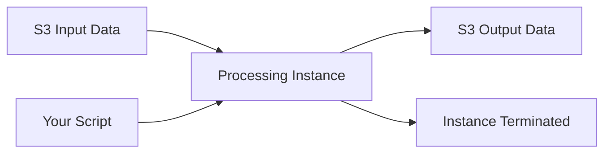

# How to Use SageMaker Processing Jobs for Data Preparation

Author: [nawazdhandala](https://github.com/nawazdhandala)

Tags: AWS, SageMaker, Data Engineering, Machine Learning

Description: Learn how to use Amazon SageMaker Processing Jobs to run data preparation, feature engineering, and model evaluation workloads at scale.

---

Data preparation is where most ML projects spend the majority of their time. Cleaning, transforming, and validating data isn't glamorous, but it's critical. Running these jobs on your local machine works until your dataset grows beyond what your laptop can handle. SageMaker Processing Jobs let you offload data preparation to managed infrastructure - spin up a powerful instance, run your script, and shut it down when it's done.

This guide covers how to set up and run Processing Jobs for common data preparation tasks.

## What Are Processing Jobs?

A Processing Job is essentially a managed compute job. You give SageMaker a script, tell it where to find input data (usually S3), specify where to write output data, and pick an instance type. SageMaker provisions the instance, copies the data, runs your script, saves the output back to S3, and terminates the instance.



The beauty is that your script runs in a familiar environment - Python with whatever libraries you need. There's no special API to learn beyond specifying inputs and outputs.

## Running a Basic Processing Job

Let's start with a straightforward example: a data cleaning script that runs on SageMaker.

First, write your processing script.

```python
# preprocessing.py - Runs on the SageMaker Processing instance

import os
import pandas as pd
import numpy as np
from sklearn.preprocessing import StandardScaler, LabelEncoder

def main():
    # SageMaker mounts input data at /opt/ml/processing/input/
    input_dir = '/opt/ml/processing/input'
    output_dir = '/opt/ml/processing/output'

    # Read the raw data
    raw_data = pd.read_csv(os.path.join(input_dir, 'raw_data.csv'))
    print(f"Loaded {len(raw_data)} rows with {len(raw_data.columns)} columns")

    # Drop duplicates
    data = raw_data.drop_duplicates()
    print(f"After dedup: {len(data)} rows")

    # Handle missing values
    numeric_cols = data.select_dtypes(include=[np.number]).columns
    categorical_cols = data.select_dtypes(include=['object']).columns

    # Fill numeric columns with median
    for col in numeric_cols:
        if data[col].isnull().sum() > 0:
            median_val = data[col].median()
            data[col] = data[col].fillna(median_val)
            print(f"Filled {col} nulls with median: {median_val:.2f}")

    # Encode categorical columns
    label_encoders = {}
    for col in categorical_cols:
        le = LabelEncoder()
        data[col] = le.fit_transform(data[col].astype(str))
        label_encoders[col] = le

    # Scale numeric features
    scaler = StandardScaler()
    data[numeric_cols] = scaler.fit_transform(data[numeric_cols])

    # Split into train/validation/test
    from sklearn.model_selection import train_test_split

    train_data, temp_data = train_test_split(data, test_size=0.3, random_state=42)
    val_data, test_data = train_test_split(temp_data, test_size=0.5, random_state=42)

    print(f"Train: {len(train_data)}, Val: {len(val_data)}, Test: {len(test_data)}")

    # Save processed data to the output directory
    os.makedirs(os.path.join(output_dir, 'train'), exist_ok=True)
    os.makedirs(os.path.join(output_dir, 'validation'), exist_ok=True)
    os.makedirs(os.path.join(output_dir, 'test'), exist_ok=True)

    train_data.to_csv(os.path.join(output_dir, 'train', 'train.csv'), index=False)
    val_data.to_csv(os.path.join(output_dir, 'validation', 'validation.csv'), index=False)
    test_data.to_csv(os.path.join(output_dir, 'test', 'test.csv'), index=False)

    print("Processing complete!")

if __name__ == '__main__':
    main()
```

Now launch it as a Processing Job.

```python
from sagemaker.processing import ScriptProcessor, ProcessingInput, ProcessingOutput
from sagemaker import Session, get_execution_role

session = Session()
role = get_execution_role()
bucket = session.default_bucket()

# Create a ScriptProcessor with a scikit-learn image
from sagemaker.sklearn.processing import SKLearnProcessor

sklearn_processor = SKLearnProcessor(
    framework_version='1.2-1',
    role=role,
    instance_type='ml.m5.xlarge',
    instance_count=1,
    sagemaker_session=session,
    max_runtime_in_seconds=3600  # 1 hour timeout
)

# Run the processing job
sklearn_processor.run(
    code='preprocessing.py',
    inputs=[
        ProcessingInput(
            source=f's3://{bucket}/raw-data/',
            destination='/opt/ml/processing/input'
        )
    ],
    outputs=[
        ProcessingOutput(
            source='/opt/ml/processing/output/train',
            destination=f's3://{bucket}/processed-data/train'
        ),
        ProcessingOutput(
            source='/opt/ml/processing/output/validation',
            destination=f's3://{bucket}/processed-data/validation'
        ),
        ProcessingOutput(
            source='/opt/ml/processing/output/test',
            destination=f's3://{bucket}/processed-data/test'
        )
    ]
)
```

## Using Your Own Container

For more control over the environment, use a custom Docker image with ScriptProcessor.

```python
from sagemaker.processing import ScriptProcessor

# Use your own ECR image
custom_processor = ScriptProcessor(
    image_uri='123456789012.dkr.ecr.us-east-1.amazonaws.com/my-processing-image:latest',
    role=role,
    instance_count=1,
    instance_type='ml.m5.2xlarge',
    command=['python3'],
    sagemaker_session=session
)

custom_processor.run(
    code='advanced_preprocessing.py',
    inputs=[
        ProcessingInput(
            source=f's3://{bucket}/raw-data/',
            destination='/opt/ml/processing/input'
        )
    ],
    outputs=[
        ProcessingOutput(
            source='/opt/ml/processing/output',
            destination=f's3://{bucket}/processed-data/'
        )
    ]
)
```

## PySpark Processing Jobs

For really large datasets, you might want to use PySpark. SageMaker has first-class support for Spark Processing Jobs.

```python
from sagemaker.spark.processing import PySparkProcessor

spark_processor = PySparkProcessor(
    base_job_name='spark-processing',
    framework_version='3.3',
    role=role,
    instance_count=3,        # Spark cluster with 3 nodes
    instance_type='ml.m5.xlarge',
    sagemaker_session=session
)
```

Here's a PySpark processing script.

```python
# spark_preprocessing.py

from pyspark.sql import SparkSession
from pyspark.sql.functions import col, when, mean, count
from pyspark.ml.feature import VectorAssembler, StandardScaler, StringIndexer
import sys

def main():
    spark = SparkSession.builder.appName('DataPreprocessing').getOrCreate()

    # Read input data
    input_path = sys.argv[1]
    output_path = sys.argv[2]

    df = spark.read.csv(input_path, header=True, inferSchema=True)
    print(f"Loaded {df.count()} rows")

    # Remove rows where target column is null
    df = df.dropna(subset=['target'])

    # Fill missing numeric values with column means
    numeric_columns = [
        field.name for field in df.schema.fields
        if str(field.dataType) in ('IntegerType()', 'DoubleType()', 'FloatType()')
    ]

    for col_name in numeric_columns:
        mean_val = df.agg(mean(col(col_name))).collect()[0][0]
        if mean_val is not None:
            df = df.fillna({col_name: mean_val})

    # Index string columns
    string_columns = [
        field.name for field in df.schema.fields
        if str(field.dataType) == 'StringType()' and field.name != 'target'
    ]

    for col_name in string_columns:
        indexer = StringIndexer(inputCol=col_name, outputCol=f'{col_name}_indexed')
        df = indexer.fit(df).transform(df)
        df = df.drop(col_name)

    # Split the data
    train_df, val_df, test_df = df.randomSplit([0.7, 0.15, 0.15], seed=42)

    # Write output
    train_df.write.mode('overwrite').parquet(f'{output_path}/train')
    val_df.write.mode('overwrite').parquet(f'{output_path}/validation')
    test_df.write.mode('overwrite').parquet(f'{output_path}/test')

    print(f"Train: {train_df.count()}, Val: {val_df.count()}, Test: {test_df.count()}")

    spark.stop()

if __name__ == '__main__':
    main()
```

Run the Spark job.

```python
from sagemaker.processing import ProcessingInput, ProcessingOutput

spark_processor.run(
    submit_app='spark_preprocessing.py',
    arguments=[
        's3://my-bucket/raw-data/',
        's3://my-bucket/processed-data/'
    ],
    spark_event_logs_s3_uri=f's3://{bucket}/spark-logs/',
    logs=True
)
```

## Model Evaluation as a Processing Job

Processing Jobs aren't just for data prep. They're also perfect for model evaluation after training.

```python
# evaluate.py - Model evaluation processing script

import os
import json
import joblib
import pandas as pd
import numpy as np
from sklearn.metrics import (
    accuracy_score, precision_score, recall_score,
    f1_score, roc_auc_score, confusion_matrix
)

def main():
    model_dir = '/opt/ml/processing/model'
    test_dir = '/opt/ml/processing/test'
    output_dir = '/opt/ml/processing/evaluation'

    # Load the trained model
    model = joblib.load(os.path.join(model_dir, 'model.joblib'))

    # Load test data
    test_data = pd.read_csv(os.path.join(test_dir, 'test.csv'))
    y_test = test_data.iloc[:, 0].values
    X_test = test_data.iloc[:, 1:].values

    # Generate predictions
    predictions = model.predict(X_test)
    probabilities = model.predict_proba(X_test)[:, 1]

    # Calculate metrics
    metrics = {
        'accuracy': float(accuracy_score(y_test, predictions)),
        'precision': float(precision_score(y_test, predictions)),
        'recall': float(recall_score(y_test, predictions)),
        'f1': float(f1_score(y_test, predictions)),
        'auc_roc': float(roc_auc_score(y_test, probabilities)),
        'confusion_matrix': confusion_matrix(y_test, predictions).tolist()
    }

    print("Evaluation Results:")
    for key, value in metrics.items():
        if key != 'confusion_matrix':
            print(f"  {key}: {value:.4f}")

    # Save evaluation report
    os.makedirs(output_dir, exist_ok=True)
    with open(os.path.join(output_dir, 'evaluation.json'), 'w') as f:
        json.dump(metrics, f, indent=2)

    print("Evaluation complete!")

if __name__ == '__main__':
    main()
```

Launch the evaluation job.

```python
sklearn_processor.run(
    code='evaluate.py',
    inputs=[
        ProcessingInput(
            source=f's3://{bucket}/model-output/model.tar.gz',
            destination='/opt/ml/processing/model'
        ),
        ProcessingInput(
            source=f's3://{bucket}/processed-data/test',
            destination='/opt/ml/processing/test'
        )
    ],
    outputs=[
        ProcessingOutput(
            source='/opt/ml/processing/evaluation',
            destination=f's3://{bucket}/evaluation-results/'
        )
    ]
)
```

## Scheduling Processing Jobs

For recurring data preparation tasks, you can trigger Processing Jobs on a schedule using EventBridge.

```python
import boto3
import json

events_client = boto3.client('events')
lambda_client = boto3.client('lambda')

# Create a rule that triggers daily at 2 AM UTC
events_client.put_rule(
    Name='daily-data-processing',
    ScheduleExpression='cron(0 2 * * ? *)',
    State='ENABLED',
    Description='Trigger daily data processing job'
)

# The Lambda function would start the Processing Job
# You'd create a Lambda that calls the SageMaker API to start the job
```

## Monitoring and Debugging

Processing Jobs emit CloudWatch logs and metrics. You can check the status programmatically.

```python
import boto3

client = boto3.client('sagemaker')

# List recent processing jobs
response = client.list_processing_jobs(
    SortBy='CreationTime',
    SortOrder='Descending',
    MaxResults=5
)

for job in response['ProcessingJobSummaries']:
    print(f"{job['ProcessingJobName']}: {job['ProcessingJobStatus']}")
```

For production pipelines, pipe these logs into [OneUptime](https://oneuptime.com/blog/post/aws-cloudwatch-alerting/view) so you get notified when jobs fail.

## Cost Tips

Processing Jobs charge you for the instance time plus any S3 data transfer. A few ways to keep costs reasonable:

- **Right-size your instances** - Don't use ml.m5.4xlarge for a job that only needs 4 GB of RAM
- **Use Spot instances** - Processing Jobs don't support managed spot directly, but you can use SageMaker Pipelines to achieve similar savings
- **Compress your data** - Reading compressed files from S3 is faster and cheaper than uncompressed
- **Clean up S3** - Processing Jobs create output in S3. Set lifecycle rules to clean up old data

## Wrapping Up

Processing Jobs are the workhorse of SageMaker data pipelines. They're simple, flexible, and cost-effective since you only pay for the compute time you use. Whether you're cleaning data with pandas, running Spark ETL jobs, or evaluating model performance, the pattern is the same: define inputs, write a script, define outputs, and run. When you're ready to chain processing jobs with training and deployment, check out [SageMaker Pipelines](https://oneuptime.com/blog/post/sagemaker-pipelines-mlops/view) for orchestration.
