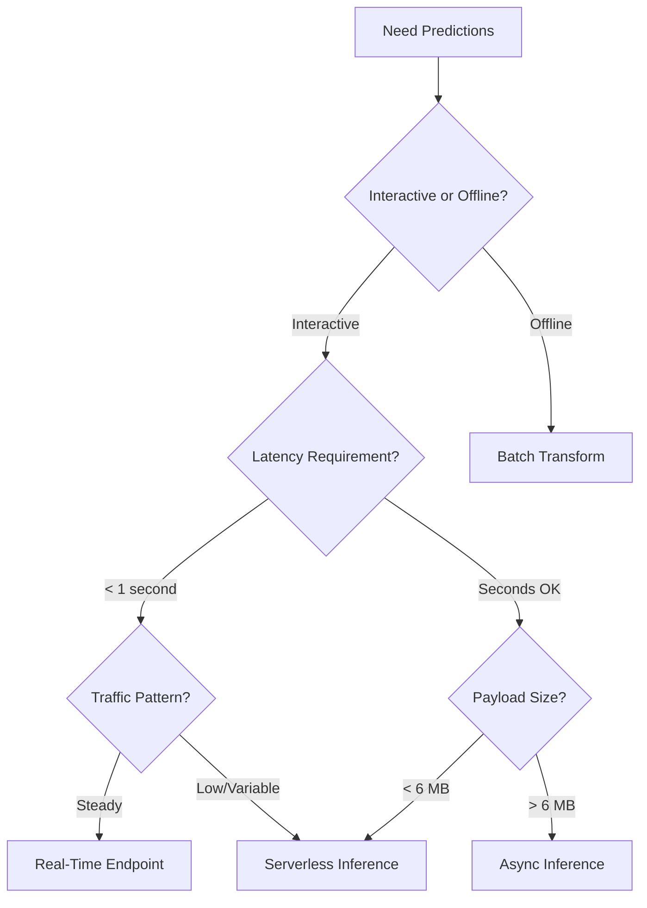

# How to Use SageMaker Real-Time vs Batch vs Async Inference

Author: [nawazdhandala](https://github.com/nawazdhandala)

Tags: AWS, SageMaker, Machine Learning, Model Deployment, Inference

Description: Compare SageMaker's four inference options - real-time, batch, async, and serverless - to choose the right deployment pattern for your ML workload.

---

SageMaker gives you four ways to get predictions from a deployed model: real-time endpoints, batch transform, asynchronous inference, and serverless inference. Choosing the wrong one can cost you money, add unnecessary latency, or create operational headaches. Choosing the right one depends on your traffic patterns, latency requirements, and budget.

Let's break down each option so you can pick the best fit for your use case.

## The Four Inference Options at a Glance

| Feature | Real-Time | Batch | Async | Serverless |
|---------|-----------|-------|-------|------------|
| Latency | Milliseconds | Minutes to hours | Seconds to minutes | Seconds (cold start) |
| Scaling | Manual or auto | Job-based | Queue-based | Automatic |
| Cost model | Per-instance-hour | Per-instance-hour | Per-instance-hour | Per-request |
| Scale to zero | No | Yes (jobs are ephemeral) | Yes | Yes |
| Max payload | 6 MB | Unlimited (S3) | 1 GB | 6 MB |
| Best for | Interactive apps | Large datasets | Large payloads, variable traffic | Low traffic |

## Real-Time Inference

Real-time endpoints are the standard deployment option. Your model runs on one or more instances that are always on and ready to serve requests.

```python
import sagemaker
from sagemaker.model import Model
from sagemaker import image_uris

session = sagemaker.Session()
role = sagemaker.get_execution_role()
region = session.boto_region_name

xgb_image = image_uris.retrieve('xgboost', region, '1.7-1')

model = Model(
    image_uri=xgb_image,
    model_data='s3://my-bucket/models/model.tar.gz',
    role=role,
    sagemaker_session=session
)

# Deploy as a real-time endpoint
predictor = model.deploy(
    initial_instance_count=2,      # Two instances for high availability
    instance_type='ml.m5.xlarge',
    endpoint_name='realtime-endpoint'
)

# Invoke it synchronously - response comes back immediately
import boto3
runtime = boto3.client('sagemaker-runtime')

response = runtime.invoke_endpoint(
    EndpointName='realtime-endpoint',
    ContentType='text/csv',
    Body='1.5,2.3,0.7,4.1,3.2'
)

prediction = response['Body'].read().decode()
print(f"Prediction: {prediction}")
```

**Use when**: Your application needs sub-second responses. Think recommendation engines, fraud detection, search ranking, or any interactive application.

**Watch out for**: Cost. You're paying for instances whether they're handling requests or sitting idle. Set up auto-scaling to match capacity to demand.

## Batch Transform

Batch transform is for when you have a large dataset and want predictions for all of it. SageMaker spins up instances, processes the entire dataset, writes results to S3, and shuts down.

```python
from sagemaker.transformer import Transformer

# Create a transformer from a trained model
transformer = sagemaker.transformer.Transformer(
    model_name='my-xgb-model',
    instance_count=3,               # Parallelize across 3 instances
    instance_type='ml.m5.xlarge',
    output_path='s3://my-bucket/batch-output/',
    strategy='MultiRecord',         # Process multiple records per request
    max_payload=6,                  # Max payload size in MB
    assemble_with='Line',
    sagemaker_session=session
)

# Run batch prediction on an entire dataset in S3
transformer.transform(
    data='s3://my-bucket/batch-input/dataset.csv',
    content_type='text/csv',
    split_type='Line',              # Split input file by lines
    join_source='Input',            # Join predictions with input data
    wait=True
)

print(f"Batch results saved to: {transformer.output_path}")
```

You can also run batch transform right after training.

```python
# After training with an estimator
transformer = xgb_estimator.transformer(
    instance_count=2,
    instance_type='ml.m5.xlarge',
    output_path='s3://my-bucket/batch-predictions/'
)

transformer.transform(
    data='s3://my-bucket/scoring-data/',
    content_type='text/csv',
    split_type='Line'
)
```

**Use when**: You need to score a large dataset all at once. Monthly credit scoring, periodic customer segmentation, or any offline prediction job.

**Watch out for**: It's not real-time. You can't use batch transform for interactive applications. Also, the minimum job duration means very small datasets aren't cost-effective.

## Asynchronous Inference

Async inference sits between real-time and batch. You submit a request, get back a token, and poll for the result later. It's designed for large payloads or when inference takes more than a few seconds.

```python
from sagemaker.async_inference import AsyncInferenceConfig

# Configure async inference
async_config = AsyncInferenceConfig(
    output_path='s3://my-bucket/async-output/',
    max_concurrent_invocations_per_instance=4,
    notification_config={
        'SuccessTopic': 'arn:aws:sns:us-east-1:123456789012:async-success',
        'ErrorTopic': 'arn:aws:sns:us-east-1:123456789012:async-error'
    }
)

# Deploy with async configuration
predictor = model.deploy(
    initial_instance_count=1,
    instance_type='ml.m5.xlarge',
    endpoint_name='async-endpoint',
    async_inference_config=async_config
)
```

Invoke it by uploading the payload to S3 and passing the S3 URI.

```python
import boto3
import json
import time

runtime = boto3.client('sagemaker-runtime')

# For async, upload payload to S3 first (supports up to 1 GB)
s3 = boto3.client('s3')
s3.put_object(
    Bucket='my-bucket',
    Key='async-input/request-001.csv',
    Body='1.5,2.3,0.7,4.1,3.2\n2.1,1.8,0.3,3.5,4.2\n...'
)

# Invoke asynchronously
response = runtime.invoke_endpoint_async(
    EndpointName='async-endpoint',
    InputLocation='s3://my-bucket/async-input/request-001.csv',
    ContentType='text/csv'
)

output_location = response['OutputLocation']
print(f"Results will be at: {output_location}")

# Poll for results (or use SNS notification)
while True:
    try:
        result = s3.get_object(
            Bucket='my-bucket',
            Key=output_location.replace(f's3://my-bucket/', '')
        )
        prediction = result['Body'].read().decode()
        print(f"Result: {prediction}")
        break
    except s3.exceptions.NoSuchKey:
        print("Still processing...")
        time.sleep(5)
```

A key feature of async inference is that it can scale to zero instances when there are no requests in the queue.

```python
# Configure auto-scaling with scale-to-zero for async endpoints
asg_client = boto3.client('application-autoscaling')

asg_client.register_scalable_target(
    ServiceNamespace='sagemaker',
    ResourceId='endpoint/async-endpoint/variant/AllTraffic',
    ScalableDimension='sagemaker:variant:DesiredInstanceCount',
    MinCapacity=0,   # Scale to zero!
    MaxCapacity=5
)

# Scale based on the queue depth
asg_client.put_scaling_policy(
    PolicyName='async-queue-scaling',
    ServiceNamespace='sagemaker',
    ResourceId='endpoint/async-endpoint/variant/AllTraffic',
    ScalableDimension='sagemaker:variant:DesiredInstanceCount',
    PolicyType='TargetTrackingScaling',
    TargetTrackingScalingPolicyConfiguration={
        'TargetValue': 5.0,  # Target 5 requests in queue per instance
        'CustomizedMetricSpecification': {
            'MetricName': 'ApproximateBacklogSizePerInstance',
            'Namespace': 'AWS/SageMaker',
            'Dimensions': [
                {'Name': 'EndpointName', 'Value': 'async-endpoint'}
            ],
            'Statistic': 'Average'
        },
        'ScaleInCooldown': 600,
        'ScaleOutCooldown': 120
    }
)
```

**Use when**: Payloads are large (images, videos, documents), inference takes more than 60 seconds, or traffic is very bursty and you want scale-to-zero.

**Watch out for**: It's not synchronous. Your application needs to handle the async pattern - either polling or using SNS notifications.

## Serverless Inference

Serverless inference automatically provisions compute when requests arrive and scales to zero when idle. You pay per request, not per instance-hour.

```python
from sagemaker.serverless import ServerlessInferenceConfig

serverless_config = ServerlessInferenceConfig(
    memory_size_in_mb=2048,
    max_concurrency=10
)

predictor = model.deploy(
    serverless_inference_config=serverless_config,
    endpoint_name='serverless-endpoint'
)

# Invoke it like a regular endpoint
response = runtime.invoke_endpoint(
    EndpointName='serverless-endpoint',
    ContentType='text/csv',
    Body='1.5,2.3,0.7,4.1,3.2'
)

print(response['Body'].read().decode())
```

**Use when**: Traffic is low and unpredictable. Development endpoints, internal tools, or models that get a handful of requests per hour.

**Watch out for**: Cold starts can add several seconds. Not suitable for latency-sensitive applications. Memory is capped at 6 GB.

For a deeper dive into serverless, see our [SageMaker Serverless Inference guide](https://oneuptime.com/blog/post/2026-02-12-sagemaker-serverless-inference/view).

## Decision Framework

Here's a flowchart to help you decide.



## Cost Comparison

Let's compare costs for different traffic levels, assuming ml.m5.xlarge instances at approximately $0.269/hour.

```python
# Cost comparison for different traffic levels

scenarios = [
    {"name": "Low traffic (100 req/day)", "requests_per_day": 100},
    {"name": "Medium traffic (10K req/day)", "requests_per_day": 10000},
    {"name": "High traffic (1M req/day)", "requests_per_day": 1000000},
]

instance_hourly_rate = 0.269
serverless_rate_per_sec_per_gb = 0.0000200  # Approximate
inference_time_sec = 0.1
memory_gb = 2

for scenario in scenarios:
    daily_requests = scenario["requests_per_day"]

    # Real-time (1 instance, always on)
    realtime_daily = instance_hourly_rate * 24

    # Serverless
    serverless_daily = daily_requests * serverless_rate_per_sec_per_gb * inference_time_sec * memory_gb

    # Batch (assuming 1 hour job)
    batch_daily = instance_hourly_rate * 1  # 1 hour per day

    print(f"\n{scenario['name']}:")
    print(f"  Real-time:  ${realtime_daily:.2f}/day  (${realtime_daily * 30:.2f}/month)")
    print(f"  Serverless: ${serverless_daily:.4f}/day  (${serverless_daily * 30:.2f}/month)")
    print(f"  Batch:      ${batch_daily:.2f}/day  (${batch_daily * 30:.2f}/month)")
```

## Mixing Inference Modes

You don't have to pick just one. Many real-world systems use multiple inference modes together.

A common pattern: use real-time inference for your primary serving path, batch transform for nightly scoring jobs, and async inference for heavy processing tasks like document analysis.

```python
# Example: Real-time for interactive predictions
realtime_predictor = model.deploy(
    initial_instance_count=2,
    instance_type='ml.m5.xlarge',
    endpoint_name='prod-realtime'
)

# Batch for nightly scoring
transformer = sagemaker.transformer.Transformer(
    model_name='my-model',
    instance_count=5,
    instance_type='ml.m5.xlarge',
    output_path='s3://my-bucket/nightly-scores/'
)

# Serverless for internal tools and dashboards
serverless_predictor = model.deploy(
    serverless_inference_config=ServerlessInferenceConfig(
        memory_size_in_mb=2048,
        max_concurrency=5
    ),
    endpoint_name='internal-tools-endpoint'
)
```

## Monitoring Across Inference Modes

Regardless of which mode you choose, monitoring is essential. Track latency, error rates, and throughput. Use [OneUptime](https://oneuptime.com/blog/post/aws-cloudwatch-alerting/view) to get a unified view of all your inference infrastructure.

## Wrapping Up

There's no single best inference mode - it depends entirely on your use case. Real-time endpoints give you the lowest latency but cost the most. Batch transform is the cheapest for large offline jobs. Async inference handles big payloads and offers scale-to-zero. Serverless is perfect for low-traffic endpoints. Start with the decision framework above, pick the option that best matches your requirements, and don't hesitate to use multiple modes in the same system.
