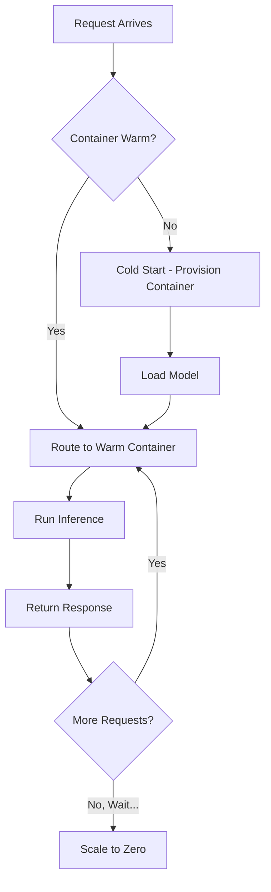

# How to Use SageMaker Serverless Inference

Author: [nawazdhandala](https://github.com/nawazdhandala)

Tags: AWS, SageMaker, Serverless, Machine Learning, Model Deployment

Description: Deploy machine learning models with SageMaker Serverless Inference for automatic scaling to zero and pay-per-request pricing without managing infrastructure.

---

Not every ML model needs a 24/7 endpoint. Maybe your model gets called a few times an hour, or traffic is extremely bursty. Running a persistent endpoint for those workloads means paying for idle compute most of the time. SageMaker Serverless Inference changes the equation - it scales to zero when there's no traffic and scales up automatically when requests come in. You only pay for what you use.

Let's look at how to set it up and when it makes sense.

## How Serverless Inference Works

Traditional SageMaker endpoints keep instances running continuously. Serverless Inference works differently:

1. When a request arrives and no compute is active, SageMaker provisions a container (cold start)
2. The container stays warm for a period to handle subsequent requests
3. After a period of inactivity, the container is shut down (scale to zero)
4. Multiple concurrent requests trigger multiple containers



## When to Use Serverless Inference

Serverless Inference is ideal for:

- **Intermittent traffic** - Models called a few times per hour or less
- **Development and testing** - Endpoints that don't need to be always-on
- **Cost-sensitive workloads** - When you'd rather not pay for idle compute
- **New models** - When you're not sure about traffic patterns yet

It's NOT ideal for:
- **Low-latency requirements** - Cold starts can add several seconds
- **High-throughput workloads** - Persistent endpoints will be more cost-effective
- **Very large models** - There are memory limits (6 GB max)

## Deploying a Serverless Endpoint

Setting up a serverless endpoint is almost identical to a regular deployment, with one key difference: you provide a `ServerlessInferenceConfig` instead of instance type and count.

```python
import sagemaker
from sagemaker.model import Model
from sagemaker import image_uris
from sagemaker.serverless import ServerlessInferenceConfig

session = sagemaker.Session()
role = sagemaker.get_execution_role()
bucket = session.default_bucket()
region = session.boto_region_name

# Get the XGBoost container
xgb_image = image_uris.retrieve('xgboost', region, '1.7-1')

# Create a Model object
model = Model(
    image_uri=xgb_image,
    model_data='s3://my-bucket/models/xgb-model/model.tar.gz',
    role=role,
    sagemaker_session=session
)

# Configure serverless inference
serverless_config = ServerlessInferenceConfig(
    memory_size_in_mb=2048,      # Memory allocation (1024, 2048, 3072, 4096, 5120, or 6144)
    max_concurrency=10           # Max concurrent invocations (1-200)
)

# Deploy as serverless
predictor = model.deploy(
    serverless_inference_config=serverless_config,
    endpoint_name='xgb-serverless-endpoint'
)

print(f"Serverless endpoint created: {predictor.endpoint_name}")
```

That's it. No instance types, no instance counts. Just memory size and concurrency limits.

## Deploying a Custom Model Serverlessly

Custom models work with serverless inference too. Here's an example with a scikit-learn model.

```python
from sagemaker.sklearn import SKLearnModel

# Create a sklearn model with custom inference code
sklearn_model = SKLearnModel(
    model_data='s3://my-bucket/models/sklearn-model/model.tar.gz',
    role=role,
    entry_point='inference.py',
    source_dir='./inference_code',
    framework_version='1.2-1',
    py_version='py3',
    sagemaker_session=session
)

# Deploy as serverless
serverless_config = ServerlessInferenceConfig(
    memory_size_in_mb=3072,
    max_concurrency=20
)

predictor = sklearn_model.deploy(
    serverless_inference_config=serverless_config,
    endpoint_name='sklearn-serverless'
)
```

## Testing the Endpoint

Send requests the same way you would with a regular endpoint.

```python
import boto3
import json
import time

runtime = boto3.client('sagemaker-runtime')

# First request might be slow due to cold start
start = time.time()
response = runtime.invoke_endpoint(
    EndpointName='xgb-serverless-endpoint',
    ContentType='text/csv',
    Body='1.5,2.3,0.7,4.1,3.2,0.9,1.8,2.1,3.5,0.4'
)
cold_start_time = time.time() - start

result = response['Body'].read().decode()
print(f"First request (cold start): {cold_start_time:.2f}s - Result: {result}")

# Second request should be faster (container is warm)
start = time.time()
response = runtime.invoke_endpoint(
    EndpointName='xgb-serverless-endpoint',
    ContentType='text/csv',
    Body='2.1,1.8,0.3,3.5,4.2,1.1,0.9,2.7,1.5,0.8'
)
warm_time = time.time() - start

result = response['Body'].read().decode()
print(f"Second request (warm): {warm_time:.2f}s - Result: {result}")
```

## Understanding Cold Starts

Cold starts are the main tradeoff with serverless inference. Here's what happens during a cold start:

1. SageMaker provisions compute resources
2. The container image is pulled
3. Your model is downloaded from S3
4. The model is loaded into memory
5. Your inference code initializes

This can take anywhere from a few seconds to over a minute, depending on model size and container complexity.

Ways to minimize cold start impact:

```python
# Use a smaller model when possible
# Optimize your model loading code
# Choose an appropriate memory size - too small can slow things down

# Use provisioned concurrency to keep containers warm (if available)
# The memory size affects the CPU allocation:
# 1024 MB -> lower CPU
# 6144 MB -> higher CPU

# A good rule of thumb: if your model is under 500 MB,
# use 2048-3072 MB for a balance of cost and speed
serverless_config = ServerlessInferenceConfig(
    memory_size_in_mb=3072,  # More memory = more CPU = faster loading
    max_concurrency=5
)
```

## Cost Comparison

Let's compare the cost of a serverless endpoint versus a persistent one for a low-traffic workload.

```python
# Cost estimation example
# Assume: 1000 requests per day, 200ms average inference time

# Persistent endpoint (ml.m5.large)
persistent_hourly_rate = 0.134  # USD per hour
persistent_monthly = persistent_hourly_rate * 24 * 30
print(f"Persistent endpoint: ${persistent_monthly:.2f}/month")

# Serverless endpoint
requests_per_month = 1000 * 30
inference_time_seconds = 0.2
memory_gb = 2  # 2048 MB

# Serverless charges per inference duration
# Price is approximately $0.0000200 per second per GB of memory
serverless_cost_per_request = 0.0000200 * inference_time_seconds * memory_gb
serverless_monthly = serverless_cost_per_request * requests_per_month
print(f"Serverless endpoint: ${serverless_monthly:.2f}/month")
print(f"Savings: ${persistent_monthly - serverless_monthly:.2f}/month")
```

For low-traffic workloads, the savings can be dramatic - often 90% or more compared to persistent endpoints.

## Monitoring Serverless Endpoints

Serverless endpoints emit the same CloudWatch metrics as regular endpoints, plus some serverless-specific ones.

```python
import boto3

cloudwatch = boto3.client('cloudwatch')

# Check invocation metrics
response = cloudwatch.get_metric_statistics(
    Namespace='AWS/SageMaker',
    MetricName='Invocations',
    Dimensions=[
        {'Name': 'EndpointName', 'Value': 'xgb-serverless-endpoint'},
        {'Name': 'VariantName', 'Value': 'AllTraffic'}
    ],
    StartTime='2026-02-11T00:00:00Z',
    EndTime='2026-02-12T00:00:00Z',
    Period=3600,
    Statistics=['Sum']
)

for dp in sorted(response['Datapoints'], key=lambda x: x['Timestamp']):
    print(f"{dp['Timestamp'].strftime('%H:%M')}: {int(dp['Sum'])} invocations")
```

Set up alerts with [OneUptime](https://oneuptime.com/blog/post/aws-cloudwatch-alerting/view) to get notified about high error rates or unusual latency patterns.

## Migrating from Persistent to Serverless

If you have existing persistent endpoints that don't get much traffic, here's how to migrate them.

```python
# Step 1: Create the serverless endpoint with a different name
serverless_config = ServerlessInferenceConfig(
    memory_size_in_mb=2048,
    max_concurrency=10
)

# Reuse the same model
existing_model_name = 'my-existing-model'

client = boto3.client('sagemaker')

# Create serverless endpoint config
client.create_endpoint_config(
    EndpointConfigName='my-model-serverless-config',
    ProductionVariants=[{
        'VariantName': 'AllTraffic',
        'ModelName': existing_model_name,
        'ServerlessConfig': {
            'MemorySizeInMB': 2048,
            'MaxConcurrency': 10
        }
    }]
)

# Step 2: Test the serverless endpoint thoroughly

# Step 3: Update your application to point to the new endpoint
# Or update the existing endpoint in-place:
client.update_endpoint(
    EndpointName='my-existing-endpoint',
    EndpointConfigName='my-model-serverless-config'
)

# Step 4: Delete the old endpoint config
```

## Limitations to Know About

Before going serverless, be aware of these constraints:

- **Memory limit**: 6 GB maximum
- **Payload size**: 6 MB request/response limit
- **Timeout**: 60-second invocation timeout
- **Concurrency**: 200 max concurrent invocations per endpoint
- **Container startup**: No GPU support (CPU only)
- **Cold starts**: First request after idle period will be slow

## Wrapping Up

Serverless Inference is perfect for the long tail of ML models that don't need always-on infrastructure. It's also great for development and staging environments where you want endpoints available but don't want to pay for idle compute. The cold start tradeoff is real, so test it with your specific model and traffic patterns before committing. For workloads that need consistent low latency, stick with [real-time endpoints](https://oneuptime.com/blog/post/2026-02-12-deploy-model-endpoint-sagemaker/view). And for an overview of all your options, check out our comparison of [SageMaker inference modes](https://oneuptime.com/blog/post/2026-02-12-sagemaker-real-time-vs-batch-vs-async-inference/view).
