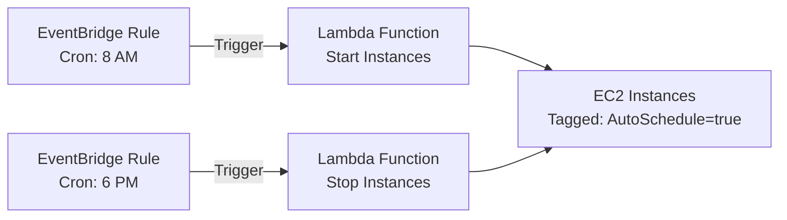

# How to Schedule EC2 Instance Start and Stop to Save Costs

Author: [nawazdhandala](https://github.com/nawazdhandala)

Tags: AWS, EC2, Cost Optimization, Lambda, EventBridge

Description: Automate EC2 instance scheduling with Lambda and EventBridge to stop instances outside business hours and save up to 65% on compute costs.

---

If your development, staging, or QA instances run 24/7 but nobody uses them outside business hours, you're burning money for no reason. A typical development instance running all month costs about 730 hours of compute time. But if your team only works 10 hours a day on weekdays, that's just 220 hours - roughly 30% of the total. Scheduling those instances to stop at night and on weekends can cut your EC2 bill by up to 65%.

Let's set this up using AWS Lambda and EventBridge (formerly CloudWatch Events), which is the most flexible and maintainable approach.

## The Architecture

The setup is simple: EventBridge triggers a Lambda function on a cron schedule. The Lambda function finds instances with a specific tag and starts or stops them.



## Step 1: Tag Your Instances

First, tag the instances you want to schedule. This lets you control which instances are affected without modifying the Lambda code.

Tag instances for scheduling:

```bash
# Tag instances that should be auto-scheduled
aws ec2 create-tags \
  --resources i-0abc123 i-0def456 i-0ghi789 \
  --tags Key=AutoSchedule,Value=true Key=Schedule,Value=business-hours
```

You can also use the Schedule tag to support different schedules (business hours, extended hours, weekends only, etc.).

## Step 2: Create the IAM Role

The Lambda function needs permission to start and stop EC2 instances.

Create the IAM role with the required permissions:

```bash
# Create the trust policy document
cat > trust-policy.json << 'EOF'
{
  "Version": "2012-10-17",
  "Statement": [
    {
      "Effect": "Allow",
      "Principal": {
        "Service": "lambda.amazonaws.com"
      },
      "Action": "sts:AssumeRole"
    }
  ]
}
EOF

# Create the role
aws iam create-role \
  --role-name ec2-scheduler-role \
  --assume-role-policy-document file://trust-policy.json

# Create the permission policy
cat > ec2-scheduler-policy.json << 'EOF'
{
  "Version": "2012-10-17",
  "Statement": [
    {
      "Effect": "Allow",
      "Action": [
        "ec2:DescribeInstances",
        "ec2:StartInstances",
        "ec2:StopInstances"
      ],
      "Resource": "*"
    },
    {
      "Effect": "Allow",
      "Action": [
        "logs:CreateLogGroup",
        "logs:CreateLogStream",
        "logs:PutLogEvents"
      ],
      "Resource": "arn:aws:logs:*:*:*"
    }
  ]
}
EOF

# Attach the policy
aws iam put-role-policy \
  --role-name ec2-scheduler-role \
  --policy-name ec2-scheduler-policy \
  --policy-document file://ec2-scheduler-policy.json
```

## Step 3: Create the Lambda Function

Here's a Python Lambda function that handles both starting and stopping instances based on the event it receives.

The Lambda function code:

```python
# lambda_function.py
import boto3
import os

ec2 = boto3.client('ec2')

def lambda_handler(event, context):
    action = event.get('action', 'stop')
    tag_key = os.environ.get('TAG_KEY', 'AutoSchedule')
    tag_value = os.environ.get('TAG_VALUE', 'true')

    # Find instances with the scheduling tag
    if action == 'start':
        # Find stopped instances that should be running
        filters = [
            {'Name': f'tag:{tag_key}', 'Values': [tag_value]},
            {'Name': 'instance-state-name', 'Values': ['stopped']}
        ]
    else:
        # Find running instances that should be stopped
        filters = [
            {'Name': f'tag:{tag_key}', 'Values': [tag_value]},
            {'Name': 'instance-state-name', 'Values': ['running']}
        ]

    response = ec2.describe_instances(Filters=filters)

    instance_ids = []
    for reservation in response['Reservations']:
        for instance in reservation['Instances']:
            instance_ids.append(instance['InstanceId'])

    if not instance_ids:
        print(f'No instances to {action}')
        return {
            'statusCode': 200,
            'body': f'No instances to {action}'
        }

    print(f'{action.capitalize()}ing instances: {instance_ids}')

    if action == 'start':
        ec2.start_instances(InstanceIds=instance_ids)
    else:
        ec2.stop_instances(InstanceIds=instance_ids)

    return {
        'statusCode': 200,
        'body': f'{action.capitalize()}ed {len(instance_ids)} instances: {instance_ids}'
    }
```

Package and deploy the function:

```bash
# Zip the function code
zip function.zip lambda_function.py

# Create the Lambda function
aws lambda create-function \
  --function-name ec2-scheduler \
  --runtime python3.12 \
  --handler lambda_function.lambda_handler \
  --role arn:aws:iam::ACCOUNT_ID:role/ec2-scheduler-role \
  --zip-file fileb://function.zip \
  --timeout 60 \
  --environment Variables="{TAG_KEY=AutoSchedule,TAG_VALUE=true}"
```

## Step 4: Create EventBridge Rules

Now create the cron schedules. EventBridge cron expressions use UTC, so adjust for your timezone.

Create rules for business hours (8 AM - 6 PM US Eastern):

```bash
# Rule to START instances at 8 AM Eastern (1 PM UTC)
aws events put-rule \
  --name ec2-start-business-hours \
  --schedule-expression "cron(0 13 ? * MON-FRI *)" \
  --description "Start scheduled EC2 instances on weekday mornings"

# Rule to STOP instances at 6 PM Eastern (11 PM UTC)
aws events put-rule \
  --name ec2-stop-business-hours \
  --schedule-expression "cron(0 23 ? * MON-FRI *)" \
  --description "Stop scheduled EC2 instances on weekday evenings"
```

Add permission for EventBridge to invoke the Lambda function:

```bash
# Allow EventBridge to invoke Lambda for start rule
aws lambda add-permission \
  --function-name ec2-scheduler \
  --statement-id start-rule-permission \
  --action lambda:InvokeFunction \
  --principal events.amazonaws.com \
  --source-arn arn:aws:events:us-east-1:ACCOUNT_ID:rule/ec2-start-business-hours

# Allow EventBridge to invoke Lambda for stop rule
aws lambda add-permission \
  --function-name ec2-scheduler \
  --statement-id stop-rule-permission \
  --action lambda:InvokeFunction \
  --principal events.amazonaws.com \
  --source-arn arn:aws:events:us-east-1:ACCOUNT_ID:rule/ec2-stop-business-hours
```

Set the Lambda function as the target for each rule, passing the appropriate action:

```bash
# Target for START rule
aws events put-targets \
  --rule ec2-start-business-hours \
  --targets '[{
    "Id": "start-target",
    "Arn": "arn:aws:lambda:us-east-1:ACCOUNT_ID:function:ec2-scheduler",
    "Input": "{\"action\": \"start\"}"
  }]'

# Target for STOP rule
aws events put-targets \
  --rule ec2-stop-business-hours \
  --targets '[{
    "Id": "stop-target",
    "Arn": "arn:aws:lambda:us-east-1:ACCOUNT_ID:function:ec2-scheduler",
    "Input": "{\"action\": \"stop\"}"
  }]'
```

## Testing the Setup

Test the Lambda function manually before relying on the schedule:

```bash
# Test stopping instances
aws lambda invoke \
  --function-name ec2-scheduler \
  --payload '{"action": "stop"}' \
  response.json
cat response.json

# Test starting instances
aws lambda invoke \
  --function-name ec2-scheduler \
  --payload '{"action": "start"}' \
  response.json
cat response.json
```

## Terraform Version

If you prefer infrastructure as code, here's the complete setup in Terraform:

```hcl
# Lambda function
resource "aws_lambda_function" "scheduler" {
  filename         = "function.zip"
  function_name    = "ec2-scheduler"
  role             = aws_iam_role.scheduler.arn
  handler          = "lambda_function.lambda_handler"
  runtime          = "python3.12"
  timeout          = 60

  environment {
    variables = {
      TAG_KEY   = "AutoSchedule"
      TAG_VALUE = "true"
    }
  }
}

# EventBridge rule - Stop at 6 PM
resource "aws_cloudwatch_event_rule" "stop" {
  name                = "ec2-stop-business-hours"
  schedule_expression = "cron(0 23 ? * MON-FRI *)"
}

resource "aws_cloudwatch_event_target" "stop" {
  rule  = aws_cloudwatch_event_rule.stop.name
  arn   = aws_lambda_function.scheduler.arn
  input = jsonencode({ action = "stop" })
}

# EventBridge rule - Start at 8 AM
resource "aws_cloudwatch_event_rule" "start" {
  name                = "ec2-start-business-hours"
  schedule_expression = "cron(0 13 ? * MON-FRI *)"
}

resource "aws_cloudwatch_event_target" "start" {
  rule  = aws_cloudwatch_event_rule.start.name
  arn   = aws_lambda_function.scheduler.arn
  input = jsonencode({ action = "start" })
}
```

## Cost Savings Calculation

Here's what the savings look like for a small team:

| Scenario | Monthly Hours | Monthly Cost (m5.large) | Savings |
|----------|--------------|------------------------|---------|
| 24/7 | 730 | ~$70 | $0 |
| Business hours only (10h x weekdays) | ~220 | ~$21 | $49/instance |
| Extended hours (14h x weekdays) | ~308 | ~$29 | $41/instance |

Multiply by the number of instances across dev, staging, and QA environments, and you're looking at significant monthly savings. For a team with 20 development instances, business-hours scheduling saves roughly $980 per month.

## Handling Edge Cases

A few things to keep in mind:

- **Instances with EBS-optimized volumes**: Starting and stopping is safe - EBS data persists
- **Instances with instance store volumes**: Data on instance store is lost when stopped - don't schedule these
- **Elastic IPs**: Elastic IPs remain associated when you stop an instance, but you'll be charged for the EIP while the instance is stopped
- **Holidays**: The simple cron approach doesn't account for holidays. You can add holiday logic to the Lambda or use a more sophisticated scheduling system

For monitoring your cost optimization efforts, set up billing alerts and dashboards. Our guide on [AWS infrastructure monitoring](https://oneuptime.com/blog/post/aws-infrastructure-monitoring/view) covers how to track these metrics effectively.

## Wrapping Up

Scheduling EC2 instances is one of the easiest cost optimization wins in AWS. The Lambda plus EventBridge approach is serverless (so it costs almost nothing to run), flexible enough to support multiple schedules, and easy to extend. Tag your non-production instances, deploy the scheduler, and start saving immediately.
