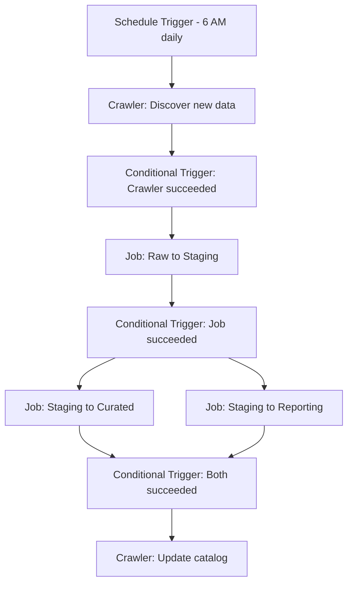

# How to Schedule Glue ETL Jobs with Workflows

Author: [nawazdhandala](https://github.com/nawazdhandala)

Tags: AWS, Glue, ETL, Workflows, Data Engineering

Description: Learn how to orchestrate multiple AWS Glue ETL jobs and crawlers into automated workflows with triggers, dependencies, and error handling.

---

A single Glue ETL job is useful. A coordinated pipeline of multiple jobs that run in the right order, handle failures gracefully, and kick off automatically - that's what actually runs in production. Glue Workflows let you orchestrate multiple ETL jobs and crawlers into a single managed pipeline.

Instead of rigging together Lambda functions, Step Functions, and CloudWatch Events to sequence your jobs, you can define the entire pipeline as a Glue Workflow with triggers and dependencies.

## How Workflows Work

A Glue Workflow is a directed acyclic graph (DAG) of triggers, jobs, and crawlers:



Each workflow consists of:

- **Triggers** - Start conditions (scheduled, on-demand, or conditional)
- **Actions** - What runs when a trigger fires (jobs or crawlers)
- **Dependencies** - Conditions that must be met before a trigger fires

## Creating a Workflow

Let's build a three-stage ETL pipeline:

1. Crawl S3 for new data
2. Run a transformation job
3. Crawl the output to update the catalog

```python
# Create the workflow
import boto3

glue = boto3.client('glue', region_name='us-east-1')

glue.create_workflow(
    Name='daily-etl-pipeline',
    Description='Daily pipeline: crawl -> transform -> catalog update',
    DefaultRunProperties={
        'environment': 'production',
        'pipeline_version': '1.0'
    },
    MaxConcurrentRuns=1
)
```

`MaxConcurrentRuns` prevents the workflow from stacking up if a run takes longer than expected.

## Adding Triggers

### Schedule Trigger (Start of the Pipeline)

```python
# Create the starting trigger - runs daily at 6 AM
glue.create_trigger(
    Name='daily-6am-start',
    WorkflowName='daily-etl-pipeline',
    Type='SCHEDULED',
    Schedule='cron(0 6 * * ? *)',
    Actions=[
        {
            'CrawlerName': 'raw-data-crawler'
        }
    ],
    StartOnCreation=True
)
```

### Conditional Trigger (After Crawler Succeeds)

```python
# Trigger the transform job after the crawler completes successfully
glue.create_trigger(
    Name='after-crawl-transform',
    WorkflowName='daily-etl-pipeline',
    Type='CONDITIONAL',
    Predicate={
        'Logical': 'AND',
        'Conditions': [
            {
                'LogicalOperator': 'EQUALS',
                'CrawlerName': 'raw-data-crawler',
                'CrawlState': 'SUCCEEDED'
            }
        ]
    },
    Actions=[
        {
            'JobName': 'raw-to-processed-transform',
            'Arguments': {
                '--source_database': 'raw_data',
                '--target_path': 's3://my-data-lake/processed/'
            }
        }
    ],
    StartOnCreation=True
)
```

### Conditional Trigger (After Job Succeeds)

```python
# Run the catalog update crawler after the transform job completes
glue.create_trigger(
    Name='after-transform-catalog',
    WorkflowName='daily-etl-pipeline',
    Type='CONDITIONAL',
    Predicate={
        'Logical': 'AND',
        'Conditions': [
            {
                'LogicalOperator': 'EQUALS',
                'JobName': 'raw-to-processed-transform',
                'State': 'SUCCEEDED'
            }
        ]
    },
    Actions=[
        {
            'CrawlerName': 'processed-data-crawler'
        }
    ],
    StartOnCreation=True
)
```

## Parallel Job Execution

Workflows support parallel execution. Multiple jobs can run simultaneously when their dependencies are met:

```python
# Trigger multiple jobs in parallel after the staging job completes
glue.create_trigger(
    Name='parallel-processing',
    WorkflowName='daily-etl-pipeline',
    Type='CONDITIONAL',
    Predicate={
        'Conditions': [
            {
                'LogicalOperator': 'EQUALS',
                'JobName': 'staging-transform',
                'State': 'SUCCEEDED'
            }
        ]
    },
    Actions=[
        {'JobName': 'generate-daily-report'},
        {'JobName': 'update-dashboard-tables'},
        {'JobName': 'export-to-redshift'}
    ],
    StartOnCreation=True
)
```

All three jobs start simultaneously when the staging transform succeeds.

## Complex Dependencies

You can wait for multiple jobs to complete before proceeding:

```python
# Wait for all parallel jobs to finish before the final step
glue.create_trigger(
    Name='all-parallel-complete',
    WorkflowName='daily-etl-pipeline',
    Type='CONDITIONAL',
    Predicate={
        'Logical': 'AND',  # ALL conditions must be met
        'Conditions': [
            {
                'LogicalOperator': 'EQUALS',
                'JobName': 'generate-daily-report',
                'State': 'SUCCEEDED'
            },
            {
                'LogicalOperator': 'EQUALS',
                'JobName': 'update-dashboard-tables',
                'State': 'SUCCEEDED'
            },
            {
                'LogicalOperator': 'EQUALS',
                'JobName': 'export-to-redshift',
                'State': 'SUCCEEDED'
            }
        ]
    },
    Actions=[
        {'JobName': 'send-completion-notification'}
    ],
    StartOnCreation=True
)
```

You can also use `OR` logic if you want the trigger to fire when any condition is met.

## Passing Properties Between Steps

Workflow run properties let you pass data between jobs in the pipeline:

```python
# In Job 1: Set a workflow run property
import sys
from awsglue.utils import getResolvedOptions

args = getResolvedOptions(sys.argv, ['JOB_NAME', 'WORKFLOW_NAME', 'WORKFLOW_RUN_ID'])

glue = boto3.client('glue')

# Record how many records were processed
glue.put_workflow_run_properties(
    Name=args['WORKFLOW_NAME'],
    RunId=args['WORKFLOW_RUN_ID'],
    RunProperties={
        'records_processed': '150000',
        'processing_date': '2025-02-12'
    }
)
```

```python
# In Job 2: Read properties from a previous step
args = getResolvedOptions(sys.argv, ['JOB_NAME', 'WORKFLOW_NAME', 'WORKFLOW_RUN_ID'])

glue = boto3.client('glue')

properties = glue.get_workflow_run_properties(
    Name=args['WORKFLOW_NAME'],
    RunId=args['WORKFLOW_RUN_ID']
)

records_count = properties['RunProperties']['records_processed']
print(f"Previous step processed {records_count} records")
```

## Manual Triggers

Start a workflow manually for testing or ad-hoc runs:

```python
# Start the workflow manually
response = glue.start_workflow_run(
    Name='daily-etl-pipeline',
    RunProperties={
        'run_reason': 'manual-backfill',
        'target_date': '2025-02-10'
    }
)

run_id = response['RunId']
print(f"Workflow run started: {run_id}")
```

## Monitoring Workflow Runs

Check the status of a workflow run:

```python
# Get workflow run status
run = glue.get_workflow_run(
    Name='daily-etl-pipeline',
    RunId=run_id,
    IncludeGraph=True
)

print(f"Status: {run['Run']['Status']}")
print(f"Started: {run['Run']['StartedOn']}")

if run['Run'].get('CompletedOn'):
    print(f"Completed: {run['Run']['CompletedOn']}")

# Check the status of each node in the graph
if 'Graph' in run['Run']:
    for node in run['Run']['Graph']['Nodes']:
        node_type = node['Type']
        name = node.get('Name', 'Unknown')

        if node_type == 'JOB':
            details = node.get('JobDetails', {})
            job_runs = details.get('JobRuns', [])
            if job_runs:
                latest = job_runs[0]
                print(f"  Job '{name}': {latest['JobRunState']}")

        elif node_type == 'CRAWLER':
            details = node.get('CrawlerDetails', {})
            crawls = details.get('Crawls', [])
            if crawls:
                latest = crawls[0]
                print(f"  Crawler '{name}': {latest['State']}")
```

List recent runs:

```python
# List recent workflow runs
runs = glue.get_workflow_runs(
    Name='daily-etl-pipeline',
    MaxResults=10
)

for run in runs['Runs']:
    print(f"Run ID: {run['RunId']}")
    print(f"  Status: {run['Status']}")
    print(f"  Started: {run['StartedOn']}")
    print(f"  Statistics: {run.get('Statistics', {})}")
    print()
```

## Error Handling Patterns

### Retry Logic

Glue jobs have built-in retry support:

```python
# Create a job with retry configuration
glue.create_job(
    Name='resilient-transform',
    Role='arn:aws:iam::YOUR_ACCOUNT_ID:role/GlueETLRole',
    Command={
        'Name': 'glueetl',
        'ScriptLocation': 's3://my-scripts/transform.py',
        'PythonVersion': '3'
    },
    MaxRetries=2,  # Retry up to 2 times on failure
    Timeout=60
)
```

### Notification on Failure

Add a notification job that checks the workflow status:

```python
# Simple notification Lambda that checks workflow status
import boto3
import json

def lambda_handler(event, context):
    glue = boto3.client('glue')
    sns = boto3.client('sns')

    workflow_name = event['workflow_name']

    runs = glue.get_workflow_runs(Name=workflow_name, MaxResults=1)

    if runs['Runs']:
        latest = runs['Runs'][0]
        status = latest['Status']

        if status == 'ERROR':
            stats = latest.get('Statistics', {})
            message = f"Workflow '{workflow_name}' failed!\n"
            message += f"Failed actions: {stats.get('FailedActions', 0)}\n"
            message += f"Run ID: {latest['RunId']}"

            sns.publish(
                TopicArn='arn:aws:sns:us-east-1:YOUR_ACCOUNT:etl-alerts',
                Subject=f'ETL Pipeline Failed: {workflow_name}',
                Message=message
            )
```

### EventBridge Integration

Use EventBridge (CloudWatch Events) to react to workflow state changes:

```python
# EventBridge rule for workflow failures
import boto3

events = boto3.client('events')

events.put_rule(
    Name='glue-workflow-failure',
    EventPattern=json.dumps({
        'source': ['aws.glue'],
        'detail-type': ['Glue Job State Change'],
        'detail': {
            'state': ['FAILED', 'TIMEOUT']
        }
    }),
    State='ENABLED'
)

events.put_targets(
    Rule='glue-workflow-failure',
    Targets=[{
        'Id': 'sns-notification',
        'Arn': 'arn:aws:sns:us-east-1:YOUR_ACCOUNT:etl-alerts'
    }]
)
```

## Complete Pipeline Example

Here's a full workflow setup script:

```python
# Complete workflow: Ingest -> Transform -> Load -> Catalog
import boto3

glue = boto3.client('glue', region_name='us-east-1')

WORKFLOW_NAME = 'complete-data-pipeline'

# Step 1: Create the workflow
glue.create_workflow(Name=WORKFLOW_NAME, MaxConcurrentRuns=1)

# Step 2: Schedule trigger - start the pipeline
glue.create_trigger(
    Name=f'{WORKFLOW_NAME}-start',
    WorkflowName=WORKFLOW_NAME,
    Type='SCHEDULED',
    Schedule='cron(0 6 * * ? *)',
    Actions=[{'CrawlerName': 'source-crawler'}],
    StartOnCreation=True
)

# Step 3: After crawler, run transform
glue.create_trigger(
    Name=f'{WORKFLOW_NAME}-transform',
    WorkflowName=WORKFLOW_NAME,
    Type='CONDITIONAL',
    Predicate={'Conditions': [
        {'CrawlerName': 'source-crawler', 'CrawlState': 'SUCCEEDED', 'LogicalOperator': 'EQUALS'}
    ]},
    Actions=[{'JobName': 'data-transform-job'}],
    StartOnCreation=True
)

# Step 4: After transform, update catalog
glue.create_trigger(
    Name=f'{WORKFLOW_NAME}-catalog',
    WorkflowName=WORKFLOW_NAME,
    Type='CONDITIONAL',
    Predicate={'Conditions': [
        {'JobName': 'data-transform-job', 'State': 'SUCCEEDED', 'LogicalOperator': 'EQUALS'}
    ]},
    Actions=[{'CrawlerName': 'output-crawler'}],
    StartOnCreation=True
)

print(f"Workflow '{WORKFLOW_NAME}' created with all triggers")
```

## Wrapping Up

Glue Workflows give you a managed way to orchestrate multi-step ETL pipelines. They're simpler than Step Functions for Glue-only pipelines and more reliable than chaining jobs with CloudWatch Events. Use them when you need jobs and crawlers to run in a specific sequence with proper dependency handling.

For the individual jobs within your workflow, check out our guides on [creating Glue ETL jobs](https://oneuptime.com/blog/post/create-aws-glue-etl-jobs/view) and [using job bookmarks for incremental processing](https://oneuptime.com/blog/post/use-glue-job-bookmarks-for-incremental-data-processing/view).
