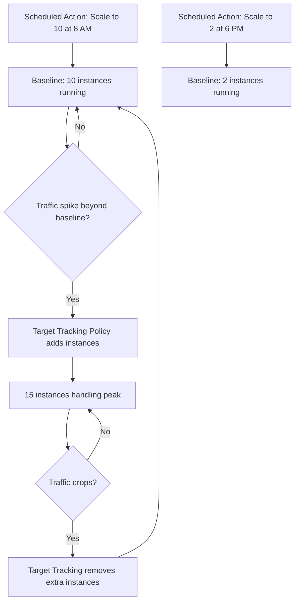

# How to Set Up Scheduled Scaling for Predictable Traffic Patterns

Author: [nawazdhandala](https://github.com/nawazdhandala)

Tags: AWS, EC2, Auto Scaling, Scheduled Scaling, Cost Optimization

Description: Learn how to configure AWS Auto Scaling scheduled actions to automatically scale your EC2 fleet for predictable traffic patterns and save money.

---

If your application sees predictable traffic spikes - maybe a rush at 9 AM when people start work, a lull overnight, or a weekly surge every Monday - you're leaving money on the table if you're not using scheduled scaling. Instead of keeping extra capacity running 24/7 "just in case," you can tell AWS exactly when to scale up and when to scale back down.

Scheduled scaling is one of those features that's simple to set up but often overlooked. Let's fix that.

## When Scheduled Scaling Makes Sense

Dynamic scaling policies (target tracking, step scaling) react to changes in metrics like CPU utilization or request count. They're great for unpredictable traffic, but they have an inherent lag. It takes time for CloudWatch to detect the metric change, time for the scaling policy to trigger, and time for new instances to boot and pass health checks.

Scheduled scaling eliminates that lag for traffic patterns you can predict. Common scenarios include:

- **Business hours traffic** - Scale up at 8 AM, scale down at 6 PM
- **Batch processing windows** - Scale up before nightly jobs kick off
- **Marketing campaigns** - Pre-scale before a planned promotion goes live
- **Weekly patterns** - More capacity on weekdays, less on weekends
- **Seasonal patterns** - Holiday shopping, back-to-school, tax season

The best part? Scheduled scaling works alongside dynamic scaling. You can use scheduled actions to set the baseline and let dynamic policies handle the unexpected fluctuations on top.

## Setting Up Your First Scheduled Action

Scheduled actions modify the MinSize, MaxSize, or DesiredCapacity of your Auto Scaling group at a specific time. You can create one-time actions or recurring ones.

Here's a simple example that scales up every weekday morning and scales back down every evening:

```bash
# Scale up to 10 instances every weekday at 8 AM UTC
aws autoscaling put-scheduled-update-group-action \
  --auto-scaling-group-name my-asg \
  --scheduled-action-name scale-up-morning \
  --recurrence "0 8 * * MON-FRI" \
  --min-size 10 \
  --max-size 20 \
  --desired-capacity 10

# Scale down to 2 instances every weekday at 6 PM UTC
aws autoscaling put-scheduled-update-group-action \
  --auto-scaling-group-name my-asg \
  --scheduled-action-name scale-down-evening \
  --recurrence "0 18 * * MON-FRI" \
  --min-size 2 \
  --max-size 10 \
  --desired-capacity 2
```

The recurrence field uses cron syntax. Important note: all times are in UTC. Make sure you convert from your local timezone, and remember that UTC doesn't observe daylight saving time, so your schedule might be off by an hour depending on the time of year.

## Cron Expression Reference

Cron expressions in AWS scheduled scaling follow this format:

```
Minutes Hours DayOfMonth Month DayOfWeek
```

Here are some useful patterns:

```bash
# Every day at midnight UTC
"0 0 * * *"

# Weekdays only at 9 AM UTC
"0 9 * * MON-FRI"

# Every Monday at 6 AM UTC
"0 6 * * MON"

# First day of every month at midnight
"0 0 1 * *"

# Every 30 minutes (careful with this one)
"*/30 * * * *"
```

## One-Time Scheduled Actions

Sometimes you need to pre-scale for a specific event - a product launch, a big sale, or a scheduled load test. One-time actions are perfect for this.

This creates a one-time scale-up action for a specific date and time:

```bash
# Scale up for Black Friday
aws autoscaling put-scheduled-update-group-action \
  --auto-scaling-group-name my-asg \
  --scheduled-action-name black-friday-prep \
  --start-time "2026-11-27T06:00:00Z" \
  --min-size 50 \
  --max-size 100 \
  --desired-capacity 50

# Scale back down after the event
aws autoscaling put-scheduled-update-group-action \
  --auto-scaling-group-name my-asg \
  --scheduled-action-name black-friday-cleanup \
  --start-time "2026-11-30T06:00:00Z" \
  --min-size 5 \
  --max-size 20 \
  --desired-capacity 5
```

## Terraform Configuration

If you manage your infrastructure with Terraform, here's how to set up scheduled scaling:

```hcl
resource "aws_autoscaling_group" "web" {
  name                = "web-asg"
  min_size            = 2
  max_size            = 20
  desired_capacity    = 2
  vpc_zone_identifier = var.subnet_ids

  launch_template {
    id      = aws_launch_template.web.id
    version = "$Latest"
  }
}

# Scale up for business hours
resource "aws_autoscaling_schedule" "scale_up" {
  scheduled_action_name  = "scale-up-business-hours"
  autoscaling_group_name = aws_autoscaling_group.web.name
  min_size               = 10
  max_size               = 20
  desired_capacity       = 10
  recurrence             = "0 8 * * MON-FRI"
  time_zone              = "America/New_York"
}

# Scale down after hours
resource "aws_autoscaling_schedule" "scale_down" {
  scheduled_action_name  = "scale-down-after-hours"
  autoscaling_group_name = aws_autoscaling_group.web.name
  min_size               = 2
  max_size               = 10
  desired_capacity       = 2
  recurrence             = "0 18 * * MON-FRI"
  time_zone              = "America/New_York"
}

# Weekend minimal capacity
resource "aws_autoscaling_schedule" "weekend" {
  scheduled_action_name  = "weekend-scale-down"
  autoscaling_group_name = aws_autoscaling_group.web.name
  min_size               = 1
  max_size               = 5
  desired_capacity       = 1
  recurrence             = "0 18 * * FRI"
  time_zone              = "America/New_York"
}
```

Notice that Terraform supports the `time_zone` parameter, which is much more convenient than converting everything to UTC manually.

## Combining Scheduled and Dynamic Scaling

The real power comes from combining scheduled scaling with dynamic policies. Scheduled actions set your baseline capacity, and dynamic policies handle the variance.

Here's the flow:



The key thing to understand is that scheduled actions modify the ASG's min/max/desired values. Dynamic policies then work within those bounds. If your scheduled action sets MinSize to 10, a target tracking policy can't scale below 10 even if CPU is at 0%.

This setup example adds a target tracking policy on top of your scheduled scaling:

```bash
# Add a target tracking policy to handle unexpected spikes
aws autoscaling put-scaling-policy \
  --auto-scaling-group-name my-asg \
  --policy-name cpu-target-tracking \
  --policy-type TargetTrackingScaling \
  --target-tracking-configuration '{
    "PredefinedMetricSpecification": {
      "PredefinedMetricType": "ASGAverageCPUUtilization"
    },
    "TargetValue": 60.0,
    "ScaleInCooldown": 300,
    "ScaleOutCooldown": 60
  }'
```

## Managing and Viewing Scheduled Actions

You can list all scheduled actions for an ASG to verify your configuration:

```bash
# List all scheduled actions
aws autoscaling describe-scheduled-actions \
  --auto-scaling-group-name my-asg \
  --output table

# Delete a scheduled action you no longer need
aws autoscaling delete-scheduled-action \
  --auto-scaling-group-name my-asg \
  --scheduled-action-name scale-up-morning
```

## Cost Savings Example

Let's do some quick math. Say you're running 10 m5.large instances 24/7 to handle daytime traffic. At $0.096/hour per instance, that's:

- **Without scheduled scaling**: 10 instances x $0.096 x 24h x 30 days = **$691.20/month**
- **With scheduled scaling**: 10 instances x 12h + 2 instances x 12h = (10 x $0.096 x 12 x 30) + (2 x $0.096 x 12 x 30) = $345.60 + $69.12 = **$414.72/month**

That's a **40% savings** just by scaling down during off-hours. And this is a conservative example - if your weekends need even less capacity, the savings grow.

## Tips and Gotchas

**Timezone awareness**: If you're using the CLI, times are in UTC. Terraform and CloudFormation support the `time_zone` parameter. Plan for daylight saving shifts.

**Overlapping actions**: If two scheduled actions fire at the same time, the one with the later scheduled time takes precedence. If they're exactly the same, the behavior is unpredictable. Avoid overlaps.

**Instance launch time**: Schedule your scale-up action early enough that instances are healthy before traffic arrives. If your instances take 5 minutes to boot and pass health checks, schedule the action 10 minutes before you need the capacity.

**Monitoring**: Set up CloudWatch alarms to alert you if scaling actions fail. You want to know if your scheduled scale-up didn't happen before the morning traffic rush.

For end-to-end monitoring of your Auto Scaling groups and scheduled actions, check out [OneUptime's AWS monitoring capabilities](https://oneuptime.com/blog/post/2026-02-12-ec2-spot-instances-save-compute/view) to track instance counts, scaling events, and costs in real time.

## Summary

Scheduled scaling is the low-hanging fruit of AWS cost optimization. If your traffic follows any kind of predictable pattern, setting up a few cron-based scaling actions can cut your EC2 bill significantly. Combine it with dynamic scaling policies for the best of both worlds - predictable baselines with reactive adjustments on top.
