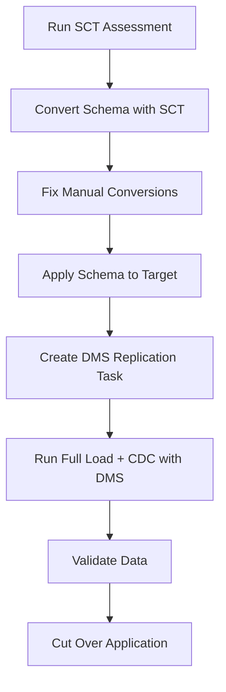

# How to Use Schema Conversion Tool (SCT) for Database Migration

Author: [nawazdhandala](https://github.com/nawazdhandala)

Tags: AWS, SCT, Database Migration, Schema Conversion

Description: A practical guide to using the AWS Schema Conversion Tool for database migrations, covering schema analysis, conversion, manual fixes, and integration with DMS.

---

When you're migrating between different database engines - say Oracle to PostgreSQL, or SQL Server to MySQL - the schema doesn't just transfer directly. Data types differ, stored procedures use different syntax, and database-specific features need alternatives. The AWS Schema Conversion Tool (SCT) automates as much of this conversion as possible and clearly flags what needs manual attention.

SCT works hand-in-hand with [AWS Database Migration Service (DMS)](https://oneuptime.com/blog/post/database-migration-service-dms-replication/view). While DMS handles moving the actual data, SCT handles converting the schema - tables, views, stored procedures, functions, and triggers.

## What SCT Converts

SCT handles conversions between many database engine pairs. The most common migrations it supports:

- Oracle to Amazon Aurora PostgreSQL
- Oracle to Amazon RDS PostgreSQL
- Microsoft SQL Server to Aurora MySQL
- Microsoft SQL Server to Aurora PostgreSQL
- Oracle to Amazon Redshift (for data warehouse migrations)
- Teradata to Amazon Redshift
- Netezza to Amazon Redshift

For each migration, SCT converts:
- Table definitions (columns, data types, constraints)
- Views
- Stored procedures and functions
- Triggers
- Indexes
- Sequences

## Installing SCT

SCT is a desktop application that runs on Windows, macOS, or Linux. Download it from the AWS website.

```bash
# On macOS, after downloading the DMG
# Install the application and required JDBC drivers

# Download JDBC drivers for your source and target databases
# Oracle JDBC driver
wget https://download.oracle.com/otn-pub/otn_software/jdbc/ojdbc11.jar

# PostgreSQL JDBC driver
wget https://jdbc.postgresql.org/download/postgresql-42.7.1.jar
```

After installing SCT, configure the JDBC drivers in the Global Settings before creating a project. Go to Settings > Global Settings > Drivers and point each driver to the JAR file you downloaded.

## Creating a Migration Project

Once SCT is installed, here's the workflow. First, create a new project and connect to your source database.

The SCT GUI walks you through this, but you can also script it using the SCT CLI for automation.

```bash
# SCT CLI - create a new project and run assessment
# Save this as a command file (sct-commands.txt)
CreateProject /projectName:"oracle-to-postgres" /projectFolder:"/migrations/oracle-to-pg"
ConnectSourceDatabase /databaseType:ORACLE /serverName:"oracle-source.example.com" /port:1521 /userName:"migration_user" /password:"OraclePass!" /sid:"ORCL"
ConnectTargetDatabase /databaseType:AURORA_POSTGRESQL /serverName:"target-aurora.cluster-xxx.us-east-1.rds.amazonaws.com" /port:5432 /userName:"postgres" /password:"PostgresPass!" /database:"myapp"
```

## Running the Assessment Report

Before converting anything, run an assessment. This tells you what percentage of your schema can be converted automatically and what needs manual work.

```bash
# Generate an assessment report via SCT CLI
CreateMigrationAssessmentReport /sourceDatabase:"ORCL" /targetDatabase:"myapp" /reportFormat:PDF /reportFile:"/migrations/assessment-report.pdf"
```

The assessment report categorizes every schema object into one of these categories:

- **Green** - converts automatically with no issues
- **Yellow** - converts with minor modifications needed
- **Red** - requires manual conversion

Here's what a typical assessment looks like for an Oracle to PostgreSQL migration:

| Object Type | Total | Auto-Convert | Manual Fix |
|-------------|-------|-------------|------------|
| Tables | 150 | 148 | 2 |
| Views | 45 | 40 | 5 |
| Stored Procedures | 80 | 52 | 28 |
| Functions | 30 | 22 | 8 |
| Triggers | 20 | 15 | 5 |

Tables and views typically convert well. Stored procedures are where the most manual work lives, because procedural code uses engine-specific syntax heavily.

## Converting the Schema

After reviewing the assessment, convert the schema.

```bash
# Convert the source schema to target-compatible SQL
ConvertSchema /sourceDatabase:"ORCL" /sourceSchema:"APP_SCHEMA"
```

SCT generates the equivalent DDL for your target database. Here's an example of what it does with Oracle-specific constructs.

Oracle source:

```sql
-- Oracle table with Oracle-specific features
CREATE TABLE employees (
    employee_id NUMBER(10) GENERATED ALWAYS AS IDENTITY,
    name VARCHAR2(200) NOT NULL,
    hire_date DATE DEFAULT SYSDATE,
    salary NUMBER(10,2),
    department_id NUMBER(10),
    status VARCHAR2(20) DEFAULT 'ACTIVE',
    CONSTRAINT pk_employees PRIMARY KEY (employee_id)
);

-- Oracle sequence (used separately in older Oracle versions)
CREATE SEQUENCE emp_audit_seq START WITH 1 INCREMENT BY 1;

-- Oracle stored procedure with PL/SQL
CREATE OR REPLACE PROCEDURE give_raise(
    p_employee_id IN NUMBER,
    p_percentage IN NUMBER
) AS
    v_current_salary NUMBER;
BEGIN
    SELECT salary INTO v_current_salary
    FROM employees WHERE employee_id = p_employee_id;

    UPDATE employees
    SET salary = v_current_salary * (1 + p_percentage / 100)
    WHERE employee_id = p_employee_id;

    DBMS_OUTPUT.PUT_LINE('New salary: ' || v_current_salary * (1 + p_percentage / 100));
    COMMIT;
EXCEPTION
    WHEN NO_DATA_FOUND THEN
        RAISE_APPLICATION_ERROR(-20001, 'Employee not found');
END;
/
```

SCT converts this to PostgreSQL:

```sql
-- PostgreSQL equivalent generated by SCT
CREATE TABLE employees (
    employee_id INTEGER GENERATED ALWAYS AS IDENTITY,
    name VARCHAR(200) NOT NULL,
    hire_date DATE DEFAULT CURRENT_DATE,
    salary NUMERIC(10,2),
    department_id INTEGER,
    status VARCHAR(20) DEFAULT 'ACTIVE',
    CONSTRAINT pk_employees PRIMARY KEY (employee_id)
);

-- PostgreSQL sequence
CREATE SEQUENCE emp_audit_seq START WITH 1 INCREMENT BY 1;

-- PostgreSQL stored procedure (converted from PL/SQL to PL/pgSQL)
CREATE OR REPLACE PROCEDURE give_raise(
    p_employee_id INTEGER,
    p_percentage NUMERIC
)
LANGUAGE plpgsql
AS $$
DECLARE
    v_current_salary NUMERIC;
BEGIN
    SELECT salary INTO v_current_salary
    FROM employees WHERE employee_id = p_employee_id;

    IF NOT FOUND THEN
        RAISE EXCEPTION 'Employee not found';
    END IF;

    UPDATE employees
    SET salary = v_current_salary * (1 + p_percentage / 100)
    WHERE employee_id = p_employee_id;

    RAISE NOTICE 'New salary: %', v_current_salary * (1 + p_percentage / 100);
    COMMIT;
END;
$$;
```

Notice how SCT mapped `NUMBER` to `INTEGER`/`NUMERIC`, `VARCHAR2` to `VARCHAR`, `SYSDATE` to `CURRENT_DATE`, `DBMS_OUTPUT.PUT_LINE` to `RAISE NOTICE`, and `RAISE_APPLICATION_ERROR` to `RAISE EXCEPTION`.

## Handling Manual Conversions

For objects SCT can't convert automatically, you need to rewrite them manually. SCT highlights these and often provides guidance.

Common patterns that need manual work:

**Oracle hierarchical queries** (CONNECT BY) need to be rewritten using PostgreSQL's recursive CTEs.

```sql
-- Oracle: CONNECT BY query
SELECT employee_id, name, manager_id, LEVEL
FROM employees
START WITH manager_id IS NULL
CONNECT BY PRIOR employee_id = manager_id;

-- PostgreSQL: Recursive CTE equivalent (manual conversion)
WITH RECURSIVE org_chart AS (
    SELECT employee_id, name, manager_id, 1 AS level
    FROM employees
    WHERE manager_id IS NULL

    UNION ALL

    SELECT e.employee_id, e.name, e.manager_id, oc.level + 1
    FROM employees e
    JOIN org_chart oc ON e.manager_id = oc.employee_id
)
SELECT * FROM org_chart;
```

**Oracle packages** don't have a direct PostgreSQL equivalent. SCT breaks them into individual functions and procedures in a schema that mirrors the package name.

## Applying the Converted Schema

Once you're satisfied with the conversion, apply it to the target database.

```bash
# Apply the converted schema to the target database
ApplyToTarget /targetDatabase:"myapp" /targetSchema:"app_schema"
```

Or save it as a SQL script for review and manual application.

```bash
# Save converted DDL to a file for review
SaveAsSQL /outputFile:"/migrations/converted-schema.sql"
```

## Integrating with DMS

The typical migration workflow uses both SCT and DMS together.



SCT handles the structure. DMS handles the data. Together they cover the full migration.

## Automation with SCT CLI

For large migrations or CI/CD pipelines, script the entire SCT workflow.

```bash
#!/bin/bash
# Automated schema conversion pipeline

SCT_CLI="/opt/aws-schema-conversion-tool/bin/sct-cli"

# Run the full conversion pipeline
$SCT_CLI << EOF
CreateProject /projectName:"automated-migration" /projectFolder:"/tmp/migration"
ConnectSourceDatabase /databaseType:ORACLE /serverName:"$SOURCE_HOST" /port:1521 /userName:"$SOURCE_USER" /password:"$SOURCE_PASS" /sid:"ORCL"
ConnectTargetDatabase /databaseType:AURORA_POSTGRESQL /serverName:"$TARGET_HOST" /port:5432 /userName:"$TARGET_USER" /password:"$TARGET_PASS" /database:"myapp"
CreateMigrationAssessmentReport /reportFormat:PDF /reportFile:"/tmp/migration/report.pdf"
ConvertSchema /sourceSchema:"APP_SCHEMA"
SaveAsSQL /outputFile:"/tmp/migration/converted.sql"
EOF

echo "Schema conversion complete. Review /tmp/migration/converted.sql"
```

## Wrapping Up

The Schema Conversion Tool takes a massive amount of tedious work out of cross-engine database migrations. It won't handle everything automatically - stored procedures and engine-specific features always need some manual attention. But it gives you a clear picture of what's involved and handles the straightforward conversions reliably. Run the assessment report early in your migration planning so you know the scope of manual work ahead of you.
