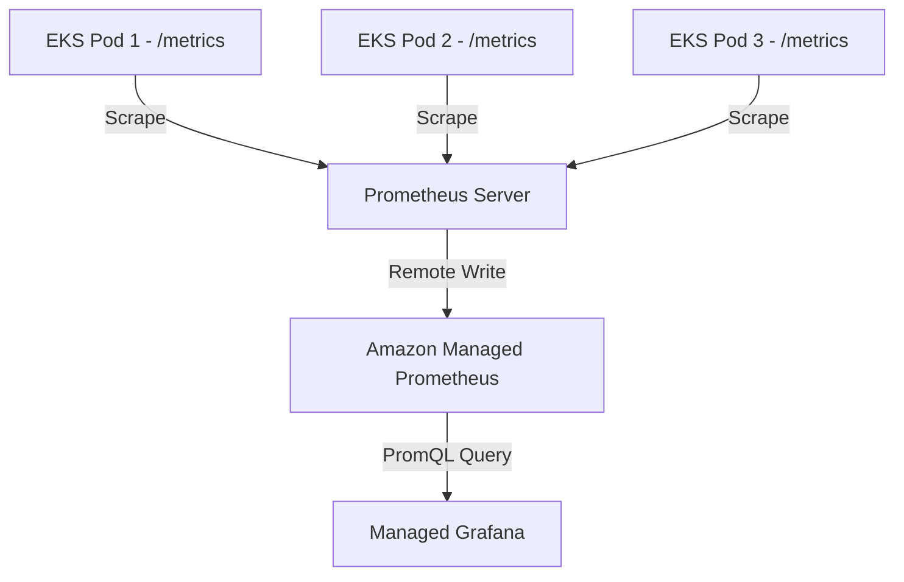

# How to Scrape Metrics from EKS Pods with Amazon Managed Prometheus

Author: [nawazdhandala](https://github.com/nawazdhandala)

Tags: AWS, Prometheus, EKS, Kubernetes, Metrics, Monitoring, AMP

Description: Configure Prometheus metric scraping from EKS pods and send metrics to Amazon Managed Prometheus using service discovery and relabeling

---

Running applications on EKS means you have potentially hundreds of pods generating metrics. Prometheus can scrape all of them automatically using Kubernetes service discovery, but getting the configuration right takes some work. You need to set up service accounts, configure scrape targets, handle relabeling, and ensure metrics flow reliably to Amazon Managed Prometheus (AMP).

This guide focuses on the practical details of scraping metrics from EKS pods: how to annotate pods for scraping, configure service discovery, optimize what gets scraped, and verify everything works end to end.

## Architecture



Prometheus runs inside the EKS cluster (as a Deployment or StatefulSet). It discovers pods using the Kubernetes API, scrapes their metrics endpoints, and remote-writes the data to AMP.

## Step 1: Set Up IAM for Service Account

Create an IAM role that allows the Prometheus pod to write to AMP.

```bash
# Create an OIDC provider for your EKS cluster (if not already done)
eksctl utils associate-iam-oidc-provider \
  --cluster my-eks-cluster \
  --approve

# Create a service account with AMP write permissions
eksctl create iamserviceaccount \
  --name prometheus-server \
  --namespace monitoring \
  --cluster my-eks-cluster \
  --attach-policy-arn arn:aws:iam::123456789012:policy/AMPRemoteWritePolicy \
  --approve \
  --override-existing-serviceaccounts
```

The IAM policy for remote write:

```json
{
  "Version": "2012-10-17",
  "Statement": [
    {
      "Effect": "Allow",
      "Action": [
        "aps:RemoteWrite"
      ],
      "Resource": "arn:aws:aps:us-east-1:123456789012:workspace/ws-abc123-def456"
    }
  ]
}
```

## Step 2: Annotate Your Pods for Scraping

Prometheus uses Kubernetes annotations to discover which pods to scrape. Add these annotations to your pod specs.

```yaml
# deployment.yaml - Application with Prometheus scraping enabled
apiVersion: apps/v1
kind: Deployment
metadata:
  name: order-api
  namespace: production
spec:
  replicas: 3
  selector:
    matchLabels:
      app: order-api
  template:
    metadata:
      labels:
        app: order-api
      annotations:
        # Tell Prometheus to scrape this pod
        prometheus.io/scrape: "true"
        # The port where metrics are exposed
        prometheus.io/port: "8080"
        # The path to the metrics endpoint
        prometheus.io/path: "/metrics"
    spec:
      containers:
        - name: order-api
          image: order-api:latest
          ports:
            - containerPort: 8080
              name: http
          # Your application must expose a /metrics endpoint
          # Most frameworks have Prometheus client libraries for this
```

Different applications might expose metrics on different ports and paths. The annotations let you configure this per-pod without changing the global Prometheus configuration.

## Step 3: Configure Prometheus Scrape Configuration

Here is a comprehensive Prometheus configuration for scraping EKS pods with proper relabeling.

```yaml
# prometheus-config.yaml
global:
  scrape_interval: 15s
  evaluation_interval: 15s

# Remote write to Amazon Managed Prometheus
remote_write:
  - url: https://aps-workspaces.us-east-1.amazonaws.com/workspaces/ws-abc123-def456/api/v1/remote_write
    sigv4:
      region: us-east-1
    queue_config:
      max_samples_per_send: 1000
      max_shards: 200
      capacity: 2500

scrape_configs:
  # Scrape pods with prometheus.io annotations
  - job_name: 'kubernetes-pods'
    kubernetes_sd_configs:
      - role: pod
    relabel_configs:
      # Only scrape pods with prometheus.io/scrape=true
      - source_labels: [__meta_kubernetes_pod_annotation_prometheus_io_scrape]
        action: keep
        regex: true

      # Use custom scrape path if specified
      - source_labels: [__meta_kubernetes_pod_annotation_prometheus_io_path]
        action: replace
        target_label: __metrics_path__
        regex: (.+)

      # Use custom port if specified
      - source_labels: [__address__, __meta_kubernetes_pod_annotation_prometheus_io_port]
        action: replace
        regex: ([^:]+)(?::\d+)?;(\d+)
        replacement: $1:$2
        target_label: __address__

      # Add namespace as a label
      - source_labels: [__meta_kubernetes_namespace]
        action: replace
        target_label: namespace

      # Add pod name as a label
      - source_labels: [__meta_kubernetes_pod_name]
        action: replace
        target_label: pod

      # Add node name as a label
      - source_labels: [__meta_kubernetes_pod_node_name]
        action: replace
        target_label: node

      # Add app label from pod labels
      - source_labels: [__meta_kubernetes_pod_label_app]
        action: replace
        target_label: app

  # Scrape kube-state-metrics for cluster state
  - job_name: 'kube-state-metrics'
    kubernetes_sd_configs:
      - role: service
    relabel_configs:
      - source_labels: [__meta_kubernetes_service_name]
        action: keep
        regex: kube-state-metrics

  # Scrape node-exporter for host metrics
  - job_name: 'node-exporter'
    kubernetes_sd_configs:
      - role: node
    relabel_configs:
      - action: labelmap
        regex: __meta_kubernetes_node_label_(.+)
      - source_labels: [__address__]
        regex: ([^:]+)(?::\d+)?
        replacement: $1:9100
        target_label: __address__
```

Let me break down the relabel configs for the pod scraping job:

1. **Keep only annotated pods**: The first rule filters out pods without the scrape annotation.
2. **Custom metrics path**: Uses the `prometheus.io/path` annotation if present, otherwise defaults to `/metrics`.
3. **Custom port**: Uses the `prometheus.io/port` annotation to determine which port to scrape.
4. **Metadata labels**: Adds namespace, pod name, node name, and app label to every metric for filtering in queries.

## Step 4: Deploy Prometheus with Helm

Use the Prometheus community Helm chart for a quick deployment.

```bash
# Create the monitoring namespace
kubectl create namespace monitoring

# Install Prometheus
helm install prometheus prometheus-community/prometheus \
  --namespace monitoring \
  --set serviceAccounts.server.name=prometheus-server \
  --set serviceAccounts.server.create=false \
  --set server.persistentVolume.enabled=true \
  --set server.persistentVolume.size=50Gi \
  --set server.retention=2d \
  --values prometheus-values.yaml
```

The values file for AMP remote write:

```yaml
# prometheus-values.yaml
server:
  remoteWrite:
    - url: https://aps-workspaces.us-east-1.amazonaws.com/workspaces/ws-abc123-def456/api/v1/remote_write
      sigv4:
        region: us-east-1
      queueConfig:
        maxSamplesPerSend: 1000
        maxShards: 200
        capacity: 2500

  # Keep local retention low since AMP stores the data
  retention: "2d"
  resources:
    requests:
      memory: 512Mi
      cpu: 250m
    limits:
      memory: 1Gi
      cpu: 500m
```

## Step 5: Verify Scraping Is Working

Check that Prometheus is discovering and scraping your pods.

```bash
# Port-forward to Prometheus UI
kubectl port-forward -n monitoring svc/prometheus-server 9090:80

# Open http://localhost:9090/targets in your browser
# You should see your pods listed under the kubernetes-pods job
```

You can also verify from the command line:

```bash
# Check Prometheus targets via API
curl -s http://localhost:9090/api/v1/targets | python3 -m json.tool | grep -A5 "kubernetes-pods"

# Verify a specific metric exists
curl -s "http://localhost:9090/api/v1/query?query=up{job='kubernetes-pods'}" | python3 -m json.tool
```

## Step 6: Optimize What Gets Scraped

Not every metric is useful. Dropping unnecessary metrics reduces AMP ingestion costs and keeps your metric store clean.

### Drop Metrics at Scrape Time

```yaml
# In your scrape config
metric_relabel_configs:
  # Drop Go runtime metrics if you do not need them
  - source_labels: [__name__]
    regex: 'go_.*'
    action: drop

  # Drop high-cardinality histogram buckets you do not use
  - source_labels: [__name__]
    regex: '.*_bucket'
    action: drop

  # Keep only specific metrics
  - source_labels: [__name__]
    regex: 'http_requests_total|http_request_duration_seconds.*|up|process_cpu_seconds_total'
    action: keep
```

### Drop Metrics at Remote Write Time

```yaml
# In your remote_write config
remote_write:
  - url: https://aps-workspaces.us-east-1.amazonaws.com/workspaces/ws-abc123/api/v1/remote_write
    sigv4:
      region: us-east-1
    write_relabel_configs:
      # Only remote-write metrics matching this pattern
      - source_labels: [__name__]
        regex: 'http_.*|container_.*|kube_.*|node_.*|up'
        action: keep
```

## Exposing Metrics from Your Application

If your application does not yet expose a `/metrics` endpoint, here is how to add it in common frameworks.

### Python (Flask)

```python
# Install: pip install prometheus-flask-instrumentator
from prometheus_flask_instrumentator import Instrumentator

app = Flask(__name__)
Instrumentator().instrument(app).expose(app)
```

### Node.js (Express)

```javascript
// Install: npm install prom-client express-prom-bundle
const promBundle = require('express-prom-bundle');
const metricsMiddleware = promBundle({ includeMethod: true, includePath: true });

app.use(metricsMiddleware);
```

### Go

```go
// Import: github.com/prometheus/client_golang/prometheus/promhttp
http.Handle("/metrics", promhttp.Handler())
```

For deeper PromQL usage, see our guide on [using PromQL queries in Amazon Managed Prometheus](https://oneuptime.com/blog/post/use-promql-queries-in-amazon-managed-prometheus/view).

## Wrapping Up

Scraping EKS pods for Prometheus metrics boils down to three things: annotating your pods, configuring Prometheus service discovery, and setting up remote write to AMP. The relabel configuration is where most of the complexity lives, but once you have a working template, adding new services is as simple as adding annotations to their pod specs. Keep your metric volume in check by dropping unnecessary metrics at scrape time or remote write time. This keeps costs down and queries fast.
