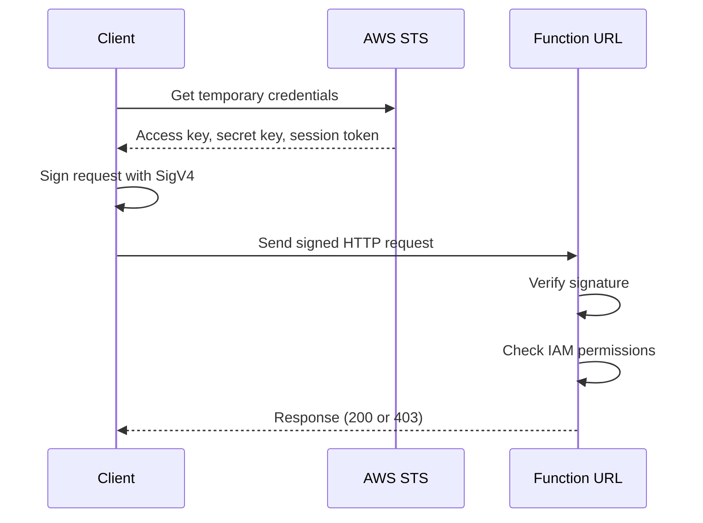

# How to Secure Lambda Function URLs with IAM Auth

Author: [nawazdhandala](https://github.com/nawazdhandala)

Tags: AWS, Lambda, IAM, Security, Serverless

Description: Learn how to secure AWS Lambda Function URLs using IAM authentication with SigV4 signing for service-to-service communication and internal APIs.

---

Lambda Function URLs with `NONE` auth type are open to the internet. Anyone with the URL can invoke your function. That's fine for public webhooks, but for internal services, admin endpoints, or service-to-service communication, you need to lock things down.

IAM authentication for Function URLs uses AWS SigV4 (Signature Version 4) to verify that the caller has the right IAM permissions. Only principals with the `lambda:InvokeFunctionUrl` permission can make successful requests. Let's set it up and see how to call these secured endpoints from different contexts.

## Creating a Function URL with IAM Auth

When you create the Function URL, set the auth type to `AWS_IAM`:

```bash
# Create a Function URL that requires IAM authentication
aws lambda create-function-url-config \
  --function-name my-secure-api \
  --auth-type AWS_IAM
```

Unlike the `NONE` auth type, you don't need to add a public permission. Instead, you grant specific IAM principals access:

```bash
# Grant a specific IAM role permission to invoke the function
aws lambda add-permission \
  --function-name my-secure-api \
  --statement-id AllowServiceRole \
  --action lambda:InvokeFunctionUrl \
  --principal arn:aws:iam::123456789012:role/calling-service-role \
  --function-url-auth-type AWS_IAM
```

Using CloudFormation:

```yaml
# CloudFormation: Function URL with IAM authentication
Resources:
  SecureFunction:
    Type: AWS::Lambda::Function
    Properties:
      FunctionName: my-secure-api
      Runtime: nodejs20.x
      Handler: index.handler
      Role: !GetAtt FunctionRole.Arn
      Code:
        ZipFile: |
          exports.handler = async (event) => {
            // The caller's IAM identity is available in the request context
            const caller = event.requestContext.authorizer?.iam;
            console.log('Called by:', caller?.userArn);
            return {
              statusCode: 200,
              body: JSON.stringify({
                message: 'Authenticated!',
                caller: caller?.userArn,
              }),
            };
          };

  # Function URL with IAM auth
  SecureFunctionUrl:
    Type: AWS::Lambda::Url
    Properties:
      TargetFunctionArn: !Ref SecureFunction
      AuthType: AWS_IAM

  # Permission for a specific role to invoke
  InvokePermission:
    Type: AWS::Lambda::Permission
    Properties:
      FunctionName: !Ref SecureFunction
      Action: lambda:InvokeFunctionUrl
      Principal: !GetAtt CallerRole.Arn
      FunctionUrlAuthType: AWS_IAM
```

## How SigV4 Authentication Works

When you make a request to an IAM-authenticated Function URL, you need to sign the request with AWS SigV4. This adds authorization headers that prove your identity and ensure the request hasn't been tampered with.



## Calling from Another Lambda Function

The most common use case is service-to-service calls. Here's how to call an IAM-authenticated Function URL from another Lambda:

```javascript
// Call an IAM-authenticated Function URL from another Lambda
const { SignatureV4 } = require('@aws-sdk/signature-v4');
const { Sha256 } = require('@aws-crypto/sha256-js');
const { defaultProvider } = require('@aws-sdk/credential-provider-node');
const { HttpRequest } = require('@aws-sdk/protocol-http');

const FUNCTION_URL = 'https://abc123xyz.lambda-url.us-east-1.on.aws';

async function callSecureFunction(path, body) {
  const url = new URL(path, FUNCTION_URL);

  // Build the HTTP request
  const request = new HttpRequest({
    method: body ? 'POST' : 'GET',
    hostname: url.hostname,
    path: url.pathname,
    headers: {
      host: url.hostname,
      'content-type': 'application/json',
    },
    body: body ? JSON.stringify(body) : undefined,
  });

  // Sign the request with SigV4
  const signer = new SignatureV4({
    credentials: defaultProvider(),
    region: 'us-east-1',
    service: 'lambda',
    sha256: Sha256,
  });

  const signedRequest = await signer.sign(request);

  // Make the HTTP request with the signed headers
  const response = await fetch(url.toString(), {
    method: signedRequest.method,
    headers: signedRequest.headers,
    body: signedRequest.body,
  });

  return response.json();
}

exports.handler = async (event) => {
  // Call the secured function
  const result = await callSecureFunction('/process', {
    orderId: event.orderId,
    action: 'validate',
  });

  return { statusCode: 200, body: JSON.stringify(result) };
};
```

## Calling from Python

Here's the Python equivalent using the `requests` library with `aws-requests-auth`:

```python
# Call an IAM-authenticated Function URL from Python
import json
import boto3
from botocore.auth import SigV4Auth
from botocore.awsrequest import AWSRequest
import requests

FUNCTION_URL = 'https://abc123xyz.lambda-url.us-east-1.on.aws'

def call_secure_function(path, body=None):
    url = f"{FUNCTION_URL}{path}"
    method = 'POST' if body else 'GET'
    data = json.dumps(body) if body else None

    # Create the request
    aws_request = AWSRequest(
        method=method,
        url=url,
        data=data,
        headers={'Content-Type': 'application/json'} if body else {}
    )

    # Sign it with SigV4
    session = boto3.Session()
    credentials = session.get_credentials().get_frozen_credentials()
    SigV4Auth(credentials, 'lambda', 'us-east-1').add_auth(aws_request)

    # Make the signed request
    response = requests.request(
        method=method,
        url=url,
        headers=dict(aws_request.headers),
        data=data
    )

    return response.json()

def handler(event, context):
    result = call_secure_function('/process', {'orderId': event['orderId']})
    return {'statusCode': 200, 'body': json.dumps(result)}
```

## Calling from the CLI with curl

For testing, you can use the `--aws-sigv4` option in curl (requires curl 7.75+):

```bash
# Call a secured Function URL using curl with SigV4
curl --aws-sigv4 "aws:amz:us-east-1:lambda" \
  --user "$AWS_ACCESS_KEY_ID:$AWS_SECRET_ACCESS_KEY" \
  -H "x-amz-security-token: $AWS_SESSION_TOKEN" \
  -H "Content-Type: application/json" \
  -d '{"test": true}' \
  "https://abc123xyz.lambda-url.us-east-1.on.aws/process"
```

Or use the `awscurl` tool which handles signing automatically:

```bash
# awscurl handles SigV4 signing transparently
pip install awscurl

awscurl --service lambda \
  --region us-east-1 \
  -X POST \
  -H "Content-Type: application/json" \
  -d '{"test": true}' \
  "https://abc123xyz.lambda-url.us-east-1.on.aws/process"
```

## IAM Policy for Callers

The calling service's IAM role needs explicit permission to invoke the Function URL:

```json
{
  "Version": "2012-10-17",
  "Statement": [
    {
      "Effect": "Allow",
      "Action": "lambda:InvokeFunctionUrl",
      "Resource": "arn:aws:lambda:us-east-1:123456789012:function:my-secure-api"
    }
  ]
}
```

You can also restrict by condition keys:

```json
{
  "Version": "2012-10-17",
  "Statement": [
    {
      "Effect": "Allow",
      "Action": "lambda:InvokeFunctionUrl",
      "Resource": "arn:aws:lambda:us-east-1:123456789012:function:my-secure-api",
      "Condition": {
        "StringEquals": {
          "lambda:FunctionUrlAuthType": "AWS_IAM"
        }
      }
    }
  ]
}
```

## Cross-Account Access

You can allow Lambda functions in other AWS accounts to call your Function URL:

```bash
# Grant cross-account access
aws lambda add-permission \
  --function-name my-secure-api \
  --statement-id CrossAccountAccess \
  --action lambda:InvokeFunctionUrl \
  --principal arn:aws:iam::987654321098:role/cross-account-caller \
  --function-url-auth-type AWS_IAM
```

The calling account's role also needs the `lambda:InvokeFunctionUrl` permission on your function's ARN.

## Accessing Caller Identity

When IAM auth is enabled, you can see who's calling from within your Lambda function:

```javascript
// Access the caller's IAM identity
exports.handler = async (event) => {
  const iam = event.requestContext.authorizer?.iam;

  if (iam) {
    console.log('Caller details:', {
      accountId: iam.accountId,
      userArn: iam.userArn,
      userId: iam.userId,
      accessKey: iam.accessKey,
    });

    // You can make authorization decisions based on the caller
    if (iam.accountId !== '123456789012') {
      return {
        statusCode: 403,
        body: JSON.stringify({ error: 'Cross-account access not allowed for this endpoint' }),
      };
    }
  }

  return { statusCode: 200, body: JSON.stringify({ message: 'Authorized' }) };
};
```

## Combining with Resource-Based Policies

For fine-grained access control, you can use both resource-based policies on the Lambda function and identity-based policies on the caller. Both must allow the action for the request to succeed.

This lets you implement a defense-in-depth approach where changes to either policy alone can't accidentally open access.

## When IAM Auth Makes Sense

Use IAM-authenticated Function URLs when:

- Services within the same AWS account need to communicate
- You need cross-account service-to-service calls
- Internal admin or management endpoints need protection
- You want to avoid API Gateway costs but still need authentication

For user-facing authentication (login, OAuth, JWT tokens), API Gateway with Cognito or a custom authorizer is a better choice. IAM auth is designed for machine-to-machine communication, not browser-based user sessions.

For more on Function URLs in general, see our guide on [using Lambda Function URLs for simple HTTP endpoints](https://oneuptime.com/blog/post/use-lambda-function-urls-for-simple-http-endpoints/view).

## Wrapping Up

IAM authentication on Lambda Function URLs gives you secure, zero-cost authentication for service-to-service communication. The setup is minimal - change the auth type to `AWS_IAM` and grant the right permissions. The calling side is slightly more work since you need to sign requests with SigV4, but the AWS SDKs make this manageable. For internal APIs and microservice communication, it's a simple and effective security layer.
