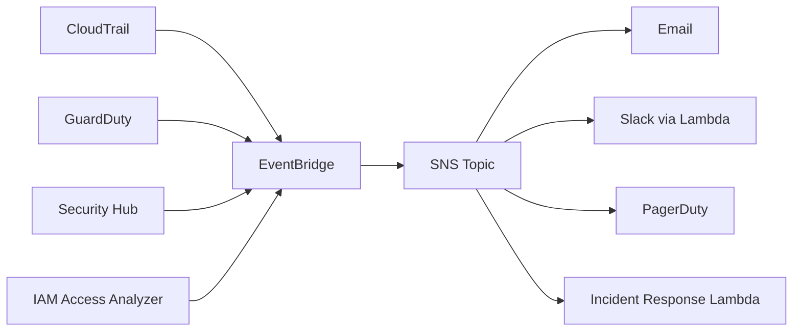

# How to Implement Security Alerting with EventBridge and SNS

Author: [nawazdhandala](https://github.com/nawazdhandala)

Tags: AWS, EventBridge, SNS, Security, Monitoring

Description: Build a real-time security alerting pipeline using Amazon EventBridge and SNS to detect and respond to critical security events in your AWS account.

---

When a security event happens in your AWS account, every minute counts. The difference between catching an unauthorized API call in real time versus discovering it in a log review next week can be enormous. Amazon EventBridge and SNS together form a powerful alerting pipeline that can notify your security team the moment something suspicious happens.

EventBridge acts as the event router - it watches for specific patterns in AWS events and routes matching events to targets. SNS handles the delivery - emails, SMS, Slack webhooks, PagerDuty, you name it. Together they give you a low-latency, highly reliable security alerting system with almost no operational overhead.

## Architecture Overview

Here's how the pieces fit together:



AWS services emit events to EventBridge automatically. You write rules that match specific event patterns, and EventBridge forwards matching events to your SNS topics. From there, SNS fans out to whatever notification channels you've configured.

## Setting Up the SNS Topic

Let's start with the SNS topic and its subscriptions. We want a topic specifically for security alerts, separate from operational notifications.

```bash
# Create an SNS topic for security alerts
aws sns create-topic \
  --name security-alerts \
  --tags Key=Team,Value=Security Key=Purpose,Value=Alerting

# Subscribe an email address
aws sns subscribe \
  --topic-arn arn:aws:sns:us-east-1:123456789012:security-alerts \
  --protocol email \
  --notification-endpoint security-team@company.com

# Subscribe a second email for redundancy
aws sns subscribe \
  --topic-arn arn:aws:sns:us-east-1:123456789012:security-alerts \
  --protocol email \
  --notification-endpoint on-call@company.com
```

Don't forget to confirm the subscriptions - AWS sends a confirmation email that someone needs to click.

## EventBridge Rules for Common Security Events

Now let's create EventBridge rules that catch the security events you care about most.

### Root Account Usage

This is the big one. Nobody should be using the root account for day-to-day operations.

```json
{
  "source": ["aws.signin"],
  "detail-type": ["AWS Console Sign In via CloudTrail"],
  "detail": {
    "userIdentity": {
      "type": ["Root"]
    }
  }
}
```

Here's the CLI command to create this rule:

```bash
# Create EventBridge rule for root account sign-in detection
aws events put-rule \
  --name detect-root-login \
  --description "Alert on any root account console sign-in" \
  --event-pattern '{
    "source": ["aws.signin"],
    "detail-type": ["AWS Console Sign In via CloudTrail"],
    "detail": {
      "userIdentity": {
        "type": ["Root"]
      }
    }
  }' \
  --state ENABLED

# Add SNS as the target
aws events put-targets \
  --rule detect-root-login \
  --targets '[{
    "Id": "SecurityAlertsSNS",
    "Arn": "arn:aws:sns:us-east-1:123456789012:security-alerts",
    "InputTransformer": {
      "InputPathsMap": {
        "account": "$.account",
        "time": "$.time",
        "region": "$.region",
        "sourceIP": "$.detail.sourceIPAddress"
      },
      "InputTemplate": "\"CRITICAL: Root account sign-in detected!\\nAccount: <account>\\nTime: <time>\\nRegion: <region>\\nSource IP: <sourceIP>\""
    }
  }]'
```

Notice the `InputTransformer` - this is really useful. Instead of dumping the raw JSON event into your email, it formats a human-readable alert message.

### Unauthorized API Calls

Catch API calls that fail due to authorization errors:

```bash
# Detect unauthorized API calls
aws events put-rule \
  --name detect-unauthorized-api \
  --description "Alert on unauthorized API call attempts" \
  --event-pattern '{
    "source": ["aws.cloudtrail"],
    "detail-type": ["AWS API Call via CloudTrail"],
    "detail": {
      "errorCode": ["AccessDenied", "UnauthorizedAccess", "Client.UnauthorizedAccess"]
    }
  }' \
  --state ENABLED
```

### Security Group Changes

Any modification to security groups should be reviewed:

```bash
# Monitor security group modifications
aws events put-rule \
  --name detect-sg-changes \
  --description "Alert on security group modifications" \
  --event-pattern '{
    "source": ["aws.ec2"],
    "detail-type": ["AWS API Call via CloudTrail"],
    "detail": {
      "eventName": [
        "AuthorizeSecurityGroupIngress",
        "AuthorizeSecurityGroupEgress",
        "RevokeSecurityGroupIngress",
        "RevokeSecurityGroupEgress",
        "CreateSecurityGroup",
        "DeleteSecurityGroup"
      ]
    }
  }' \
  --state ENABLED
```

### GuardDuty Findings

GuardDuty is AWS's threat detection service. You'll want to know about high-severity findings immediately:

```bash
# Alert on high-severity GuardDuty findings
aws events put-rule \
  --name detect-guardduty-high \
  --description "Alert on high-severity GuardDuty findings" \
  --event-pattern '{
    "source": ["aws.guardduty"],
    "detail-type": ["GuardDuty Finding"],
    "detail": {
      "severity": [{"numeric": [">=", 7]}]
    }
  }' \
  --state ENABLED
```

The numeric matcher here is powerful - it filters to only findings with severity 7 or above, which are the high and critical ones.

## Adding Slack Integration

Email alerts are fine, but most teams live in Slack. Here's a Lambda function that formats EventBridge events into Slack messages:

```python
# slack_notifier.py - Forward security alerts to Slack
import json
import urllib.request
import os

SLACK_WEBHOOK = os.environ['SLACK_WEBHOOK_URL']

def handler(event, context):
    # Determine severity based on source
    source = event.get('source', 'unknown')
    severity = 'WARNING'
    color = '#ff9900'  # orange

    if source == 'aws.guardduty':
        gd_severity = event.get('detail', {}).get('severity', 0)
        if gd_severity >= 7:
            severity = 'CRITICAL'
            color = '#ff0000'  # red
    elif 'Root' in json.dumps(event.get('detail', {})):
        severity = 'CRITICAL'
        color = '#ff0000'

    # Build Slack message
    message = {
        'username': 'AWS Security Alert',
        'icon_emoji': ':rotating_light:',
        'attachments': [{
            'color': color,
            'title': f'{severity}: {event.get("detail-type", "Security Event")}',
            'fields': [
                {'title': 'Account', 'value': event.get('account', 'N/A'), 'short': True},
                {'title': 'Region', 'value': event.get('region', 'N/A'), 'short': True},
                {'title': 'Source', 'value': source, 'short': True},
                {'title': 'Time', 'value': event.get('time', 'N/A'), 'short': True},
            ],
            'text': json.dumps(event.get('detail', {}), indent=2)[:1000]
        }]
    }

    # Send to Slack
    req = urllib.request.Request(
        SLACK_WEBHOOK,
        data=json.dumps(message).encode('utf-8'),
        headers={'Content-Type': 'application/json'}
    )
    urllib.request.urlopen(req)

    return {'statusCode': 200}
```

Subscribe the Lambda to your SNS topic, and every security alert will pop up in Slack within seconds.

## CloudFormation Template for the Full Stack

Here's a complete CloudFormation template that sets up everything we've discussed:

```yaml
# security-alerting-stack.yaml
AWSTemplateFormatVersion: '2010-09-09'
Description: Security alerting pipeline with EventBridge and SNS

Parameters:
  SecurityEmail:
    Type: String
    Description: Email address for security alerts

Resources:
  SecurityAlertsTopic:
    Type: AWS::SNS::Topic
    Properties:
      TopicName: security-alerts
      Subscription:
        - Protocol: email
          Endpoint: !Ref SecurityEmail

  SecurityAlertsTopicPolicy:
    Type: AWS::SNS::TopicPolicy
    Properties:
      Topics:
        - !Ref SecurityAlertsTopic
      PolicyDocument:
        Statement:
          - Effect: Allow
            Principal:
              Service: events.amazonaws.com
            Action: sns:Publish
            Resource: !Ref SecurityAlertsTopic

  RootLoginRule:
    Type: AWS::Events::Rule
    Properties:
      Name: detect-root-login
      Description: Detect root account console sign-in
      EventPattern:
        source:
          - aws.signin
        detail-type:
          - AWS Console Sign In via CloudTrail
        detail:
          userIdentity:
            type:
              - Root
      Targets:
        - Id: SecurityAlerts
          Arn: !Ref SecurityAlertsTopic

  SGChangeRule:
    Type: AWS::Events::Rule
    Properties:
      Name: detect-sg-changes
      EventPattern:
        source:
          - aws.ec2
        detail-type:
          - AWS API Call via CloudTrail
        detail:
          eventName:
            - AuthorizeSecurityGroupIngress
            - AuthorizeSecurityGroupEgress
            - CreateSecurityGroup
            - DeleteSecurityGroup
      Targets:
        - Id: SecurityAlerts
          Arn: !Ref SecurityAlertsTopic
```

## Reducing Alert Noise

One common problem is getting too many alerts. If your EventBridge rules are too broad, your team will start ignoring notifications. A few strategies to keep noise down:

**Use specific event patterns**. Don't match on all CloudTrail events - narrow down to the specific API calls and error codes you care about.

**Filter by severity**. For GuardDuty and Security Hub, use numeric matchers to only alert on medium-severity and above.

**Aggregate with Lambda**. Instead of sending individual alerts, use a Lambda function that batches events over a 5-minute window and sends a digest.

**Suppress known false positives**. If a specific automation role triggers frequent "unauthorized" events as part of normal operations, exclude it with a pattern that uses the `anything-but` matcher.

For more sophisticated monitoring, you can combine this alerting pipeline with [AWS Config auto remediation](https://oneuptime.com/blog/post/2026-02-12-aws-config-auto-remediation/view) to not just detect issues but fix them automatically.

## Wrapping Up

EventBridge and SNS together give you a flexible, scalable security alerting pipeline that requires almost zero maintenance. The key is being thoughtful about which events you alert on and how you format those alerts. Start with the high-value rules - root logins, security group changes, and high-severity GuardDuty findings - and expand from there as your team gets comfortable with the alert volume.
