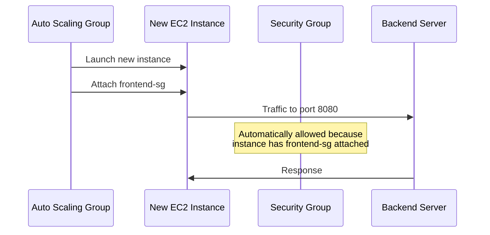

# How to Use Security Group Referencing for Layered Security

Author: [nawazdhandala](https://github.com/nawazdhandala)

Tags: AWS, Security Groups, VPC, Networking, Security

Description: Learn how to use security group referencing to build layered, dynamic security architectures in AWS that automatically adapt as instances scale.

---

Most people configure security groups with CIDR blocks - allowing traffic from specific IP ranges. That works, but it's brittle. Every time an IP changes, you're updating rules. Security group referencing is a better approach. Instead of specifying IP addresses, you reference another security group. Any instance in that referenced group is automatically allowed, even if IPs change or new instances spin up.

This is the foundation of layered security in AWS.

## What Is Security Group Referencing?

When you create an inbound rule on a security group, you can specify the source as either:

- A CIDR block (e.g., `10.0.1.0/24`)
- A prefix list (e.g., `pl-abc123`)
- Another security group (e.g., `sg-abc123`)

When you reference a security group, the rule means "allow traffic from any network interface that has this security group attached." It doesn't matter what IP the interface has - if it's a member of the referenced group, the traffic is allowed.

Here's a simple example:

```bash
# Create two security groups
FRONTEND_SG=$(aws ec2 create-security-group \
  --group-name "frontend-sg" \
  --description "Frontend web servers" \
  --vpc-id vpc-abc123 \
  --query "GroupId" --output text)

BACKEND_SG=$(aws ec2 create-security-group \
  --group-name "backend-sg" \
  --description "Backend API servers" \
  --vpc-id vpc-abc123 \
  --query "GroupId" --output text)

# Allow backend to accept traffic from frontend on port 8080
aws ec2 authorize-security-group-ingress \
  --group-id $BACKEND_SG \
  --protocol tcp \
  --port 8080 \
  --source-group $FRONTEND_SG
```

Now any instance in `frontend-sg` can reach port 8080 on any instance in `backend-sg`. If you add 10 more frontend servers, they automatically get access. No rule changes needed.

## Why This Matters for Auto Scaling

In an auto-scaling environment, instances come and go constantly. Their IP addresses change every time. If you used CIDR blocks, you'd need to update security group rules every time an instance launches or terminates.

With security group referencing, the scaling is seamless:



No manual intervention. No Lambda functions to update rules. It just works.

## Building Layered Security

Let's build a complete layered architecture with five tiers, each referencing only the tier above it.

```bash
# Tier 1: Load Balancer
LB_SG=$(aws ec2 create-security-group \
  --group-name "tier1-lb-sg" \
  --description "Load balancer tier" \
  --vpc-id vpc-abc123 \
  --query "GroupId" --output text)

# LB accepts traffic from the internet
aws ec2 authorize-security-group-ingress \
  --group-id $LB_SG \
  --protocol tcp --port 443 --cidr 0.0.0.0/0

# Tier 2: Web Application
WEB_SG=$(aws ec2 create-security-group \
  --group-name "tier2-web-sg" \
  --description "Web application tier" \
  --vpc-id vpc-abc123 \
  --query "GroupId" --output text)

# Web accepts traffic only from LB
aws ec2 authorize-security-group-ingress \
  --group-id $WEB_SG \
  --protocol tcp --port 8080 --source-group $LB_SG

# Tier 3: API Service
API_SG=$(aws ec2 create-security-group \
  --group-name "tier3-api-sg" \
  --description "API service tier" \
  --vpc-id vpc-abc123 \
  --query "GroupId" --output text)

# API accepts traffic only from web tier
aws ec2 authorize-security-group-ingress \
  --group-id $API_SG \
  --protocol tcp --port 3000 --source-group $WEB_SG

# Tier 4: Cache Layer
CACHE_SG=$(aws ec2 create-security-group \
  --group-name "tier4-cache-sg" \
  --description "Cache tier (Redis/ElastiCache)" \
  --vpc-id vpc-abc123 \
  --query "GroupId" --output text)

# Cache accepts traffic from API tier
aws ec2 authorize-security-group-ingress \
  --group-id $CACHE_SG \
  --protocol tcp --port 6379 --source-group $API_SG

# Tier 5: Database
DB_SG=$(aws ec2 create-security-group \
  --group-name "tier5-db-sg" \
  --description "Database tier" \
  --vpc-id vpc-abc123 \
  --query "GroupId" --output text)

# Database accepts traffic from API tier
aws ec2 authorize-security-group-ingress \
  --group-id $DB_SG \
  --protocol tcp --port 5432 --source-group $API_SG
```

Each tier is completely isolated from non-adjacent tiers. The database can't be reached directly from the web tier. The cache can't be reached from the load balancer. Traffic must flow through each layer in order.

## Self-Referencing Security Groups

Sometimes instances in the same tier need to talk to each other. Cluster communication, peer discovery, and gossip protocols all require this. A self-referencing rule handles it:

```bash
# Allow instances in the same security group to communicate
aws ec2 authorize-security-group-ingress \
  --group-id $API_SG \
  --protocol tcp \
  --port 0-65535 \
  --source-group $API_SG
```

This is common for:

- **Elasticsearch clusters** - Nodes need to communicate on ports 9200 and 9300
- **Redis clusters** - Cluster bus communication on port 16379
- **Kafka brokers** - Inter-broker communication
- **ECS service mesh** - Service-to-service discovery

A more restrictive version limits the ports:

```bash
# Elasticsearch cluster: nodes talk on 9200 (HTTP) and 9300 (transport)
aws ec2 authorize-security-group-ingress \
  --group-id $ES_SG \
  --ip-permissions \
    IpProtocol=tcp,FromPort=9200,ToPort=9200,UserIdGroupPairs='[{GroupId='$ES_SG'}]' \
    IpProtocol=tcp,FromPort=9300,ToPort=9300,UserIdGroupPairs='[{GroupId='$ES_SG'}]'
```

## Cross-Account References

Security group referencing works across AWS accounts within the same VPC peering connection or Transit Gateway attachment. The syntax includes the account ID:

```bash
# Allow traffic from a security group in another account
aws ec2 authorize-security-group-ingress \
  --group-id $DB_SG \
  --protocol tcp \
  --port 5432 \
  --source-group sg-xyz789 \
  --group-owner 987654321098
```

The `--group-owner` parameter specifies the AWS account that owns the referenced security group.

## Multiple Security Groups Per Instance

An EC2 instance can have up to 5 security groups attached (this limit can be increased). When multiple security groups are attached, their rules are combined with a logical OR. If any security group allows the traffic, it's allowed.

This is useful for adding capabilities:

```bash
# Base security group for all servers
BASE_SG=$(aws ec2 create-security-group \
  --group-name "base-sg" \
  --description "Base rules for all servers" \
  --vpc-id vpc-abc123 \
  --query "GroupId" --output text)

# Allow health checks from monitoring system
aws ec2 authorize-security-group-ingress \
  --group-id $BASE_SG \
  --protocol tcp --port 9090 --source-group $MONITORING_SG

# Debugging security group - attach only when troubleshooting
DEBUG_SG=$(aws ec2 create-security-group \
  --group-name "debug-sg" \
  --description "Temporary SSH access for debugging" \
  --vpc-id vpc-abc123 \
  --query "GroupId" --output text)

aws ec2 authorize-security-group-ingress \
  --group-id $DEBUG_SG \
  --protocol tcp --port 22 --cidr 203.0.113.0/24
```

When you need to debug an instance, attach the debug security group temporarily. When you're done, remove it. No rule changes needed.

## Terraform Example

Here's how layered security group referencing looks in Terraform:

```hcl
resource "aws_security_group" "alb" {
  name_prefix = "alb-sg-"
  vpc_id      = aws_vpc.main.id

  ingress {
    from_port   = 443
    to_port     = 443
    protocol    = "tcp"
    cidr_blocks = ["0.0.0.0/0"]
  }
}

resource "aws_security_group" "app" {
  name_prefix = "app-sg-"
  vpc_id      = aws_vpc.main.id

  ingress {
    from_port       = 8080
    to_port         = 8080
    protocol        = "tcp"
    # Reference the ALB security group
    security_groups = [aws_security_group.alb.id]
  }
}

resource "aws_security_group" "db" {
  name_prefix = "db-sg-"
  vpc_id      = aws_vpc.main.id

  ingress {
    from_port       = 5432
    to_port         = 5432
    protocol        = "tcp"
    # Reference the app security group
    security_groups = [aws_security_group.app.id]
  }
}
```

## Common Mistakes to Avoid

**Using CIDR blocks for internal traffic** - If two security groups are in the same VPC, always use security group references instead of CIDR blocks. CIDRs break when IPs change.

**Overly broad self-references** - Don't open all ports with a self-reference unless you really need it. Specify only the ports your cluster protocol requires.

**Forgetting outbound rules** - If you've restricted outbound traffic (which you should in production), make sure outbound rules also use security group references where applicable.

**Not tagging security groups** - When you have dozens of security groups with cross-references, good names and tags are essential for keeping track of what connects to what.

## Visualizing Your Security Groups

Use the AWS CLI to generate a map of security group references:

```bash
# List all security groups and their inbound references
aws ec2 describe-security-groups \
  --query "SecurityGroups[].{
    Name:GroupName,
    ID:GroupId,
    InboundReferences:IpPermissions[].UserIdGroupPairs[].GroupId
  }" \
  --output table
```

## Wrapping Up

Security group referencing is the right way to handle inter-tier communication in AWS. It's dynamic, scales with auto-scaling, works across accounts via peering, and creates clear, auditable relationships between your application tiers. Every multi-tier architecture should use this pattern instead of CIDR-based rules for internal traffic.

For the broader picture on securing your network, see our guides on [security group configurations for common architectures](https://oneuptime.com/blog/post/security-group-rules-common-architectures/view) and [Network ACLs for subnet-level security](https://oneuptime.com/blog/post/network-acls-subnet-level-security/view).
