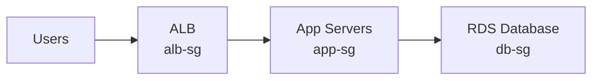

# How to Configure Security Group Rules for Common Architectures

Author: [nawazdhandala](https://github.com/nawazdhandala)

Tags: AWS, Security Groups, VPC, Networking, Security

Description: Practical security group configurations for common AWS architectures including web servers, three-tier apps, microservices, and database clusters.

---

Security groups are the primary firewall for AWS resources. Every EC2 instance, RDS database, Lambda function in a VPC, and load balancer has at least one security group controlling what traffic gets in and out. Getting the rules right is fundamental to AWS security, but most tutorials only show basic examples. Let's look at real-world configurations for architectures you'll actually build.

## Security Group Fundamentals

A few things to remember before we start:

- Security groups are **stateful** - if you allow inbound traffic, the response is automatically allowed outbound
- Rules are **allow-only** - you can't create deny rules
- **All rules are evaluated** - there's no rule ordering like NACLs
- The **default rule** denies all inbound traffic and allows all outbound traffic
- You can reference other security groups as sources or destinations

That last point is the most powerful feature. Instead of hardcoding IP addresses, you can say "allow traffic from any instance in security group X." This makes your rules dynamic and self-maintaining.

## Architecture 1: Basic Web Server

Let's start simple. A single web server behind no load balancer, accessible via HTTP, HTTPS, and SSH.

Create the security group and add rules:

```bash
# Create the security group
WEB_SG=$(aws ec2 create-security-group \
  --group-name "web-server-sg" \
  --description "Security group for public web servers" \
  --vpc-id vpc-abc123 \
  --query "GroupId" --output text)

# Allow HTTP from anywhere
aws ec2 authorize-security-group-ingress \
  --group-id $WEB_SG \
  --protocol tcp \
  --port 80 \
  --cidr 0.0.0.0/0

# Allow HTTPS from anywhere
aws ec2 authorize-security-group-ingress \
  --group-id $WEB_SG \
  --protocol tcp \
  --port 443 \
  --cidr 0.0.0.0/0

# Allow SSH from corporate network only
aws ec2 authorize-security-group-ingress \
  --group-id $WEB_SG \
  --protocol tcp \
  --port 22 \
  --cidr 203.0.113.0/24
```

For IPv6 support, add matching rules:

```bash
# Allow HTTP over IPv6
aws ec2 authorize-security-group-ingress \
  --group-id $WEB_SG \
  --ip-permissions IpProtocol=tcp,FromPort=80,ToPort=80,Ipv6Ranges='[{CidrIpv6=::/0}]'

# Allow HTTPS over IPv6
aws ec2 authorize-security-group-ingress \
  --group-id $WEB_SG \
  --ip-permissions IpProtocol=tcp,FromPort=443,ToPort=443,Ipv6Ranges='[{CidrIpv6=::/0}]'
```

## Architecture 2: Three-Tier Application

This is the most common pattern - an ALB in front of application servers, with a database behind them.



Here's how to set up each security group:

```bash
# ALB security group - accepts traffic from the internet
ALB_SG=$(aws ec2 create-security-group \
  --group-name "alb-sg" \
  --description "ALB - allows HTTP/HTTPS from internet" \
  --vpc-id vpc-abc123 \
  --query "GroupId" --output text)

aws ec2 authorize-security-group-ingress \
  --group-id $ALB_SG \
  --protocol tcp --port 80 --cidr 0.0.0.0/0

aws ec2 authorize-security-group-ingress \
  --group-id $ALB_SG \
  --protocol tcp --port 443 --cidr 0.0.0.0/0

# App server security group - only accepts traffic from ALB
APP_SG=$(aws ec2 create-security-group \
  --group-name "app-sg" \
  --description "App servers - allows traffic from ALB only" \
  --vpc-id vpc-abc123 \
  --query "GroupId" --output text)

# Reference the ALB security group as source
aws ec2 authorize-security-group-ingress \
  --group-id $APP_SG \
  --protocol tcp \
  --port 8080 \
  --source-group $ALB_SG

# Database security group - only accepts traffic from app servers
DB_SG=$(aws ec2 create-security-group \
  --group-name "db-sg" \
  --description "RDS - allows MySQL from app servers only" \
  --vpc-id vpc-abc123 \
  --query "GroupId" --output text)

# Reference the app security group as source
aws ec2 authorize-security-group-ingress \
  --group-id $DB_SG \
  --protocol tcp \
  --port 3306 \
  --source-group $APP_SG
```

Notice how each tier only accepts traffic from the tier above it. The database never sees traffic from the internet or the ALB - only from app servers.

## Architecture 3: Microservices

Microservices architectures have multiple services talking to each other. Each service gets its own security group, and you explicitly allow the communication paths you need.

```bash
# Service A - API Gateway
SVC_A_SG=$(aws ec2 create-security-group \
  --group-name "service-a-sg" \
  --description "Service A - API Gateway" \
  --vpc-id vpc-abc123 \
  --query "GroupId" --output text)

# Service B - User Service
SVC_B_SG=$(aws ec2 create-security-group \
  --group-name "service-b-sg" \
  --description "Service B - User Service" \
  --vpc-id vpc-abc123 \
  --query "GroupId" --output text)

# Service C - Order Service
SVC_C_SG=$(aws ec2 create-security-group \
  --group-name "service-c-sg" \
  --description "Service C - Order Service" \
  --vpc-id vpc-abc123 \
  --query "GroupId" --output text)

# Service A can call Service B and C
aws ec2 authorize-security-group-ingress \
  --group-id $SVC_B_SG \
  --protocol tcp --port 8080 --source-group $SVC_A_SG

aws ec2 authorize-security-group-ingress \
  --group-id $SVC_C_SG \
  --protocol tcp --port 8080 --source-group $SVC_A_SG

# Service C can call Service B (orders need user info)
aws ec2 authorize-security-group-ingress \
  --group-id $SVC_B_SG \
  --protocol tcp --port 8080 --source-group $SVC_C_SG
```

This creates an explicit service mesh at the network level. Service B can't call Service C unless you add that rule.

## Architecture 4: ECS with Service Discovery

For ECS services running on Fargate, each service still needs its own security group. But the port mapping is dynamic:

```bash
# ECS service security group
ECS_SG=$(aws ec2 create-security-group \
  --group-name "ecs-service-sg" \
  --description "ECS Fargate service" \
  --vpc-id vpc-abc123 \
  --query "GroupId" --output text)

# Allow ALB to reach any ephemeral port (Fargate uses dynamic port mapping)
aws ec2 authorize-security-group-ingress \
  --group-id $ECS_SG \
  --protocol tcp \
  --port 0-65535 \
  --source-group $ALB_SG

# Allow service-to-service communication within ECS
aws ec2 authorize-security-group-ingress \
  --group-id $ECS_SG \
  --protocol tcp \
  --port 0-65535 \
  --source-group $ECS_SG
```

That second rule allows any ECS task in this security group to talk to any other task in the same group. If you need stricter isolation, create separate security groups per service.

## Architecture 5: Bastion Host Pattern

A bastion (jump) host provides controlled SSH access to private instances:

```bash
# Bastion security group
BASTION_SG=$(aws ec2 create-security-group \
  --group-name "bastion-sg" \
  --description "Bastion host - SSH from corporate only" \
  --vpc-id vpc-abc123 \
  --query "GroupId" --output text)

# SSH from corporate network
aws ec2 authorize-security-group-ingress \
  --group-id $BASTION_SG \
  --protocol tcp --port 22 --cidr 203.0.113.0/24

# Private instance security group
PRIVATE_SG=$(aws ec2 create-security-group \
  --group-name "private-instance-sg" \
  --description "Private instances - SSH from bastion only" \
  --vpc-id vpc-abc123 \
  --query "GroupId" --output text)

# SSH only from bastion
aws ec2 authorize-security-group-ingress \
  --group-id $PRIVATE_SG \
  --protocol tcp --port 22 --source-group $BASTION_SG
```

## Managing Outbound Rules

By default, security groups allow all outbound traffic. For higher security environments, you should restrict outbound too:

```bash
# Remove the default allow-all outbound rule
aws ec2 revoke-security-group-egress \
  --group-id $APP_SG \
  --protocol -1 \
  --cidr 0.0.0.0/0

# Allow outbound only to specific destinations
# Database access
aws ec2 authorize-security-group-egress \
  --group-id $APP_SG \
  --protocol tcp --port 3306 \
  --source-group $DB_SG

# HTTPS to internet (for API calls)
aws ec2 authorize-security-group-egress \
  --group-id $APP_SG \
  --protocol tcp --port 443 --cidr 0.0.0.0/0

# DNS
aws ec2 authorize-security-group-egress \
  --group-id $APP_SG \
  --protocol tcp --port 53 --cidr 0.0.0.0/0

aws ec2 authorize-security-group-egress \
  --group-id $APP_SG \
  --protocol udp --port 53 --cidr 0.0.0.0/0
```

## CloudFormation Template

For repeatable deployments, define your security groups in CloudFormation:

```yaml
Resources:
  ALBSecurityGroup:
    Type: AWS::EC2::SecurityGroup
    Properties:
      GroupDescription: ALB security group
      VpcId: !Ref VpcId
      SecurityGroupIngress:
        - IpProtocol: tcp
          FromPort: 443
          ToPort: 443
          CidrIp: 0.0.0.0/0

  AppSecurityGroup:
    Type: AWS::EC2::SecurityGroup
    Properties:
      GroupDescription: Application security group
      VpcId: !Ref VpcId
      SecurityGroupIngress:
        - IpProtocol: tcp
          FromPort: 8080
          ToPort: 8080
          SourceSecurityGroupId: !Ref ALBSecurityGroup

  DBSecurityGroup:
    Type: AWS::EC2::SecurityGroup
    Properties:
      GroupDescription: Database security group
      VpcId: !Ref VpcId
      SecurityGroupIngress:
        - IpProtocol: tcp
          FromPort: 5432
          ToPort: 5432
          SourceSecurityGroupId: !Ref AppSecurityGroup
```

## Wrapping Up

The key principle is simple: every resource should only accept traffic from the resource directly in front of it in the request path. Security group referencing makes this easy - you reference the upstream security group instead of IP addresses, and the rules stay correct even as instances scale up and down.

For an additional layer of protection at the subnet level, combine security groups with [Network ACLs](https://oneuptime.com/blog/post/network-acls-subnet-level-security/view). And to understand how security group referencing works in depth, check out our post on [layered security with security group referencing](https://oneuptime.com/blog/post/security-group-referencing-layered-security/view).
