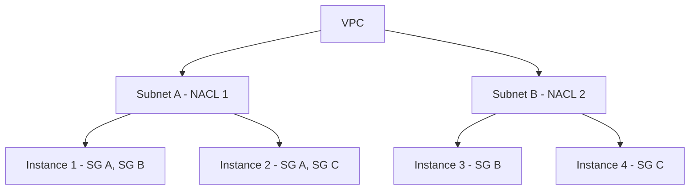

# How to Understand Security Groups vs Network ACLs

Author: [nawazdhandala](https://github.com/nawazdhandala)

Tags: AWS, VPC, Security, Networking

Description: A detailed comparison of AWS Security Groups and Network ACLs covering their differences in statefulness, rule evaluation, scope, and when to use each for optimal VPC security.

---

One of the most common questions from people getting started with AWS networking is "what's the difference between security groups and network ACLs, and when should I use which?" Both control network traffic in your VPC, but they work at different levels and have fundamentally different behaviors. Understanding these differences is critical for designing a proper defense-in-depth strategy.

Let me break it down clearly.

## The Core Difference: Stateful vs Stateless

Security groups are stateful. If you allow inbound traffic on port 443, the response traffic on the ephemeral port is automatically allowed. You don't need to think about it.

Network ACLs are stateless. Every single packet is evaluated against the rules independently. Allow inbound on port 443? Great, but the response going back out won't be allowed unless you also have an outbound rule covering the ephemeral port range (1024-65535).

This one difference is responsible for about 90% of the confusion between the two.

## Scope: Instance Level vs Subnet Level

Security groups operate at the network interface level. You attach them to individual instances, RDS databases, Lambda functions in a VPC, or any other resource with an ENI (Elastic Network Interface).

Network ACLs operate at the subnet level. Every instance in the subnet is covered by the same NACL, whether you like it or not. A subnet can only have one NACL, but a NACL can be applied to multiple subnets.



Traffic flowing to Instance 1 gets filtered first by NACL 1 (subnet level), then by Security Groups A and B (instance level). Both layers must allow the traffic for it to reach the instance.

## Rule Evaluation

Security groups evaluate all rules before making a decision. If any rule allows the traffic, it's allowed. There's no ordering or priority - it's a flat list of allow rules, and a match on any single rule means the traffic passes.

NACLs evaluate rules in order, starting from the lowest rule number. The first matching rule wins, and no further rules are checked. This means rule ordering matters enormously with NACLs.

Here's an example that shows why ordering matters.

```
NACL Rules (Inbound):
Rule 50:  DENY  TCP  port 22  from 198.51.100.0/24
Rule 100: ALLOW TCP  port 22  from 0.0.0.0/0
Rule *:   DENY  All  All      from 0.0.0.0/0
```

In this setup, SSH from 198.51.100.0/24 is denied (matches rule 50 first), but SSH from everywhere else is allowed (matches rule 100). If you reversed the rule numbers, the allow-all would match first and the deny rule would never trigger.

## Allow vs Deny Rules

Security groups only support allow rules. You can't say "deny traffic from IP X." If it's not explicitly allowed, it's denied by default.

NACLs support both allow and deny rules. This is a big deal when you need to block a specific IP address or range. If someone's port-scanning your infrastructure from a known IP, a NACL deny rule at the subnet level is your go-to tool.

```bash
# Block a malicious IP at the NACL level - not possible with security groups
aws ec2 create-network-acl-entry \
  --network-acl-id acl-0123456789abcdef0 \
  --rule-number 10 \
  --protocol -1 \
  --cidr-block 198.51.100.55/32 \
  --rule-action deny \
  --ingress
```

## Side-by-Side Comparison

Here's a quick reference table:

| Feature | Security Groups | Network ACLs |
|---------|----------------|--------------|
| Level | Instance (ENI) | Subnet |
| Statefulness | Stateful | Stateless |
| Rule types | Allow only | Allow and Deny |
| Rule evaluation | All rules evaluated | Rules evaluated in order |
| Default behavior | Deny all inbound, allow all outbound | Default NACL allows all |
| Return traffic | Automatic | Must be explicitly allowed |
| Can reference other SGs | Yes | No |
| Number per resource | Up to 5 per ENI | 1 per subnet |

## When to Use Security Groups

Security groups should be your primary firewall mechanism. Use them for:

**Fine-grained instance-level control.** Different instances in the same subnet can have different security groups. Your web servers get one set of rules, your app servers get another.

**Inter-tier communication.** Security group references let you say "the database only accepts connections from the app tier" without knowing any IP addresses. This is incredibly powerful and self-maintaining.

```hcl
# Database only accepts connections from the app security group
resource "aws_security_group_rule" "db_from_app" {
  type                     = "ingress"
  from_port                = 5432
  to_port                  = 5432
  protocol                 = "tcp"
  source_security_group_id = aws_security_group.app.id
  security_group_id        = aws_security_group.db.id
}
```

**Dynamic environments.** When instances scale in and out with auto-scaling groups, security group membership handles the firewall rules automatically. No manual updates needed.

## When to Use Network ACLs

NACLs are best for:

**Blocking specific IPs or ranges.** Since security groups can't deny traffic, NACLs are the only VPC-native option for blacklisting.

**Subnet-wide policies.** If every instance in a subnet should have the same baseline network restrictions, a NACL enforces that regardless of what security groups are attached.

**Defense in depth.** Even if someone misconfigures a security group, the NACL provides a backup layer. This is especially important in environments where multiple teams manage their own security groups.

**Compliance requirements.** Some compliance frameworks require network filtering at multiple layers. NACLs + security groups satisfy this requirement.

## A Practical Architecture

Here's a pattern I see working well in production.

```
Internet
    |
[NACL: Allow 80, 443 inbound; Block known bad IPs]
    |
Public Subnet
    |
[SG: Web servers - Allow 80, 443 from internet]
    |
[NACL: Allow traffic from public subnet; Deny all else]
    |
Private Subnet
    |
[SG: App servers - Allow 8080 from web server SG]
    |
[NACL: Allow traffic from private app subnet only]
    |
Data Subnet
    |
[SG: Databases - Allow 5432 from app server SG]
```

The NACLs provide broad subnet-level filtering, and the security groups provide precise instance-level access control. If someone accidentally opens port 22 to the world in a security group, the NACL still blocks it at the subnet level.

## Debugging Traffic Flow

When traffic isn't flowing, you need to check both layers. VPC Flow Logs will tell you if traffic was accepted or rejected, but they won't tell you which layer did the rejecting. See our guide on flow logs at https://oneuptime.com/blog/post/2026-02-12-enable-and-analyze-vpc-flow-logs/view.

Here's my debugging workflow:

1. Check the security group inbound rules for the destination
2. Check the security group outbound rules for the source (usually fine since most people leave outbound open)
3. Check the NACL inbound rules for the destination's subnet
4. Check the NACL outbound rules for the source's subnet
5. Check the NACL outbound rules for the destination's subnet (for return traffic)
6. Check the NACL inbound rules for the source's subnet (for return traffic)

Steps 5 and 6 are the ones people forget about - the stateless nature of NACLs means you need to trace the return path too.

## The Bottom Line

Use security groups as your primary tool. They're easier to manage, stateful behavior prevents common mistakes, and security group references are incredibly powerful for dynamic environments. Use NACLs as a backup layer for subnet-wide policies and explicit deny rules. Together, they give you a solid defense-in-depth approach to VPC security.

Don't make the mistake of relying on just one. And definitely don't leave default NACLs (allow-all) in place and assume security groups alone are enough. In a production environment, you want both layers actively filtering traffic.
