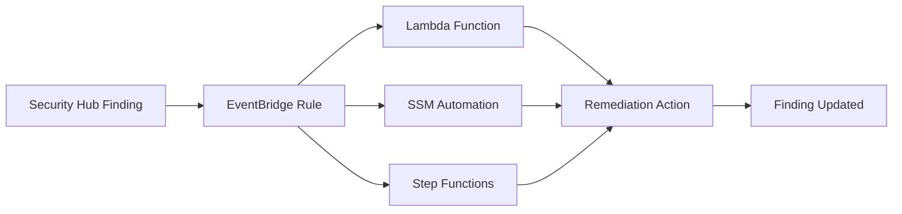

# How to Use Security Hub Automated Response and Remediation

Author: [nawazdhandala](https://github.com/nawazdhandala)

Tags: AWS, Security Hub, Automation, Remediation, Compliance

Description: Set up automated response and remediation actions in AWS Security Hub to fix compliance violations and security issues without manual intervention.

---

Finding security issues is only half the battle. The real challenge is fixing them fast enough that they don't turn into incidents. AWS Security Hub is great at aggregating findings from GuardDuty, Config, Inspector, and other sources into a single pane. But staring at a dashboard full of red items doesn't make them go away.

Automated response and remediation lets Security Hub trigger fixes automatically. An unencrypted S3 bucket? Enable encryption. A security group open to the world? Close it. A key that hasn't been rotated? Rotate it. Let's build this out.

## Architecture

The pattern uses Security Hub custom actions or EventBridge rules to trigger Lambda functions or SSM Automation documents that perform the remediation.



There are two approaches: fully automatic (every finding triggers a fix) and semi-automatic (a human clicks a custom action button to approve the fix). In production, you'll want a mix of both.

## Using the AWS-Provided Solution

AWS provides a pre-built solution called "Automated Security Response on AWS" that covers many common remediations. It's deployed via CloudFormation and handles findings from CIS Benchmarks, NIST, PCI DSS, and AWS Foundational Security Best Practices.

Deploy it using the provided CloudFormation template:

```bash
# Deploy the solution stack
aws cloudformation create-stack \
  --stack-name automated-security-response \
  --template-url https://s3.amazonaws.com/solutions-reference/aws-security-hub-automated-response-and-remediation/latest/aws-sharr-deploy.template \
  --capabilities CAPABILITY_IAM CAPABILITY_NAMED_IAM CAPABILITY_AUTO_EXPAND \
  --parameters \
    ParameterKey=LogLevel,ParameterValue=info
```

This deploys Step Functions workflows, Lambda functions, and EventBridge rules that handle dozens of common remediation scenarios.

## Building Custom Remediations

For cases not covered by the pre-built solution, you'll build your own. Let's go through several common scenarios.

### Remediation 1: Enable S3 Bucket Encryption

This Lambda function enables AES-256 encryption on any S3 bucket that Security Hub flags as unencrypted:

```python
import boto3
import json

s3 = boto3.client('s3')
securityhub = boto3.client('securityhub')

def handler(event, context):
    finding = event['detail']['findings'][0]
    finding_id = finding['Id']
    product_arn = finding['ProductArn']

    # Extract the bucket name from the finding
    resources = finding['Resources']
    bucket_arn = resources[0]['Id']
    bucket_name = bucket_arn.split(':::')[1]

    print(f"Enabling encryption on bucket: {bucket_name}")

    try:
        # Enable default encryption
        s3.put_bucket_encryption(
            Bucket=bucket_name,
            ServerSideEncryptionConfiguration={
                'Rules': [{
                    'ApplyServerSideEncryptionByDefault': {
                        'SSEAlgorithm': 'AES256'
                    },
                    'BucketKeyEnabled': True
                }]
            }
        )

        # Update the finding status
        securityhub.batch_update_findings(
            FindingIdentifiers=[{
                'Id': finding_id,
                'ProductArn': product_arn
            }],
            Note={
                'Text': 'Auto-remediated: Default encryption enabled with AES-256',
                'UpdatedBy': 'auto-remediation-lambda'
            },
            Workflow={'Status': 'RESOLVED'}
        )

        print(f"Successfully encrypted bucket: {bucket_name}")

    except Exception as e:
        print(f"Failed to remediate: {str(e)}")
        securityhub.batch_update_findings(
            FindingIdentifiers=[{
                'Id': finding_id,
                'ProductArn': product_arn
            }],
            Note={
                'Text': f'Auto-remediation failed: {str(e)}',
                'UpdatedBy': 'auto-remediation-lambda'
            },
            Workflow={'Status': 'NOTIFIED'}
        )

    return {'statusCode': 200}
```

### Remediation 2: Close Open Security Groups

This function removes any inbound rules that allow 0.0.0.0/0 access on sensitive ports:

```python
import boto3

ec2 = boto3.client('ec2')
securityhub = boto3.client('securityhub')

RESTRICTED_PORTS = [22, 3389, 3306, 5432, 1433, 27017]

def handler(event, context):
    finding = event['detail']['findings'][0]
    finding_id = finding['Id']
    product_arn = finding['ProductArn']

    # Extract security group ID
    resource = finding['Resources'][0]
    sg_id = resource['Id'].split('/')[-1]

    print(f"Remediating security group: {sg_id}")

    try:
        # Get current rules
        sg = ec2.describe_security_groups(GroupIds=[sg_id])
        permissions = sg['SecurityGroups'][0]['IpPermissions']

        rules_to_remove = []

        for perm in permissions:
            from_port = perm.get('FromPort', 0)
            to_port = perm.get('ToPort', 65535)

            # Check if any restricted port falls in the range
            for port in RESTRICTED_PORTS:
                if from_port <= port <= to_port:
                    # Check for 0.0.0.0/0 or ::/0
                    open_ranges = [
                        r for r in perm.get('IpRanges', [])
                        if r['CidrIp'] == '0.0.0.0/0'
                    ]
                    open_v6 = [
                        r for r in perm.get('Ipv6Ranges', [])
                        if r['CidrIpv6'] == '::/0'
                    ]

                    if open_ranges or open_v6:
                        rules_to_remove.append(perm)
                        break

        if rules_to_remove:
            ec2.revoke_security_group_ingress(
                GroupId=sg_id,
                IpPermissions=rules_to_remove
            )
            print(f"Removed {len(rules_to_remove)} open rules from {sg_id}")

        # Update finding
        securityhub.batch_update_findings(
            FindingIdentifiers=[{
                'Id': finding_id,
                'ProductArn': product_arn
            }],
            Note={
                'Text': f'Auto-remediated: Removed {len(rules_to_remove)} unrestricted ingress rules',
                'UpdatedBy': 'auto-remediation-lambda'
            },
            Workflow={'Status': 'RESOLVED'}
        )

    except Exception as e:
        print(f"Remediation failed: {str(e)}")
```

### Remediation 3: Enable CloudTrail Logging

This restarts CloudTrail logging when it's been stopped:

```python
import boto3

cloudtrail = boto3.client('cloudtrail')
securityhub = boto3.client('securityhub')

def handler(event, context):
    finding = event['detail']['findings'][0]
    finding_id = finding['Id']
    product_arn = finding['ProductArn']

    resource = finding['Resources'][0]
    trail_arn = resource['Id']
    trail_name = trail_arn.split('/')[-1]

    try:
        cloudtrail.start_logging(Name=trail_name)

        securityhub.batch_update_findings(
            FindingIdentifiers=[{
                'Id': finding_id,
                'ProductArn': product_arn
            }],
            Note={
                'Text': f'Auto-remediated: Restarted CloudTrail logging for {trail_name}',
                'UpdatedBy': 'auto-remediation-lambda'
            },
            Workflow={'Status': 'RESOLVED'}
        )
        print(f"Restarted logging for trail: {trail_name}")

    except Exception as e:
        print(f"Failed: {str(e)}")
```

## Setting Up EventBridge Rules

Connect Security Hub findings to your remediation functions.

This EventBridge rule triggers the S3 encryption remediation whenever Security Hub flags an unencrypted bucket:

```bash
# Rule for S3 encryption findings
aws events put-rule \
  --name remediate-s3-encryption \
  --event-pattern '{
    "source": ["aws.securityhub"],
    "detail-type": ["Security Hub Findings - Imported"],
    "detail": {
      "findings": {
        "GeneratorId": ["aws-foundational-security-best-practices/v/1.0.0/S3.4"],
        "Compliance": {
          "Status": ["FAILED"]
        },
        "Workflow": {
          "Status": ["NEW"]
        }
      }
    }
  }'

# Connect to Lambda
aws events put-targets \
  --rule remediate-s3-encryption \
  --targets '[{
    "Id": "s3-encryption-lambda",
    "Arn": "arn:aws:lambda:us-east-1:111111111111:function:remediate-s3-encryption"
  }]'
```

## Creating Custom Actions

Custom actions let a human trigger remediation from the Security Hub console. This is safer for production environments where you don't want fully automatic fixes.

Create a custom action:

```bash
# Create a custom action
aws securityhub create-action-target \
  --name "RemediateSecurityGroup" \
  --description "Remove unrestricted inbound rules" \
  --id "RemediateSG"
```

Then create an EventBridge rule for when someone clicks that action:

```bash
aws events put-rule \
  --name sg-custom-action \
  --event-pattern '{
    "source": ["aws.securityhub"],
    "detail-type": ["Security Hub Findings - Custom Action"],
    "detail": {
      "actionName": ["RemediateSecurityGroup"]
    }
  }'
```

## Using SSM Automation

For more complex remediation, use Systems Manager Automation documents. AWS provides many pre-built runbooks.

This runs an SSM automation to enable S3 bucket logging:

```bash
aws ssm start-automation-execution \
  --document-name "AWS-EnableS3BucketLogging" \
  --parameters '{
    "BucketName": ["my-bucket"],
    "TargetBucket": ["my-logging-bucket"],
    "TargetPrefix": ["s3-access-logs/"]
  }'
```

## Tracking Remediation Success

After running remediations, verify they're working.

This script checks how many findings have been auto-resolved:

```bash
# Count resolved findings by automation
aws securityhub get-findings \
  --filters '{
    "NoteUpdatedBy": [{
      "Value": "auto-remediation-lambda",
      "Comparison": "EQUALS"
    }],
    "WorkflowStatus": [{
      "Value": "RESOLVED",
      "Comparison": "EQUALS"
    }]
  }' \
  --query 'length(Findings)'
```

## Best Practices

**Start semi-automatic.** Use custom actions first. Watch the remediations work correctly for a few weeks before switching to fully automatic.

**Always update the finding.** Add a note explaining what was done and update the workflow status. This creates an audit trail.

**Have a rollback plan.** Some remediations can break applications. Make sure you can undo changes quickly.

**Test thoroughly.** Use Security Hub's sample findings or intentionally create non-compliant resources in a sandbox account to test your automations.

**Monitor remediation failures.** Lambda errors, permission issues, and edge cases will happen. Set up alerts for when remediations fail.

Automated remediation dramatically reduces your mean time to fix. Instead of security findings sitting in a queue for days, they get resolved in seconds. Pair Security Hub with [OneUptime](https://oneuptime.com) for monitoring your remediation pipeline and you'll have a security operations workflow that actually keeps up with the pace of cloud infrastructure changes.
